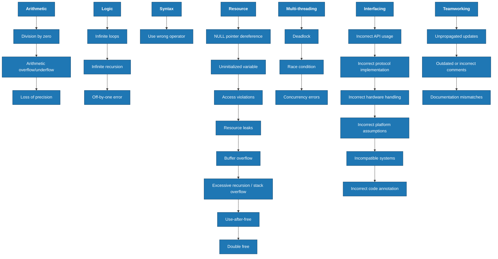

```mermaid
flowchart TD

    classDef col fill:#1f77b4,stroke:#0d3a5c,color:white,font-weight:bold;
    classDef cell fill:#1f77b4,stroke:#0d3a5c,color:white;

    %% Column Titles
    A[Arithmetic]:::col
    B[Logic]:::col
    C[Syntax]:::col
    D[Resource]:::col
    E[Multi-threading]:::col
    F[Interfacing]:::col
    G[Teamworking]:::col

    %% Arithmetic
    A1[Division by zero]:::cell
    A2[Arithmetic overflow/underflow]:::cell
    A3[Loss of precision]:::cell
    A --> A1 --> A2 --> A3

    %% Logic
    B1[Infinite loops]:::cell
    B2[Infinite recursion]:::cell
    B3[Off-by-one error]:::cell
    B --> B1 --> B2 --> B3

    %% Syntax
    C1[Use wrong operator]:::cell
    C --> C1

    %% Resource
    D1[NULL pointer dereference]:::cell
    D2[Uninitialized variable]:::cell
    D3[Access violations]:::cell
    D4[Resource leaks]:::cell
    D5[Buffer overflow]:::cell
    D6[Excessive recursion / stack overflow]:::cell
    D7[Use-after-free]:::cell
    D8[Double free]:::cell
    D --> D1 --> D2 --> D3 --> D4 --> D5 --> D6 --> D7 --> D8

    %% Multi-threading
    E1[Deadlock]:::cell
    E2[Race condition]:::cell
    E3[Concurrency errors]:::cell
    E --> E1 --> E2 --> E3

    %% Interfacing
    F1[Incorrect API usage]:::cell
    F2[Incorrect protocol implementation]:::cell
    F3[Incorrect hardware handling]:::cell
    F4[Incorrect platform assumptions]:::cell
    F5[Incompatible systems]:::cell
    F6[Incorrect code annotation]:::cell
    F --> F1 --> F2 --> F3 --> F4 --> F5 --> F6

    %% Teamworking
    G1[Unpropagated updates]:::cell
    G2[Outdated or incorrect comments]:::cell
    G3[Documentation mismatches]:::cell
    G --> G1 --> G2 --> G3

```
t