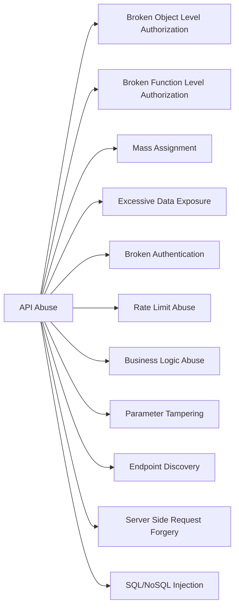
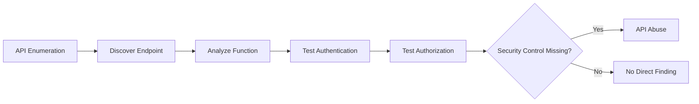

> [!abstract] Overview
> **API Abuse** refers to the misuse of an API's legitimate functionality in a way that violates the application's security or business requirements.
>
> The API itself may be working exactly as the developer intended:
>
> ```text
> Request
>    |
>    ↓
> API
>    |
>    ↓
> Valid Function
> ```
>
> The problem is that the application may fail to properly enforce:
>
> ```text
> Authentication
> Authorization
> Rate Limits
> Input Validation
> Business Rules
> Resource Limits
> Data Exposure
> ```
>
> Therefore, an attacker can use a legitimate API function in an unintended way.
>
> The general concept is:
>
> ```text
> Legitimate API Function
>          |
>          ↓
> Attacker Manipulates
> Request / Parameters / Workflow
>          |
>          ↓
> Security Control Bypassed
>          |
>          ↓
> Unauthorized Result
> ```




> [!info]
> 
> ## Important
> 
> These categories are not all the same type of vulnerability.
> 
> **API Abuse** is better understood as a broad category describing how APIs can be misused.
> 
> Some of the issues below are formal vulnerability classes, while others are common API abuse techniques or attack surfaces.
> 
> For example:
> 
> ```text
> BOLA / BFLA
>     ↓
> Authorization Failures
> 
> Rate Limit Abuse
>     ↓
> Resource / Automation Abuse
> 
> Business Logic Abuse
>     ↓
> Workflow Abuse
> 
> Parameter Tampering
>     ↓
> Client-Controlled Input Abuse
> ```

---

# 5. Broken Authentication

> [!abstract]
> 
> ## Overview
> 
> **Broken Authentication** occurs when an API incorrectly implements the mechanism used to identify and authenticate users.
> 
> The API may allow an attacker to:
> 
> ```text
> Obtain a session
> Predict a session
> Reuse a session
> Bypass authentication
> Brute-force authentication
> ```
> 
> Authentication should establish:
> 
> ```text
> "Who is making this request?"
> ```
> 
> If the API cannot reliably answer that question, all authorization decisions built on top of it become unreliable.

---

## Common Authentication Problems

```text
Weak / Predictable Tokens
Missing Token Expiration
Weak Password Policy
Authentication Bypass
Improper Session Handling
Missing MFA Where Required
Token Reuse
Weak Password Reset
```

---

## Vulnerable Login API

Request:

```http
POST /api/login
Content-Type: application/json
```

```json
{
    "username": "admin",
    "password": "password"
}
```

Response:

```json
{
    "token": "123456"
}
```

Problem:

```text
Token
  |
  ↓
Predictable / Weak
  |
  ↓
Potential Session Compromise
```

A secure token should be generated using a cryptographically secure mechanism and should not be predictable from user information or previous tokens.

---

## curl

```bash
curl -X POST \
"https://target.com/api/login" \
-H "Content-Type: application/json" \
-d '{
    "username":"admin",
    "password":"password"
}'
```

---

## What to Test

> [!info]
> 
> Check whether:
> 
> ```text
> Authentication can be bypassed
> 
> Tokens are predictable
> 
> Tokens expire correctly
> 
> Invalid tokens are rejected
> 
> Logout invalidates sessions when required
> 
> Password reset properly authenticates the user
> 
> MFA cannot be bypassed through another API endpoint
> ```

---

## Impact

```text
Account Takeover
Session Compromise
Unauthorized API Access
Privilege Escalation
```

---

# 6. Rate Limit Abuse

> [!abstract]
> 
> ## Overview
> 
> **Rate Limit Abuse** occurs when an API does not sufficiently restrict how frequently a client can perform a sensitive operation.
> 
> Rate limiting is particularly important for operations where repeated requests provide an attacker with additional opportunities.
> 
> Examples:
> 
> ```text
> Login
> OTP Verification
> Password Reset
> Email Verification
> Coupon Redemption
> API Resource Creation
> Expensive Search Operations
> ```

---

# Why Rate Limiting Matters

Consider:

```text
OTP = 6 digits
```

Possible values:

```text
000000
000001
000002
...
999999
```

Without an effective limit:

```text
Attacker
   |
   ↓
Repeated Requests
   |
   ↓
Large Number of Attempts
   |
   ↓
Potential OTP Guess
```

With a rate limit:

```text
Attacker
   |
   ↓
Several Requests
   |
   ↓
Rate Limit
   |
   ↓
429 Too Many Requests
```

---

## Vulnerable API

```http
POST /api/verifyOTP
```

Request:

```json
{
    "phone":"+989121234567",
    "otp":"123456"
}
```

The server checks:

```text
Is OTP correct?
       |
       ↓
YES → Login
NO  → Reject
```

But does not enforce:

```text
Maximum Attempts
Cooldown
IP / Account Limits
Device Limits
Temporary Lockout
```

---

## Testing

Single request:

```bash
curl -X POST \
"https://target.com/api/verifyOTP" \
-H "Content-Type: application/json" \
-d '{
    "phone":"+989121234567",
    "otp":"123456"
}'
```

During authorized testing, send a small controlled number of repeated requests and observe:

```text
HTTP Status
Response Headers
Response Body
Retry-After
Response Timing
```

A properly rate-limited API may eventually return:

```http
HTTP/1.1 429 Too Many Requests
```

---

## What Makes It Vulnerable?

Not simply:

```text
"I sent two requests."
```

The important question is:

```text
Can an attacker perform an excessive number
of sensitive operations without meaningful restriction?
```

For example:

```text
100 requests
    ↓
No restriction
    ↓
Potentially Interesting
```

versus:

```text
5 requests
    ↓
429 Too Many Requests
    ↓
Rate Limit Working
```

---

## Impact

```text
Credential Brute Force
OTP Guessing
Account Takeover
Resource Exhaustion
Email / SMS Abuse
Financial Abuse
Automated Enumeration
```

---

# 7. Business Logic Abuse

> [!abstract]
> 
> ## Overview
> 
> **Business Logic Abuse** occurs when an attacker uses legitimate application functionality in a sequence or combination that the developer did not intend.
> 
> Unlike SQL Injection, the attacker may not need malformed syntax.
> 
> The requests can be completely valid:
> 
> ```text
> Valid Request
> +
> Valid Authentication
> +
> Valid Endpoint
> =
> Invalid Business Result
> ```
> 
> This is why business logic vulnerabilities can be difficult to detect using automated scanners.

---

# Example: Coupon Abuse

Business rule:

```text
One coupon per order
```

API:

```http
POST /api/applyCoupon
```

Request:

```json
{
    "coupon":"DISCOUNT50"
}
```

---

## Vulnerable Logic

Backend:

```python
apply_coupon(user, coupon)

return {
    "status": "success"
}
```

The application does not verify:

```text
Has this coupon already been used?

Is the coupon valid for this user?

Has the maximum redemption count been reached?

Is the coupon valid for this order?
```

---

## Attack

```bash
curl -X POST \
"https://target.com/api/applyCoupon" \
-H "Authorization: Bearer TOKEN" \
-H "Content-Type: application/json" \
-d '{
    "coupon":"DISCOUNT50"
}'
```

If the same operation can improperly be repeated:

```text
Request 1 → Discount Applied
Request 2 → Discount Applied
Request 3 → Discount Applied
```

then the workflow may violate the intended business rule.

---

# Another Important Business Logic Pattern

> [!example]
> 
> ## Race Condition
> 
> Suppose:
> 
> ```text
> Account Balance = $100
> ```
> 
> API:

```http
POST /api/withdraw
```

Request:

```json
{
    "amount":100
}
```

Correct business rule:

```text
Balance >= Amount
       |
       ↓
Withdraw
       |
       ↓
Balance = Balance - Amount
```

If multiple requests are processed concurrently without proper atomic controls:

```text
Request A → Check balance = $100
Request B → Check balance = $100

Request A → Withdraw $100
Request B → Withdraw $100
```

The resulting state may violate the business rule.

This is a **race-condition/business-logic** issue rather than simply a malformed request.

---

## Impact

```text
Financial Loss
Coupon Abuse
Inventory Abuse
Unauthorized Transactions
Workflow Bypass
Privilege Abuse
Account State Manipulation
```

---

# 8. Parameter Tampering

> [!abstract]
> 
> ## Overview
> 
> **Parameter Tampering** occurs when an application trusts security-sensitive values supplied by the client instead of calculating or validating them on the server.
> 
> The fundamental mistake is:
> 
> ```text
> Client Input
>      |
>      ↓
> Backend Trusts Value
>      |
>      ↓
> Security / Business Decision
> ```
> 
> Any value controlled by the client should be considered untrusted.

---

# Example: Price Manipulation

Normal request:

```http
POST /api/order
```

```json
{
    "product":"Laptop",
    "price":1000
}
```

The application should determine the price from:

```text
Product ID
     |
     ↓
Database
     |
     ↓
Official Price
```

Instead, the vulnerable application trusts:

```json
{
    "price":1000
}
```

---

## Attack

The attacker changes:

```json
{
    "product":"Laptop",
    "price":1
}
```

Request:

```bash
curl -X POST \
"https://target.com/api/order" \
-H "Content-Type: application/json" \
-H "Authorization: Bearer TOKEN" \
-d '{
    "product":"Laptop",
    "price":1
}'
```

---

## Vulnerable Behavior

```text
Client
  |
  ↓
price = 1
  |
  ↓
Backend trusts value
  |
  ↓
Order created for $1
```

---

## Secure Design

```text
Product ID
     |
     ↓
Database
     |
     ↓
Official Price
     |
     ↓
Server Calculates Total
     |
     ↓
Payment
```

The server should not trust:

```text
price
discount
role
userId
accountBalance
permissions
```

when those values are security-sensitive and controlled by the client.

---

# Parameter Tampering vs Mass Assignment

> [!info]
> 
> These are related but different.
> 
> **Parameter Tampering:**
> 
> ```text
> Modify an existing parameter
> ```
> 
> Example:
> 
> ```json
> {
>     "price":1
> }
> ```
> 
> **Mass Assignment:**
> 
> ```text
> Add parameters that were not intended
> to be user-controlled
> ```
> 
> Example:
> 
> ```json
> {
>     "username":"john",
>     "isAdmin":true
> }
> ```
> 
> Both occur when the backend trusts client-controlled data too much.

---

# Impact

```text
Financial Loss
Privilege Escalation
Unauthorized Modification
Business Rule Bypass
Data Manipulation
```

---

# 9. API Enumeration

> [!abstract]
> 
> ## Overview
> 
> **API Enumeration** is the process of discovering API endpoints, parameters, methods, versions, and functionality that are not obvious from the application's normal interface.
> 
> Enumeration itself is not necessarily a vulnerability.
> 
> The security issue arises when discovering an endpoint exposes:
> 
> ```text
> Undocumented Administrative Functions
> Deprecated APIs
> Debug Endpoints
> Unprotected Resources
> Hidden Functionality
> ```
> 
> The basic attack surface becomes:
> 
> ```text
> Known API
>    |
>    ↓
> Discover Related Endpoints
>    |
>    ↓
> Find Security Weakness
>    |
>    ↓
> Abuse Functionality
> ```

---

# Common Locations

```text
/api/
/api/v1/
/api/v2/
/api/internal/
/api/admin/
/swagger/
/swagger.json
/openapi.json
/graphql
```

Also inspect:

```text
JavaScript Files
Mobile Applications
API Documentation
Source Maps
Burp HTTP History
```

---

# Example

Known endpoint:

```http
GET /api/users
```

During testing, another endpoint is discovered:

```http
GET /api/admin/users
```

The important question is not merely:

```text
"Does this endpoint exist?"
```

but:

```text
"Does this endpoint enforce the correct authorization?"
```

---

## curl

Check API documentation:

```bash
curl \
"https://target.com/swagger.json"
```

Test API versions:

```bash
curl \
"https://target.com/api/v1/users"

curl \
"https://target.com/api/v2/users"
```

---

## Enumeration → Abuse



---

## Impact

Enumeration can expose:

```text
Increased Attack Surface
Administrative Functions
Deprecated Functionality
Debug Interfaces
Hidden Parameters
Potential Authorization Weaknesses
```

---

# 10. SSRF Through API

> [!abstract]
> 
> ## Overview
> 
> **Server-Side Request Forgery (SSRF)** occurs when an API allows an attacker to influence a request made by the server.
> 
> The important distinction is:
> 
> ```text
> Normal Request:
> 
> Attacker → Server
> 
> SSRF:
> 
> Attacker → Server → Target
> ```
> 
> The attacker is abusing the server's network position and privileges.

---

# Vulnerable API

Suppose an API provides URL fetching functionality:

```http
POST /api/fetch
```

Request:

```json
{
    "url":"https://example.com"
}
```

Backend:

```python
requests.get(url)
```

The intended functionality is:

```text
User
 |
 ↓
API
 |
 ↓
Public Website
```

---

# SSRF Condition

The server accepts attacker-controlled URLs without properly restricting where the server can connect.

For example, during an authorized test:

```json
{
    "url":"http://127.0.0.1:8080/admin"
}
```

Request:

```bash
curl -X POST \
"https://target.com/api/fetch" \
-H "Content-Type: application/json" \
-d '{
    "url":"http://127.0.0.1:8080/admin"
}'
```

The server may interpret this as:

```text
Attacker
   |
   ↓
target.com
   |
   ↓
127.0.0.1:8080
```

Notice:

```text
127.0.0.1
```

refers to the server itself from the server's perspective.

---

# Why SSRF Is Dangerous

> [!danger]
> 
> The application server may have network access that the external attacker does not have.
> 
> Therefore:
> 
> ```text
> External Attacker
>       |
>       X
>       |
> Internal Network
> ```
> 
> may become:
> 
> ```text
> External Attacker
>       |
>       ↓
> Vulnerable API
>       |
>       ↓
> Internal Network
> ```
> 
> Potential targets include:
> 
> ```text
> Internal Web Services
> Internal APIs
> Administrative Interfaces
> Cloud Metadata Services
> Development Services
> Monitoring Systems
> ```

---

# SSRF Testing Concept

> [!info]
> 
> Do not treat every URL-fetching API as automatically vulnerable.
> 
> Determine whether the server:
> 
> ```text
> Accepts attacker-controlled URL
>          |
>          ↓
> Makes server-side request
>          |
>          ↓
> Allows access to unintended destinations
> ```
> 
> A secure implementation should restrict:
> 
> ```text
> Destination
> Protocol
> Redirects
> Network Range
> DNS Resolution
> ```

---

# SSRF Impact

```text
Internal Service Access
Internal Network Discovery
Cloud Metadata Access
Credential Exposure
Administrative Interface Access
Potential Remote Code Execution
```

The final impact depends heavily on what the server can reach and what those internal services expose.

---

# 11. Injection Through API

> [!abstract]
> 
> ## Overview
> 
> APIs frequently pass user-controlled input into backend interpreters.
> 
> If the application fails to properly validate and parameterize that input, the attacker may inject syntax understood by the backend.
> 
> Common examples:
> 
> ```text
> SQL Injection
> NoSQL Injection
> Command Injection
> LDAP Injection
> Template Injection
> ```
> 
> General model:
> 
> ```text
> Attacker Input
>       |
>       ↓
> API
>       |
>       ↓
> Backend Interpreter
>       |
>       ↓
> Unexpected Execution
> ```

---

# SQL Injection Through API

## Vulnerable API

```http
GET /api/user?id=1
```

Backend:

```sql
SELECT *
FROM users
WHERE id = INPUT;
```

If input is directly concatenated into SQL:

```text
SQL Query
    +
Attacker-Controlled Input
    =
Potential SQL Injection
```

---

## Test

A basic authorized test:

```bash
curl \
"https://target.com/api/user?id=1'"
```

If the application produces a database error, changes behavior unexpectedly, or otherwise reveals evidence of unsafe query construction, investigate further.

---

# NoSQL Injection Through API

Suppose the API receives:

```http
POST /api/login
```

```json
{
    "username":"admin",
    "password":"test"
}
```

Backend:

```javascript
db.users.find({
    username:req.body.username,
    password:req.body.password
})
```

If the application accepts structured query operators directly from the client, the attacker may attempt to manipulate the query structure.

Example test:

```json
{
    "username":{
        "$ne":null
    },
    "password":{
        "$ne":null
    }
}
```

Request:

```bash
curl -X POST \
"https://target.com/api/login" \
-H "Content-Type: application/json" \
-d '{
    "username":{
        "$ne":null
    },
    "password":{
        "$ne":null
    }
}'
```

The security issue is:

```text
Client JSON
     |
     ↓
Application
     |
     ↓
Trusted as Query Structure
```

instead of:

```text
Client JSON
     |
     ↓
Validate Expected Types
     |
     ↓
Construct Safe Query
```

---

# API Abuse Testing Methodology

> [!abstract]
> 
> ## General Workflow
> 
> ```mermaid
> flowchart TD
> 
> A[Discover API]
> --> B[Understand Normal Function]
> 
> B --> C[Identify Security Control]
> 
> C --> D[Manipulate Request]
> 
> D --> E[Test API Behavior]
> 
> E --> F{Control Enforced?}
> 
> F -->|Yes| G[Normal / Secure Behavior]
> 
> F -->|No| H[Potential API Abuse]
> 
> H --> I[Verify Security Impact]
> ```
> 
> The key is to first understand **what the API is supposed to do**, then determine whether a user can manipulate the request to make it perform something it should not.

---

# API Abuse Testing Checklist

> [!tip]
> 
> ```text
> Authentication
> ├── Can authentication be bypassed?
> ├── Are tokens securely generated?
> └── Are sessions properly invalidated?
> 
> Authorization
> ├── Can users access other objects?
> └── Can users execute privileged functions?
> 
> Rate Limiting
> ├── Are sensitive endpoints rate limited?
> └── Are repeated operations restricted?
> 
> Business Logic
> ├── Can workflows be repeated?
> ├── Can steps be skipped?
> └── Can operations be performed out of order?
> 
> Parameters
> ├── Can prices be modified?
> ├── Can user-controlled security fields be changed?
> └── Does the server recalculate sensitive values?
> 
> Enumeration
> ├── Are undocumented APIs exposed?
> ├── Are old versions accessible?
> └── Are admin/debug endpoints protected?
> 
> SSRF
> ├── Can the server fetch attacker-controlled URLs?
> └── Can internal destinations be reached?
> 
> Injection
> ├── Is input passed into SQL?
> ├── NoSQL?
> ├── OS commands?
> └── Other interpreters?
> ```

---

# Final Concept

> [!abstract]
> 
> The central idea behind API Abuse is:
> 
> ```text
> API provides legitimate functionality
>              |
>              ↓
> Attacker understands how it works
>              |
>              ↓
> Attacker manipulates request
>              |
>              ↓
> Security / Business Control fails
>              |
>              ↓
> API performs unintended action
> ```
> 
> Therefore, when testing an API, do not only ask:
> 
> ```text
> "Can I access this endpoint?"
> ```
> 
> Ask:
> 
> ```text
> Who can access it?
> 
> Which object can they access?
> 
> Which function can they execute?
> 
> How many times can they execute it?
> 
> Which parameters can they control?
> 
> Can they change the intended workflow?
> 
> Can the server be tricked into making requests?
> 
> What backend interpreter receives the input?
> ```
> 
> That is the actual mindset behind API Abuse testing.