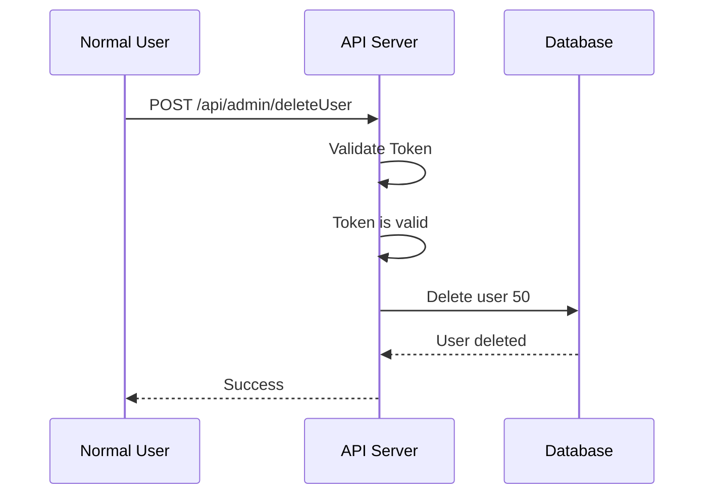

> [!abstract]
> ## Overview
>
> **Broken Function Level Authorization (BFLA)** occurs when an application fails to properly enforce authorization for a specific **function or API endpoint**.
>
> In other words:
>
> ```
> The user is authenticated,
> but the application does not verify
> whether that user is allowed to execute this function.
> ```
>
> BFLA is different from BOLA:
>
> ```
> BOLA
> ↓
> "Can I access this OBJECT?"
>
> BFLA
> ↓
> "Can I execute this FUNCTION?"
> ```
>
> Example:
>
> ```
> Normal User
>      |
>      ↓
> POST /api/admin/deleteUser
>      |
>      ↓
> Admin Function
> ```
>
> If the server executes the function without checking the user's role:
>
> ```
> Normal User
>      +
> Missing Function Authorization
>      =
> BFLA
> ```

# Authentication vs Authorization

> [!info]
> ## Important Difference
>
> Authentication determines **who the user is**.
>
> Authorization determines **what the user is allowed to do**.
>
> Example:
>
> ```
> Authentication:
>
> "This token belongs to John."
> ```
>
> But the server must additionally ask:
>
> ```
> "Is John allowed to delete users?"
> ```
>
> If the application only verifies the token:
>
> ```text
> Valid Token
>     |
>     ↓
> Request Accepted
> ```
>
> but does not check:
>
> ```text
> User Role
>     |
>     ↓
> Required Permission
> ```
>
> the endpoint may be vulnerable to BFLA.

# Privilege Levels

> [!info]
> ## Example Application Roles
>
> A typical application might have:
>
> ```
> Guest
>   |
>   ↓
> User
>   |
>   ↓
> Moderator
>   |
>   ↓
> Admin
> ```
>
> Different roles should have different permissions.
>
> Example:
>
> | Function | User | Moderator | Admin |
> |---|---:|---:|---:|
> | View Profile | ✅ | ✅ | ✅ |
> | Edit Profile | ✅ | ✅ | ✅ |
> | Delete Comment | ❌ | ✅ | ✅ |
> | Delete User | ❌ | ❌ | ✅ |
> | Create Admin | ❌ | ❌ | ✅ |

---

# Vulnerable API

> [!warning]
> ## Admin Endpoint
>
> Suppose the application has:
>
> ```http
> POST /api/admin/deleteUser
> ```
>
> This endpoint should only be available to:
>
> ```
> Admin
> ```
>
> However, the backend is implemented as:
>
> ```python
> @app.post("/api/admin/deleteUser")
> def delete_user():
>
>     delete_user(request.json["id"])
>
>     return "deleted"
> ```

---

## What Is Missing?

The application never checks:

```python
current_user.role == "admin"
````

Therefore:

```text
Request
   |
   ↓
Authentication Check
   |
   ↓
Valid Token
   |
   ↓
deleteUser()
   |
   ↓
User Deleted
```

The authorization step is missing.

---

# Normal Admin Request

> [!example]
> 
> ## Expected Behavior
> 
> An administrator sends:
> 
> ```http
> POST /api/admin/deleteUser
> Authorization: Bearer ADMIN_TOKEN
> Content-Type: application/json
> ```
> 
> ```json
> {
>     "id": 50
> }
> ```
> 
> The server checks:
> 
> ```text
> Is token valid?
>       |
>       ↓
> YES
>       |
>       ↓
> Is user an Admin?
>       |
>       ↓
> YES
>       |
>       ↓
> Execute Function
> ```
> 
> This is the intended behavior.

---

# Attack Scenario

> [!danger]
> 
> ## Normal User Accesses Admin Function
> 
> Assume the attacker is an ordinary user:
> 
> ```text
> Username: attacker
> Role: user
> ```
> 
> The attacker discovers:
> 
> ```http
> POST /api/admin/deleteUser
> ```
> 
> The attacker sends the request using their own valid session/token.

---

## Attack Request

```bash
curl -X POST \
"https://target.com/api/admin/deleteUser" \
-H "Authorization: Bearer USER_TOKEN" \
-H "Content-Type: application/json" \
-d '{
    "id":50
}'
```

The important part is:

```text
USER_TOKEN
```

not:

```text
ADMIN_TOKEN
```

The attacker is authenticated as a normal user.

---

# Vulnerable Request Flow



The problem is obvious:

```text
Authorization Check
        ↓
      MISSING
```

---

# Vulnerable Response

```json
{
    "message": "User deleted"
}
```

This confirms that:

```text
Normal User
     |
     ↓
Admin Function
     |
     ↓
Unauthorized Action
```

BFLA exists.

---

# Correct Behavior

> [!info]
> 
> ## Secure Response
> 
> The server should reject the request:
> 
> ```http
> HTTP/1.1 403 Forbidden
> ```
> 
> ```json
> {
>     "error": "Admin privileges required"
> }
> ```
> 
> The important point is that the request should be denied **server-side**.

---

# Frontend Protection Is Not Enough

> [!warning]
> 
> ## Hidden Buttons Are Not Authorization
> 
> A common mistake is:
> 
> ```javascript
> if (user.role === "admin") {
>     showDeleteUserButton();
> }
> ```
> 
> Developers may think:
> 
> ```
> Normal User
>      |
>      ↓
> Button Hidden
>      |
>      ↓
> Function Protected
> ```
> 
> This is incorrect.
> 
> An attacker can directly send:
> 
> ```http
> POST /api/admin/deleteUser
> ```
> 
> without using the frontend.
> 
> Correct architecture:
> 
> ```text
> Frontend
>    |
>    ↓
> API
>    |
>    ↓
> Authorization Check
>    |
>    +---- User → DENY
>    |
>    +---- Admin → ALLOW
> ```

---

# BFLA Testing Methodology

> [!abstract]
> 
> ## Step 1: Identify Roles
> 
> Create or identify accounts with different privilege levels:
> 
> ```text
> User A → Normal User
> User B → Admin
> ```
> 
> The goal is to compare what each role can execute.

---

> [!abstract]
> 
> ## Step 2: Discover Functions
> 
> Look for API endpoints such as:
> 
> ```text
> /api/admin/*
> /api/manage/*
> /api/users/delete
> /api/users/create
> /api/settings/*
> /api/roles/*
> ```
> 
> Other sources:
> 
> ```text
> JavaScript files
> API documentation
> Swagger/OpenAPI
> Burp Suite HTTP history
> Mobile applications
> GraphQL queries
> ```

---

> [!abstract]
> 
> ## Step 3: Capture an Admin Request
> 
> Example:
> 
> ```http
> POST /api/admin/deleteUser
> Authorization: Bearer ADMIN_TOKEN
> ```
> 
> Determine:
> 
> ```text
> Endpoint
> HTTP Method
> Parameters
> Headers
> Authorization Mechanism
> ```

---

> [!abstract]
> 
> ## Step 4: Replay as a Lower-Privilege User
> 
> Replace:
> 
> ```text
> ADMIN_TOKEN
> ```
> 
> with:
> 
> ```text
> USER_TOKEN
> ```
> 
> Example:
> 
> ```bash
> curl -X POST \
> "https://target.com/api/admin/deleteUser" \
> -H "Authorization: Bearer USER_TOKEN" \
> -H "Content-Type: application/json" \
> -d '{
>     "id":50
> }'
> ```

---

> [!abstract]
> 
> ## Step 5: Compare the Result
> 
> Expected:
> 
> ```text
> Admin Token → 200 OK
> User Token  → 403 Forbidden
> ```
> 
> Vulnerable:
> 
> ```text
> Admin Token → 200 OK
> User Token  → 200 OK
> ```
> 
> If a lower-privileged user can successfully execute an administrative function:
> 
> ```
> BFLA Confirmed
> ```

---

# BFLA Examples

> [!example]
> 
> ## Example 1: Delete User
> 
> ```http
> DELETE /api/admin/users/50
> ```
> 
> Normal user should receive:
> 
> ```http
> 403 Forbidden
> ```
> 
> If deletion succeeds:
> 
> ```text
> BFLA
> ```

---

> [!example]
> 
> ## Example 2: Create Administrator
> 
> ```http
> POST /api/admin/createAdmin
> ```
> 
> Request:
> 
> ```json
> {
>     "username": "attacker"
> }
> ```
> 
> If a normal user can execute this function:
> 
> ```text
> Privilege Escalation
> ```

---

> [!example]
> 
> ## Example 3: Change User Role
> 
> ```http
> PUT /api/admin/users/50/role
> ```
> 
> Request:
> 
> ```json
> {
>     "role": "admin"
> }
> ```
> 
> If a normal user can execute the function:
> 
> ```text
> Normal User
>      |
>      ↓
> Role Management Function
>      |
>      ↓
> Privilege Escalation
> ```

---

# HTTP Method Testing

> [!info]
> 
> ## Test Different Methods
> 
> Authorization may be implemented incorrectly for one HTTP method.
> 
> For example:
> 
> ```http
> GET /api/admin/users
> ```
> 
> may correctly require admin privileges.
> 
> But:
> 
> ```http
> POST /api/admin/users
> ```
> 
> may not.
> 
> Test the functions according to their intended behavior:
> 
> ```text
> GET
> POST
> PUT
> PATCH
> DELETE
> ```
> 
> The important point is not to blindly change methods, but to verify whether the same authorization policy is consistently enforced.

---

# BFLA vs BOLA

> [!info]
> 
> ## Important Difference
> 
> These vulnerabilities are easy to confuse.
> 
> **BOLA:**
> 
> ```text
> Can I access another user's OBJECT?
> ```
> 
> Example:
> 
> ```http
> GET /api/users/101
> ```
> 
> **BFLA:**
> 
> ```text
> Can I execute a FUNCTION that my role should not have access to?
> ```
> 
> Example:
> 
> ```http
> POST /api/admin/deleteUser
> ```
> 
> Simple distinction:
> 
> ```mermaid
> flowchart LR
> 
> A[Authorization Failure]
> 
> A --> B[BOLA]
> A --> C[BFLA]
> 
> B --> D["Object Access"]
> C --> E["Function Access"]
> ```

---

# Impact

> [!danger]
> 
> ## Security Impact
> 
> Depending on the exposed function, BFLA can lead to:
> 
> ```text
> Privilege Escalation
> Account Administration
> User Deletion
> Role Modification
> Sensitive Data Access
> Configuration Changes
> Administrative Actions
> ```
> 
> In severe cases:
> 
> ```text
> Normal User
>      |
>      ↓
> Administrative API
>      |
>      ↓
> Full Administrative Control
> ```

---

# Prevention

> [!tip]
> 
> ## Server-Side Authorization
> 
> Every privileged API function should enforce authorization on the server.
> 
> Vulnerable:
> 
> ```python
> @app.post("/api/admin/deleteUser")
> def delete_user():
>     delete_user(request.json["id"])
>     return "deleted"
> ```
> 
> Secure:
> 
> ```python
> @app.post("/api/admin/deleteUser")
> def delete_user():
> 
>     if current_user.role != "admin":
>         return {
>             "error": "Forbidden"
>         }, 403
> 
>     delete_user(request.json["id"])
> 
>     return {
>         "message": "User deleted"
>     }
> ```
> 
> The authorization decision must happen **before the privileged operation**.

---

# Quick Testing Checklist

> [!info]
> 
> ```text
> [ ] Identify user roles
> 
> [ ] Discover privileged endpoints
> 
> [ ] Capture an authorized request
> 
> [ ] Replay it using a lower-privileged account
> 
> [ ] Compare HTTP status codes
> 
> [ ] Compare response bodies
> 
> [ ] Verify whether the privileged action actually occurred
> 
> [ ] Test relevant HTTP methods
> 
> [ ] Check authorization server-side
> ```

---

# Summary

> [!abstract]
> 
> **BFLA = Broken Function Level Authorization**
> 
> The vulnerability occurs when:
> 
> ```text
> User is authenticated
>         +
> Function requires higher privileges
>         +
> Server fails to enforce the privilege requirement
>         ↓
> BFLA
> ```
> 
> The core pentesting question is:
> 
> ```text
> Can a lower-privileged user execute
> a function intended for a higher-privileged user?
> ```
> 
> Example:
> 
> ```text
> Normal User
>      |
>      ↓
> POST /api/admin/deleteUser
>      |
>      ↓
> Server fails to check role
>      |
>      ↓
> User Deleted
> ```
> 
> That is the essential difference from BOLA:
> 
> ```text
> BOLA → Unauthorized OBJECT
> 
> BFLA → Unauthorized FUNCTION
> ```