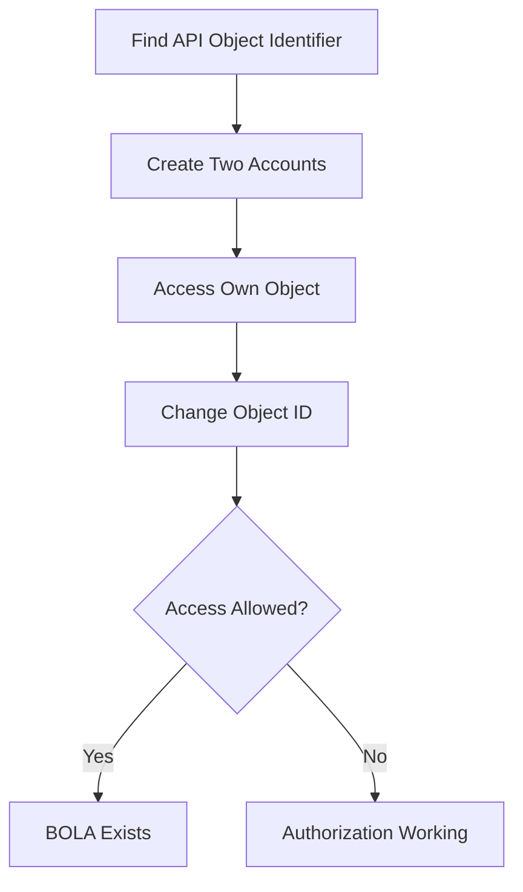

![[Pasted image 20260819163211.png]]

> [!abstract] Overview
> **Broken Object Level Authorization (BOLA)** is an API authorization vulnerability where an application exposes direct references to objects (such as IDs, UUIDs, filenames, or account numbers) but fails to verify whether the authenticated user has permission to access that object.
>
> In simple terms:
>
> ```
> The user is authenticated,
> but the application does not check ownership.
> ```
>
> Authentication answers:
>
> ```
> Who are you?
> ```
>
> Authorization answers:
>
> ```
> What are you allowed to access?
> ```
>
> BOLA occurs when the first question is answered correctly, but the second one is ignored.

# Object-Level Authorization Concept

> [!info]
> ## What is an Object?
>
> In APIs, an object is any resource that belongs to a user or system.
>
> Examples:
>
> ```
> User Account
> Profile
> Invoice
> Order
> Message
> Document
> Payment Record
> File
> Ticket
> ```
>
> APIs usually identify these objects using identifiers:
>
> ```
> Integer ID
> UUID
> Username
> Email
> Filename
> Reference Number
> ```

---

## Common API Pattern

A common API design:

```http
GET /api/users/{user_id}
````

Example:

```http
GET /api/users/100
```

The server receives:

```
Object ID = 100
```

Then retrieves:

```
Database Object
        |
        ↓
User Record 100
```

The security question:

```
Does the current user have permission to access object 100?
```

If the answer is not checked:

```
BOLA Vulnerability
```

---

# Vulnerable Backend Logic

> [!warning]
> 
> ## Missing Authorization Check
> 
> Example vulnerable code:

```python
@app.get("/api/user/<id>")
def get_user(id):

    user = database.get_user(id)

    return user
```

The backend performs:

```
Receive ID
    |
    ↓
Search Database
    |
    ↓
Return Object
```

But missing:

```
Is this object owned by the logged-in user?
```

---

## Secure Backend Logic

A secure implementation should check ownership:

```python
@app.get("/api/user/<id>")
def get_user(id):

    user = database.get_user(id)

    if user.owner != current_user:
        return "Unauthorized"

    return user
```

Secure flow:

```
Request Object ID

        |
        ↓

Find Object

        |
        ↓

Check Ownership

        |
        ↓

Allow / Deny
```

---

# Normal Application Flow

Assume the database contains:

```
Users Table

ID      Username
----------------
100     john
101     admin
102     alice
```

User John logs in:

```
User:
john

Token:
USER_A_TOKEN
```

---

John requests his profile:

```http
GET /api/users/100

Authorization:
Bearer USER_A_TOKEN
```

Backend:

```
Token belongs to John

Requested Object:
User ID 100

Ownership:
YES

Allow
```

Response:

```json
{
"id":100,
"username":"john"
}
```

---

# Attack Scenario

> [!danger]
> 
> ## ID Manipulation
> 
> The attacker notices that the API uses predictable IDs:
> ```
> /api/users/100
> ```
> 
>The attacker changes:
>
>```
>100 → 101
>```
>
>Request:
>
>```http
>GET /api/users/101
>
>Authorization:
>Bearer USER_A_TOKEN
>```
## Vulnerable Server Behavior

Backend:

```
Receive Token
      |
      ↓
Validate Token
      |
      ↓
Receive Object ID 101
      |
      ↓
Return User 101
```

Problem:

```
Token is valid,
but object ownership was never checked.
```

---

Response:

```json
{
"id":101,
"username":"admin",
"email":"admin@test.com"
}
```

Impact:

```
John accessed Admin's data
```

---

# Exploitation with curl

Request:

```bash
curl -X GET \
"https://target.com/api/users/101" \
-H "Authorization: Bearer USER_A_TOKEN"
```

## Vulnerable Response

```json
{
"id":101,
"username":"admin",
"email":"admin@test.com"
}
```

Meaning:

```
Authenticated User
        |
        ↓
Unauthorized Object Access
```

---

## Secure Response

```json
{
"error":"Unauthorized"
}
```

or:

```http
HTTP/1.1 403 Forbidden
```

---

# Common BOLA Locations

> [!example] Where to Look for BOLA
>### User Profiles
>
>```http
>GET /api/users/100/profile
>```
>
>Test:
>
>```http
>GET /api/users/101/profile
>```
>
>
>
>### Orders
>
>Normal:
>
>```http
>GET /api/orders/5001
>```
>
>Attack:
>
>```http
>GET /api/orders/5002
>```
>
>Possible impact:
>
>```
>View another user's order
>```
>
>### Documents
>
>API:
>
>```http
>GET /api/documents/abc123
>```
>
>Attack:
>
>```
>Change document ID
>```
>
>Impact:
>
>```
>Private file disclosure
>```
>
>
>### Messages
>
>API:
>
>```http
>GET /api/messages/900
>```
>
> Attack:
>
>```http
>GET /api/messages/901
>```
>
>Impact:
>
>```
>Read another user's messages
>```
>


# Types of BOLA

> [!info]
> 
> ## 1. Read-Based BOLA
> 
> Attacker can read another user's object.
>
>Example:
>
>```http
>GET /api/profile/101
>```
>
>Impact:
>
>```
>Information Disclosure
>```
>

> [!info]
> 
> ## 2. Write-Based BOLA
> 
> Attacker can modify another user's object.
>
>Example:
>
>```http
>PUT /api/profile/101
>```
>
>Request:
>
>```json
>{
>"email":"attacker@test.com"
>}
>```
>
>Impact:
>
>```
>Account Modification
>```
>

> [!danger]
> 
> ## 3. Delete-Based BOLA
> 
> Attacker can delete another user's resource.
>
>Example:
>
>```http
>DELETE /api/files/101
>```
>
>Impact:
>
>```
>Data Loss
>```
>

# BOLA Testing Methodology



> [!tip] Testing Checklist
>
>Look for:
>
>```
>/api/users/{id}
>
>/api/orders/{id}
>
>/api/accounts/{id}
>
>/api/files/{id}
>
>/api/messages/{id}
>```
>
>Test changing:
>
>```
>ID
>UUID
>Username
>Reference Number
>Filename
>```
>
>Check:
>
>```
>GET
>POST
>PUT
>PATCH
>DELETE
>```
>
Because many developers remember to protect viewing but forget modifying and deleting. Humanity's favorite security strategy: "we secured the front door, ignore the windows."

> [!danger] Security Impact
>Successful BOLA can lead to:
>
>```
>Unauthorized Data Access
>
>Privacy Violation
>
>Account Takeover
>
>Financial Data Exposure
>
>Modification of User Data
>
>Deletion of Resources
>
>Privilege Escalation
>```

> [!info] Secure Development
>Never trust object identifiers from users.
>
>Bad:
>
>```python
>object = get_object(id)
>return object
>```
>
>Good:
>
>```python
>object = get_object(id)
>
>if object.user_id != authenticated_user.id:
>    deny()
>```
>
>Security checks must happen on:
>
>```
>Every API Request
>
>Every Object Access
>
>Every HTTP Method
>```


# Summary

> [!abstract]
>
>BOLA happens when:
>
>```
>User Authentication
>        +
>Missing Object Authorization
>        =
>Unauthorized Object Access
>```
>
>The attacker usually performs:
>
>```
>1. Authenticate normally
>
>2. Find object identifier
>
>3. Modify ID/UUID/reference
>
>4. Access another user's resource
>```
>
>The core question during testing:
>
>```
>Can User A access User B's object by changing an identifier?
>```
