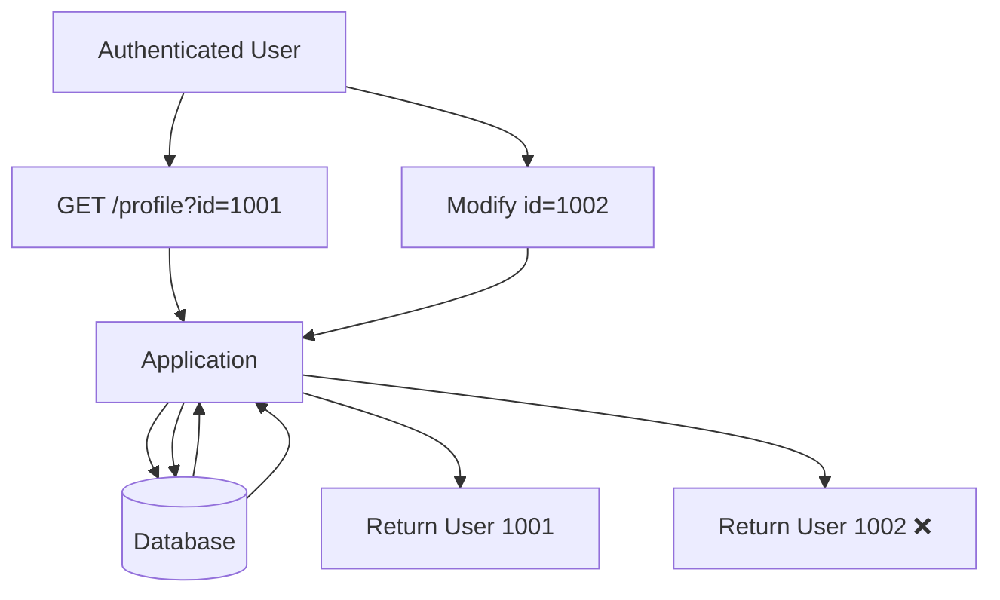
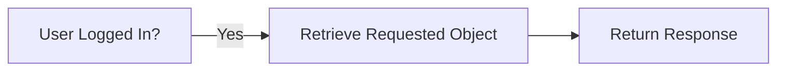
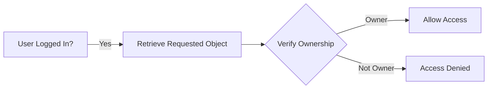
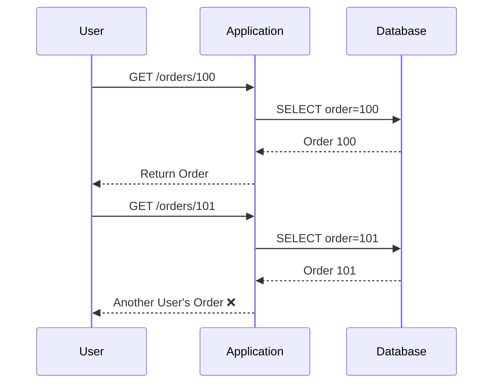
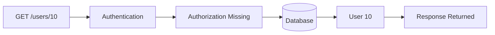

![[Pasted image 20260811163438.png]]

> [!abstract]
>
> **Insecure Direct Object Reference (IDOR)** is an access control vulnerability where an application exposes a direct reference to an object (such as a user ID, document ID, order number, or filename) without verifying whether the authenticated user is authorized to access that object.
>
> An attacker can manipulate the object identifier to access or modify resources belonging to other users.
# How IDOR Works

Applications often expose object identifiers in requests.

Example:

```http
GET /profile?id=1001
```

The application retrieves:

```sql
SELECT * FROM users WHERE id = 1001;
```

If no authorization check exists, an attacker can simply change:

```http
GET /profile?id=1002
```

and obtain another user's information.

---

# Attack Flow



---

# Why Does IDOR Happen?

The application validates that the user is authenticated but fails to verify ownership of the requested object.
### Incorrect Authorization Flow



### Correct Authorization Flow



# Common IDOR Targets

- User Profiles
- Orders
- Invoices
- Documents
- Images
- Medical Records
- Support Tickets
- Messages
- File Downloads
- REST API Resources

---

# Example 1 - User Profile

Request:

```http
GET /profile?id=5
```

Response:

```json
{
    "id":5,
    "username":"alice"
}
```

Attacker changes:

```http
GET /profile?id=6
```

Response:

```json
{
    "id":6,
    "username":"bob"
}
```

---

# Example 2 - File Download

Request

```http
GET /download?file=invoice_102.pdf
```

Attacker changes

```http
GET /download?file=invoice_101.pdf
```

If access control is missing:

```text
Sensitive invoice disclosed
```

---

# Example 3 - REST API

Request

```http
GET /api/users/15
```

Attacker changes

```http
GET /api/users/16
```

Application returns another user's data.

---

# Example 4 - Order History

```http
GET /orders/5001
```

↓

```http
GET /orders/5002
```

If both succeed:

```text
Possible IDOR
```

---

# IDOR Flow



---

# Testing IDOR With curl

## User Profile

```bash
curl -i \
https://target.com/profile?id=10
```

Change:

```bash
curl -i \
https://target.com/profile?id=11
```

Compare:

- Status Code
- Response Body
- Response Length

---

## REST API

```bash
curl -i \
https://target.com/api/users/10
```

↓

```bash
curl -i \
https://target.com/api/users/11
```

---

## Download Endpoint

```bash
curl -i \
"https://target.com/download?file=invoice_100.pdf"
```

↓

```bash
curl -i \
"https://target.com/download?file=invoice_101.pdf"
```

---

# Common Object References

## Numeric IDs

```text
?id=1
?id=2
?id=3
```

---

## UUID

```text
/users/3d3470fa-657f-4586-a063-d84b0cf8af65
```

---

## Filenames

```text
invoice.pdf
report.docx
backup.zip
```

---

## Order Numbers

```text
ORD-1001
ORD-1002
```

---

## API Keys

```text
/api/token/abcd1234
```

---

# IDOR in REST APIs



---

# Authentication ≠ Authorization

> [!warning]
>
> Authentication verifies **who you are**.
>
> Authorization verifies **what you are allowed to access**.
>
> Most IDOR vulnerabilities occur because authentication exists but authorization is missing.

---

# Indicators During Pentest

> [!tip]
>Look for user-controlled identifiers in:
> - URL parameters
> - REST API paths
> - POST parameters
> - JSON bodies
> - Cookies
> - Hidden form fields
> - File names

Examples

```text
?id=
```

```text
/user/15
```

```text
/order/500
```

```text
/document/42
```

> [!todo] Checklist
>
> - Identify object identifiers.
> - Modify numeric IDs.
> - Modify UUIDs.
> - Test sequential values.
> - Test deleted object IDs.
> - Test file names.
> - Compare responses.
> - Compare status codes.
> - Compare response sizes.
> - Test different user accounts.
> - Test API endpoints.
> - Test download functionality.

> [!success] Prevention
>
> - Enforce authorization checks for every object access.
> - Never trust user-supplied object identifiers.
> - Verify object ownership before returning data.
> - Use indirect object references where appropriate.
> - Implement server-side access control.
> - Log unauthorized access attempts.
> - Apply least privilege.

---

# Related Vulnerabilities

- Broken Access Control
- Forced Browsing
- Privilege Escalation
- Information Disclosure
- API Authorization Issues

---

# References

- OWASP Top 10 - Broken Access Control
- OWASP Web Security Testing Guide
- OWASP API Security Top 10
- CWE-639: Authorization Bypass Through User-Controlled Key
- PortSwigger Web Security Academy