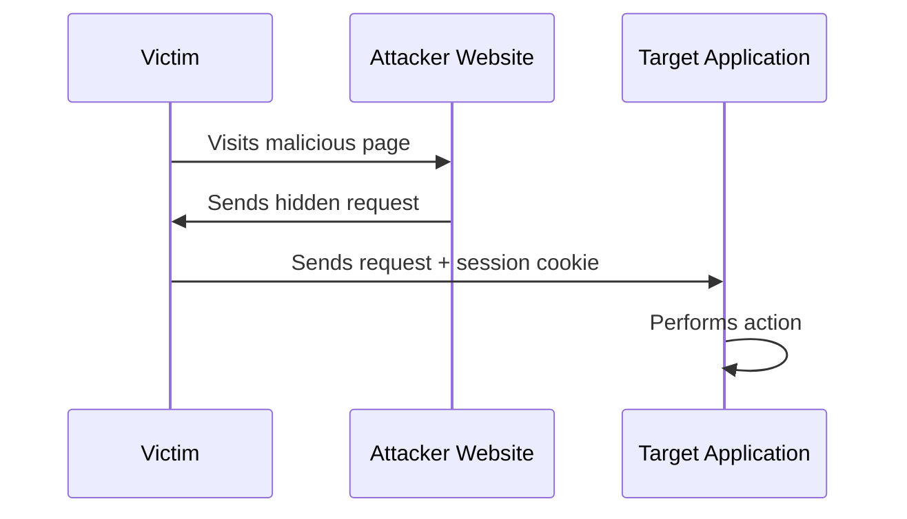
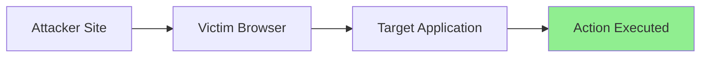

---
title:
draft: false
tags:
  - CWE-352
---

![[Pasted image 20260811163907.png]]

> [!abstract]  
> **Cross-Site Request Forgery (CSRF)** is a web vulnerability that tricks an authenticated user into performing unintended actions on a web application without their knowledge or consent.

## What is CSRF?

It's called `CSRF` in MITRE ATT&CK, and is categorized under **Broken Access Control** in the **OWASP Top 10**. 

`CSRF` occurs when an attacker causes a victim's browser to send a request to a target application where the victim is already authenticated. The application receives a legitimate request containing the victim's session cookies and assumes the action was intentionally performed by the user.

> [!info]-
> CSRF does **not** steal the victim's credentials. 
> Instead, it abuses the victim's existing authenticated session.

> [!check] Requirements 
> A successful CSRF attack typically requires:
> - The victim to be authenticated to the target application.
> - Authentication to rely on **cookies** (or other automatically appended headers).
> - No effective CSRF protection mechanism in place.

## What Actions Can Be Targeted?

`CSRF` is only meaningful when the request performs a **state-changing action**.

> [!example]  
> Common targets include:
> - Changing account settings
> - Updating profile information
> - Changing passwords
> - Adding new users
> - Modifying email addresses
> - Submitting financial transactions
> - Deleting resources

Actions that only retrieve data (GET requests) are generally not primary CSRF targets unless they trigger a state change.

## How Does the Attack Work?

The attacker creates a malicious page containing a request to the vulnerable application. When the victim visits the attacker's page, the browser automatically sends the request along with the victim's session cookies.



![[Pasted image 20260530151703.png]]

> [!tip]  
> The attacker never needs direct access to the victim's session cookie. 
> The browser automatically includes it in the cross-site request.

---

## Can Any HTTP Request Be CSRFed? (Understanding "Simple Requests")

> [!warning]  
> Attackers cannot arbitrarily forge every possible HTTP request.

For a CSRF attack to work via JavaScript (like `XMLHttpRequest` or `fetch`), the request must be classified as a **"Simple Request"** by the browser. If it's not simple, the browser sends a preflight `OPTIONS` request first (due to CORS). If the server doesn't explicitly allow the attacker's origin, the actual request is blocked.

> [!example]+ Allowed HTTP Methods for Simple Requests
> Browsers only consider these methods as "simple":
> - `GET`
> - `HEAD`
> - `POST`
> 
> If the state-changing endpoint uses `PUT`, `DELETE`, or `PATCH`, a traditional CSRF attack will fail because the browser will send a preflight request first.

> [!example]+ Allowed Content-Types for Simple Requests
> For a `POST` request to be "simple", its `Content-Type` header must be one of exactly three values:
> 1. `application/x-www-form-urlencoded` (Standard HTML forms)
> 2. `multipart/form-data` (File uploads)
> 3. `text/plain` (Plain text)
> 
> If the endpoint requires `application/json` or `application/xml`, the browser will trigger a preflight request, making CSRF much harder (unless the server improperly parses `text/plain` as JSON).

> [!danger] Custom Headers Break the Attack
> If the application requires any custom headers (e.g., `X-Requested-With: XMLHttpRequest`, `X-CSRF-Token`, or `Authorization`), it is no longer a simple request. The browser will send a preflight request, and the attack will fail unless a separate CORS misconfiguration exists.

## SameSite Cookies and CSRF

Modern browsers support the `SameSite` cookie attribute to mitigate CSRF attacks.

> [!info]  
> `SameSite` controls when cookies are sent during cross-site requests.

### Common Values

| Value | Behavior |
| :--- | :--- |
| `Strict` | Cookies are never sent in cross-site requests. |
| `Lax` | Cookies are sent only in limited situations (e.g., top-level GET navigations). |
| `None` | Cookies are sent normally (requires `Secure` attribute in modern browsers). |

---

## Advanced SameSite Cookie Scenarios

> [!question] What if there are multiple cookies with different SameSite policies?
> Applications often set multiple cookies. The success of a CSRF attack depends entirely on the `SameSite` attribute of the **authentication/session cookie**.
> 
> **Scenario:** You have an API that requires two cookies to function:
> 1. `session_id` (Important - used for auth) -> `SameSite=None`
> 2. `csrf_token` (Important - used for CSRF protection) -> `SameSite=Strict`
> 3. `tracking_id` (Not important) -> `SameSite=Lax`
> 
> **Will the attack succeed?** **NO.**
> 
> Even though the `session_id` is sent cross-site (because it's `None`), the `csrf_token` will **not** be sent because it is `Strict`. When the request reaches the server, the backend will reject it because the CSRF token is missing or mismatched.

> [!success] The Golden Rule of SameSite for CSRF
> A CSRF attack is only successful if **all cookies required by the backend to authorize the action** have `SameSite=None` (or no SameSite attribute on very old browsers). If the critical authentication or CSRF-token cookie is `Lax` or `Strict`, the attack is mitigated.
> 
> - `SameSite=Strict`: Completely blocks CSRF for that cookie.
> - `SameSite=Lax`: Blocks CSRF for POST requests, but still sends the cookie on top-level GET navigations.
> - `SameSite=None`: Offers no CSRF protection (must be used with `Secure` flag).

---

## When SameSite Is Enabled

> [!warning]  
> If `SameSite` protections are properly configured, traditional CSRF attacks often fail because session cookies are not included in cross-site requests.

In some scenarios, attackers may need an additional vulnerability to bypass these protections, such as:
- Cross-Site Scripting (XSS)
- A vulnerable subdomain allowing cookie scope manipulation
- Cross-Origin Resource Sharing (CORS) misconfigurations

## What About the Same-Origin Policy (SOP)?

> [!question]  
> Doesn't the Same-Origin Policy stop this attack?

The Same-Origin Policy (SOP) prevents malicious websites from **reading responses** from other origins. However, CSRF does not require reading the response. The attack only requires the request to be successfully delivered and processed by the server.



> [!note]  
> The attacker doesn't care about the response. 
> The damage is already done once the state-changing action is executed.

---

## Proof of Concept (PoC)

> [!bug] CSRF PoC using XMLHttpRequest
> If the endpoint accepts a simple POST request and the session cookie is `SameSite=None`, you can use this JavaScript PoC. Host this on your attacker-controlled domain (e.g., `https://attacker.com/poc.html`).
> 
> ```html
> <!DOCTYPE html>
> <html>
> <head><title>CSRF PoC</title></head>
> <body>
>     <h2>CSRF Attack in Progress...</h2>
>     <p>You are being redirected, please wait.</p>
> 
>     <script>
>         // 1. Create a new XMLHttpRequest object
>         var xhr = new XMLHttpRequest();
> 
>         // 2. Configure it: POST request to the target endpoint
>         xhr.open("POST", "https://api.victim.com/account/change-email", true);
> 
>         // 3. Set the necessary headers (must be a simple Content-Type!)
>         xhr.setRequestHeader("Content-Type", "application/x-www-form-urlencoded");
> 
>         // 4. Define what happens on successful data submission
>         xhr.onload = function() {
>             if (xhr.status === 200) {
>                 console.log("CSRF Attack Successful!");
>                 // Optional: Redirect victim to hide the attack
>                 window.location.href = "https://victim.com/account/settings";
>             }
>         };
> 
>         // 5. Send the request with the malicious payload.
>         // The victim's browser will automatically append the victim's cookies.
>         xhr.send("new_email=attacker@evil.com");
>     </script>
> </body>
> </html>
> ```
> 

> [!tip] Why no `withCredentials = true`?
> In standard CSRF, you do **not** need `xhr.withCredentials = true`. That flag is used when you want the attacker to read the *response* from the target (which is a CORS issue). For CSRF, the browser automatically attaches cookies for simple cross-site requests regardless of the `withCredentials` flag. The attacker only cares about sending the request, not reading the response.

> [!example]+ Alternative: Hidden HTML Form PoC
> While `XMLHttpRequest` works perfectly for simple POST requests, the most reliable CSRF PoC is a standard auto-submitting HTML form. It guarantees no CORS preflight is triggered.
> 
> ```html
> <!DOCTYPE html>
> <html>
> <body>
>     <form id="csrfForm" action="https://api.victim.com/account/change-email" method="POST" enctype="application/x-www-form-urlencoded">
>         <input type="hidden" name="new_email" value="attacker@evil.com" />
>     </form>
>     <script>
>         // Auto-submit the form as soon as the page loads
>         document.getElementById("csrfForm").submit();
>     </script>
> </body>
> </html>
> ```
## Key Takeaways

> [!summary] 
> - CSRF forces authenticated users to perform unwanted actions.
> - It relies on browsers automatically sending session cookies.
> - Only state-changing actions are interesting targets.
> - Traditional CSRF generally requires cookie-based authentication.
> - `SameSite` cookies significantly reduce CSRF risk.
> - The Same-Origin Policy remains intact because the attacker does not need access to the response.
> - Modern applications commonly defend against CSRF using tokens, SameSite cookies, and strict request validation.

