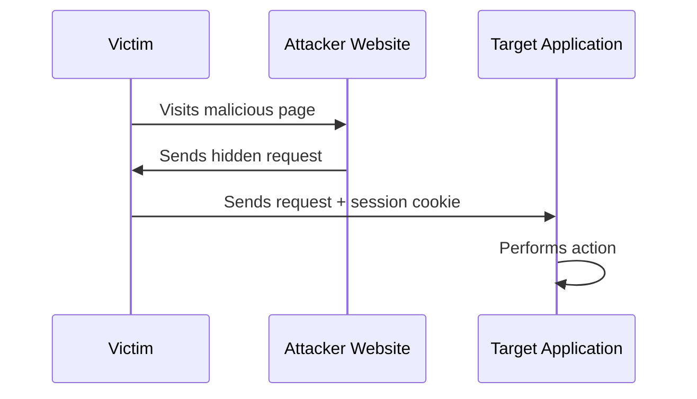
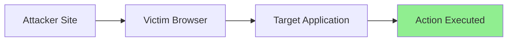

---
title:
draft: false
tags:
  - OWASP
---
![[Pasted image 20260811163907.png]]

> [!abstract]  
> **Cross-Site Request Forgery (CSRF)** is a web vulnerability that tricks an authenticated user into performing unintended actions on a web application without their knowledge or consent.
## What is CSRF?

It's called `CSRF` in MITRE ATT&CK, and is categorized under **Broken Access Control** in the **OWASP Top 10**. 

`CSRF` occurs when an attacker causes a victim's browser to send a request to a target application where the victim is already authenticated. The application receives a legitimate request containing the victim's session cookies and assumes the action was intentionally performed by the user.

> [!info]-
> CSRF does **not** steal the victim's credentials. 
> Instead, it abuses the victim's existing authenticated session.

> [!check] Requirements 
> A successful CSRF attack typically requires:
> - The victim to be authenticated to the target application.
> - Authentication to rely on **cookies** (or other automatically appended headers).
> - No effective CSRF protection mechanism in place.

## What Actions Can Be Targeted?

`CSRF` is only meaningful when the request performs a **state-changing action**.

> [!example]  
> Common targets include:
> - Changing account settings
> - Updating profile information
> - Changing passwords
> - Adding new users
> - Modifying email addresses
> - Submitting financial transactions
> - Deleting resources

Actions that only retrieve data (GET requests) are generally not primary CSRF targets unless they trigger a state change.

## How Does the Attack Work?

The attacker creates a malicious page containing a request to the vulnerable application. When the victim visits the attacker's page, the browser automatically sends the request along with the victim's session cookies.

![[Pasted image 20260530151703.png]]

> [!tip]  
> The attacker never needs direct access to the victim's session cookie. 
> The browser automatically includes it in the cross-site request.

---

## Can Any HTTP Request Be CSRFed?

> [!warning]  
> Attackers cannot arbitrarily forge every possible HTTP request.

For a request to be CSRFable, it generally needs to be a **simple request** that browsers can send without triggering a Cross-Origin Resource Sharing (CORS) preflight.

**Vulnerable examples include:**
- Standard form submissions (`application/x-www-form-urlencoded`)
- Simple GET requests
- Basic POST requests using `multipart/form-data` or `text/plain`

> [!danger] Harder to CSRF
> Modern APIs that require the following are typically much harder (or impossible) to exploit via traditional CSRF techniques:
> - Custom headers (e.g., `X-Requested-With`)
> - JSON content type (`application/json`)
> - CSRF tokens
> - Authorization headers

## SameSite Cookies and CSRF

Modern browsers support the `SameSite` cookie attribute to mitigate CSRF attacks.

> [!info]  
> `SameSite` controls when cookies are sent during cross-site requests.

### Common Values

| Value | Behavior |
| :--- | :--- |
| `Strict` | Cookies are never sent in cross-site requests. |
| `Lax` | Cookies are sent only in limited situations (e.g., top-level GET navigations). |
| `None` | Cookies are sent normally (requires `Secure` attribute in modern browsers). |

---

## When SameSite Is Enabled

> [!warning]  
> If `SameSite` protections are properly configured, traditional CSRF attacks often fail because session cookies are not included in cross-site requests.

In some scenarios, attackers may need an additional vulnerability to bypass these protections, such as:
- Cross-Site Scripting (XSS)
- A vulnerable subdomain allowing cookie scope manipulation
- Cross-Origin Resource Sharing (CORS) misconfigurations

## What About the Same-Origin Policy (SOP)?

> [!question]  
> Doesn't the Same-Origin Policy stop this attack?

The Same-Origin Policy (SOP) prevents malicious websites from **reading responses** from other origins. However, CSRF does not require reading the response. The attack only requires the request to be successfully delivered and processed by the server.

> [!note]  
> The attacker doesn't care about the response. 
> The damage is already done once the state-changing action is executed.

## Key Takeaways

> [!summary] 
> - CSRF forces authenticated users to perform unwanted actions.
> - It relies on browsers automatically sending session cookies.
> - Only state-changing actions are interesting targets.
> - Traditional CSRF generally requires cookie-based authentication.
> - `SameSite` cookies significantly reduce CSRF risk.
> - The Same-Origin Policy remains intact because the attacker does not need access to the response.
> - Modern applications commonly defend against CSRF using tokens, SameSite cookies, and strict request validation.

