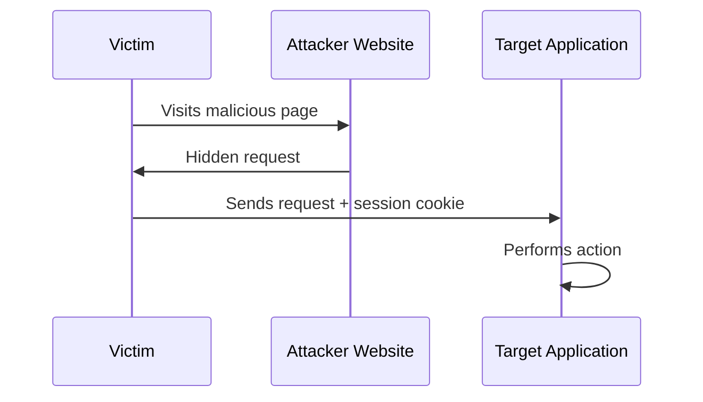
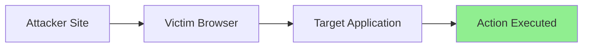

---
title:
draft: false
tags:
  - OWASP
---

> [!abstract]  
> **Cross-Site Request Forgery (CSRF)** is a web vulnerability that tricks an authenticated user into performing unintended actions on a web application without their knowledge.

![[Pasted image 20260811163907.png]]
## What is CSRF

it's called `CSRF` in Mitre Attack, categorized as Broken Access Control in **OWASP TOP 10 2026**. what is it?

`CSRF` occurs when an attacker causes a victim's browser to send a request to a target application where the victim is already authenticated.

The application receives a legitimate request containing the victim's session cookies and assumes the action was intentionally performed by the user.

> [!info]-
> CSRF does **not** steal the victim's credentials.
> 
> Instead, it abuses the victim's existing authenticated session.

> [!check]  Requirements 
> A CSRF attack typically requires:
> - The victim to be authenticated to the target application.
> - Authentication to rely on **cookies**.
> - No effective CSRF protection mechanism.

## What Actions Can Be Targeted?

`CSRF` is only meaningful when the request performs a **state-changing action**.

> [!example]  
> Common targets include:
> 
> - Changing account settings
>     
> - Updating profile information
>     
> - Changing passwords
>     
> - Adding new users
>     
> - Modifying email addresses
>     
> - Submitting transactions
>     
> - Deleting resources
>     

Actions that only retrieve data are generally not useful `CSRF` targets.
## How Does the Attack Work?

The attacker creates a malicious page containing a request to the vulnerable application.

When the victim visits the attacker's page, the browser automatically sends the request along with the victim's session cookies.

![[Pasted image 20260530151703.png]]

> [!tip]  
> The attacker never needs access to the victim's session cookie.
> 
> The browser automatically includes it.

---

## Can Any HTTP Request Be CSRFed?

> [!warning]  
>Attackers cannot arbitrarily forge every possible HTTP request.

For a request to be CSRFable, it generally needs to be a **simple request** that browsers can send without triggering additional security checks.

Examples include:
- Standard form submissions
- Simple GET requests
- Basic POST requests using common content types

Modern APIs that require
are typically much harder to exploit via traditional CSRF techniques.

- Custom headers
- JSON requests
- CSRF tokens
- Authorization headers

---

## SameSite Cookies and CSRF

Modern browsers support the `SameSite` cookie attribute to reduce CSRF attacks.

> [!info]  
> `SameSite` controls when cookies are sent during cross-site requests.

### Common Values

|Value|Behavior|
|---|---|
|`Strict`|Cookies are never sent in cross-site requests|
|`Lax`|Cookies are sent only in limited situations|
|`None`|Cookies are sent normally|

---

## When SameSite Is Enabled

> [!warning]  
> If `SameSite` protections are properly configured, traditional CSRF attacks often fail because session cookies are not included in cross-site requests.

In some scenarios, attackers may need an additional vulnerability such as:

- Cross-Site Scripting (XSS)
- A vulnerable subdomain
- Cookie scope misconfigurations

to bypass these protections.

## What About the Same-Origin Policy (SOP)?

> [!question]  
> Doesn't the Same-Origin Policy stop this attack?

The Same-Origin Policy prevents malicious websites from **reading responses** from other origins.

However, CSRF does not require reading the response.

The attack only requires the request to be successfully delivered and processed.

> [!note]  
> The attacker doesn't care about the response.
> 
> The damage is already done once the state-changing action is executed.

## Key Takeaways

> [!summary]
> 
> - CSRF forces authenticated users to perform unwanted actions.
>     
> - It relies on browsers automatically sending session cookies.
>     
> - Only state-changing actions are interesting targets.
>     
> - Traditional CSRF generally requires cookie-based authentication.
>     
> - `SameSite` cookies significantly reduce CSRF risk.
>     
> - The Same-Origin Policy remains intact because the attacker does not need access to the response.
>     
> - Modern applications commonly defend against CSRF using tokens, SameSite cookies, and strict request validation.
