> [!info] What is RCE?
> **Remote Code Execution (RCE)** is a vulnerability that allows an attacker to cause an application or server to execute **attacker-controlled code remotely**.
> 
> In other words, the application processes attacker-controlled input as **program code** instead of treating it as ordinary data.
> 
> The important distinction is that the attacker is not simply controlling application data. The attacker is influencing **what code or commands the application executes**.
> 
> A simplified vulnerable flow looks like this:
> 
> ```mermaid
> flowchart TD
>     A[Attacker-Controlled Input] --> B[Web Application]
>     B -->|Input is interpreted as Code| C[Code Execution]
>     C --> D[Server]
> ```
> 
> RCE vulnerabilities can occur when an application insecurely handles user-controlled input and passes it to dangerous functionality, such as:
> 
> - Command execution functions
>     
> - Code evaluation functions
>     
> - Template engines
>     
> - Deserialization mechanisms
>     
> - File upload or processing functionality
>     
> - Vulnerable third-party components
>     
> 
> The impact of RCE depends on the permissions of the vulnerable application. An attacker may be able to execute code with the same privileges as the affected process, which can potentially lead to:
> 
> - Access to sensitive data
>     
> - Modification or deletion of files
>     
> - Access to internal systems
>     
> - Further privilege escalation
>     
> - Complete compromise of the affected server in severe cases
>     
> 
> **RCE is therefore one of the most critical vulnerability classes because the attacker may gain control over what the vulnerable system actually executes.**

![[Pasted image 20260811164841.png]]

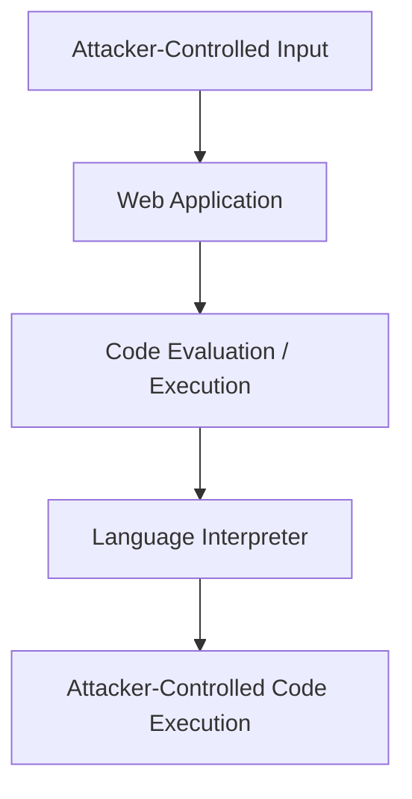

## Code Injection

One common way RCE can occur is through **Code Injection**.

Code Injection happens when an application takes attacker-controlled input and passes it to a mechanism that interprets the input as source code.

For example:

```php
<?php

$code = $_GET['code'];

eval($code);

?>
```

The application receives the value of `code` from the HTTP request and passes it directly to `eval()`.

The fundamental problem is:

```text
User Input → Code Evaluation
```

Instead of:

```text
User Input → Data Processing
```

---

## `eval()`

`eval()` is a function that evaluates a string as source code.

For example:

```php
<?php

$code = "2 + 2";

$result = eval("return $code;");

echo $result;

?>
```

The string stored in `$code` is interpreted as PHP code.

Conceptually:

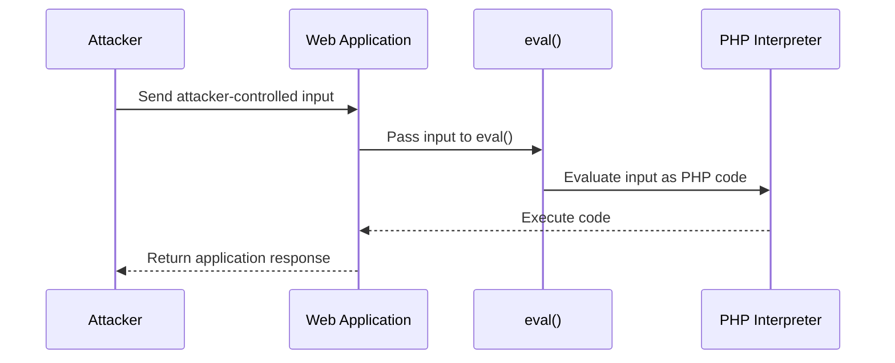

> [!danger] Security Risk  
> `eval()` itself is not automatically a vulnerability. The vulnerability occurs when untrusted attacker-controlled input reaches a code-evaluation mechanism in an unsafe way.

---

## A Simple RCE Example

Consider:

```php
<?php

$code = @$_GET['code'];

eval($code);

?>
```

The application accepts the `code` parameter and evaluates it as PHP source code.

For example:

```text
/code.php?code=...
```

The important point is that the application does not treat the parameter as ordinary data.

It passes the value directly to the PHP interpreter.

---

## Breaking Out of an Existing Context

Sometimes the application does not pass the input directly to `eval()`.

Instead, it may construct a larger piece of code:

```php
<?php

$echo = @$_GET['echo'];

eval("print('$echo');");

?>
```

Here, the attacker-controlled value is inserted inside an existing PHP string:

```php
print('$echo');
```

The input is therefore being evaluated inside a specific **syntactic context**.

Conceptually:

```mermaid
flowchart TD
    A[Attacker Input] --> B[Application]
    B --> C[Construct PHP Code]
    C --> D["print('USER_INPUT')"]
    D --> E[eval()]
    E --> F[PHP Interpreter]
    F --> G[Code Execution]
```

This is an important concept when analyzing code injection vulnerabilities.

The attacker has to understand the context in which their input is placed.

Possible contexts include:

- String context
    
- Numeric context
    
- Expression context
    
- Function argument
    
- Template expression
    
- JavaScript context
    
- SQL context
    

The exact behavior depends on the programming language and the way the application constructs the code.

---

## Python Example

The same concept exists in other programming languages.

For example, Python provides functions such as:

```python
eval()
exec()
```

A simplified vulnerable application could look like:

```python
from flask import Flask, request

app = Flask(__name__)

@app.route("/eval")
def page():
    expression = request.args.get("expression")
    result = eval(expression)

    return str(result)

if __name__ == "__main__":
    app.run(host="0.0.0.0", port=8080)
```

The application receives attacker-controlled input through the HTTP request:

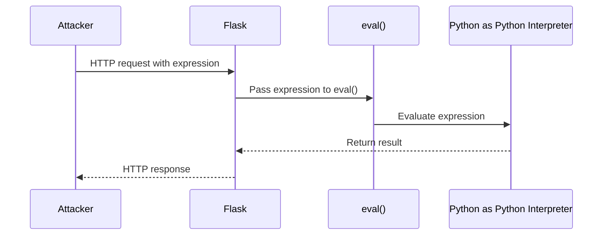

> [!warning] Important  
> `eval()` and `exec()` should not be used with untrusted input unless the application has a very strong and carefully designed security boundary around the evaluated code.

---

# RCE vs Command Injection

RCE and OS Command Injection are closely related, but they are not exactly the same vulnerability.

## OS Command Injection

OS Command Injection occurs when attacker-controlled input reaches an operating-system command or shell.

Conceptually:

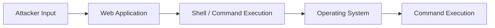

For example:

```php
<?php

$output = shell_exec($_GET["cmd"]);

echo "<pre>$output</pre>";

?>
```

The application receives the value of:

```text
cmd
```

and passes it to:

```php
shell_exec()
```

The shell then executes the resulting command.

> [!danger] Security Risk  
> If attacker-controlled input reaches `shell_exec()` without proper validation and safe command construction, the attacker may be able to execute operating-system commands with the privileges of the web application.

---

## Code Injection

Code Injection targets the **application's programming-language interpreter**.

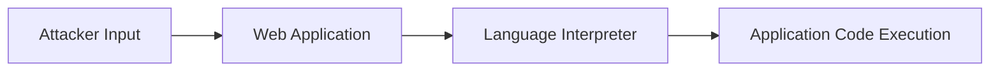

Examples include:

```text
PHP        → eval()
Python     → eval(), exec()
JavaScript → eval(), Function()
```

---

## Command Injection vs Code Injection

|Vulnerability|Target|
|---|---|
|Code Injection|Application language interpreter|
|Command Injection|Operating-system command / shell|
|RCE|Impact where attacker-controlled code is executed remotely|

For example:

```text
eval()
```

is primarily a **code-evaluation mechanism**.

Whereas:

```text
shell_exec()
```

is an **OS command execution mechanism**.

RCE is generally used to describe the resulting ability to execute attacker-controlled code remotely. Therefore, not every RCE vulnerability has to involve `eval()`.

---

# Other Causes of RCE

`eval()` is only one possible path to RCE.

Other vulnerabilities can potentially result in remote code execution, including:

- Unsafe deserialization
    
- Server-Side Template Injection (SSTI)
    
- Certain file upload vulnerabilities
    
- Vulnerable third-party components
    
- Expression Language Injection
    
- Server-side code injection
    
- Memory corruption vulnerabilities
    
- Exploitable application vulnerabilities
    

A useful way to think about this is:

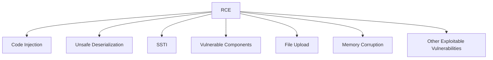

These vulnerabilities have different root causes, even though they may ultimately provide the same high-level impact: **attacker-controlled code execution**.

---

# Impact

The impact of RCE depends heavily on the privileges and environment of the vulnerable application.

If the vulnerable process has high privileges, the impact can be significantly greater.

Potential consequences include:

- Reading sensitive files
    
- Accessing application secrets
    
- Modifying application data
    
- Executing operating-system commands
    
- Accessing internal services
    
- Stealing credentials
    
- Modifying application behavior
    
- Establishing persistence
    
- Compromising the underlying server
    

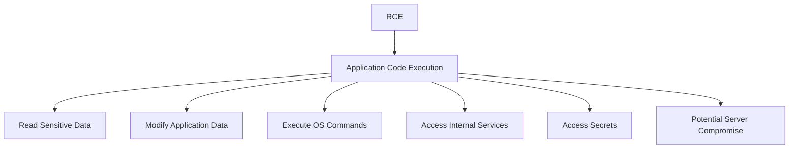

> [!warning] Privileges Matter  
> RCE does not automatically mean unrestricted control of the entire server. The actual impact depends on the privileges of the vulnerable process, sandboxing, containers, operating-system restrictions, network controls, and other security mechanisms.

---

# `shell_exec()`

PHP provides several functions for executing operating-system commands.

One example is:

```php
shell_exec()
```

A vulnerable example:

```php
<?php

$output = shell_exec($_GET["cmd"]);

echo "<pre>$output</pre>";

?>
```

The application accepts:

```text
cmd
```

and passes it directly to:

```php
shell_exec()
```

The execution flow is:

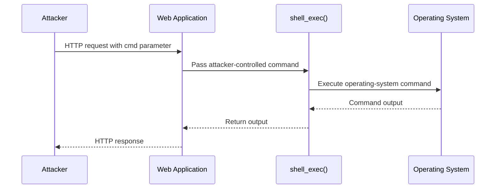

For example, an application might expose a URL such as:

```text
shell.php?cmd=whoami
```

If the application executes the parameter directly, the operating system receives the command.

> [!danger] Vulnerable Pattern  
> The dangerous pattern is not simply "using `shell_exec()`". The problem is passing attacker-controlled input into OS command execution without an appropriate security boundary.

---

# Detection Methodology

When testing an application for potential code execution, first identify where user-controlled input reaches an interpreter or command-execution function.

A simplified process is:

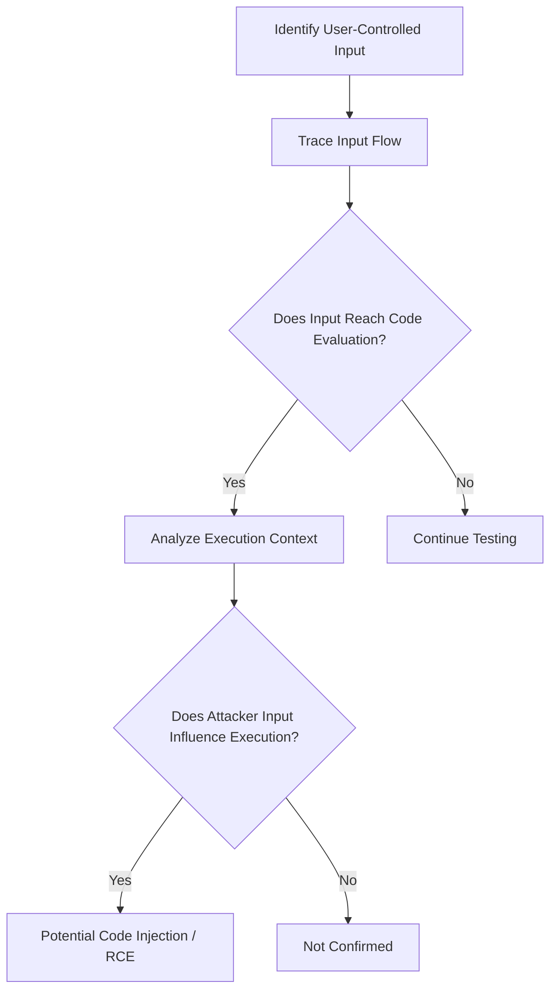

Useful things to investigate during source-code review include:

```text
eval()
exec()
system()
shell_exec()
passthru()
popen()
proc_open()
```

and similar functions provided by other languages or frameworks.

However, finding one of these functions does not automatically prove a vulnerability.

The important question is:

> **Can attacker-controlled input reach the execution mechanism in a way that changes what gets executed?**

---

# Root Cause

The fundamental security problem can be summarized as:

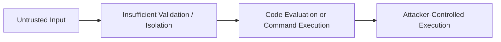

The application fails to maintain a proper separation between:

```text
Data
```

and:

```text
Code
```

A secure design should treat user input as **data**, not executable instructions.

---

# Prevention

The best defense is to avoid evaluating untrusted input as code.

Recommended practices include:

- Avoid `eval()` whenever possible.
    
- Never pass untrusted input directly to command execution functions.
    
- Use allowlists instead of attempting to blacklist dangerous characters.
    
- Use safe APIs instead of invoking a shell when possible.
    
- Separate user-controlled data from executable code.
    
- Apply least-privilege permissions to application processes.
    
- Keep dependencies and server software updated.
    
- Use sandboxing or container isolation where appropriate.
    
- Validate input according to the expected data type and format.
    

A safer architecture looks like:

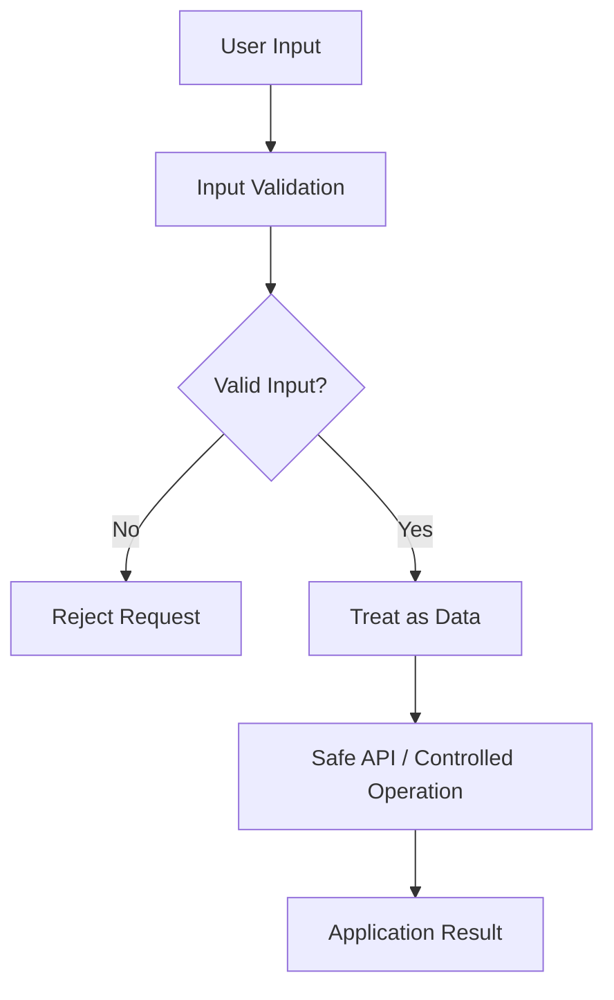

---

# Key Takeaways

- **RCE** means an attacker can cause a remote system to execute attacker-controlled code.
    
- RCE is an **impact**, while vulnerabilities such as code injection, unsafe deserialization, SSTI, and memory corruption can be different paths to that impact.
    
- `eval()` evaluates a string as source code.
    
- Passing untrusted input to `eval()` can result in code injection.
    
- `shell_exec()` executes operating-system commands and can become dangerous when attacker-controlled input reaches it.
    
- **Code Injection** targets the application's language interpreter.
    
- **OS Command Injection** targets operating-system commands or a shell.
    
- `eval()` is not required for RCE.
    
- Successful RCE can potentially result in application or server compromise.
    
- The actual impact depends on the privileges and security boundaries of the vulnerable process.
    
- The primary defense is to maintain a strict separation between **untrusted data** and **executable code**.