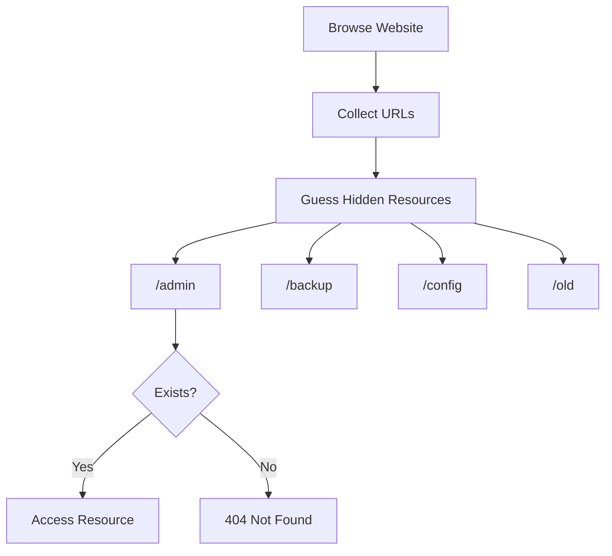

> [!abstract]
>
> **Force Browsing** (also known as **Direct Browsing**, **Predictable Resource Location**, or **Forced Resource Discovery**) is a technique where an attacker manually requests files, directories, or endpoints that are not linked by the application but are still accessible on the server.
>
> Unlike directory brute-forcing, Force Browsing is based on **guessing or knowing common resource names**.

![[Pasted image 20260811163519.png]]
# How It Works

A web application may hide sensitive resources from users but fail to protect them.

Example

```text
/admin
```

is not linked anywhere on the website, but the endpoint still exists.

If an attacker manually requests

```http
GET /admin
```

the server may return the page successfully.

---

## Attack Flow



---

# Force Browsing vs Directory Brute Force

| Force Browsing | Directory Brute Force |
|---------------|-----------------------|
| Manual discovery | Automated discovery |
| Based on common names | Uses large wordlists |
| Few requests | Thousands of requests |
| No special tool required | Uses fuzzing tools |

> [!tip]
>
> Force Browsing is often the first step before using automated directory brute-forcing.

---

# Common Targets

```
/admin
/login
/dashboard
/backup
/config
/uploads
/private
/test
/dev
/staging
/api
/docs
/swagger
```

---

# Testing with curl

## Request a Hidden Directory

```bash
curl -i https://target.com/admin
```

Example

```http
HTTP/1.1 200 OK
```

## Test a Backup File

```bash
curl -i https://target.com/backup.zip
```

Possible Response

```http
HTTP/1.1 200 OK
```

---

## Test Configuration Files

```bash
curl -i https://target.com/config.php.bak
```

```bash
curl -i https://target.com/.env
```

```bash
curl -i https://target.com/web.config
```

```bash
curl -i https://target.com/config.yml
```

---

## Test Common Admin Panels

```bash
curl -i https://target.com/admin
```

```bash
curl -i https://target.com/admin/login
```

```bash
curl -i https://target.com/dashboard
```

---

# Interesting Files

```
robots.txt
sitemap.xml
crossdomain.xml
clientaccesspolicy.xml
security.txt
```

Example

```bash
curl -i https://target.com/robots.txt
```

Sometimes

```
robots.txt
```

contains entries like

```text
Disallow: /backup/
Disallow: /private/
Disallow: /admin/
```

> [!warning]
>
> `robots.txt` is **not** an access control mechanism. It only tells search engines which paths should not be indexed.

---

# Backup Files

Developers often leave backup files on the server.

Examples

```
index.php.bak
index.php.old
config.php~
config.zip
backup.tar.gz
website.rar
```

Testing

```bash
curl -i https://target.com/index.php.bak
```

---

# Hidden Git Repository

Sometimes the Git repository is exposed.

```bash
curl -i https://target.com/.git/HEAD
```

Response

```text
ref: refs/heads/main
```

This usually indicates that the `.git` directory is publicly accessible.

---

# Hidden Environment Files

Examples

```
.env
.env.production
.env.local
.env.backup
```

Testing

```bash
curl -i https://target.com/.env
```

Potential contents

```text
DB_PASSWORD=password
API_KEY=xxxxxxxx
SECRET_KEY=xxxxxxxx
```

---

# API Endpoints

REST APIs often expose undocumented endpoints.

Examples

```
/api
/api/v1
/api/v2
/api/debug
/api/internal
```

Testing

```bash
curl -i https://target.com/api/v1
```

---

# Status Codes

| Code | Meaning |
|------|----------|
| 200 | Resource Exists |
| 301 | Redirect |
| 302 | Redirect |
| 401 | Authentication Required |
| 403 | Exists but Forbidden |
| 404 | Not Found |

> [!info]
>
> A **403 Forbidden** response is often more interesting than **404 Not Found**, because it confirms that the resource exists.

> [!todo] Checklist
>
>- Check `/robots.txt`
>- Check `/sitemap.xml`
>- Test common admin panels
>- Test backup files
>- Test configuration files
>- Test `.git`
>- Test `.env`
>- Test `/uploads`
>- Test `/api`
>- Compare 403 vs 404 responses
>- Look for versioned directories
>- Test old application paths

> [!success] Prevention
>- Remove unused files and directories.
>- Delete backup files from production servers.
>- Disable public access to `.git`, `.svn`, and configuration files.
>- Protect sensitive resources using authentication and authorization.
>- Return consistent error messages for unauthorized resources.
>- Regularly review exposed files during deployment.

---

# Related Vulnerabilities

- Information Disclosure
- Broken Access Control
- Sensitive File Exposure
- Insecure Direct Object References (IDOR)
- Directory Listing
- Security Misconfiguration

---
# References

- OWASP Web Security Testing Guide
- OWASP Top 10
- PortSwigger Web Security Academy
- CWE-425: Direct Request (Forced Browsing)

> [!danger] FFUF
>```bash
>ffuf -w wordlist -u https://site.com/FUZZ # fuzzing for directory or file
>```
>```bash
>ffuf -w wordlist -u https://site.com/FUZZ -e .zip #fuzzing for .zip files
>```
>```bash
>ffuf -w wordlist -u https://site.com/FUZZ -H "Cookie: some_cookie" #fuzzing + >header
>```
>```bash
>ffuf -w wordlist -u https://site.com/FUZZ -fc 403 #fuzzing + filtering out 403 >from the result
>```
>```bash
>ffuf -w wordlist -u https://site.com/ -H "header: FUZZ" #fuzzing on a header
>```
>```bash
>ffuf -w wordlist -u http://site.com/FUZZ -mc 200,204,301,302, 307, 401, 403, 405, >500, 404 #fuzzing for directory or file + matching for specific status codes
>```
>```bash
>ffuf -w wordlist:UU, wordlist:PP -u http://site.com/api/v1/auth -H "Content-Type: 
>application/json" -d '{"user": "UU", "pass": "PP"}' #fuzzing for valid credentials
>```
>```bash
>ffuf -w <(curl -s https://raw.githubusercontent.com/wordlistexample.txt) -u https://victeam.com/admin/FUZZ -c -mc all -fs 276,279 # exclude file size
>```
>```bash
>ffuf -w wordlist:CNA -u https://site.com/CNA.php -mc all -fc 404 -c
>```
