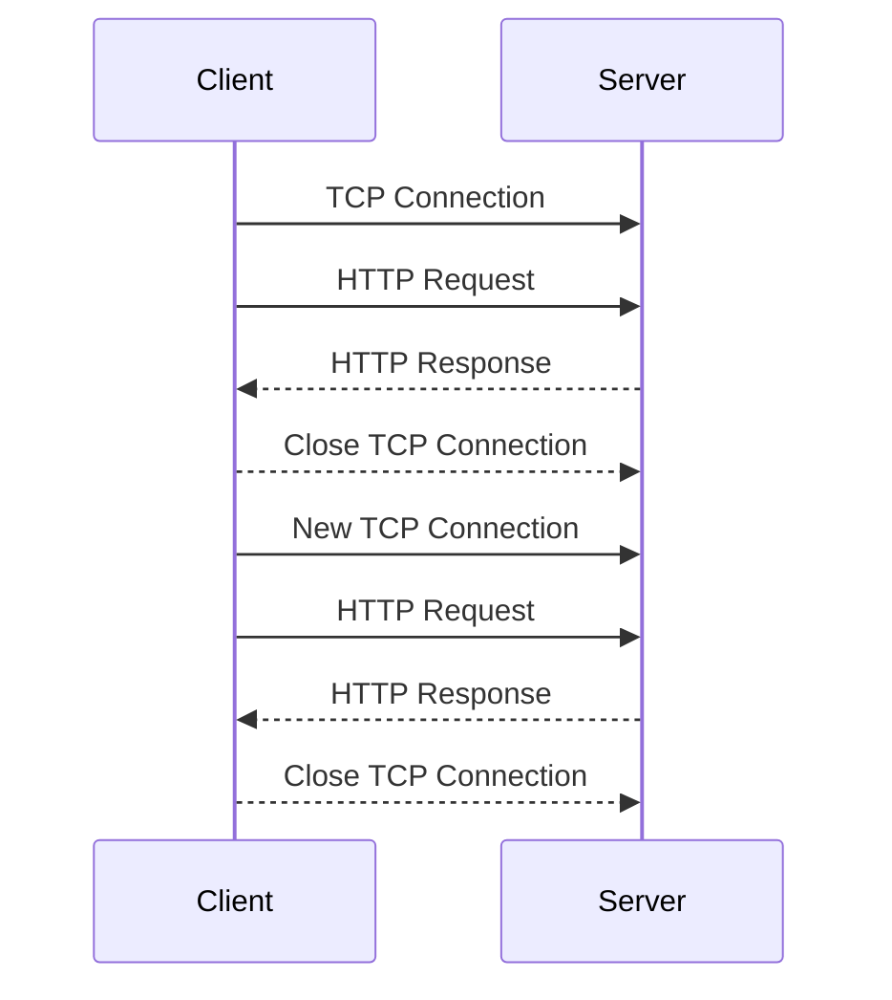
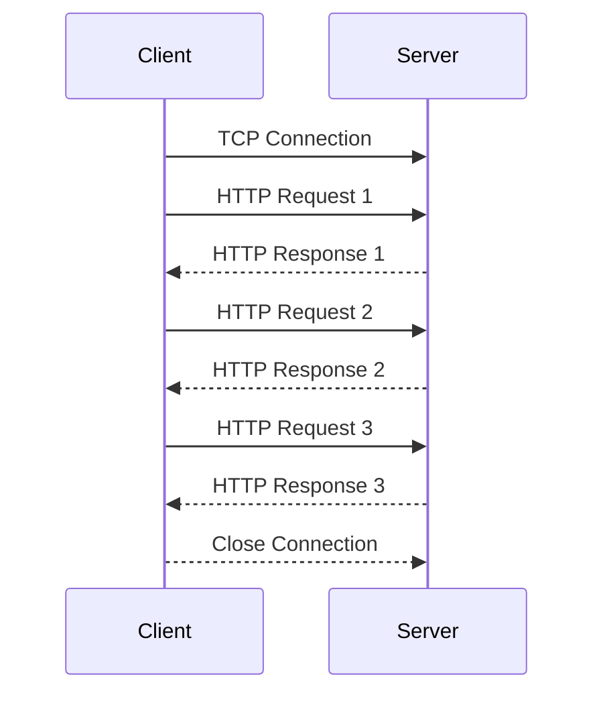
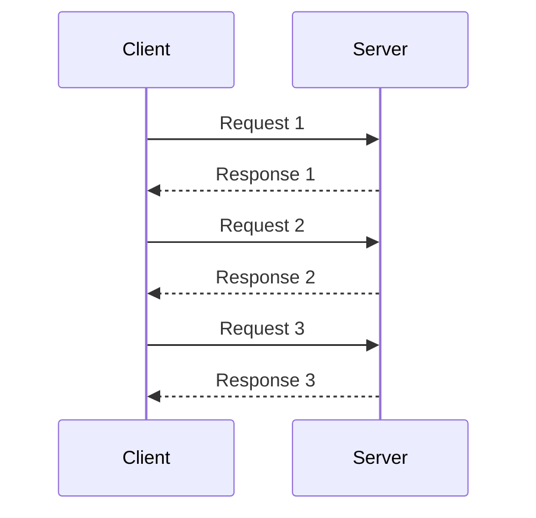
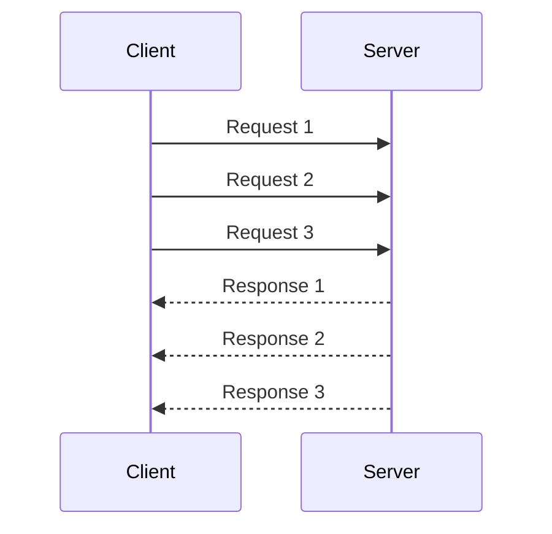
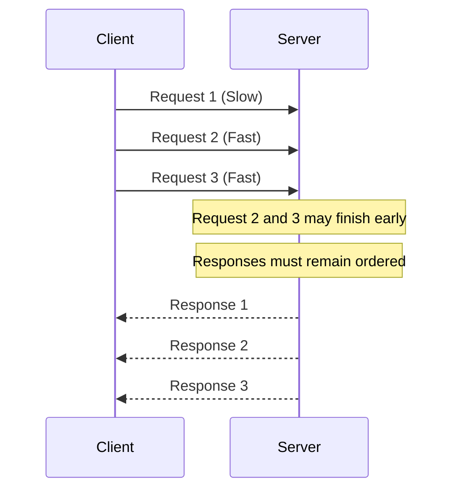
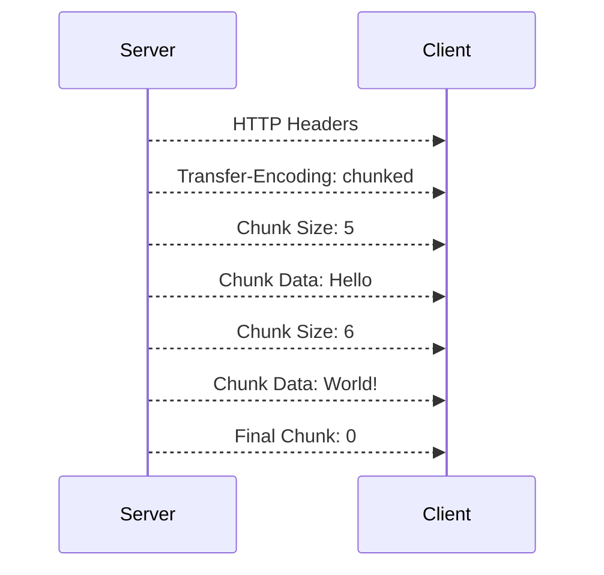
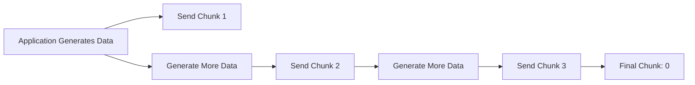

> [!abstract]  Review
> This section introduces important HTTP connection and data transfer mechanisms, including **Keep-Alive**, **HTTP Pipelining**, and different ways HTTP messages can transfer data.
> 
> We will examine how multiple HTTP requests can use a single TCP connection, how HTTP Pipelining allows requests to be sent without waiting for previous responses, and why this mechanism is rarely used in modern web communication.
> 
> We will also cover HTTP message transfer methods, including **Content-Length** and **Chunked Transfer Encoding**, to understand how clients and servers determine where an HTTP message begins and ends.
> 
> Understanding these mechanisms is important for learning how HTTP connections work internally and provides useful context for topics such as **HTTP request smuggling**, connection management, and modern HTTP protocols.

![[Pasted image 20260818003348.png]]
### HTTP Keep-Alive

By default, an HTTP connection does not necessarily need to be closed after a single request and response.

**Keep-Alive**, also known as a **persistent connection**, allows the client and server to reuse the same TCP connection for multiple HTTP requests.

Without persistent connections, the process would look like this:



The problem is that creating a new TCP connection for every request adds unnecessary overhead. Humanity invented TCP handshakes, then apparently decided doing them repeatedly was a fun hobby.

With **Keep-Alive**, the same TCP connection can be reused:



> [!Example]
>
>```http
>GET /index.html HTTP/1.1
>Host: example.com
>Connection: keep-alive
>```
>
>The server can respond:
>
>```http
>HTTP/1.1 200 OK
>Content-Type: text/html
>Connection: keep-alive
>Content-Length: 100
>```
>
>The TCP connection remains open, allowing additional requests.
>
>```bash
>curl --keepalive-time 20 http://example.com/1 http://example.com/2
>```

## HTTP/1.0 vs HTTP/1.1

In HTTP/1.0, connections were generally closed after the response.

To request persistent connections, the client could use:

```http
Connection: keep-alive
```

Example:

```http
GET / HTTP/1.0
Host: example.com
Connection: keep-alive
```


In HTTP/1.1, persistent connections are the default behavior.

The connection normally remains open unless one side specifies:

```http
Connection: close
```

For example:

```http
HTTP/1.1 200 OK
Connection: close
```

After the response, the connection is closed.

> [!info]  
> In HTTP/1.1, `Connection: keep-alive` is usually unnecessary because persistent connections are enabled by default.

# HTTP Pipelining

**HTTP Pipelining** is a feature of HTTP/1.1 that allows a client to send multiple HTTP requests without waiting for the previous response.

Without pipelining:



The client waits for each response before sending the next request.

With pipelining:



The requests are sent consecutively through the same persistent connection.

>[!Example] 
>```http
>GET /page1 HTTP/1.1
>Host: example.com
>
>GET /page2 HTTP/1.1
>Host: example.com
>
>GET /page3 HTTP/1.1
>Host: example.com
>```
>```bash
># echo -en "GET /path1 HTTP/1.1\r\nhost: example.com\r\n\r\nGET /path2 HTTP/1.1\r\nhost: example.com\r\n\r\n" | nc example.com 80
>```

The server processes the requests and sends responses in the correct order.

## Head-of-Line Blocking

HTTP pipelining has an important problem called **Head-of-Line Blocking**.

Imagine the client sends:

```text
Request 1
Request 2
Request 3
```

If `Request 1` takes a long time to process, later responses may be delayed even if they are ready.



This limitation contributed to pipelining being largely abandoned by browsers.

HTTP/2 later introduced **multiplexing**, which allows multiple streams to share a connection more efficiently.

> [!warning]  
> HTTP Pipelining and HTTP/2 Multiplexing are not the same thing.
> 
> - **Pipelining:** Multiple requests are sent without waiting, but responses remain ordered.
>     
> - **Multiplexing:** Multiple independent streams can exchange data concurrently.
>     

---

# Transfer-Encoding

Normally, an HTTP message can use the `Content-Length` header to specify the size of its body.

Example:

```http
HTTP/1.1 200 OK
Content-Type: text/html
Content-Length: 13

Hello, World!
```

The client knows exactly how many bytes belong to the response body.

However, sometimes the server does not know the final size of the response when it starts sending data.

This is where **Transfer-Encoding** can be used.

Example:

```http
Transfer-Encoding: chunked
```

The most common HTTP/1.1 transfer coding you will encounter is:

```text
chunked
```

# Chunked Transfer Encoding

**Chunked Transfer Encoding** allows the server to send the response body in multiple pieces called **chunks**.

The server does not need to know the complete response size before sending it.

The format is:

```text
<chunk size in hexadecimal>
<chunk data>

<next chunk size in hexadecimal>
<next chunk data>

0
```

The final chunk has a size of:

```text
0
```

which indicates the end of the message body.

### Example

```http
HTTP/1.1 200 OK
Content-Type: text/plain
Transfer-Encoding: chunked

5
Hello
6
 World
0
```

The client interprets this as:

```text
Hello World
```

The numbers represent the chunk sizes in **hexadecimal**.

For example:

```text
5
```

means:

```text
5 bytes
```

And:

```text
A
```

means:

```text
10 bytes
```

because:

```text
A hexadecimal = 10 decimal
```

---

## Chunked Response Flow



The client reconstructs all chunks to create the complete response body.

---

# Why Is Chunked Encoding Useful?

Chunked encoding is useful when the server generates data dynamically.

For example:



The server can begin sending data before it knows the total size.

Common situations include:

- Streaming data
    
- Dynamically generated content
    
- Large responses
    
- Proxy communication
    
- Data produced gradually
    

---

# Transfer-Encoding Examples

### Example 1: Chunked Response

```http
HTTP/1.1 200 OK
Content-Type: text/html
Transfer-Encoding: chunked

A
HelloWorld
0
```

`A` in hexadecimal means:

```text
10 bytes
```

The response body is:

```text
HelloWorld
```
### Example 2: Multiple Chunks

```http
HTTP/1.1 200 OK
Transfer-Encoding: chunked

5
Hello

1
 
5
World

0
```

The client combines the chunks:

```text
Hello World
```
### Example 3: HTTP Request Using Chunked Encoding

Chunked encoding can also appear in an HTTP request.

```http
POST /upload HTTP/1.1
Host: example.com
Transfer-Encoding: chunked

4
test
4
data
0
```

The reconstructed request body becomes:

```text
testdata
```
# Content-Length vs Transfer-Encoding

## Content-Length

The complete body size is known before transmission.

```http
POST /login HTTP/1.1
Host: example.com
Content-Length: 27

username=test&password=123
```

The server reads exactly the specified number of bytes.

## Transfer-Encoding: chunked

The body is sent in multiple chunks.

```http
POST /login HTTP/1.1
Host: example.com
Transfer-Encoding: chunked

4
user
4
name
0
```

The server reconstructs the body until it encounters:

```text
0
```

## Comparison

|Feature|Content-Length|Chunked Transfer-Encoding|
|---|---|---|
|Body size known beforehand|Yes|No|
|Body sent in pieces|No|Yes|
|Uses hexadecimal chunk size|No|Yes|
|Requires final `0` chunk|No|Yes|
|Common in HTTP/1.1|Yes|Yes|

---

# Important Security Concept

`Content-Length` and `Transfer-Encoding` are especially important in HTTP security testing because different HTTP components may interpret the boundaries of a request differently.

For example:


If a front-end proxy and a back-end server disagree about where one HTTP request ends and another begins, this can potentially lead to **HTTP Request Smuggling**.

Three famous parsing patterns are:

```text
CL.TE
```

```text
TE.CL
```

```text
TE.TE
```

Where:

```text
CL = Content-Length
TE = Transfer-Encoding
```

The basic idea is that two HTTP components interpret the same request differently.

That disagreement can cause part of the request to be treated as belonging to another HTTP request. Because apparently even web servers sometimes struggle with agreeing where a sentence ends.

> [!warning]  
> The presence of both `Content-Length` and `Transfer-Encoding` does not automatically mean a vulnerability. Request smuggling requires inconsistent parsing behavior between multiple HTTP components.
# Key Takeaways

- **Keep-Alive** allows multiple HTTP requests and responses to reuse the same TCP connection.
- HTTP/1.1 uses persistent connections by default.
- `Connection: close` tells the other side to close the connection.
- **HTTP Pipelining** allows multiple requests to be sent without waiting for previous responses.
- Pipelining suffers from **Head-of-Line Blocking** and is largely obsolete in browsers.
- **Transfer-Encoding** describes how an HTTP message body is transferred.
- **Chunked Transfer Encoding** divides a message body into multiple chunks.
- Each chunk starts with its size written in hexadecimal.
- A chunk size of `0` marks the end of the message body.
- `Content-Length` specifies the total body size, while chunked encoding sends the body incrementally.
- Differences in how HTTP components process `Content-Length` and `Transfer-Encoding` are important when studying **HTTP Request Smuggling**.