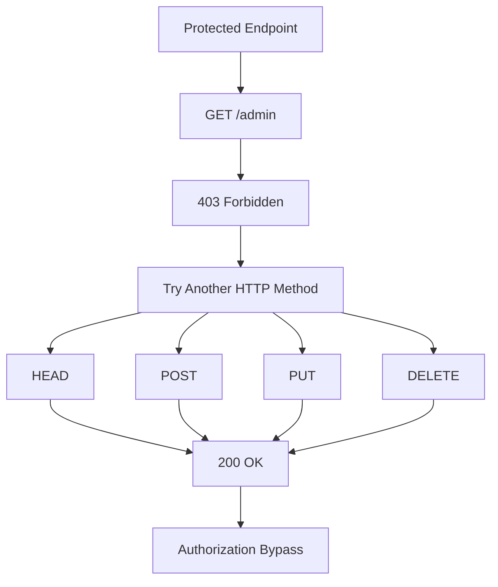
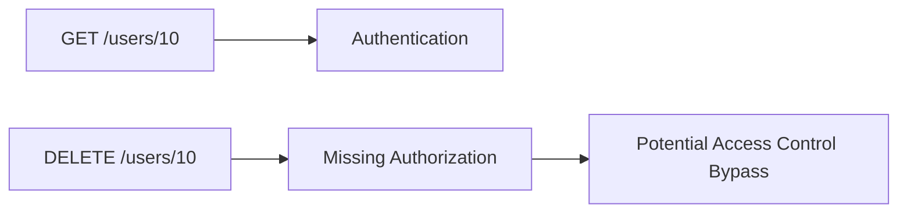

# HTTP Verb Tampering

> [!abstract]
>
> **HTTP Verb Tampering** (also known as **HTTP Method Tampering**) is a web security issue where an attacker sends requests using unexpected HTTP methods (verbs) to bypass authentication, authorization, WAF rules, or business logic.
>
> The vulnerability exists when an application protects one HTTP method (such as `GET` or `POST`) but unintentionally allows another method to access the same functionality.

![[Pasted image 20260811162520.png]]
## HTTP Methods

| Method  | Description              |
| ------- | ------------------------ |
| GET     | Retrieve a resource      |
| POST    | Submit data              |
| PUT     | Replace a resource       |
| PATCH   | Partial update           |
| DELETE  | Delete a resource        |
| HEAD    | Same as GET without body |
| OPTIONS | Show supported methods   |
| TRACE   | Diagnostic method        |
| CONNECT | Create proxy tunnel      |

> [!tip]
>
> Most applications only expect **GET** and **POST**, while the web server or framework may also support methods like PUT, DELETE, PATCH, and HEAD.

---

# How Does It Work?

Sometimes developers protect only one HTTP method.

Example:

```text
GET /admin
```

↓

Returns

```http
HTTP/1.1 403 Forbidden
```

However,

```text
HEAD /admin
```

returns

```http
HTTP/1.1 200 OK
```

because the authorization check is only applied to GET requests.

---

## Attack Flow



---

# Testing with curl

## GET

```bash
curl -i https://target.com/admin
```

Example Response

```http
HTTP/1.1 403 Forbidden
```

---

## HEAD

```bash
curl -I https://target.com/admin
```

or

```bash
curl -X HEAD -i https://target.com/admin
```

If the response becomes

```http
HTTP/1.1 200 OK
```

while GET returns **403**, this deserves further investigation.

---

## POST

```bash
curl -X POST -i https://target.com/admin
```

---

## PUT

```bash
curl -X PUT -i https://target.com/admin
```

---

## PATCH

```bash
curl -X PATCH -i https://target.com/admin
```

---

## DELETE

```bash
curl -X DELETE -i https://target.com/admin
```

---

## OPTIONS

OPTIONS reveals which methods the server supports.

```bash
curl -X OPTIONS -i https://target.com/admin
```

Example

```http
Allow: GET, POST, PUT, DELETE, OPTIONS
```

> [!info]
>
> The **Allow** header lists the HTTP methods accepted by the server. It does **not** guarantee that all of them are implemented securely.

---

# Example Scenario

Suppose

```text
GET /api/users
```

returns

```http
403 Forbidden
```

Try

```bash
curl -X HEAD -i https://target.com/api/users
```

Response

```http
HTTP/1.1 200 OK
```

Although HEAD does not return the response body, a different status code may indicate inconsistent authorization logic.

---

# REST API Example

Many REST APIs map different methods to different actions.

```text
GET     /users/10
POST    /users
PUT     /users/10
PATCH   /users/10
DELETE  /users/10
```

If authorization is only implemented for one method, another method may bypass access control.



---

# HTTP Method Override

Some frameworks allow clients to override the HTTP method.

Example Header

```http
POST /users/5 HTTP/1.1
X-HTTP-Method-Override: DELETE
```

Testing with curl

```bash
curl \
-X POST \
-H "X-HTTP-Method-Override: DELETE" \
-i https://target.com/users/5
```

Some applications also support

```text
_method=DELETE
```

Example

```bash
curl \
-X POST \
-d "_method=DELETE" \
-i https://target.com/users/5
```

> [!warning]
>
> Method Override is not a vulnerability by itself. The vulnerability occurs when security controls validate the original HTTP method but ignore the overridden one.

---

# What to Compare

When testing different HTTP methods, compare:

- Status Code
- Response Headers
- Content-Length
- Response Body
- Redirect Location
- Authentication Behavior

For example

| GET | DELETE |
|------|---------|
| 403 | 200 |

| POST | PUT |
| ---- | --- |
| 401  | 204 |

> [!warning] note
>These differences may indicate inconsistent authorization logic.

> [!danger] Common Status Codes
>| Code | Meaning                 |
>| ---- | ----------------------- |
>| 200  | Success                 |
>| 201  | Created                 |
>| 204  | Success (No Content)    |
>| 301  | Redirect                |
>| 302  | Redirect                |
>| 401  | Authentication Required |
>| 403  | Forbidden               |
>| 405  | Method Not Allowed      |

> [!tip]
>
> A **405 Method Not Allowed** response usually indicates that the endpoint exists but intentionally rejects that HTTP method.

> [!todo] Checklist
>- Enumerate supported methods using OPTIONS
>- Test GET
>- Test POST
>- Test PUT
>- Test PATCH
>- Test DELETE
>- Test HEAD
>- Compare status codes
>- Compare response headers
>- Compare Content-Length
>- Test X-HTTP-Method-Override
>- Test `_method` parameter

> [!success] Prevention
>- Allow only required HTTP methods.
>- Return **405 Method Not Allowed** for unsupported methods.
>- Apply authentication and authorization consistently to every HTTP method.
>- Disable unnecessary methods such as TRACE.
>- Validate Method Override only when required.
>- Ensure reverse proxies, WAFs, and back-end applications enforce the same HTTP method policy.

---

# References

- OWASP Web Security Testing Guide
- OWASP API Security Top 10
- RFC 9110 - HTTP Semantics
- PortSwigger Web Security Academy
