> [!abstract]  What is DTD?
> **DTD (Document Type Definition)** is a set of declarations used to define the **structure, rules, and allowed components of an XML document**.
> 
> In other words, a DTD defines what elements and attributes an XML document is allowed to contain and how those elements can be organized.
> 
> A DTD can define:
> 
> - Allowed elements
>     
> - Relationships between elements
>     
> - Element content
>     
> - Attributes
>     
> - Entities
>     
> - Entity values
>     
> - The overall document structure
>     
> 
> For example, consider the following XML document:
> 
> ```xml
> <?xml version="1.0"?>
> <user>
>     <name>CNA</name>
>     <email>cna@example.com</email>
> </user>
> ```
> 
> A DTD can define the expected structure of this document:
> 
> ```xml
> <!DOCTYPE user [
>     <!ELEMENT user (name, email)>
>     <!ELEMENT name (#PCDATA)>
>     <!ELEMENT email (#PCDATA)>
> ]>
> ```
> 
> This DTD defines that:
> 
> - The root element must be `<user>`
>     
> - The `<user>` element must contain `<name>` and `<email>`
>     
> - Both `<name>` and `<email>` contain text data
>     
> 
> The XML parser can use the DTD to validate whether the XML document follows the expected structure.
> 
> DTDs can also define **entities**, which allow reusable values or references to be declared inside the document. Because apparently XML needed a way to make data look even more like a tiny programming language.

![[Pasted image 20260814205457.png]]

The basic idea is:

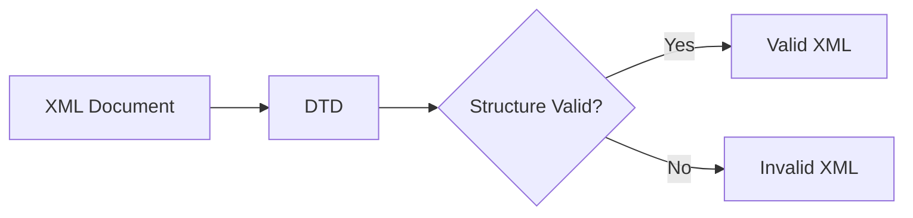

A DTD does not contain the actual application data.
Instead, it describes **how the XML document is allowed to be structured**.

## What is a DTD?

Consider this XML document:

```xml
<?xml version="1.0" encoding="UTF-8"?>

<user>
    <username>adolfcna</username>
    <email>example@gmail.com</email>
</user>
```

The XML contains:

```text
user
 ├── username
 └── email
```

A DTD can define that structure.

For example:

```xml
<!DOCTYPE user [
    <!ELEMENT user (username, email)>
    <!ELEMENT username (#PCDATA)>
    <!ELEMENT email (#PCDATA)>
]>
```

This tells the XML parser that:

```text
user
    ↓
must contain

username
    ↓
followed by

email
```

The complete document becomes:

```xml
<?xml version="1.0" encoding="UTF-8"?>

<!DOCTYPE user [
    <!ELEMENT user (username, email)>
    <!ELEMENT username (#PCDATA)>
    <!ELEMENT email (#PCDATA)>
]>

<user>
    <username>adolfcna</username>
    <email>example@gmail.com</email>
</user>
```

# `DOCTYPE`

The DTD is introduced using the `DOCTYPE` declaration.

Example:

```xml
<!DOCTYPE user [
    ...
]>
```

The general structure is:

```text
<!DOCTYPE ROOT_ELEMENT [
    DTD DECLARATIONS
]>
```

For example:

```xml
<!DOCTYPE user [
    <!ELEMENT user (username, email)>
    <!ELEMENT username (#PCDATA)>
    <!ELEMENT email (#PCDATA)>
]>
```

Here:

```text
DOCTYPE
   ↓
Document Type Declaration

user
   ↓
Root Element

[ ... ]
   ↓
Internal DTD Subset
```

The relationship can be visualized as:

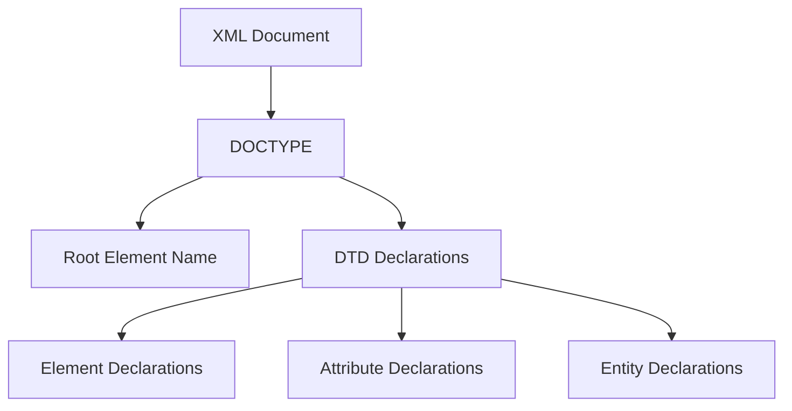

# Root Element

The name after `DOCTYPE` normally identifies the document's root element.

For example:

```xml
<!DOCTYPE user [
    ...
]>
```

corresponds to:

```xml
<user>
    ...
</user>
```

Conceptually:

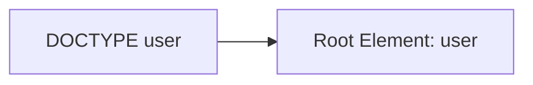

The names should correspond.

For example:

```xml
<!DOCTYPE user [
    <!ELEMENT user ANY>
]>
```

is describing a document whose root element is:

```xml
<user>
</user>
```

# Internal DTD

A DTD can be written directly inside the XML document.

This is called an **Internal DTD Subset**.

Example:

```xml
<?xml version="1.0" encoding="UTF-8"?>

<!DOCTYPE user [
    <!ELEMENT user (username, email)>
    <!ELEMENT username (#PCDATA)>
    <!ELEMENT email (#PCDATA)>
]>

<user>
    <username>adolfcna</username>
    <email>example@gmail.com</email>
</user>
```

The DTD is located between:

```xml
[
    ...
]
```

inside the `DOCTYPE`.

The structure is:

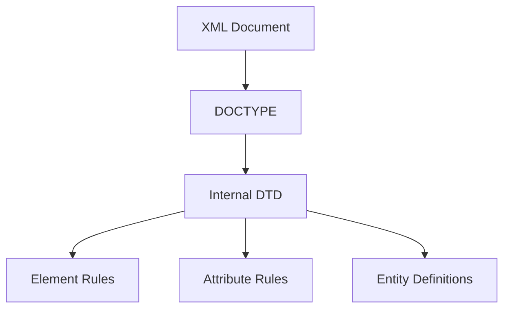

---

# `<!ELEMENT>`

The `<!ELEMENT>` declaration defines an XML element.

Basic syntax:

```xml
<!ELEMENT element-name content-model>
```

Example:

```xml
<!ELEMENT username (#PCDATA)>
```

This declares an element named:

```text
username
```

and specifies its content model as:

```text
#PCDATA
```

# `#PCDATA`

`#PCDATA` stands for:

**Parsed Character Data**

It indicates that the element contains text.

Example:

```xml
<!ELEMENT username (#PCDATA)>
```

allows:

```xml
<username>adolfcna</username>
```

The structure is:


Another example:

```xml
<!ELEMENT email (#PCDATA)>
```

allows:

```xml
<email>example@gmail.com</email>
```

# `ANY`

A DTD can use `ANY` as an element content model.

Example:

```xml
<!ELEMENT user ANY>
```

This means the element can contain a broad range of content allowed by the XML specification.

For example:

```xml
<user>
    <username>adolfcna</username>
    <email>example@gmail.com</email>
</user>
```

The declaration is:

```xml
<!ELEMENT user ANY>
```

`ANY` is therefore much less restrictive than explicitly defining the child elements.

# Empty Elements

A DTD can specify that an element must be empty.

Example:

```xml
<!ELEMENT image EMPTY>
```

This describes an element such as:

```xml
<image/>
```

or:

```xml
<image></image>
```

The element cannot contain normal character or child-element content.

---

# Child Elements

DTD can define the exact child elements an element should contain.

Example:

```xml
<!ELEMENT user (username, email)>
```

This describes:

```xml
<user>
    <username>adolfcna</username>
    <email>example@gmail.com</email>
</user>
```

The structure is:

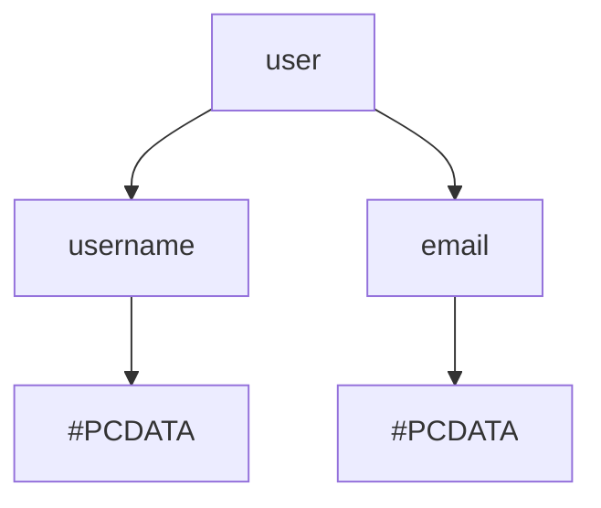

The order can also matter.

For example:

```xml
<!ELEMENT user (username, email)>
```

describes:

```xml
<user>
    <username>...</username>
    <email>...</email>
</user>
```

rather than:

```xml
<user>
    <email>...</email>
    <username>...</username>
</user>
```

when validating against that content model.

# Multiple Elements

DTD can define multiple child elements.

Example:

```xml
<!ELEMENT user (username, email, instagram)>
```

Then:

```xml
<user>
    <username>adolfcna</username>
    <email>example@gmail.com</email>
    <instagram>adolfcna</instagram>
</user>
```

The structure is:

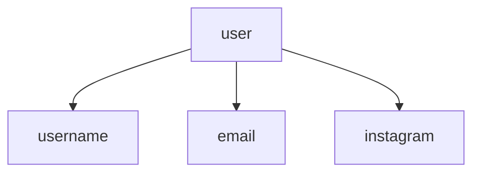

---

# Optional Elements

DTD provides operators that can control whether an element is required or optional.

For example:

```xml
<!ELEMENT user (username, email?)>
```

The `?` means that the element can occur **zero or one time**.

Therefore both structures can be valid:

```xml
<user>
    <username>adolfcna</username>
</user>
```

and:

```xml
<user>
    <username>adolfcna</username>
    <email>example@gmail.com</email>
</user>
```

---

# Repeating Elements

The `*` operator allows zero or more occurrences.

Example:

```xml
<!ELEMENT user (username, email*)>
```

This allows:

```xml
<user>
    <username>adolfcna</username>
</user>
```

or multiple `email` elements:

```xml
<user>
    <username>adolfcna</username>
    <email>one@example.com</email>
    <email>two@example.com</email>
</user>
```

---

# One or More Elements

The `+` operator means **one or more occurrences**.

Example:

```xml
<!ELEMENT user (username, email+)>
```

The XML must contain at least one:

```xml
<email>
```

element.

Conceptually:

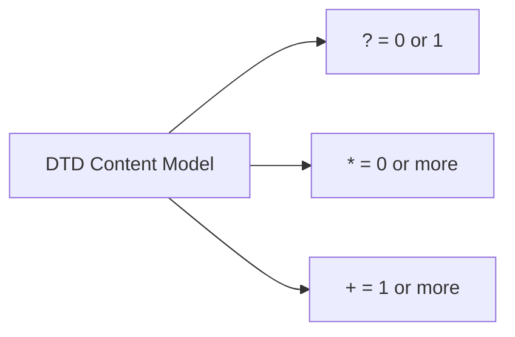

---

# Choice

DTD can also define alternatives using `|`.

Example:

```xml
<!ELEMENT contact (email | phone)>
```

This means the `contact` element can contain either:

```xml
<email>example@gmail.com</email>
```

or:

```xml
<phone>123456789</phone>
```

The concept is:

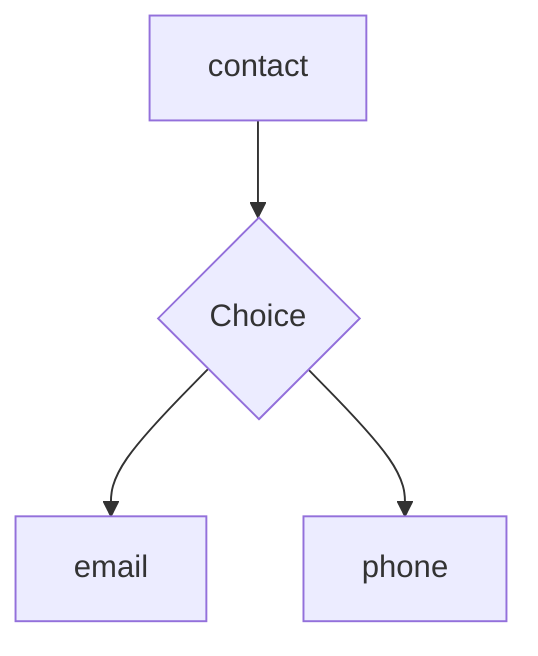

---

# Attributes

DTD can define attributes using:

```xml
<!ATTLIST>
```

The general syntax is:

```xml
<!ATTLIST element-name
    attribute-name attribute-type default-value
>
```

Example:

```xml
<!ELEMENT user (#PCDATA)>

<!ATTLIST user
    id CDATA #REQUIRED
>
```

This defines an `id` attribute for the `user` element.

Therefore:

```xml
<user id="1337">
    adolfcna
</user>
```

contains:

```text
user
 ├── id = 1337
 └── text = adolfcna
```

---

# `CDATA` Attribute Type

The `CDATA` used in an attribute declaration means **character data**.

Example:

```xml
<!ATTLIST user
    username CDATA #IMPLIED
>
```

This allows:

```xml
<user username="adolfcna">
</user>
```

Here:

```text
username
    ↓
Attribute Name

adolfcna
    ↓
Attribute Value
```

---

# `#REQUIRED`

An attribute can be marked as required.

Example:

```xml
<!ATTLIST user
    id CDATA #REQUIRED
>
```

This means the `id` attribute must be present.

Therefore:

```xml
<user id="1337">
</user>
```

contains the required attribute.

While:

```xml
<user>
</user>
```

does not satisfy that DTD requirement.

---

# `#IMPLIED`

`#IMPLIED` means that the attribute is optional and has no default value.

Example:

```xml
<!ATTLIST user
    id CDATA #IMPLIED
>
```

Both of these can be valid:

```xml
<user id="1337">
</user>
```

and:

```xml
<user>
</user>
```

---

# Default Attribute Values

A DTD can define a default value.

Example:

```xml
<!ATTLIST user
    role CDATA "user"
>
```

If the XML contains:

```xml
<user>
    adolfcna
</user>
```

the DTD defines a default value for `role`.

Conceptually:

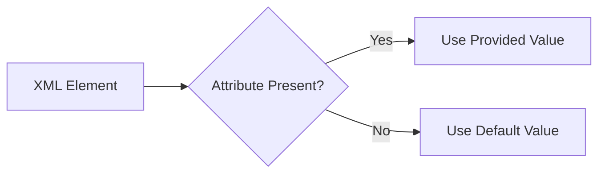

---

# Entities

DTD can also define **entities**.

An entity is a named piece of data that can be referenced later.

Example:

```xml
<!ENTITY username "adolfcna">
```

This defines:

```text
Entity Name
    ↓
username

Entity Value
    ↓
adolfcna
```

The entity can then be referenced as:

```xml
&username;
```

For example:

```xml
<?xml version="1.0" encoding="UTF-8"?>

<!DOCTYPE user [
    <!ELEMENT user (#PCDATA)>
    <!ENTITY username "adolfcna">
]>

<user>&username;</user>
```

The parser resolves:

```text
&username;
```

to:

```text
adolfcna
```

This is a normal XML entity mechanism.

---

# General Entities

A normal entity used inside XML content is called a **General Entity**.

It uses:

```text
&name;
```

Example:

```xml
<!ENTITY author "adolfcna">
```

Reference:

```xml
<author>&author;</author>
```

Conceptually:

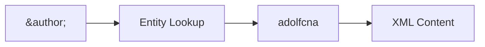

---

# Parameter Entities

DTD also supports **Parameter Entities**.

Parameter entities are primarily used within the DTD itself.

They use:

```text
%name;
```

instead of:

```text
&name;
```

Example:

```xml
<!ENTITY % common "username">
```

The parameter entity can be referenced within the DTD:

```xml
%common;
```

The important distinction is:

```text
General Entity
&name;
    ↓
Used in XML document content


Parameter Entity
%name;
    ↓
Used within the DTD
```

Conceptually:

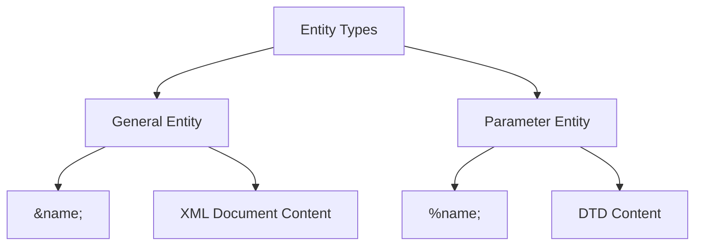

---

# Internal Entity

An entity can contain its value directly inside the DTD.

Example:

```xml
<!ENTITY site "example.com">
```

This is an **Internal Entity**.

The value is stored directly in the DTD:

```text
DTD
 ↓
Entity Declaration
 ↓
Entity Value
```

Example:

```xml
<!DOCTYPE user [
    <!ENTITY site "example.com">
]>
```

---

# External Entity

DTD also provides syntax for referencing an external resource.

Example:

```xml
<!ENTITY site SYSTEM "http://example.com/data.txt">
```

The important keyword is:

```text
SYSTEM
```

The `SYSTEM` identifier tells the XML parser that the entity's value is associated with an external resource.

Conceptually:

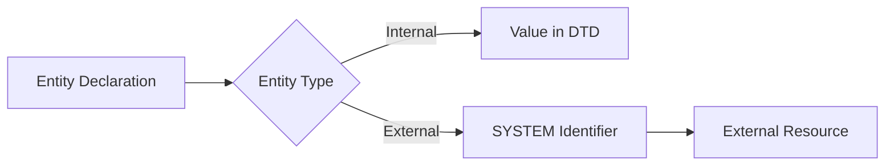

This is an important DTD concept because external entity processing is one of the XML parser behaviors that must be carefully controlled in security-sensitive applications.

---

# External DTD

The DTD itself can also be stored outside the XML document.

For example:

```xml
<!DOCTYPE user SYSTEM "user.dtd">
```

Instead of putting the DTD directly inside the XML document, the document references:

```text
user.dtd
```

The structure becomes:

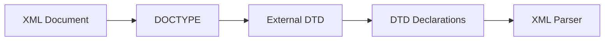

For example, `user.dtd` might contain:

```xml
<!ELEMENT user (username, email)>
<!ELEMENT username (#PCDATA)>
<!ELEMENT email (#PCDATA)>
```

The XML document can then reference it:

```xml
<?xml version="1.0" encoding="UTF-8"?>

<!DOCTYPE user SYSTEM "user.dtd">

<user>
    <username>adolfcna</username>
    <email>example@gmail.com</email>
</user>
```

---

# Internal vs External DTD

There are two major ways to provide a DTD.

### Internal DTD

```xml
<!DOCTYPE user [
    <!ELEMENT user (username, email)>
    <!ELEMENT username (#PCDATA)>
    <!ELEMENT email (#PCDATA)>
]>
```

The declarations are directly inside the XML document.

### External DTD

```xml
<!DOCTYPE user SYSTEM "user.dtd">
```

The declarations are stored in a separate DTD resource.

Comparison:

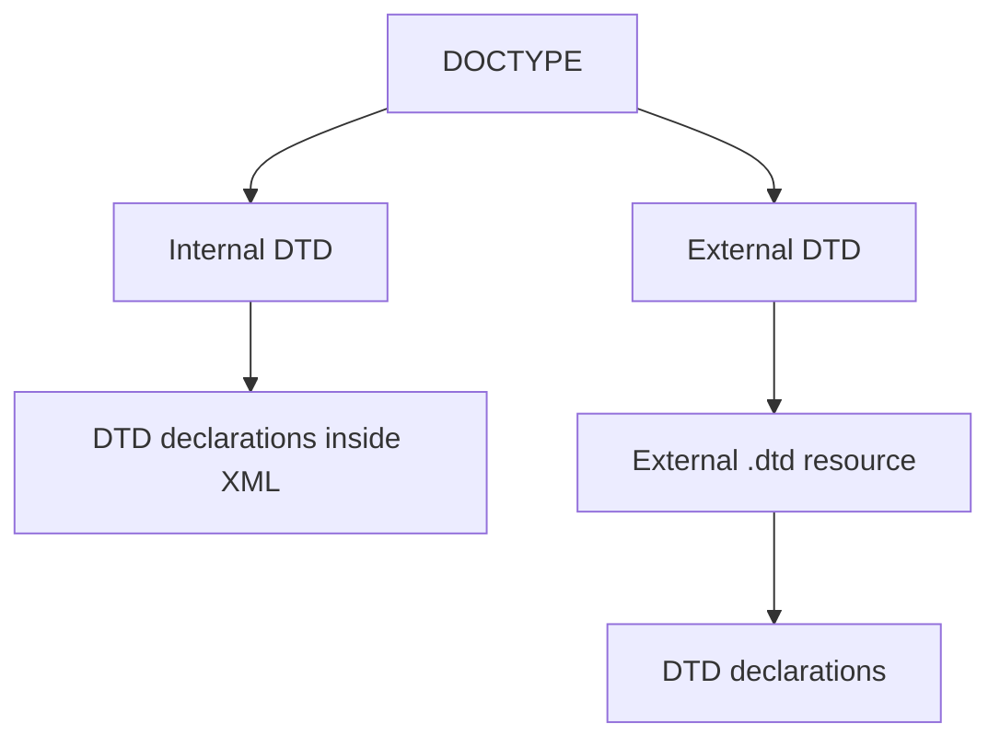

---

# DTD Validation

DTD can be used to validate whether an XML document follows the defined structure.

Consider:

```xml
<!DOCTYPE user [
    <!ELEMENT user (username, email)>
    <!ELEMENT username (#PCDATA)>
    <!ELEMENT email (#PCDATA)>
]>
```

The expected structure is:

```text
user
 ├── username
 └── email
```

Valid example:

```xml
<user>
    <username>adolfcna</username>
    <email>example@gmail.com</email>
</user>
```

Invalid structure:

```xml
<user>
    <email>example@gmail.com</email>
    <username>adolfcna</username>
</user>
```

if the DTD requires `username` before `email`.

The concept is:

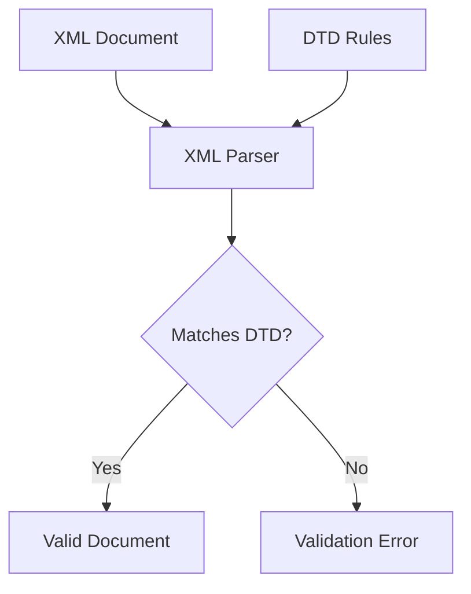

---

# Well-Formed vs Valid XML

These two concepts are different.

## Well-Formed XML

An XML document is **well-formed** when it follows the basic syntax rules of XML.

For example:

```xml
<user>
    <username>adolfcna</username>
</user>
```

The tags are correctly nested and closed.

---

## Valid XML

An XML document is **valid** when it is well-formed **and** conforms to a DTD or another applicable schema.

Conceptually:

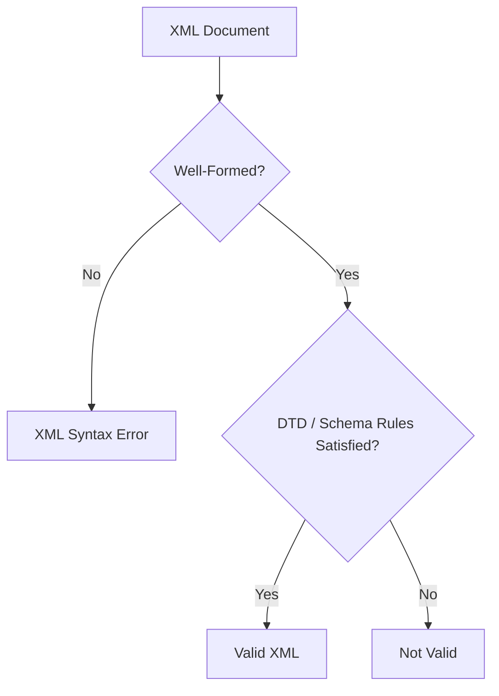

Therefore:

```text
Well-Formed
    ↓
Correct XML Syntax

Valid
    ↓
Correct XML Syntax
+
Conforms to Defined Rules
```

---

# DTD and XML Parser

When an XML parser processes a document containing a DTD, the parser may process the DTD declarations depending on its configuration.

The conceptual flow is:

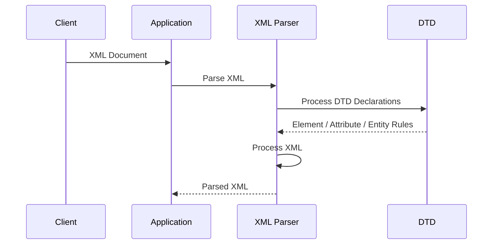

Whether DTD processing is permitted, restricted, or disabled is **parser-specific**.

This distinction is important:

> DTD is an XML feature. Security problems arise from how an application configures and uses the XML parser.

---

# DTD Structure

A DTD can contain several types of declarations:

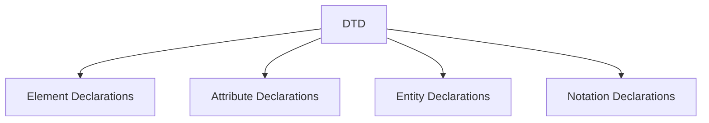

The most important declarations for understanding XML processing are:

```text
<!ELEMENT>
<!ATTLIST>
<!ENTITY>
<!NOTATION>
```

---

# Complete DTD Example

Consider this XML:

```xml
<?xml version="1.0" encoding="UTF-8"?>

<!DOCTYPE user [
    <!ELEMENT user (username, email)>
    <!ELEMENT username (#PCDATA)>
    <!ELEMENT email (#PCDATA)>

    <!ATTLIST user
        id CDATA #REQUIRED
    >

    <!ENTITY website "example.com">
]>

<user id="1337">
    <username>adolfcna</username>
    <email>example@gmail.com</email>
</user>
```

The DTD defines:

```text
user
 ├── username
 └── email

user
 └── id attribute

website
 └── entity
```

The overall structure is:

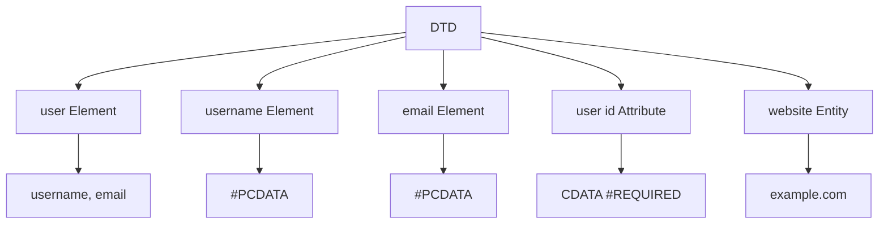

---

# DTD in the XML Processing Model

DTD sits between the XML document and the parser's understanding of the document structure.

A simplified model is:

```mermaid
flowchart LR
    A[XML Document] --> B[XML Parser]
    C[DTD] --> B

    B --> D[Document Structure]
    B --> E[Elements]
    B --> F[Attributes]
    B --> G[Entities]

    D --> H[Application]
    E --> H
    F --> H
    G --> H
```

The important concept is:

```text
XML
 ↓
DTD
 ↓
Parser
 ↓
Structured XML Data
 ↓
Application
```

---

# DTD and Entities

One of the most important relationships to understand is:

```text
DTD
 ↓
Entity Declaration
 ↓
Entity Reference
 ↓
Entity Expansion
```

For example:

```xml
<!DOCTYPE user [
    <!ENTITY name "adolfcna">
]>

<user>
    <username>&name;</username>
</user>
```

The declaration:

```xml
<!ENTITY name "adolfcna">
```

creates the entity.

The reference:

```xml
&name;
```

uses the entity.

Conceptually:

```mermaid
flowchart LR
    A["<!ENTITY name 'adolfcna'>"] --> B[Entity Definition]
    B --> C["&name;"]
    C --> D[Resolved Value]
    D --> E["adolfcna"]
```

---

# Why DTD Matters

DTD is important because it connects several XML concepts:

```text
XML Structure
     ↓
DOCTYPE
     ↓
DTD
     ├── Elements
     ├── Attributes
     └── Entities
```

Understanding DTD therefore makes it much easier to understand how XML parsers process more complex XML documents.

In particular, the following concepts are closely related:

```mermaid
flowchart TD
    A[DTD] --> B[DOCTYPE]
    A --> C[Elements]
    A --> D[Attributes]
    A --> E[General Entities]
    A --> F[Parameter Entities]
    A --> G[External DTD]
    A --> H[External Entities]
```

---

## Key Takeaways

| Concept              | Description                                                                                  | Syntax / Example                       |
| -------------------- | -------------------------------------------------------------------------------------------- | -------------------------------------- |
| **DTD**              | Stands for **Document Type Definition** and defines rules and structure for an XML document. | `DTD`                                  |
| **DOCTYPE**          | Introduces a DTD in an XML document.                                                         | `<!DOCTYPE user [...]>`                |
| **Internal DTD**     | DTD declarations are defined directly inside the XML document.                               | `<!DOCTYPE user [ ... ]>`              |
| **External DTD**     | DTD declarations are stored in a separate external resource.                                 | `<!DOCTYPE user SYSTEM "user.dtd">`    |
| **<!ELEMENT>**       | Defines an XML element and its content model.                                                | `<!ELEMENT user (username, email)>`    |
| **<!ATTLIST>**       | Defines attributes for an XML element.                                                       | `<!ATTLIST user id CDATA #REQUIRED>`   |
| **\#PCDATA**         | Represents **Parsed Character Data**, usually text content inside an element.                | `<!ELEMENT username (#PCDATA)>`        |
| **ANY**              | Allows a broad range of content inside an element.                                           | `<!ELEMENT user ANY>`                  |
| **EMPTY**            | Defines an element that cannot contain content.                                              | `<!ELEMENT image EMPTY>`               |
| **?**                | Allows an element to appear **zero or one time**.                                            | `(email?)`                             |
| *****                | Allows an element to appear **zero or more times**.                                          | `(email*)`                             |
| **+**                | Requires an element to appear **one or more times**.                                         | `(email+)`                             |
| **                   | `**                                                                                          | Defines a choice between alternatives. |
| **\#REQUIRED**       | Makes an attribute mandatory.                                                                | `id CDATA #REQUIRED`                   |
| **\#IMPLIED**        | Makes an attribute optional with no default value.                                           | `id CDATA #IMPLIED`                    |
| **Entity**           | A named piece of data that can be referenced inside XML.                                     | `<!ENTITY name "adolfcna">`            |
| **General Entity**   | An entity referenced inside XML document content.                                            | `&name;`                               |
| **Parameter Entity** | An entity intended to be referenced inside the DTD.                                          | `%name;`                               |
| **Internal Entity**  | An entity whose value is defined directly inside the DTD.                                    | `<!ENTITY name "value">`               |
| **External Entity**  | An entity whose value is associated with an external resource.                               | `<!ENTITY name SYSTEM "resource">`     |

```text
&name;
```

- Parameter entities use:

```text
%name;
```

- Internal entities store their value directly in the DTD.
- External entities use an external identifier such as `SYSTEM`.
- A DTD can itself be loaded externally.
- **Well-formed XML** means the XML follows XML syntax rules.
- **Valid XML** means the XML is well-formed and conforms to its DTD/schema rules.
- DTD processing behavior depends on the XML parser and its configuration.

The core model to remember is:

```mermaid
flowchart LR
    A[XML Document] --> B[DOCTYPE]
    B --> C[DTD]

    C --> D[Elements]
    C --> E[Attributes]
    C --> F[Entities]

    D --> G[XML Parser]
    E --> G
    F --> G

    G --> H[Structured XML Data]
    H --> I[Application]
```