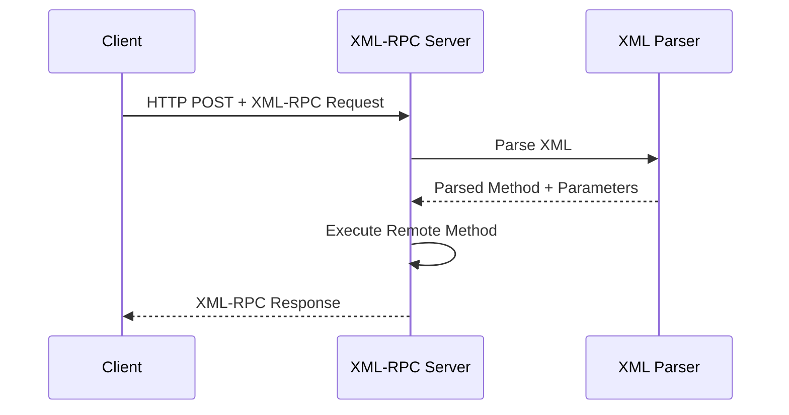
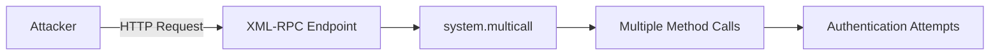
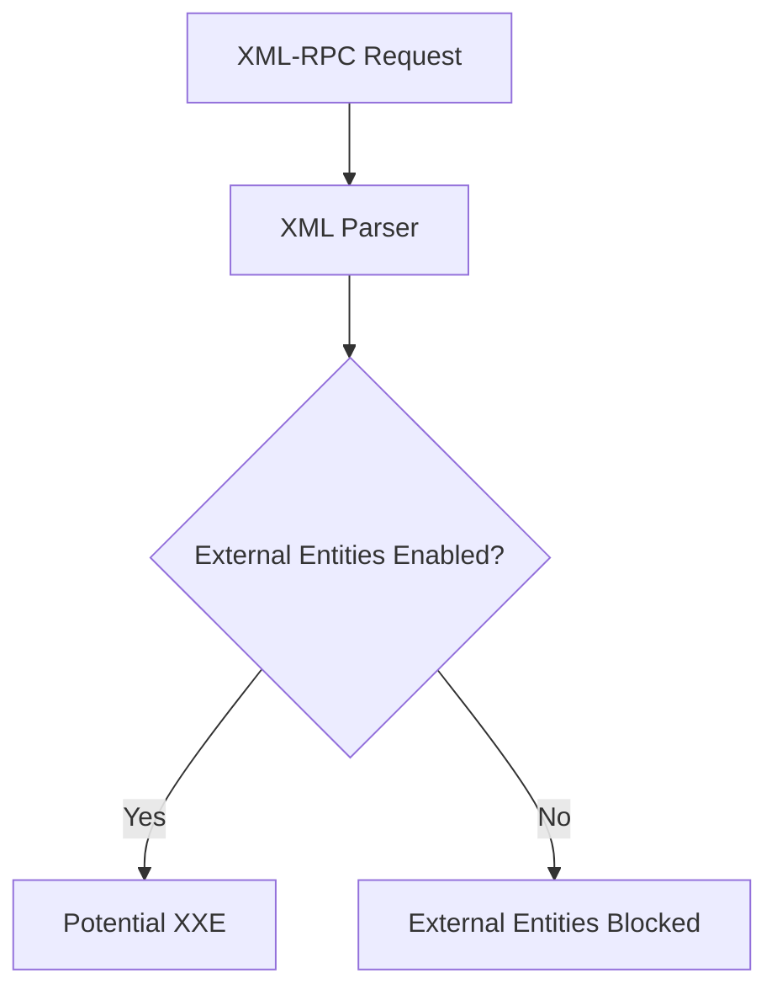
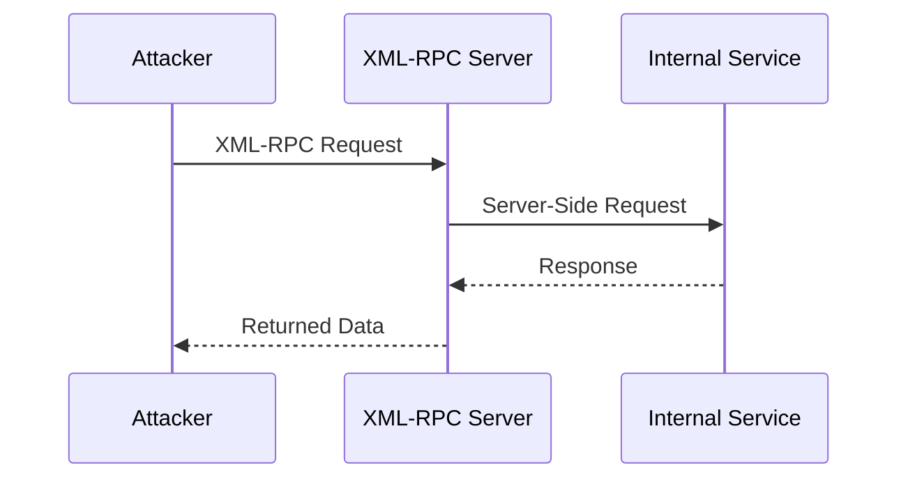
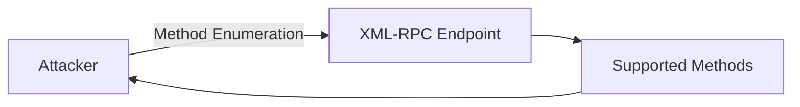

> [!abstract] What is XML-RPC?
> **XML-RPC (XML Remote Procedure Call)** is a protocol that allows a client to execute methods on a remote server using XML-encoded requests and responses.
>
> XML-RPC uses HTTP as the transport layer and XML as the data format.
>
> A typical XML-RPC request contains:
>
> - The name of the method to execute
> - Parameters passed to the method
> - XML structures describing the request
>
> A simplified request looks like this:
>
> ```http
> POST /xmlrpc.php HTTP/1.1
> Content-Type: text/xml
> ```
>
> ```xml
> <?xml version="1.0"?>
> <methodCall>
>     <methodName>system.listMethods</methodName>
>     <params>
>     </params>
> </methodCall>
> ```
>
> The server parses the XML, identifies the requested method, executes it, and returns an XML response.

![[Pasted image 20260811162010.png]]

## How XML-RPC Works

The basic communication flow is:



---

## XML-RPC Request Structure

A basic XML-RPC request contains a `methodCall` element:

```xml
<?xml version="1.0"?>

<methodCall>
    <methodName>example.method</methodName>
    <params>
        <param>
            <value>
                <string>Hello</string>
            </value>
        </param>
    </params>
</methodCall>
```

The important components are:

```text
methodCall
    |
    +── methodName
    |
    └── params
          |
          └── param
                |
                └── value
```

The server interprets `methodName` as the remote procedure that should be executed.

---

> [!info]
> ## XML-RPC Response
>
> After processing the request, the server returns a `methodResponse`.
>
> Example:
>
> ```xml
> <?xml version="1.0"?>
>
> <methodResponse>
>     <params>
>         <param>
>             <value>
>                 <string>Hello</string>
>             </value>
>         </param>
>     </params>
> </methodResponse>
> ```
>
> The response contains the result returned by the remote method.

---

## XML-RPC in WordPress

One well-known implementation of XML-RPC can be found in WordPress.

The endpoint is commonly:

```text
/xmlrpc.php
```

For example:

```http
POST /xmlrpc.php HTTP/1.1
Host: example.com
Content-Type: text/xml
```

WordPress XML-RPC can expose methods for functionality such as:

- Publishing content
- Editing posts
- Managing comments
- Uploading media
- Remote blogging functionality

The exact methods depend on the application and its configuration.

---

> [!warning]
> An exposed XML-RPC endpoint is not automatically a vulnerability.
>
> The security impact depends on which methods are enabled, how authentication is implemented, and how the application handles requests.

---

## Security Risks

XML-RPC itself is a protocol, so it does not have a single CWE that represents "XML-RPC vulnerability."

Instead, different weaknesses can occur depending on the implementation.

Common security issues include:

- Brute-force authentication abuse
- Authentication weaknesses
- Authorization failures
- SSRF
- XXE
- Information disclosure
- Denial of Service
- Unsafe method exposure

---

## Brute-Force Abuse

Some XML-RPC implementations expose authentication-related methods that can allow multiple authentication attempts to be submitted through a single HTTP request.

In WordPress, for example, the `system.multicall` method can invoke multiple XML-RPC calls within one request when it is enabled.

Conceptually:



If authentication controls such as rate limiting, lockout, or monitoring are insufficient, this can increase the efficiency of password-guessing attacks.

> [!danger]
> XML-RPC should not be treated as a magic bypass for authentication controls. The actual risk depends on the implementation and its defensive controls.

---

## Relevant CWE

For authentication-related abuse, the exact CWE depends on the underlying weakness.

A common mapping is:

```text
CWE-307
Improper Restriction of Excessive Authentication Attempts
```

This CWE describes applications that do not properly restrict repeated authentication attempts.

The important distinction is:

```text
XML-RPC
   |
   └── Authentication Abuse
          |
          └── CWE-307
```

The CWE describes the **security weakness**, not XML-RPC itself.

---

## XML-RPC and XXE

XML-RPC uses XML, which means the server must parse XML.

If the underlying XML parser is configured insecurely and allows external entity processing, an XML-RPC endpoint may potentially be affected by **XXE**.

The relationship is:



The relevant CWE is:

```text
CWE-611
Improper Restriction of XML External Entity Reference
```

> [!tip]
> XML-RPC and XXE are not the same thing.
>
> **XML-RPC** is a protocol.
>
> **XXE** is a vulnerability that can occur when an XML parser processes untrusted XML insecurely.

---

## XML-RPC and SSRF

Some XML-RPC methods may interact with URLs or remote resources.

If an application allows an attacker to control a server-side request destination without proper validation, this can result in **Server-Side Request Forgery (SSRF)**.

A simplified attack flow:



A common CWE mapping for SSRF is:

```text
CWE-918
Server-Side Request Forgery (SSRF)
```

Again, the CWE describes the vulnerability, not XML-RPC.

---

## Information Disclosure

XML-RPC implementations may expose method names or application behavior that provides useful information to an attacker.

For example:

```text
system.listMethods
```

may reveal methods supported by the server when that functionality is available.

Potentially exposed information can include:

- Available methods
- Application functionality
- Plugin-specific methods
- Error messages
- Server behavior

The exact CWE depends on what information is disclosed and how.

For generic sensitive information exposure, one possible mapping is:

```text
CWE-200
Exposure of Sensitive Information to an Unauthorized Actor
```

---

## Enumeration

An XML-RPC endpoint may sometimes allow an attacker to determine which methods are available.

The conceptual flow is:



Method enumeration by itself is not necessarily a vulnerability.

It becomes security-relevant when the exposed methods reveal sensitive functionality or enable unauthorized operations.

---

## XML-RPC vs XXE

These two concepts should not be confused:

| Feature | XML-RPC | XXE |
|---|---|---|
| Type | Protocol | Vulnerability |
| Uses XML | Yes | Yes |
| Purpose | Remote method invocation | Abuse XML entity processing |
| CWE | No single CWE | CWE-611 |
| Can exist together | Yes | Yes |
| Example | `/xmlrpc.php` | External entity resolution |

---

> [!danger]
> ## Security Assessment
>
> When an XML-RPC endpoint is discovered during an authorized security assessment, useful areas to examine include:
>
> ```text
> Endpoint Exposure
>        ↓
> Method Enumeration
>        ↓
> Authentication
>        ↓
> Authorization
>        ↓
> Rate Limiting
>        ↓
> Input Validation
>        ↓
> XML Parser Configuration
>        ↓
> Server-Side Requests
> ```
>
> The goal is to identify weaknesses in the implementation rather than treating the presence of XML-RPC itself as a vulnerability.

---

> [!success]
> ## Key Takeaways
>
> - **XML-RPC is a protocol, not a vulnerability.**
> - XML-RPC uses XML to perform remote procedure calls.
> - WordPress commonly exposes XML-RPC through `/xmlrpc.php`.
> - `system.multicall` can allow multiple method calls in a single request when supported.
> - Weak authentication controls can lead to authentication-attempt abuse.
> - **CWE-307** can apply to improper restriction of excessive authentication attempts.
> - An insecure XML parser can introduce **XXE (CWE-611)**.
> - Server-side requests triggered through XML-RPC can potentially result in **SSRF (CWE-918)**.
> - Information disclosure issues may map to **CWE-200**, depending on the specific behavior.
> - XML-RPC should therefore be treated as an **attack surface**, while the actual CWE depends on the discovered weakness.