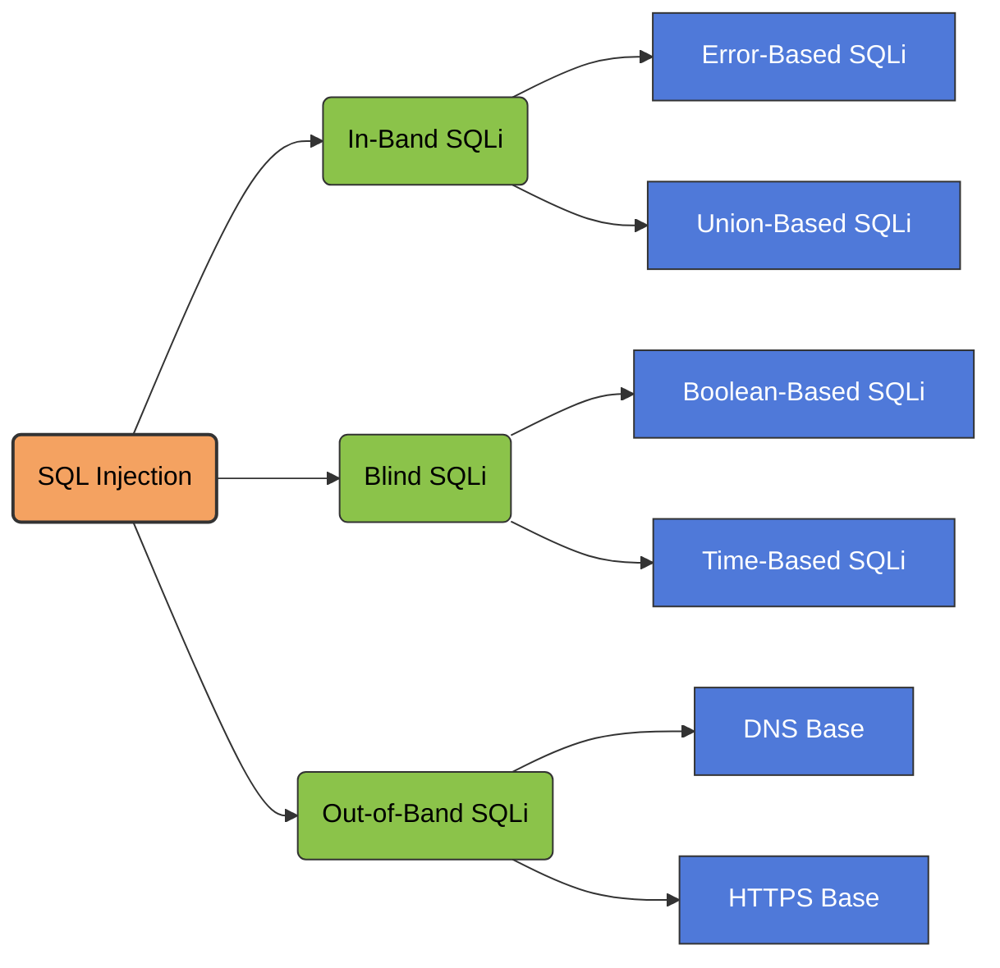

## What is SQL injection (SQLi)?

SQL injection (SQLi) is a web security vulnerability that allows an attacker to interfere with the queries that an application makes to its database. This can allow an attacker to view data that they are not normally able to retrieve. This might include data that belongs to other users, or any other data that the application can access. In many cases, an attacker can modify or delete this data, causing persistent changes to the application's content or behavior.

In some situations, an attacker can escalate a SQL injection attack to compromise the underlying server or other back-end infrastructure. It can also enable them to perform denial-of-service attacks.

## What is the impact of a successful SQL injection attack?

A successful SQL injection attack can result in unauthorized access to sensitive data, such as:

- Passwords.
- Credit card details.
- Personal user information.

SQL injection attacks have been used in many high-profile data breaches over the years. These have caused reputational damage and regulatory fines. In some cases, an attacker can obtain a persistent backdoor into an organization's systems, leading to a long-term compromise that can go unnoticed for an extended period.

## How to detect SQL injection vulnerabilities

You can detect SQL injection manually using a systematic set of tests against every entry point in the application. To do this, you would typically submit:

- The single quote character `'` and look for errors or other anomalies.
- Some SQL-specific syntax that evaluates to the base (original) value of the entry point, and to a different value, and look for systematic differences in the application responses.
- Boolean conditions such as `OR 1=1` and `OR 1=2`, and look for differences in the application's responses.
- Payloads designed to trigger time delays when executed within a SQL query, and look for differences in the time taken to respond.
- OAST payloads designed to trigger an out-of-band network interaction when executed within a SQL query, and monitor any resulting interactions.

Alternatively, you can find the majority of SQL injection vulnerabilities quickly and reliably using Burp Scanner.

## SQL injection in different parts of the query

Most SQL injection vulnerabilities occur within the `WHERE` clause of a `SELECT` query. Most experienced testers are familiar with this type of SQL injection.

However, SQL injection vulnerabilities can occur at any location within the query, and within different query types. Some other common locations where SQL injection arises are:

- In `UPDATE` statements, within the updated values or the `WHERE` clause.
- In `INSERT` statements, within the inserted values.
- In `SELECT` statements, within the table or column name.
- In `SELECT` statements, within the `ORDER BY` clause.


# SQL 

> [!info] Show Information
> ```sql
-- Show all available databases
SHOW DATABASES;
>```
>```sql
-- Select a specific database
USE nameofdatabase;
USE mysql
>```
>```sql
-- Show all tables inside the selected database
SHOW TABLES;
> ```

> [!success] Search Query
> ```sql
> DESCRIBE tablename
> SELECT <column> FROM <databasename.tablename> WHERE <condition> 
> ```
> ```sql
> -- UNION-based extraction (for SQL injection scenarios)
SELECT <column> FROM <databasename.tablename> WHERE <condition> UNION SELECT ...;
> ```

> [!example]-
> ```
> SELECT * FROM <tablename>;
> SELECT * FROM <databasename.tablename>;
> ```
> ```
> SELECT User FROM Users WHERE Id=399586;
> ```

> [!danger] Create Table  
> Use this to create a new table in the current database.
>```sql
>CREATE TABLE nikola (
>    id INT PRIMARY KEY AUTO_INCREMENT,
>    username VARCHAR(20) UNIQUE NOT NULL,
>    name VARCHAR(100) NOT NULL,
>    age INT,
>    email VARCHAR(100) UNIQUE NOT NULL,
>   create_time TIMESTAMP DEFAULT CURRENT_TIMESTAMP
>    );
>```

> [!hint] Modify Data  
>
>### Insert Data  
>Add a new record into the table:
>
>```sql
INSERT INTO nikola (id, name, age, email) VALUES ("1234", "cna", "44", "example@mail.com");
>```
>
>---
>
>### Update Data  
>Modify an existing record in the table:
>
>```sql
>UPDATE databasename.tablename SET email = "notable@mail.com" WHERE id = "1234";
>```
>
>---
>
>### Delete Data  
>Remove a record from the table:
>
>```sql
>DELETE FROM databasename.tablename WHERE id = "1234";
>```
>


> [!hint]
> ```sql
> select schema_name from information_schema.schemata
> ```
> ```sql
> select table_name from information_schema.tables
> ```
> ```sql
> select column_name from information_schema.columns
> ```
>```sql
> select group_concat(schema_name) from information_schema.schemata
> ```
>```sql
> select group_concat(table_name) from information_schema.tables where table_schema=database()-- 
> ```
> ```sql
> select group_concat(column_name) from information_schema.columns where table_schema=<DSName> and table_name=<TableName>
> ```

# NO SQL

> [!info] Show Information
> ```
> mongo
> ```
> ```
> -- show databases
> show dbs
> ```
> ```
> -- use databasesname
> use databasename
> ```
> ```
> -- show table
> show collections
> ```
> ```
> -- show information about table
> db.CollectionName.find()
> ```

> [!success] search
> ```
> db.CollectionName.find({"User":"admin"})
> ```
> ```
> db.CollectionName.count()
> ```
> ```
> -- {"id":3456,...}
> db.CollectionName.find({"id":{$gt:123}}).count()
> ```
> ```
> -- {"id":3456,"state":"ML"}
> db.CollectionName.find({$and:[{"id":{$gt:200}},{"state":"FL"}]})
> ```
> ```
> db.CollectionName.find({"state":{$regex:"^M.*"}})
> ```

