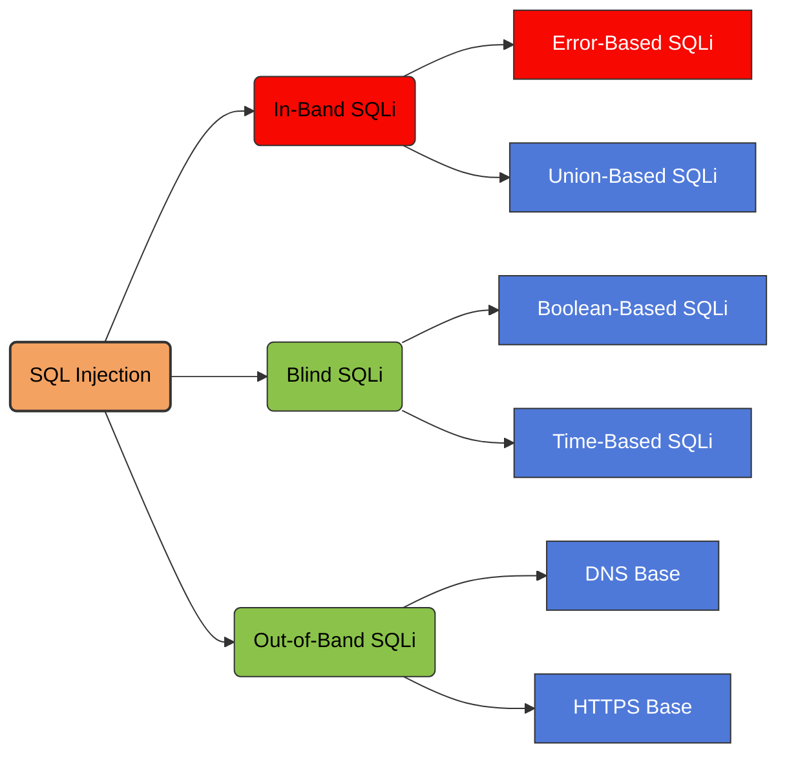

# In band SQL Injection

is a type of SQL injection attack where the attacker uses the **same communication channel** to both **inject malicious SQL queries and retrieve the results from the database**.
It is called _in‑band_ because the **data extraction happens in the same channel as the injection**.

#### **Error‑Based SQL Injection**



Error‑based SQL injection is a technique where an attacker intentionally triggers database errors to extract information from the database. By injecting specially crafted SQL queries, the attacker forces the database management system to generate error messages that reveal sensitive data such as the database name, table names, column names, or even actual data values. Many databases include detailed error messages when a query fails, and poorly configured applications may display these errors directly in the web response. Attackers exploit this behavior by embedding functions or operations in their payloads that cause errors containing useful information, allowing them to retrieve data quickly through the application’s normal response.

> [!example]+ Retrieving hidden data
>
>Imagine a shopping application that displays products in different categories. When the user clicks on the **Gifts** category, their browser requests the URL:
>
>```
>https://insecure-website.com/products?category=Gifts
>```
>
>This causes the application to make a SQL query to retrieve details of the relevant products from >the database:
>
>```
>SELECT * FROM products WHERE category = 'Gifts' AND released = 1
>```
>
>This SQL query asks the database to return:
>
>- all details (`*`)
>- from the `products` table
>- where the `category` is `Gifts`
>- and `released` is `1`.
>
>The restriction `released = 1` is being used to hide products that are not released. We could assume for unreleased products, `released = 0`.
>
>The application doesn't implement any defenses against SQL injection attacks. This means an attacker can construct the following attack, for example:
>
>```
>https://insecure-website.com/products?category=Gifts'--`
>```
>
>This results in the SQL query:
>
>`SELECT * FROM products WHERE category = 'Gifts'--' AND released = 1`
>
>Crucially, note that `--` is a comment indicator in SQL. This means that the rest of the query is >interpreted as a comment, effectively removing it. In this example, this means the query no longer >includes `AND released = 1`. As a result, all products are displayed, including those that are not yet released.
>
>You can use a similar attack to cause the application to display all the products in any category, including categories that they don't know about:
>
>```
>https://insecure-website.com/products?category=Gifts'+OR+1=1--`
>```
>
>This results in the SQL query:
>
>```
>SELECT * FROM products WHERE category = 'Gifts' OR 1=1--' AND released = 1`
>```
>
>The modified query returns all items where either the `category` is `Gifts`, or `1` is equal to `1`. As `1=1` is always true, the query returns all items.

> [!warning]- Warning
>
>Take care when injecting the condition `OR 1=1` into a SQL query. Even if it appears to be harmless in the context you're injecting into, it's common for applications to use data from a single request in multiple different queries. If your condition reaches an `UPDATE` or `DELETE` statement, for example, it can result in an accidental loss of data.

> [!example]- Subverting application logic
>
>Imagine an application that lets users log in with a username and password. If a user submits the username `wiener` and the password `bluecheese`, the application checks the credentials by performing the following SQL query:
>
>```
>SELECT * FROM users WHERE username = 'wiener' AND password = 'bluecheese'
>```
>
>If the query returns the details of a user, then the login is successful. Otherwise, it is rejected.
>
>In this case, an attacker can log in as any user without the need for a password. They can do this using the SQL comment sequence `--` to remove the password check from the `WHERE` clause of the query. For example, submitting the username `administrator'--` and a blank password results in the following query:
>
>```
>SELECT * FROM users WHERE username = 'administrator'--' AND password = ''
>```
>
>This query returns the user whose `username` is `administrator` and successfully logs the attacker in as that user.
