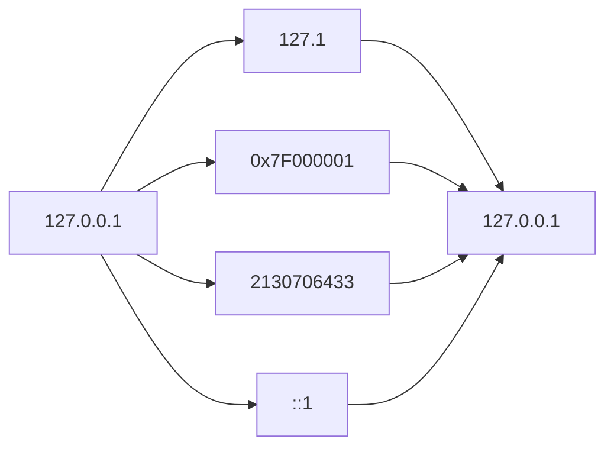
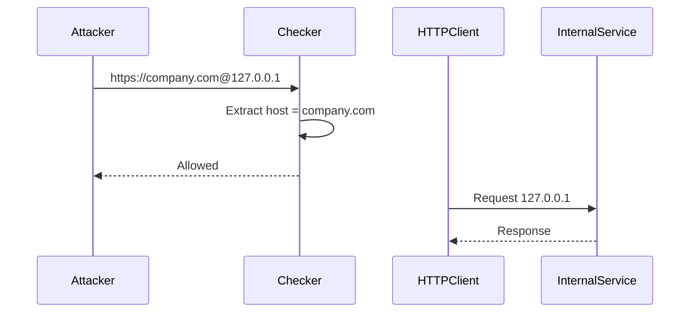
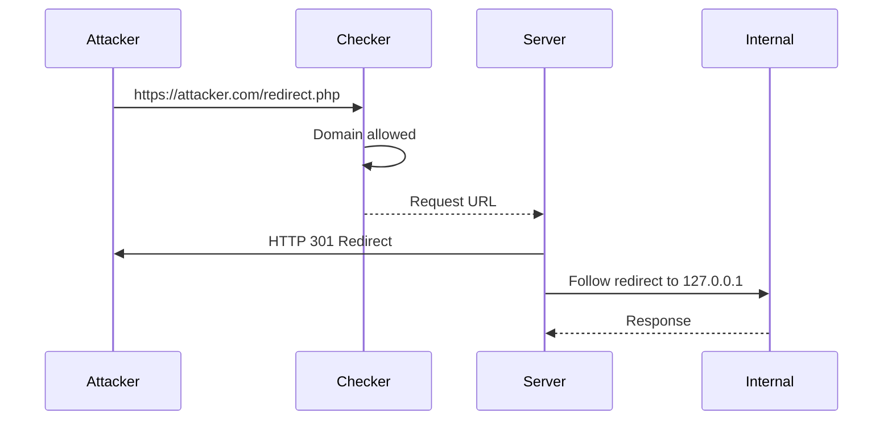
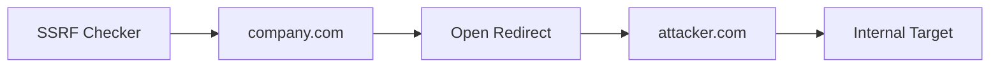
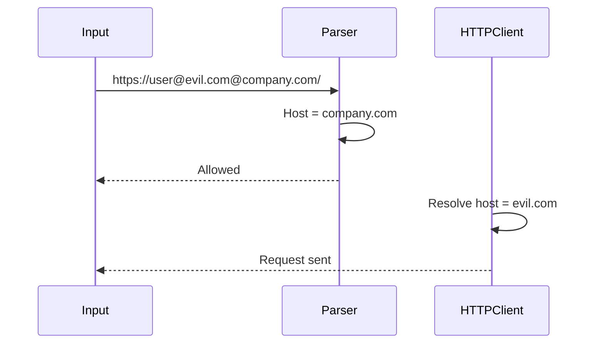

> [!abstract]
>
> In SSRF prevention, URL validation is one of the most critical security controls.
>
> A vulnerable URL checker may incorrectly validate attacker-controlled URLs due to parsing differences, IP representation tricks, redirects, or inconsistencies between the validation logic and the HTTP client library.
>
> A secure checker must validate the **final destination** of the request, not only the initial user input.

---

# Why URL Validation Fails

A common insecure flow:

```mermaid
flowchart TD

A[User Controlled URL]

A --> B[URL Checker]

B --> C{Validation Passed}

C -->|Yes| D[HTTP Client]

D --> E[Internal Resource]

C -->|No| F[Blocked]
````

The problem occurs when:

```text
Checker interpretation != HTTP Client interpretation
```

The validation function sees one destination, while the HTTP library requests another.

---

# IP Address Representation Bypass

A common mistake is checking only known internal IP formats.

Example:

Blocked:

```text
127.0.0.1
```

Possible bypasses:

```text
127.1
```

```text
0x7F000001
```

```text
2130706433
```

IPv6:

```text
[::1]
```

```text
[0:0:0:0:0:0:0:1]
```



> [!warning]
> 
> IP validation should normalize the IP address before checking it against blocklists.

---

# Domain Validation Regex Bypass

A common mistake is extracting the hostname using a weak regex.

Example:

Allowed:

```text
https://company.com
```

Validation:

```text
Host = company.com
```

Whitelist:

```text
company.com
auth.company.com
blog.company.com
```

---

Attacker input:

```text
https://company.com@127.0.0.1
```

URL parsing:

```text
Username: company.com
Host: 127.0.0.1
```

The checker may incorrectly trust:

```text
company.com
```

while the HTTP client connects to:

```text
127.0.0.1
```

---



---

# Redirect Based SSRF Bypass

Another mistake:

1. Validate the original URL.
    
2. Follow redirects automatically.
    

Example:

Allowed:

```text
https://google.com
```

Redirect:

```text
https://attacker.com/redirect.php
        |
        v
http://127.0.0.1
```

The checker validates:

```text
attacker.com
```

but the server finally requests:

```text
127.0.0.1
```

---



> [!danger]
> 
> URL validation must happen after redirects are resolved, or redirects to untrusted destinations must be blocked.

---

# Open Redirect Chaining

Even if the allowed domain is secure, an existing Open Redirect can become an SSRF primitive.

Example:

Trusted domain:

```text
https://company.com
```

Open Redirect:

```text
https://company.com/redirect?url=https://attacker.com
```

Flow:



---

# Parser Inconsistency

Different URL parsers may interpret the same URL differently.

Example:

```text
https://user@evil.com@company.com/
```

Parser A:

```text
Host = company.com
```

Whitelist:

```text
Allowed
```

HTTP client:

```text
Host = evil.com
```

Request goes to:

```text
evil.com
```

---



---

# Secure URL Validation Checklist

> [!todo]

- Parse URL using a trusted URL parser.
    
- Normalize hostname before validation.
    
- Resolve DNS before making requests.
    
- Validate the final destination after redirects.
    
- Block localhost addresses.
    
- Block private IP ranges.
    
- Block link-local addresses.
    
- Block cloud metadata IPs.
    
- Avoid regex-only URL validation.
    
- Ensure validator and HTTP client parse URLs identically.
    

---

# Related Vulnerabilities

- Server-Side Request Forgery (SSRF)
    
- Open Redirect
    
- DNS Rebinding
    
- URL Parser Confusion
    
- Access Control Bypass