> [!abstract]
> 
> ## What is Data Transmission?
> 
> **Data Transmission** in web applications refers to the process of sending and receiving data between a **Client** and a **Server** over a network.
> 
> In a typical web application, the Client sends an **HTTP Request** containing data, the Server receives and processes that data, and then returns an **HTTP Response**.
> 
> The transmitted data can include:
> 
> - User input
>     
> - Login credentials
>     
> - Form data
>     
> - JSON or XML data
>     
> - Cookies
>     
> - Authentication tokens
>     
> - Files and other resources
>     
> 
> A simplified communication flow looks like this:
> 
> ```text
> Client
>    │
>    │ HTTP Request
>    │
>    ▼
> Server
>    │
>    │ Process Request
>    │
>    ▼
> HTTP Response
>    │
>    ▼
> Client
> ```
> 
> For example, a Client may send user credentials to a Server:
> 
> ```http
> POST /login HTTP/1.1
> Host: example.com
> Content-Type: application/json
> 
> {
>     "username": "CNA",
>     "password": "password123"
> }
> ```
> 
> The Server processes the received data and returns a response:
> 
> ```http
> HTTP/1.1 200 OK
> Content-Type: application/json
> 
> {
>     "status": "success",
>     "message": "Login successful"
> }
> ```
> 
> The method used to transmit data can vary depending on the application, including **URL parameters, HTTP headers, request bodies, cookies, and other communication mechanisms**.

![[Pasted image 20260814205948.png]]

The basic communication model is:

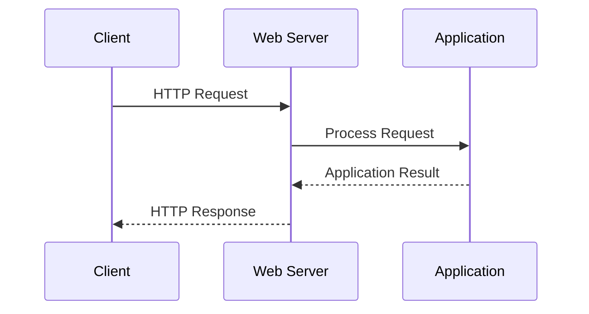

The data transmitted between the Client and Server can be represented using different formats.

Two of the most common formats are:

- **JSON**
- **XML**

## HTTP Request

An HTTP Request contains several important components.

A simplified request looks like:

```http
POST /api/user.php HTTP/1.1
Host: example.com
Content-Type: application/json

{
    "username": "adolfcna",
    "email": "example@gmail.com"
}
```

The request can be divided into:

```text
HTTP Method
     ↓
Request Target
     ↓
Headers
     ↓
Request Body
```

For example:

```http
POST /api/user.php HTTP/1.1
```

is the request line.

Then:

```http
Content-Type: application/json
```

is an HTTP Header.

And:

```json
{
    "username": "adolfcna",
    "email": "example@gmail.com"
}
```

is the Request Body.

---

## Request Body

The **Request Body** contains the actual data sent by the Client.

For example:

```http
POST /api/user.php HTTP/1.1
Host: example.com
Content-Type: application/json

{
    "username": "adolfcna",
    "email": "example@gmail.com"
}
```

The Body is:

```json
{
    "username": "adolfcna",
    "email": "example@gmail.com"
}
```

The format of this data is identified using the `Content-Type` header.

---

# Content-Type

**Content-Type** tells the receiving application what type of data is contained in the HTTP Body.

For JSON:

```http
Content-Type: application/json
```

For XML:

```http
Content-Type: application/xml
```

Another XML Content-Type that can be encountered is:

```http
Content-Type: text/xml
```

Conceptually:

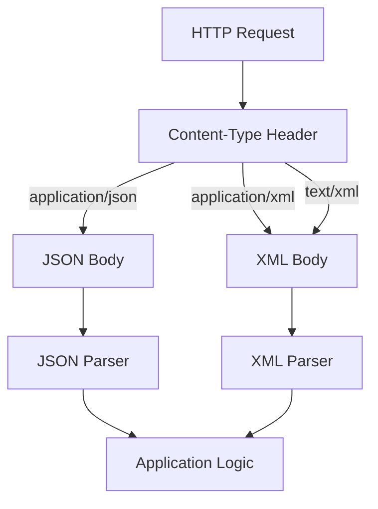

The important point is:

> `Content-Type` describes the format of the message body.

---

# JSON

**JSON (JavaScript Object Notation)** is a lightweight text-based data format commonly used for communication between web applications.

A simple JSON document:

```json
{
    "username": "adolfcna",
    "email": "example@gmail.com",
    "instagram": "adolfcna"
}
```

JSON represents data using **key-value pairs**.

For example:

```json
"username": "adolfcna"
```

Here:

```text
username
    ↓
Key

adolfcna
    ↓
Value
```

Another example:

```json
"email": "example@gmail.com"
```

means:

```text
Key
 ↓
email

Value
 ↓
example@gmail.com
```

---

# JSON Data Types

JSON supports several basic data types.

Example:

```json
{
    "username": "adolfcna",
    "age": 25,
    "active": true,
    "email": null
}
```

Here:

```text
username
    ↓
String

age
    ↓
Number

active
    ↓
Boolean

email
    ↓
Null
```

JSON also supports Arrays:

```json
{
    "username": "adolfcna",
    "skills": [
        "PHP",
        "Linux",
        "Web Security"
    ]
}
```

The structure is:

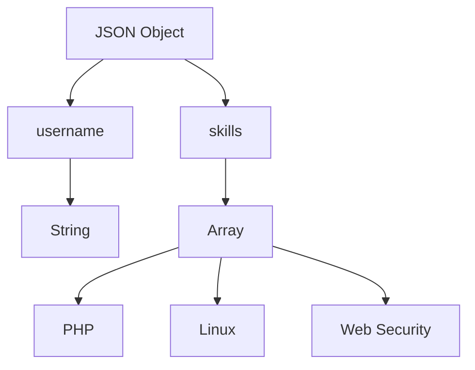

---

# `application/json`

When JSON is transmitted through HTTP, the standard Content-Type is:

```http
Content-Type: application/json
```

For example:

```http
POST /api/user.php HTTP/1.1
Host: example.com
Content-Type: application/json

{
    "username": "adolfcna",
    "email": "example@gmail.com"
}
```

The communication flow is:


---

# PHP — Receiving JSON

PHP can read the raw HTTP Request Body using:

```php
file_get_contents('php://input')
```

Example:

```php
<?php

header('Content-Type: application/json');

$body = file_get_contents('php://input');

$data = json_decode($body, true);

echo "Username: " . $data['username'] . "\n";
echo "Email: " . $data['email'] . "\n";
```

The process is:


---

# `php://input`

The following code:

```php
$body = file_get_contents('php://input');
```

reads the raw HTTP Request Body.

If the Client sends:

```json
{
    "username": "adolfcna",
    "email": "example@gmail.com"
}
```

then:

```php
$body
```

contains the JSON text.

Conceptually:

```text
HTTP Request Body
        ↓
php://input
        ↓
Raw JSON
```

---

# `json_decode()`

PHP uses:

```php
json_decode()
```

to convert JSON into a PHP data structure.

Example:

```php
$json = '{
    "username": "adolfcna",
    "email": "example@gmail.com"
}';

$data = json_decode($json, true);
```

The second argument:

```php
true
```

causes JSON objects to be converted into associative arrays.

Therefore:

```php
$data['username']
```

returns:

```text
adolfcna
```

and:

```php
$data['email']
```

returns:

```text
example@gmail.com
```

The transformation is:


---

# JSON Response

PHP can also generate a JSON Response.

Example:

```php
<?php

header('Content-Type: application/json');

$response = [
    "status" => "success",
    "username" => "adolfcna",
    "message" => "User received"
];

echo json_encode($response);
```

`json_encode()` converts the PHP array into JSON.

The flow is:


The resulting Response can look like:

```json
{
    "status": "success",
    "username": "adolfcna",
    "message": "User received"
}
```

---

# Sending JSON with cURL

Assume we have the following PHP file:

```text
json.php
```

and it is accessible at:

```text
http://localhost/json.php
```

We can send JSON using `curl`:

```bash
curl -X POST http://localhost/json.php \
-H "Content-Type: application/json" \
-d '{
    "username": "adolfcna",
    "email": "example@gmail.com"
}'
```

The important parts are:

```text
-X POST
    ↓
HTTP Method

-H "Content-Type: application/json"
    ↓
Body Format

-d '{ ... }'
    ↓
Request Body
```

The complete flow:

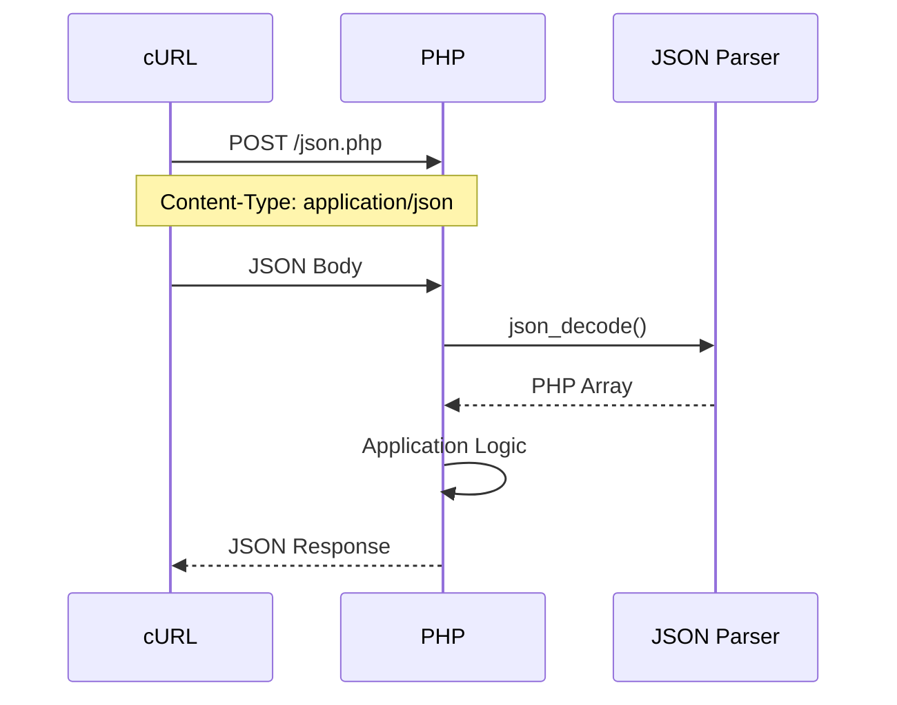

---

# Receiving the JSON Response

Suppose `json.php` returns:

```json
{
    "status": "success",
    "username": "adolfcna",
    "email": "example@gmail.com"
}
```

Then `curl` displays the response:

```json
{
    "status": "success",
    "username": "adolfcna",
    "email": "example@gmail.com"
}
```

Therefore:

```text
cURL
  ↓
HTTP Request
  ↓
JSON Body
  ↓
PHP
  ↓
json_decode()
  ↓
Application Logic
  ↓
json_encode()
  ↓
JSON Response
  ↓
cURL
```

---

# XML

**XML (Extensible Markup Language)** is another text-based format used to structure and exchange data.

A simple XML document:

```xml
<?xml version="1.0" encoding="UTF-8"?>

<user>
    <username>adolfcna</username>
    <email>example@gmail.com</email>
    <instagram>adolfcna</instagram>
</user>
```

Unlike JSON, XML represents data using **elements**.

For example:

```xml
<username>adolfcna</username>
```

Here:

```text
username
    ↓
Element Name

adolfcna
    ↓
Element Value
```

---

# XML Structure

XML normally has a root element.

For example:

```xml
<user>
    ...
</user>
```

Inside the root element, we can have child elements:

```xml
<user>

    <username>adolfcna</username>

    <email>example@gmail.com</email>

    <instagram>adolfcna</instagram>

</user>
```

The structure can be visualized as:

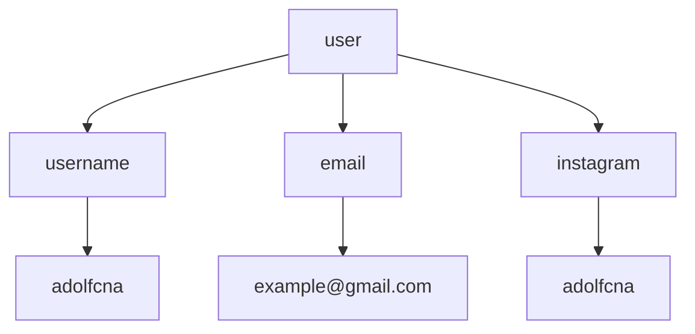

---

# XML Attributes

XML can also store information inside attributes.

Example:

```xml
<user id="1337">
    <username>adolfcna</username>
    <email>example@gmail.com</email>
</user>
```

Here:

```text
user
 ↓
Element

id="1337"
 ↓
Attribute
```

So XML can represent information using both:

```text
Elements
Attributes
```

---

# `application/xml`

The standard Content-Type commonly used when transmitting XML is:

```http
Content-Type: application/xml
```

Example:

```http
POST /api/user.php HTTP/1.1
Host: example.com
Content-Type: application/xml

<?xml version="1.0" encoding="UTF-8"?>

<user>
    <username>adolfcna</username>
    <email>example@gmail.com</email>
</user>
```

The communication flow is:

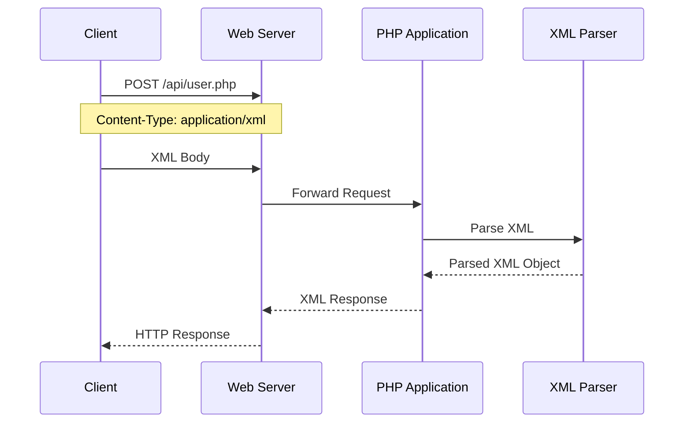

---

# `text/xml`

Another Content-Type that can be used for XML is:

```http
Content-Type: text/xml
```

Therefore, while testing or analyzing a web application, you may encounter:

```http
Content-Type: application/xml
```

or:

```http
Content-Type: text/xml
```

Both identify XML data, although `application/xml` is generally the more appropriate media type for XML used as application data.

The important distinction is:

```text
application/json
        ↓
JSON

application/xml
        ↓
XML

text/xml
        ↓
XML
```

---

# PHP — Receiving XML

PHP can read the raw XML body using:

```php
file_get_contents('php://input')
```

Then the XML can be parsed with SimpleXML.

Example:

```php
<?php

header('Content-Type: application/xml');

$body = file_get_contents('php://input');

$xml = simplexml_load_string($body);

echo "Username: " . $xml->username . "\n";
echo "Email: " . $xml->email . "\n";
php>
```

The processing flow is:


---

# `simplexml_load_string()`

PHP's **SimpleXML** extension provides:

```php
simplexml_load_string()
```

for parsing XML stored in a string.

Example:

```php
$xmlData = '
<user>
    <username>adolfcna</username>
    <email>example@gmail.com</email>
</user>
';

$xml = simplexml_load_string($xmlData);
```

After parsing, we can access XML elements using object-style syntax:

```php
$xml->username
```

and:

```php
$xml->email
```

The transformation is:


For example:

```php
echo $xml->username;
```

returns:

```text
adolfcna
```

---

# XML Response

PHP can also return XML.

Example:

```php
<?php

header('Content-Type: application/xml');

echo '<?xml version="1.0" encoding="UTF-8"?>';

echo '
<response>
    <status>success</status>
    <username>adolfcna</username>
    <message>User received</message>
</response>
';
```

The Response is:

```xml
<?xml version="1.0" encoding="UTF-8"?>

<response>
    <status>success</status>
    <username>adolfcna</username>
    <message>User received</message>
</response>
```

---

# Sending XML with cURL

Assume we have:

```text
xml.php
```

available at:

```text
http://localhost/xml.php
```

We can send an XML Request using:

```bash
curl -X POST http://localhost/xml.php \
-H "Content-Type: application/xml" \
-d '<?xml version="1.0" encoding="UTF-8"?>
<user>
    <username>adolfcna</username>
    <email>example@gmail.com</email>
</user>'
```

The important components are:

```text
-X POST
    ↓
HTTP Method

-H "Content-Type: application/xml"
    ↓
XML Body

-d '...'
    ↓
Request Body
```

The complete flow:

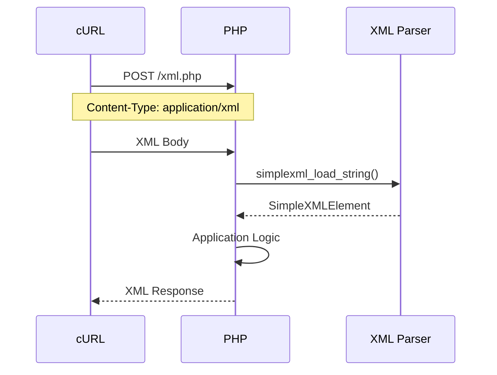

---

# Receiving the XML Response

Suppose the PHP application returns:

```xml
<?xml version="1.0" encoding="UTF-8"?>

<response>
    <status>success</status>
    <username>adolfcna</username>
</response>
```

`curl` will display that XML Response:

```xml
<?xml version="1.0" encoding="UTF-8"?>

<response>
    <status>success</status>
    <username>adolfcna</username>
</response>
```

The complete flow is:

```text
cURL
  ↓
HTTP Request
  ↓
XML Body
  ↓
PHP
  ↓
XML Parser
  ↓
Application Logic
  ↓
XML Response
  ↓
cURL
```

---

# Complete JSON Example

The following PHP application accepts JSON and returns JSON.

### `json.php`

```php
<?php

header('Content-Type: application/json');

$body = file_get_contents('php://input');

$data = json_decode($body, true);

if (!is_array($data)) {

    http_response_code(400);

    echo json_encode([
        "status" => "error",
        "message" => "Invalid JSON"
    ]);

    exit;
}

$username = $data['username'] ?? '';
$email = $data['email'] ?? '';

$response = [
    "status" => "success",
    "username" => $username,
    "email" => $email
];

echo json_encode($response);
```

Request:

```bash
curl -X POST http://localhost/json.php \
-H "Content-Type: application/json" \
-d '{
    "username": "adolfcna",
    "email": "example@gmail.com"
}'
```

Response:

```json
{
    "status": "success",
    "username": "adolfcna",
    "email": "example@gmail.com"
}
```

The complete pipeline:

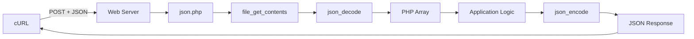

---

# Complete XML Example

The following PHP application accepts XML and returns XML.

### `xml.php`

```php
<?php

header('Content-Type: application/xml');

$body = file_get_contents('php://input');

$xml = simplexml_load_string($body);

if ($xml === false) {

    http_response_code(400);

    echo '<?xml version="1.0" encoding="UTF-8"?>';

    echo '
    <response>
        <status>error</status>
        <message>Invalid XML</message>
    </response>
    ';

    exit;
}

$username = (string)($xml->username ?? '');
$email = (string)($xml->email ?? '');

$username = htmlspecialchars(
    $username,
    ENT_XML1,
    'UTF-8'
);

$email = htmlspecialchars(
    $email,
    ENT_XML1,
    'UTF-8'
);

echo '<?xml version="1.0" encoding="UTF-8"?>';

echo "
<response>
    <status>success</status>
    <username>$username</username>
    <email>$email</email>
</response>
";
```

Request:

```bash
curl -X POST http://localhost/xml.php \
-H "Content-Type: application/xml" \
-d '<?xml version="1.0" encoding="UTF-8"?>
<user>
    <username>adolfcna</username>
    <email>example@gmail.com</email>
</user>'
```

Response:

```xml
<?xml version="1.0" encoding="UTF-8"?>

<response>
    <status>success</status>
    <username>adolfcna</username>
    <email>example@gmail.com</email>
</response>
```

The complete pipeline:

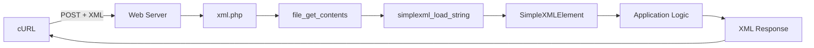

---

# JSON vs XML

JSON and XML can represent the same information using different syntax.

### JSON

```json
{
    "username": "adolfcna",
    "email": "example@gmail.com"
}
```

### XML

```xml
<user>
    <username>adolfcna</username>
    <email>example@gmail.com</email>
</user>
```

Both represent:

```text
username = adolfcna
email = example@gmail.com
```

The main difference is the way the data is structured and represented.

---

## Structural Comparison

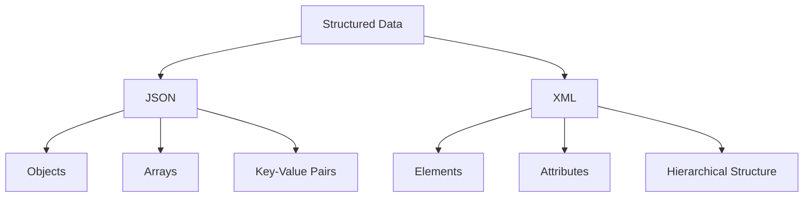

---

# JSON vs XML — Example

The same user represented in JSON:

```json
{
    "id": 1337,
    "username": "adolfcna",
    "email": "example@gmail.com"
}
```

The same data in XML:

```xml
<user>
    <id>1337</id>
    <username>adolfcna</username>
    <email>example@gmail.com</email>
</user>
```

JSON generally has a more compact syntax.

XML provides a more tag-oriented and hierarchical representation.

Neither format is inherently "better" in every situation. The appropriate format depends on the application, API, protocol, and ecosystem.

---

# `Content-Type` vs `Accept`

These two HTTP headers are often confused.

## Content-Type

`Content-Type` describes the format of the **current message body**.

For example:

```http
Content-Type: application/json
```

means:

```text
The Request Body is JSON.
```

And:

```http
Content-Type: application/xml
```

means:

```text
The Request Body is XML.
```

---

## Accept

`Accept` tells the server which response media types the Client can accept or prefers.

For example:

```http
Accept: application/json
```

means that the Client is requesting/prefering a JSON response.

These headers can be used together:

```http
POST /api/user.php HTTP/1.1
Host: example.com
Content-Type: application/xml
Accept: application/json

<user>
    <username>adolfcna</username>
</user>
```

This means:

```text
Request Body
     ↓
XML

Preferred Response
     ↓
JSON
```

The concept can be visualized as:

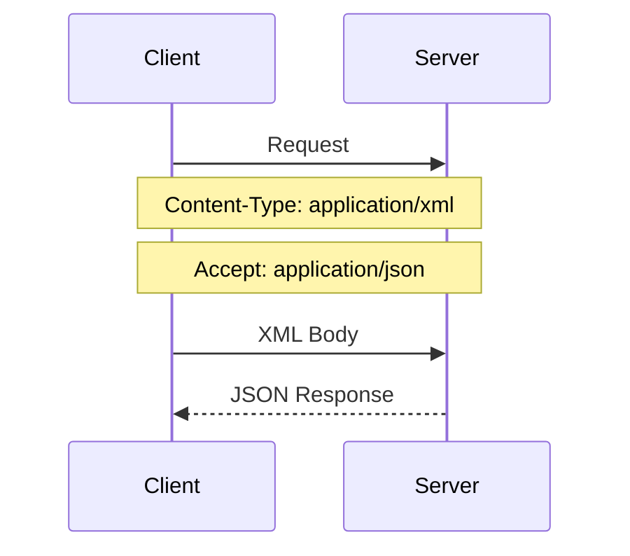

---

# JSON Request / Response Flow

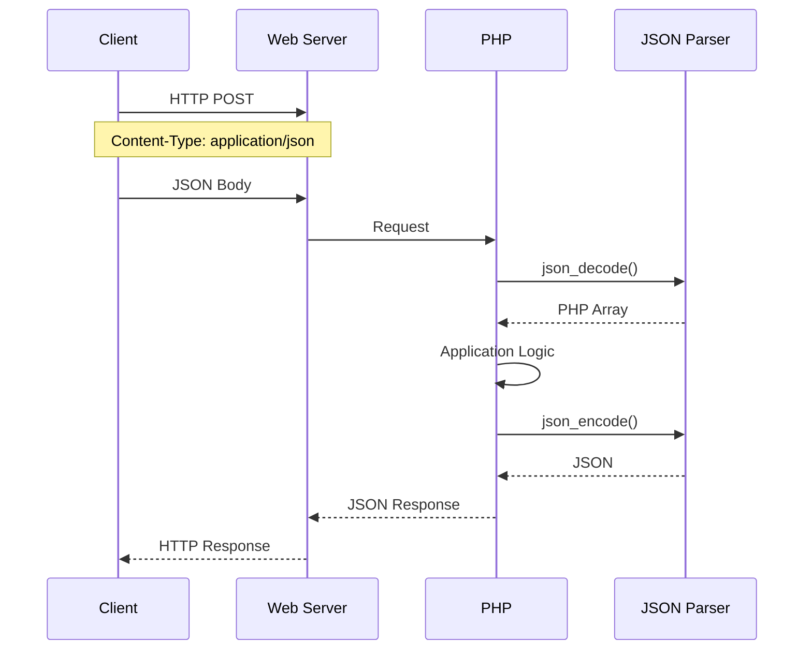

---

# XML Request / Response Flow

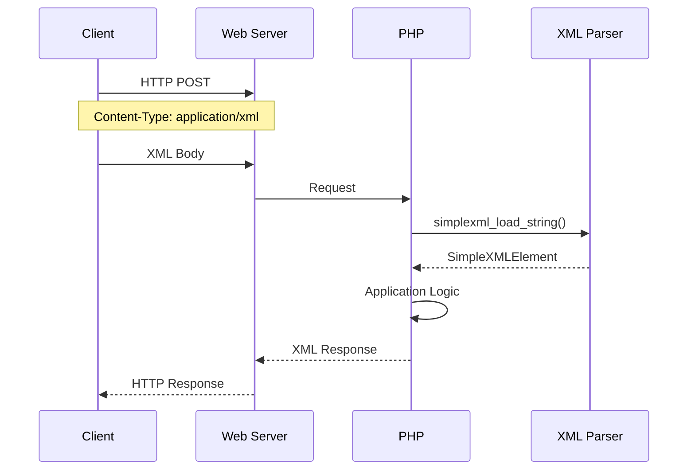

---

# JSON and XML in Web Applications

A typical application can support both formats:

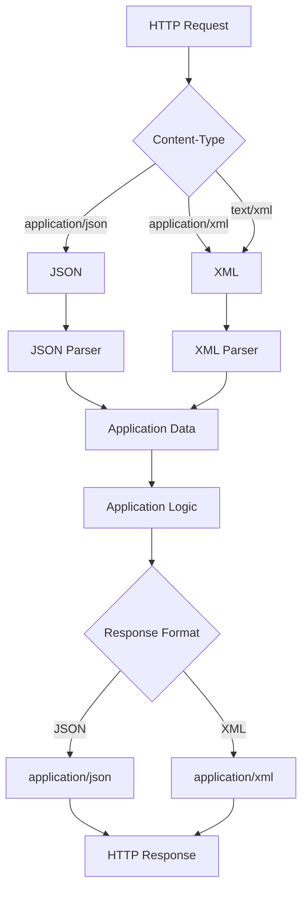

The important concept is that **the data format and the parser are connected**.

For JSON:

```text
JSON
 ↓
JSON Parser
 ↓
Application Data
```

For XML:

```text
XML
 ↓
XML Parser
 ↓
Application Data
```

---

# Important PHP Functions

For JSON:

```php
file_get_contents('php://input');
json_decode();
json_encode();
```

For XML:

```php
file_get_contents('php://input');
simplexml_load_string();
```

The two pipelines can therefore be summarized as:

```mermaid
flowchart LR
    A[HTTP Body] --> B{Format}

    B -->|JSON| C[json_decode]
    B -->|XML| D[simplexml_load_string]

    C --> E[PHP Data]
    D --> E

    E --> F[Application Logic]

    F --> G[json_encode]
    F --> H[XML Generation]

    G --> I[JSON Response]
    H --> J[XML Response]
```

---

# Key Takeaways

- **Data Transmission** is the process of exchanging data between a Client and Server.
    
- HTTP Requests can contain data inside the **Request Body**.
    
- `Content-Type` identifies the format of the HTTP Body.
    
- **JSON** is a lightweight, text-based data format commonly used by APIs.
    
- JSON is commonly transmitted using:
    

```http
Content-Type: application/json
```

- PHP can read the raw Request Body using:
    

```php
file_get_contents('php://input')
```

- PHP can parse JSON using:
    

```php
json_decode()
```

- PHP can generate JSON using:
    

```php
json_encode()
```

- **XML** is another text-based format for representing structured data.
    
- XML is commonly transmitted using:
    

```http
Content-Type: application/xml
```

- `text/xml` is another XML media type that can be encountered.
    
- PHP can parse XML using:
    

```php
simplexml_load_string()
```

- `curl` can send both JSON and XML through HTTP.
    
- `Content-Type` describes the format of the **body being sent**.
    
- `Accept` describes the response formats the Client can accept/prefer.
    
- JSON and XML can represent the same underlying data while using different syntaxes.
    
- The general Web Data Transmission model is:
    

```mermaid
flowchart LR
    A[Client] --> B[HTTP Request]
    B --> C[Content-Type]
    C --> D[Request Body]
    D --> E[Parser]
    E --> F[Application Logic]
    F --> G[HTTP Response]
    G --> A
```

The two main examples covered in this section are:

```text
application/json
        ↓
JSON
        ↓
json_decode()
        ↓
PHP Application
        ↓
json_encode()
        ↓
JSON Response
```

and:

```text
application/xml
        ↓
XML
        ↓
simplexml_load_string()
        ↓
PHP Application
        ↓
XML Response
```
