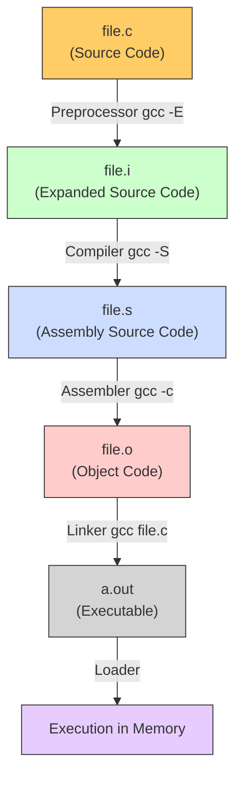

> [!abstract] C Compilation Process & Intermediate Files
> When a C program is compiled using GCC, the process goes through several distinct stages before producing the final executable. Using the `-save-temps` flag (`gcc -save-temps file.c`) retains all intermediate files, allowing reverse engineers and developers to inspect how the code transforms at each step.
> **MITRE ATT&CK Mapping:** [T1027 - Obfuscated Files or Information](https://attack.mitre.org/techniques/T1027/) (Relevant to malware analysis and understanding binary obfuscation).

## Compilation Flow Diagram



---

## Step-by-Step Breakdown (`gcc -save-temps`)

> [!info]+ Command
> ```bash
> gcc -save-temps file.c
> ```
> *This single command will generate `file.i`, `file.s`, `file.o`, and the final `a.out` executable.*

### 1. Preprocessing (`.i` file)

> [!example]+ `file.i` (Expanded Source Code)
> **Stage:** Preprocessor (`gcc -E file.c`)
> 
> **What happens:**
> - Removes all comments (`//` or `/* */`) from the source code.
> - Expands macros and `#define` directives.
> - Expands header files (`#include <stdio.h>`). It literally copies and pastes the content of the header files into the source code.
> - Handles conditional compilation directives (`#if`, `#ifdef`).
> 
> **Content:** Pure C code, but much larger than the original because all standard libraries (like `<stdio.h>`) are fully expanded and included inline.

### 2. Compilation (`.s` file)

> [!tip]+ `file.s` (Assembly Source Code)
> **Stage:** Compiler (`gcc -S file.c`)
> 
> **What happens:**
> - Takes the preprocessed C code (`file.i`) and translates it into Assembly language specific to the target architecture (e.g., x86_64, ARM).
> - Checks for syntax errors and warnings.
> - Optimizes the code (if optimization flags like `-O2` are used).
> 
> **Content:** Human-readable assembly instructions (e.g., `push rbp`, `mov rsp, rbp`, `call printf`). This is the bridge between high-level C and machine code.

### 3. Assembly (`.o` file)

> [!bug]+ `file.o` (Object Code / Relocatable Code)
> **Stage:** Assembler (`gcc -c file.c`)
> 
> **What happens:**
> - Translates the assembly instructions (`file.s`) into machine code (binary, 1s and 0s).
> - Generates a symbol table (mapping function/variable names to memory addresses).
> - At this stage, external references (like `printf` from the C standard library) are not yet resolved. The file is "relocatable".
> 
> **Content:** Binary data. If you open it in a text editor, you will see garbage characters. You need tools like `objdump` or `readelf` to read the machine instructions and symbol tables.

### 4. Linking (Executable file - `a.out`)

> [!danger]+ `a.out` (Executable)
> **Stage:** Linker (`gcc file.c`)
> 
> **What happens:**
> - Links one or more object files (`file.o`) together.
> - Resolves external references (e.g., links the `printf` function call to the actual `printf` implementation in the C Standard Library `libc.so` or `libc.a`).
> - Assigns final absolute memory addresses to functions and variables.
> - Adds the Program Header (tells the OS how to load the file into memory).
> 
> **Content:** A ready-to-run binary file. The default output name is `a.out`, but it can be changed using the `-o` flag (e.g., `gcc file.c -o myprogram`).

### 5. Loading (Execution)

> [!success]+ Loading into Memory
> **Stage:** Loader (OS component)
> 
> **What happens:**
> - When you run the executable (`./a.out`), the OS loader copies the code and data segments from the file into RAM.
> - Resolves dynamic linking (links shared libraries like `libc.so` at runtime via `ld.so`).
> - Initializes the stack and heap.
> - Jumps to the program's entry point (usually the `_start` function, which then calls `main()`).

