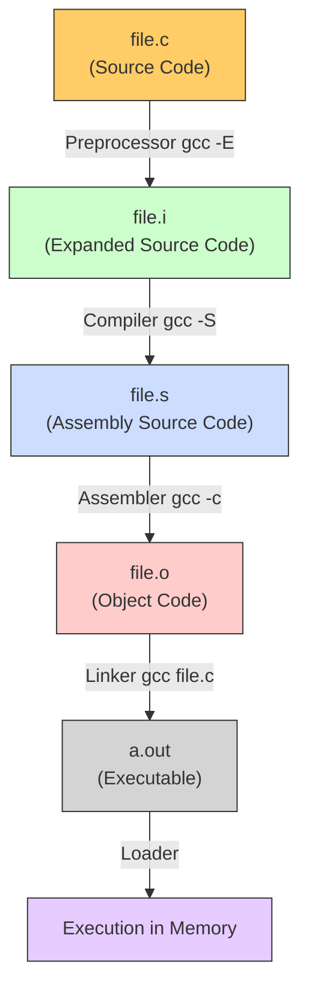

> [!abstract] C Compilation Process & Intermediate Files
> When a C program is compiled using GCC, the process goes through several distinct stages before producing the final executable. Using the `-save-temps` flag (`gcc -save-temps file.c`) retains all intermediate files, allowing reverse engineers and developers to inspect how the code transforms at each step.
> **MITRE ATT&CK Mapping:** [T1027 - Obfuscated Files or Information](https://attack.mitre.org/techniques/T1027/) (Relevant to malware analysis and understanding binary obfuscation).

## Compilation Flow Diagram



---

## Step-by-Step Breakdown (`gcc -save-temps`)

> [!info]+ Command
> ```bash
> gcc -save-temps file.c
> ```
> *This single command will generate `file.i`, `file.s`, `file.o`, and the final `a.out` executable.*

### 1. Preprocessing (`.i` file)

> [!example]+ `file.i` (Expanded Source Code)
> **Stage:** Preprocessor (`gcc -E file.c`)
> 
> **What happens:**
> - Removes all comments (`//` or `/* */`) from the source code.
> - Expands macros and `#define` directives.
> - Expands header files (`#include <stdio.h>`). It literally copies and pastes the content of the header files into the source code.
> - Handles conditional compilation directives (`#if`, `#ifdef`).
> 
> **Content:** Pure C code, but much larger than the original because all standard libraries (like `<stdio.h>`) are fully expanded and included inline.

### 2. Compilation (`.s` file)

> [!tip]+ `file.s` (Assembly Source Code)
> **Stage:** Compiler (`gcc -S file.c`)
> 
> **What happens:**
> - Takes the preprocessed C code (`file.i`) and translates it into Assembly language specific to the target architecture (e.g., x86_64, ARM).
> - Checks for syntax errors and warnings.
> - Optimizes the code (if optimization flags like `-O2` are used).
> 
> **Content:** Human-readable assembly instructions (e.g., `push rbp`, `mov rsp, rbp`, `call printf`). This is the bridge between high-level C and machine code.

### 3. Assembly (`.o` file)

> [!bug]+ `file.o` (Object Code / Relocatable Code)
> **Stage:** Assembler (`gcc -c file.c`)
> 
> **What happens:**
> - Translates the assembly instructions (`file.s`) into machine code (binary, 1s and 0s).
> - Generates a symbol table (mapping function/variable names to memory addresses).
> - At this stage, external references (like `printf` from the C standard library) are not yet resolved. The file is "relocatable".
> 
> **Content:** Binary data. If you open it in a text editor, you will see garbage characters. You need tools like `objdump` or `readelf` to read the machine instructions and symbol tables.

### 4. Linking (Executable file - `a.out`)

> [!danger]+ `a.out` (Executable)
> **Stage:** Linker (`gcc file.c`)
> 
> **What happens:**
> - Links one or more object files (`file.o`) together.
> - Resolves external references (e.g., links the `printf` function call to the actual `printf` implementation in the C Standard Library `libc.so` or `libc.a`).
> - Assigns final absolute memory addresses to functions and variables.
> - Adds the Program Header (tells the OS how to load the file into memory).
> 
> **Content:** A ready-to-run binary file. The default output name is `a.out`, but it can be changed using the `-o` flag (e.g., `gcc file.c -o myprogram`).


> [!hint]+ 🐧 Linux / GCC & G++ Build Commands
> A complete guide for compiling C/C++ code in Linux. 
> **Note on Compilers:**
> - Use `gcc` for C code (`.c` files). 
> - Use `g++` for C++ code (`.cpp` files). `g++` automatically links the C++ standard library (`libstdc++`).
> *(In the examples below, replace `g++` with `gcc` if your file is `.c`)*

### 1. Standard Executable Build (ELF)

> [!example]+ Basic Compilation
> ```bash
> # For C++
> g++ implant.cpp -o implant
> 
> # For C
> gcc implant.c -o implant
> ```
> **Explanation:**
> - `-o implant` → Specifies the output file name (default is `a.out`).

### 2. Shared Library Build (`.so`)

> [!tip]+ Dynamic Link Library (Equivalent to Windows DLL)
> To create a shared library in Linux, you must generate Position Independent Code (PIC).
> ```bash
> # For C++
> g++ -fPIC -shared implant.cpp -o libimplant.so
> 
> # For C
> gcc -fPIC -shared implant.c -o libimplant.so
> ```
> **Explanation:**
> - `-fPIC` → Generates Position Independent Code (mandatory for shared libraries).
> - `-shared` → Tells the linker to create a shared object (`.so`).

### 3. Linking External Libraries

> [!info]+ Adding Libraries to Compiler (Equivalent to MSVC `.lib` or MinGW `-l`)
> If your code uses external libraries (like OpenSSL, Lua, or PCAP), you must tell the compiler where to find them.
> ```bash
> # Example: Linking OpenSSL (-lssl -lcrypto) and Lua (-llua5.3)
> g++ main.cpp -o secure_app -lssl -lcrypto -llua5.3
> ```
> **Explanation:**
> - `-l<name>` → Links the library. It automatically strips the `lib` prefix and `.so` suffix (e.g., `-lssl` looks for `libssl.so`).
> - `-L/path/to/lib` → (Optional) If the library is in a custom folder, use this to specify the path.
> - `-I/path/to/include` → (Optional) If header files are in a custom folder.

### 4. Debug Build (For GDB Analysis)

> [!bug]+ Compilation for Debugging
> If you want to analyze the binary in GDB or Ghidra, you need to include debug symbols and disable optimizations.
> ```bash
> # For C++
> g++ implant.cpp -g -O0 -Wall -o debug_implant
> 
> # For C
> gcc implant.c -g -O0 -Wall -o debug_implant
> ```
> **Explanation:**
> - `-g` → Includes debug symbols (function names, variable names, line numbers) in the binary.
> - `-O0` → Disables optimization (prevents variables from being removed or reordered, making debugging easier).
> - `-Wall` → Shows all warnings during compilation.

### 5. Strong Security Build (Production / Secure)

> [!warning]+ Hardened Compilation (Defensive)
> Compiles the binary with built-in protections against memory corruption and buffer overflows.
> ```bash
> # For C++
> g++ implant.cpp -O2 -D_FORTIFY_SOURCE=2 -fstack-protector-strong -fstack-clash-protection -Wl,-z,relro,-z,now -Wall -Wextra -o secure_implant
> 
> # For C
> gcc implant.c -O2 -D_FORTIFY_SOURCE=2 -fstack-protector-strong -fstack-clash-protection -Wl,-z,relro,-z,now -Wall -Wextra -o secure_implant
> ```
> **Explanation:**
> - `-O2` → Standard optimization level for production.
> - `-D_FORTIFY_SOURCE=2` → Adds bounds checking to common string/memory functions (like `strcpy`, `memcpy`).
> - `-fstack-protector-strong` → Inserts canaries into the stack to protect against stack overflows.
> - `-fstack-clash-protection` → Prevents the stack from clashing with the heap.
> - `-Wl,-z,relro,-z,now` → Marks GOT (Global Offset Table) as read-only immediately at startup (Full RELRO), preventing GOT overwrite attacks.

### 6. Hard Reverse Build (Anti-Reverse Engineering)

> [!danger]+ Stripped & Static Compilation (Offensive / Malware)
> Compiles the binary to be as hard as possible to reverse engineer. Removes symbols, statically links libraries, and uses maximum optimization.
> ```bash
> # For C++
> g++ main.cpp -O3 -flto -fstack-protector-strong -fPIE -pie -s -static -o hard_implant
> strip --strip-all hard_implant
> 
> # For C
> gcc main.c -O3 -flto -fstack-protector-strong -fPIE -pie -s -static -o hard_implant
> strip --strip-all hard_implant
> ```
> **Explanation:**
> - `-O3` → Maximum optimization for speed and smaller binary size.
> - `-flto` → Link-Time Optimization (removes dead code and inlines functions across files, making the control flow harder to follow in IDA/Ghidra).
> - `-fPIE -pie` → Position Independent Executable (takes advantage of ASLR).
> - `-s` → Strips all symbol tables and relocation info during linking.
> - `-static` → Statically links all standard libraries (e.g., `libc.a`). The binary becomes larger, but it doesn't depend on the target system's `.so` files, making it highly portable and immune to `LD_PRELOAD` hooking.
> - `strip --strip-all` → Secondary pass to ensure absolutely all debugging info and symbols are removed.


