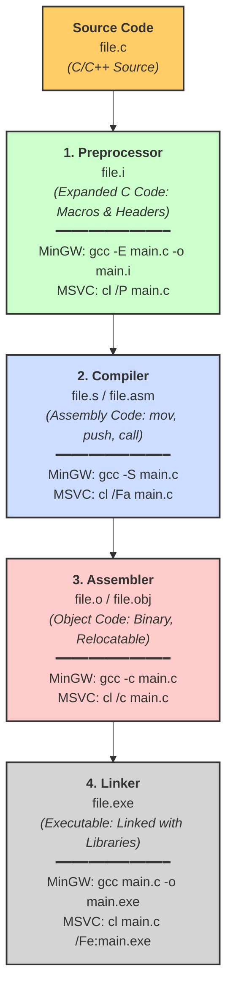

> [!abstract] C Compilation Process & Intermediate Files
> When a C program is compiled using GCC or CL the process goes through several distinct stages before producing the final executable. Using the `-save-temps` flag (`gcc -save-temps file.c`) retains all intermediate files, allowing reverse engineers and developers to inspect how the code transforms at each step.
> **MITRE ATT&CK Mapping:** [T1027 - Obfuscated Files or Information](https://attack.mitre.org/techniques/T1027/) (Relevant to malware analysis and understanding binary obfuscation).




> [!hint]+ 💻 Windows / MinGW Build Commands
> Various compile commands for Windows executables and DLLs, optimized for different scenarios.
>
> ### Windows Build (cl.exe)
> ```batch
> @ECHO OFF
> cl.exe /nologo /Ox /MT /W0 /GS- /DNDEBUG /Tcimplant.cpp /link /OUT:implant.exe /SUBSYSTEM:CONSOLE /MACHINE:x64
> ```
> **Explanation:**
> - `/Ox` – Optimize for speed  
> - `/MT` – Link with static runtime  
> - `/GS-` – Disable buffer security checks  
> - `/DNDEBUG` – Disable debug macros  
> - `/SUBSYSTEM:CONSOLE` – Console application  
> - `/MACHINE:x64` – Target 64-bit  
>
> ### Windows Build (cl.exe) Dynamic Link Library
> ```batch
> cl.exe /D_USRDLL /D_WINDLL implant.cpp /MT /link /DLL /OUT:implant.dll
> ```
>
> ### MinGW Compiler With Console
> ```bash
> x86_64-w64-mingw32-g++ implant.cpp -O3 -static -w -fno-stack-protector -fno-exceptions -fno-rtti  -DNDEBUG  -s -o tcimplant.exe
> ```
>
> ### MinGW Compiler Without Console
> ```bash
> x86_64-w64-mingw32-g++ implant.cpp -O3 -static -w -fno-stack-protector -fno-exceptions -fno-rtti -DNDEBUG -mwindows -s -o tcimplant.exe
> ```
>
> ### MinGW Compiler For Debug
> ```bash
> x86_64-w64-mingw32-g++ implant.cpp -g -O0 -Wall -o tcimplant.exe
> ```
>
> ### MinGW Compiler Strong Security
> ```bash
> x86_64-w64-mingw32-g++ implantc.cpp -O2 -D_FORTIFY_SOURCE=2 -fstack-protector-strong -fstack-clash-protection -Wl,--dynamicbase -Wl,--nxcompat -Wl,--high-entropy-va -Wall -Wextra -o secure.exe
> ```
>
> ### MinGW Compiler Hard Reverse
> ```bash
> x86_64-w64-mingw32-g++ main.cpp -O3 -flto -fstack-protector-strong -fstack-clash-protection -fPIE -pie -s -o hard.exe
> x86_64-w64-mingw32-strip --strip-all hard.exe
> ```
>
> ### MinGW Compiler Dynamic Link Library
> ```bash
> x86_64-w64-mingw32-g++ -D_USRDLL -D_WINDLL -shared -static -o implant.dll main.cpp -lws2_32 -lwininet -ladvapi32 -Wl,--out-implib,libimplant.a
> i686-w64-mingw32-g++ -D_USRDLL -D_WINDLL -shared -static -o implant.dll main.cpp -lws2_32 -lwininet -ladvapi32 -Wl,--out-implib,libimplant.a
> ```
>
> **Notes:**
> - `-O3` – Maximum optimization  
> - `-static` – Static linking for portability  
> - `-fno-stack-protector` / `-fno-exceptions` – Reduce extra checks for testing  
> - `-mwindows` – Suppresses console window  
> - `-flto` – Link-time optimization for smaller & faster binaries  
> - `strip` – Removes debug symbols for harder reverse engineering  

