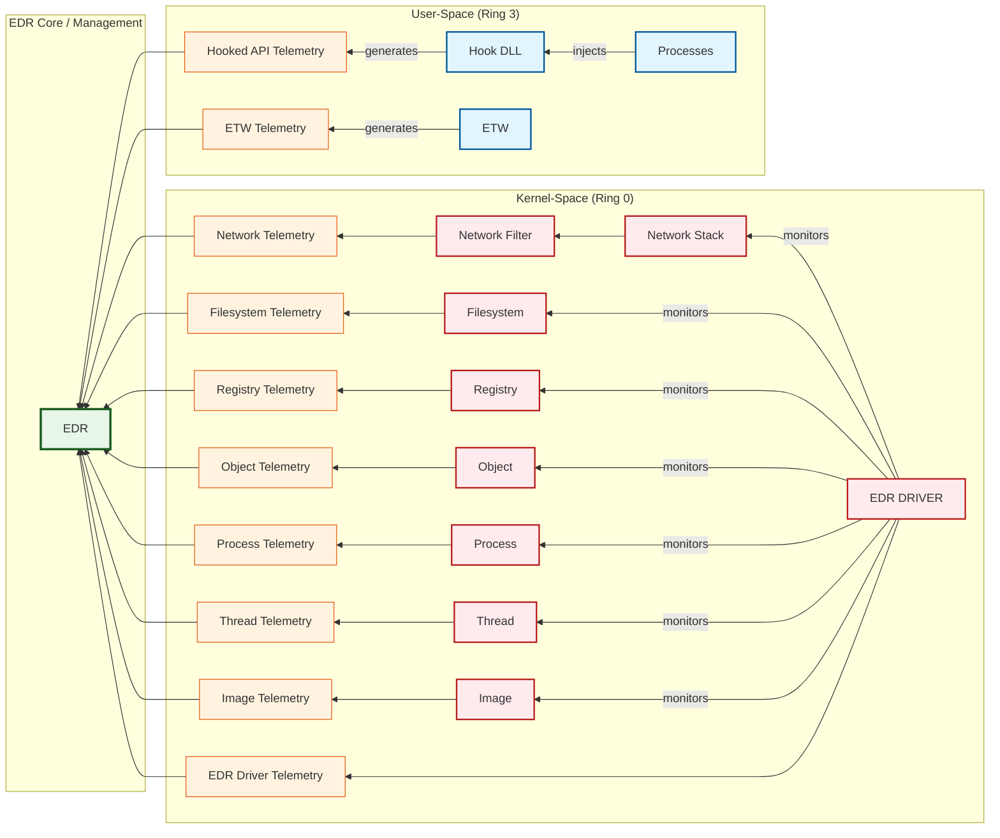

> [!abstract] EDR Architecture: The Telemetry Pipeline (Ring 0 to Ring 3)
> Endpoint Detection and Response (EDR) solutions act as the ultimate surveillance system for an operating system. This diagram visualizes the complete telemetry pipeline. Data originates from various OS components in both User-Space (Ring 3) and Kernel-Space (Ring 0), is converted into telemetry logs, and is funneled directly into the central EDR Core for real-time analysis and threat hunting.

### 1. User-Space (Ring 3) - The Frontline Brawl

> [!tip] API Hooking & ETW
> This layer represents where standard applications live and operate. EDRs cannot blindly trust user-mode processes, so they aggressively intercept them to watch behavior.
> 
> - **The Injection & Hooking Game:** The EDR targets high-risk `Processes` (like `powershell.exe` or `cmd.exe`) and `injects` a `Hook DLL` directly into their memory. This DLL places hooks (interceptions) on critical Windows APIs. When malware calls an API like `VirtualAlloc` or `CreateRemoteThread`, the hook intercepts it and `generates` **Hooked API Telemetry**.
> - **ETW (Event Tracing for Windows):** EDRs also tap into Microsoft's native `ETW` framework to catch built-in logging (like PowerShell ScriptBlock logging). This `generates` **ETW Telemetry**.
> - *Limitation:* User-Space hooks can be bypassed by attackers unhooking the DLL or using direct syscalls.

### 2. Kernel-Space (Ring 0) - The Unescapable Overlord

> [!danger] Kernel Callbacks & Mini-Filters
> If an attacker bypasses User-Space hooks, they hit the Kernel-Space. The **EDR DRIVER** (a signed `.sys` file) is the absolute king here. It uses official Microsoft Kernel Callbacks to `monitor` everything at the deepest level. You cannot easily bypass this layer from user-mode.
> 
> - **Network Monitoring:** The EDR Driver monitors the `Network Stack` and `Network Filter` layers. Every C2 ping or DNS request generates **Network Telemetry**.
> - **System Internals:** It watches the `Filesystem`, `Registry`, and kernel `Objects` (like handle duplication for token stealing). These generate **Filesystem Telemetry**, **Registry Telemetry**, and **Object Telemetry**.
> - **Execution & Injection:** It tracks the creation of new `Process`es, the spawning of new `Thread`s, and the loading of executable images/DLLs (`Image`). These generate **Process Telemetry**, **Thread Telemetry**, and **Image Telemetry**.
> - **Self-Protection:** The EDR Driver also watches its own back, generating **EDR Driver Telemetry** to alert the core if someone tries to unload or attack the driver itself.

### 3. EDR Core / Management - The Brain

> [!success] Data Correlation & Detection
> The final destination for all this data is the **EDR Core / Management** engine.
> 
> Every single telemetry stream—whether it came from a User-Space Hook DLL, ETW, or the Kernel Driver—flows directly into the EDR core.
> 
> This is where the magic happens. The EDR Core correlates all these separate telemetry pieces to build a story. If it sees "Word spawned PowerShell -> PowerShell made a network connection," it uses the telemetry to flag it as malicious and blocks the attack.

