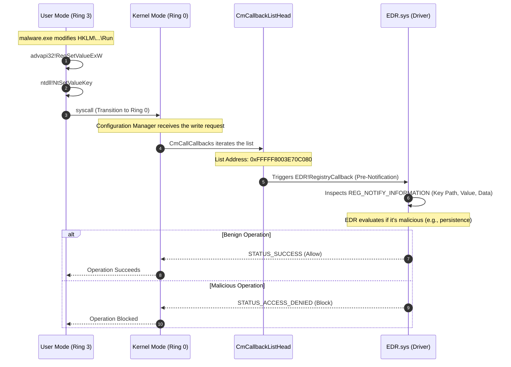

> [!abstract] Deep Dive: Registry Operation Kernel Callbacks (`CmRegisterCallbackEx`)
> The Windows Registry is the heart of the operating system's configuration and persistence mechanisms. Attackers constantly modify the registry to establish persistence (e.g., Run keys, Winlogon Shell), steal credentials (e.g., LSA secrets), or disable security tools. To counter this, the Windows Configuration Manager (CM) provides kernel callbacks. EDRs use `CmRegisterCallbackEx` to intercept registry operations *before* they are committed to disk, allowing them to block malicious changes in real-time.
> **MITRE ATT&CK Mapping:** [T1112 - Modify Registry](https://attack.mitre.org/techniques/T1112/) | [T1547.001 - Boot or Logon Autostart Execution: Registry Run Keys](https://attack.mitre.org/techniques/T1547/001/)

> [!info] The Execution & Notification Path
> When a process attempts to modify the registry, the request transitions from User Mode to Kernel Mode via a syscall. The Configuration Manager processes the request, and before executing the write operation, it iterates through its internal callback list to notify all registered drivers (like the EDR) about the pending change.



### Registration & Mechanics

> [!tip] Registration & Storage
> Unlike process and thread callbacks which use `PsSet...` APIs, registry callbacks use the Configuration Manager (CM) API.
> 
> **The Trigger:** These callback routines are triggered initially from User Mode by system calls such as `NtSetValueKey`, `NtCreateKey`, or `NtDeleteKey`.
> 
> **The List:** The pointers to these registered callback routines are stored in an internal, undocumented kernel list called `nt!CmCallbackListHead`.
> 
> **Registration API:** Drivers can register their callback routines into this list using the following Kernel API:
> - `CmRegisterCallbackEx` (Modern): Registers a callback routine and passes a `Context` pointer so the EDR can track its own state.

### The Telemetry Goldmine: `REG_NOTIFY_CLASS` & Pre-Notifications

> [!bug]+ Deep Dive: How EDRs Catch Registry Persistence
> When a registry operation occurs, the EDR's callback receives a pointer to a `REG_NOTIFY_INFORMATION` structure. The most critical field is the `REG_NOTIFY_CLASS`, which tells the EDR exactly what type of operation is happening (e.g., `RegNtPreSetValueKey`, `RegNtPreCreateKey`, `RegNtPreDeleteKey`).
> 
> **The "Pre" Advantage:**
> Notice the word "Pre" in the notification class. This means the callback fires *before* the registry change is written to disk. This gives the EDR the power of **Arbitrary Blocking**.
> 
> **How the EDR Thinks:**
> 1. **Is it a Persistence Location?** The EDR checks the registry path. If it matches `HKLM\SOFTWARE\Microsoft\Windows\CurrentVersion\Run`, it knows an attacker is trying to establish persistence.
> 2. **Is the caller legitimate?** If `svchost.exe` writes to a service key, that's normal. If `cmd.exe` writes to `HKLM\...\Run`, that's an immediate red flag.
> 3. **Is it a credential theft attempt?** If an attacker tries to read `HKLM\Security\Policy\Secrets` (LSA secrets), the EDR will block it.
> 
> *If the EDR detects a malicious write, it simply returns `STATUS_ACCESS_DENIED` or `STATUS_CALLBACK_BYPASS` from the Pre-notification callback. The Configuration Manager will abort the operation, and the registry change will never happen.*

### Enumerating the Callback Array

> [!example]+ DCMB Output: Inspecting Registered Callbacks
> By dumping the `nt!CmCallbackListHead` list (using tools like DCMB), we can see exactly which drivers are monitoring registry operations on this specific machine. 
> 
> ```text
> [DCMB] Registry callback list address : 0xFFFFF8003E70C080
> [DCMB] Registry Callback : WdFilter.sys+0x4a1b0 = 0xFFFFF8004174A1B0  <-- Microsoft Defender
> [DCMB] Registry Callback : cng.sys+0x6c20 = 0xFFFFF80040D16C20
> [DCMB] Registry Callback : ksecdd.sys+0x2d540 = 0xFFFFF80040B3D540
> [DCMB] Registry Callback : tcpip.sys+0x71a80 = 0xFFFFF80041D41A80
> [DCMB] Registry Callback : CI.dll+0x912f0 = 0xFFFFF80040C912F0    <-- Code Integrity Module
> [DCMB] Registry Callback : mssecflt.sys+0x5b3c0 = 0xFFFFF800417FB3C0
> [DCMB] Registry Callback : peauth.sys+0x48e20 = 0xFFFFF8005C468E20
> ```
> *Notice `WdFilter.sys` (Windows Defender) is in the list. An EDR driver would also be here, monitoring every single byte written to the registry.*

### OPSEC & Bypassing Registry Callbacks (Red Team Perspective)

> [!danger] Bypassing Registry Operation Callbacks
> - **Direct Syscalls are Useless Here:** Using direct syscalls (skipping `ntdll.dll`) to call `NtSetValueKey` does **not** bypass registry callbacks. The syscall still hits the Configuration Manager in the kernel, and `CmCallCallbacks` still fires. The EDR will see the operation.
> - **Raw Disk Access (Bypassing Cm):** The Configuration Manager is just an abstraction layer over the raw filesystem (where the registry hives like `NTUSER.DAT` and `SYSTEM` live as files). Advanced rootkits bypass the registry callbacks entirely by opening the raw volume (e.g., `\\.\C:`) or the raw hive files and modifying the registry structures directly on disk. The EDR's callback never fires because the `NtSetValueKey` syscall was never called.
> - **Modifying the Callback (DKOM):** Advanced rootkits perform DKOM (Direct Kernel Object Manipulation) to unlink the EDR's callback from the `nt!CmCallbackListHead` list. This effectively blinds the EDR to all future registry modifications, allowing attackers to freely establish persistence.
> - **Legitimate Proxying:** Attackers sometimes trick a legitimate, highly trusted process (like `svchost.exe` or `explorer.exe`) into making the registry change on their behalf. The EDR callback still fires, but the EDR might allow the operation because it trusts the parent process.
