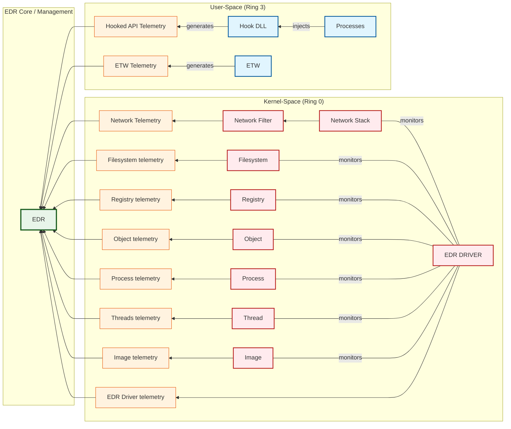
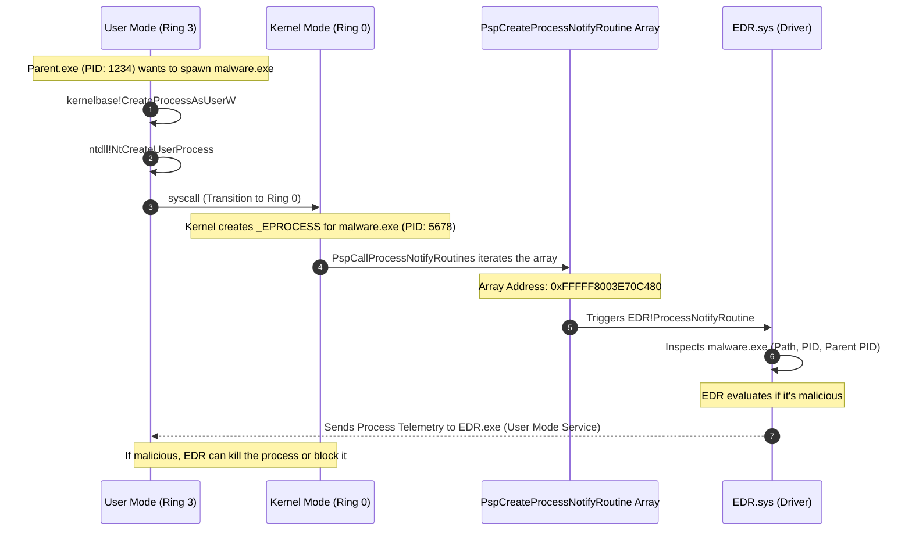
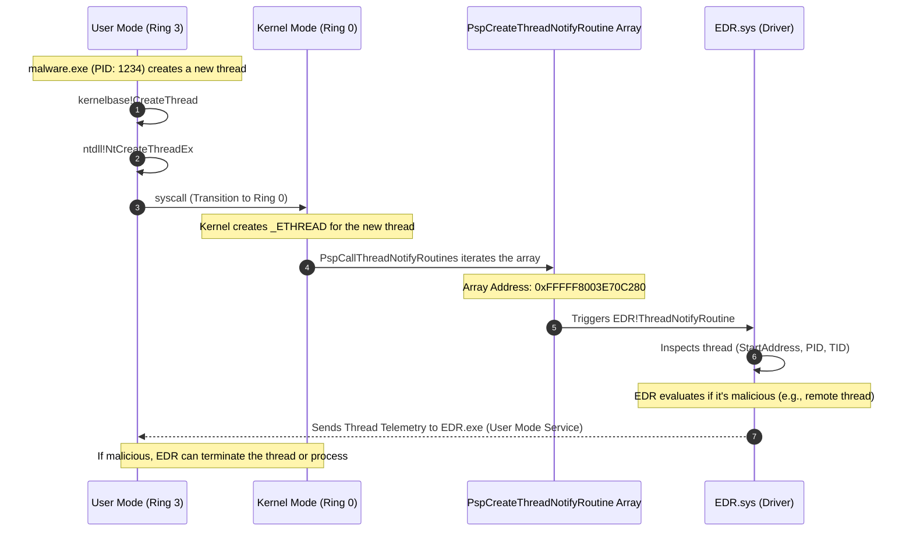

> [!abstract] EDR Architecture & Kernel Callbacks Deep Dive
> Endpoint Detection and Response (EDR) solutions rely on a deep, multi-layered architecture to monitor almost every action occurring on a system. To bypass OS limitations and avoid blind spots, EDRs deploy components in both **User-Space (Ring 3)** and **Kernel-Space (Ring 0)**. The core philosophy is to intercept system calls, generate **Telemetry** (log data), and send it to a central engine for real-time analysis. All roads lead to the EDR Core, the brain that decides if an action is malicious.
> **MITRE ATT&CK Mapping:** [T1055 - Process Injection](https://attack.mitre.org/techniques/T1055/) (Detection perspective) | [T1106 - Native API](https://attack.mitre.org/techniques/T1106/) | [T1562 - Impair Defenses](https://attack.mitre.org/techniques/T1562/)

![[Pasted image 20260918184127.png]]

## 📊 The Telemetry Pipeline: OS to EDR Engine

> [!info] How Data Moves from the OS to the EDR Engine
> The architecture operates in a linear pipeline: **System Components** (where the action happens) -> **Telemetry Generation** (the log data) -> **EDR Components** (the collector and analyzer).



### 1. User-Space (Ring 3) - The Frontline Brawl

> [!tip] API Hooking & ETW
> This is where standard applications live. EDRs cannot blindly trust user-mode processes, so they aggressively intercept them to watch behavior.
> 
> - **The Injection & Hooking Game:** The EDR targets high-risk `Processes` (like `powershell.exe` or `cmd.exe`) and injects a `Hook DLL` directly into their memory. This DLL places hooks (interceptions) on critical Windows APIs. When malware calls an API like `VirtualAlloc`, the hook intercepts it and generates **Hooked API Telemetry**.
> - **ETW (Event Tracing for Windows):** EDRs also tap into Microsoft's native ETW framework to catch built-in logging (like PowerShell ScriptBlock logging). This generates **ETW Telemetry**.
> - *Limitation:* User-Space hooks can be bypassed by attackers unhooking the DLL or using direct syscalls.

### 2. Kernel-Space (Ring 0) - The Unescapable Overlord

> [!danger] Kernel Callbacks & Mini-Filters
> If an attacker bypasses User-Space hooks, they hit the Kernel-Space. The **EDR DRIVER** (a signed `.sys` file) is the absolute king here. It uses official Microsoft Kernel Callbacks to monitor everything at the deepest level. You cannot easily bypass this layer from user-mode.
> 
> - **Network Monitoring:** The EDR Driver monitors the `Network Stack` and `Network Filter` layers. Every C2 ping or DNS request generates **Network Telemetry**.
> - **System Internals:** It watches the `Filesystem`, `Registry`, and kernel `Objects` (like handle duplication for token stealing). These generate **Filesystem telemetry**, **Registry telemetry**, and **Object telemetry**.
> - **Execution & Injection:** It tracks the creation of new `Process`es, the spawning of new `Thread`s, and the loading of executable images/DLLs (`Image`). These generate **Process telemetry**, **Threads telemetry**, and **Image telemetry**.
> - **Self-Protection:** The EDR Driver also watches its own back, generating **EDR Driver telemetry** to alert the core if someone tries to unload or attack the driver itself.

### 3. EDR Core / Management - The Brain

> [!success] Data Correlation & Detection
> The final destination for all this data is the **EDR Core / Management** engine.
> 
> Every single telemetry stream—whether it came from a User-Space Hook DLL, ETW, or the Kernel Driver—flows directly into the EDR core.
> 
> This is where the magic happens. The EDR Core correlates all these separate telemetry pieces to build a story. If it sees "Word spawned PowerShell -> PowerShell made a network connection," it uses the telemetry to flag it as malicious and blocks the attack.

---

## 🕵️‍♂️ Deep Dive 1: Process Creation Kernel Callbacks

> [!abstract] Process Creation Callbacks
> Process Creation Kernel Callback routines are used to notify drivers whenever a process is created or terminated on the system. EDRs heavily rely on this mechanism to collect initial telemetry on malicious process creation (such as capturing the full file image path of the new process) and to be aware of its existence the moment it spawns.

### Syscall to Callback Flow

> [!info] The Execution & Notification Path
> When a parent process attempts to spawn a new process, the request transitions from User Mode to Kernel Mode via a syscall. The kernel creates the process, and then iterates through a specific array to notify all registered drivers that a new process has arrived.



### Registration & Mechanics

> [!tip] Registration & Storage
> **The Trigger:** These callback routines are triggered initially from User Mode by system calls such as `NtCreateUserProcess` or `NtCreateProcessEx`.
> 
> **The Array:** The pointers to these registered callback routines are stored in a kernel array called `nt!PspCreateProcessNotifyRoutine`.
> 
> **Registration APIs:** Drivers can register their callback routines into this array using the following Kernel APIs:
> - `PsSetCreateProcessNotifyRoutine`
> - `PsSetCreateProcessNotifyRoutineEx`
> - `PsSetCreateProcessNotifyRoutineEx2`

### Telemetry Collected

> [!bug]+ Deep Dive: Process Creation Telemetry Data
> When the EDR Driver receives a notification that a process was created (via `PsSetCreateProcessNotifyRoutineEx`), it doesn't just log the name. It extracts a highly detailed structure called `PPS_CREATE_NOTIFY_INFO`.
> 
> **The Telemetries Collected by the Process Creation Kernel Callbacks are:**
> - The `_EPROCESS` structure address of the created process.
> - The PID (Process ID) of the created process.
> - The `PPS_CREATE_NOTIFY_INFO` structure pointer, which contains the goldmine of data:
>   - `ParentProcessId` (Who spawned it?)
>   - `ImageFileName` (What is the full path of the `.exe`?)
>   - `CommandLine` (What arguments were passed?)
>   - `CreatingThreadId` (Which thread executed the creation?)
> 
> **Example EDR Telemetry Log Output:**
> ```text
> [ProcInfo] Process Created: PID: 7856, Parent PID: 4968, Image File Name: \??\C:\Windows\System32\WindowsPowerShell\v1.0\powershell.exe
> [ProcInfo] Command Line: powershell /c whoami
> [ProcInfo] Creating Thread ID: 6500
> [ProcInfo] Creating Process ID: 4968
> [ProcInfo] Executable File Object: FFFFE78A2B6BBE20
> 
> [ProcInfo] Process Created: PID: 9100, Parent PID: 7856, Image File Name: \??\C:\Windows\system32\whoami.exe
> [ProcInfo] Command Line: "C:\Windows\system32\whoami.exe"
> [ProcInfo] Creating Thread ID: 9224
> [ProcInfo] Creating Process ID: 7856
> [ProcInfo] Executable File Object: FFFFE78A2B6C6580
> 
> [ProcInfo] Process Terminated: PID: 9100
> [ProcInfo] Process Terminated: PID: 7856
> ```
> *Notice how the EDR tracks the exact parent-child relationship (`Parent PID: 4968` -> `PID: 7856` -> `PID: 9100`) and the exact command line arguments. This is how EDRs build their behavioral attack stories.*

### Enumerating the Callback Array

> [!example]+ DCMB Output: Inspecting Registered Callbacks
> By dumping the `nt!PspCreateProcessNotifyRoutine` array (using tools like DCMB - Driver Callback Memory Block dumper), we can see exactly which drivers are monitoring process creation on this specific machine. 
> 
> ```text
> [DCMB] Process creation callback array address : 0xFFFFF8003E70C480
> [DCMB] Process Creation : cng.sys+0x5500 = 0xFFFFF80040D15500
> [DCMB] Process Creation : WdFilter.sys+0x79b70 = 0xFFFFF80041789B70  <-- Microsoft Defender
> [DCMB] Process Creation : ksecdd.sys+0x1c750 = 0xFFFFF80040B3C750
> [DCMB] Process Creation : tcpip.sys+0x55eb0 = 0xFFFFF80041D35EB0
> [DCMB] Process Creation : iorate.sys+0xd980 = 0xFFFFF800422FD980
> [DCMB] Process Creation : CI.dll+0x89500 = 0xFFFFF80040C99500
> [DCMB] Process Creation : dxgkrnl.sys+0x12b90 = 0xFFFFF80042912B90
> [DCMB] Process Creation : mssecflt.sys+0x438f0 = 0xFFFFF800417F38F0
> [DCMB] Process Creation : peauth.sys+0x3cd00 = 0xFFFFF8005C46CD00
> [DCMB] Process Creation : wtd.sys+0x1550 = 0xFFFFF8005C531550
> ```
> *Notice `WdFilter.sys` (Windows Defender) is in the list. An EDR driver (e.g., `MsMpEng.sys` or similar) would also appear here, watching every process birth.*

### OPSEC & Bypassing Process Callbacks

> [!danger] Bypassing Process Creation Callbacks
> Because these callbacks sit deep in Ring 0 (Kernel Mode), they are extremely difficult to bypass from User Mode.
> - **Direct Syscalls:** Attackers often use Direct Syscalls (skipping `ntdll.dll`) to avoid User-Space hooks. However, the syscall still hits the kernel, and `PspCallProcessNotifyRoutine` still fires, alerting the EDR driver. Direct syscalls do **not** bypass kernel callbacks.
> - **Removing the Callback (DKOM):** Advanced rootkits and red teams perform DKOM (Direct Kernel Object Manipulation) to directly overwrite the EDR's function pointer inside the `nt!PspCreateProcessNotifyRoutine` array with `0x00`. This blinds the EDR, though PatchGuard heavily monitors this array.
> - **Callback Data Spoofing:** Instead of removing the callback, some exploits hook the callback routine itself to feed fake telemetry data (e.g., changing the image path from `malware.exe` to `notepad.exe`) back to the EDR.

---

## 🕵️‍♂️ Deep Dive 2: Thread Creation Kernel Callbacks

> [!abstract] Thread Creation Callbacks
> Thread Creation Kernel Callback routines are used by the Windows kernel to notify drivers whenever a thread is created or terminated on the system. EDRs heavily rely on this mechanism to collect initial telemetry on malicious thread creation (such as detecting `CreateRemoteThread` injection) and to monitor suspicious execution patterns.

### Syscall to Callback Flow

> [!info] The Execution & Notification Path
> When a process attempts to spawn a new thread (often in the context of another process for injection), the request transitions from User Mode to Kernel Mode via a syscall. The kernel creates the thread (`_ETHREAD`), and then iterates through a specific array to notify all registered drivers that a new thread has arrived.



### Registration & Mechanics

> [!tip] Registration & Storage
> **The Trigger:** These callback routines are triggered initially from User Mode by system calls such as `NtCreateThreadEx` or `NtTerminateThread`.
> 
> **The Array:** The pointers to these registered callback routines are stored in a kernel array called `nt!PspCreateThreadNotifyRoutine`.
> 
> **Registration APIs:** Drivers can register their callback routines into this array using the following Kernel APIs:
> - `PsSetCreateThreadNotifyRoutine`
> - `PsSetCreateThreadNotifyRoutineEx`

### Enumerating the Callback Array

> [!example]+ DCMB Output: Inspecting Registered Callbacks
> By dumping the `nt!PspCreateThreadNotifyRoutine` array (using tools like DCMB), we can see exactly which drivers are monitoring thread creation on this specific machine. 
> 
> ```text
> [DCMB] Thread creation callback array address : 0xFFFFF8003E70C280
> [DCMB] Thread Creation : WdFilter.sys+0x37a50 = 0xFFFFF80041747A50  <-- Microsoft Defender
> [DCMB] Thread Creation : WdFilter.sys+0x79f20 = 0xFFFFF80041789F20  <-- Microsoft Defender
> [DCMB] Thread Creation : mssecflt.sys+0x3fa30 = 0xFFFFF800417EFA30 <-- Microsoft Security Filter
> [DCMB] Thread Creation : mmcss.sys+0x1040 = 0xFFFFF8005C3E1040
> ```
> *Notice `WdFilter.sys` (Windows Defender) appears twice. An EDR driver (e.g., `CrowdStrike.sys` or `Sentinel.sys`) would also appear here, watching every thread birth.*

### OPSEC & Bypassing Thread Callbacks

> [!danger] Bypassing Thread Creation Callbacks
> - **Classic Injection is Dead:** The classic `CreateRemoteThread` API is instantly flagged by these callbacks. The EDR checks the `StartAddress` of the new thread. If it points to an unbacked memory region (like `VirtualAllocEx`) or `LoadLibraryA`, the EDR immediately knows it's an injection and kills the process.
> - **Thread Hijacking:** To bypass thread creation callbacks, attackers use **Thread Hijacking**. Instead of creating a *new* thread (which triggers the callback), they suspend an existing, legitimate thread, swap its instruction pointer (RIP/EIP) to their shellcode, and resume it. Because no *new* thread is created, `PspCallThreadNotifyRoutine` never fires.
> - **Removing the Callback (DKOM):** Advanced rootkits perform DKOM (Direct Kernel Object Manipulation) to directly overwrite the EDR's function pointer inside the `nt!PspCreateThreadNotifyRoutine` array with `0x00`. This blinds the EDR to thread creation, though PatchGuard heavily monitors this array.

