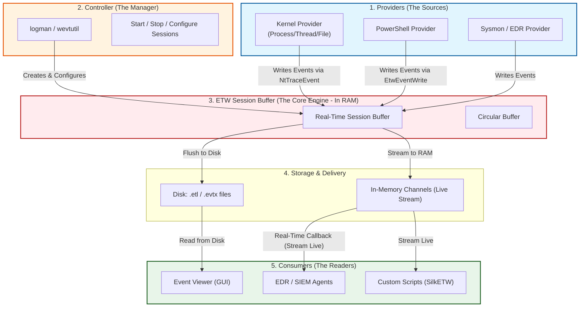
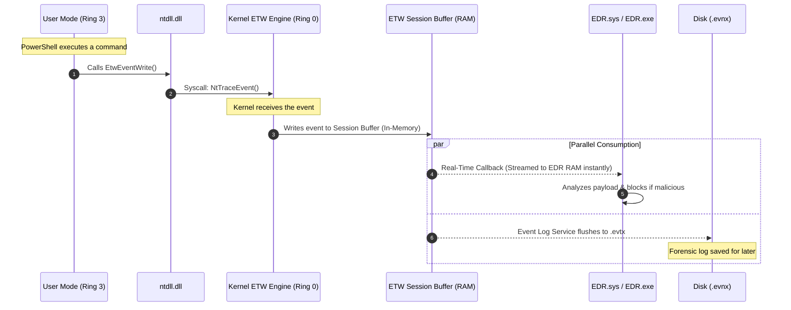

> [!abstract] ETW Architecture: The Nervous System of Windows
> Event Tracing for Windows (ETW) is the core tracing mechanism built into the Windows OS. It allows kernel-mode and user-mode components to log events with minimal performance overhead. EDRs, Sysmon, and Event Viewer all rely on ETW to detect malicious behavior in real-time. Understanding its architecture—specifically how data flows from RAM to Disk, the role of controllers like `logman` and `wevtutil`, and how EDRs use Kernel Callbacks—is critical for both defenders and Red Teams.
> **MITRE ATT&CK Mapping:** [T1562 - Impair Defenses](https://attack.mitre.org/techniques/T1562/) (ETW Bypass perspective)

![[Pasted image 20261002154836.png]]

> [!info] The 3 Pillars of ETW
> ETW is built on a decoupled architecture consisting of Providers, Controllers, and Consumers. This separation allows high-speed tracing without blocking the system. 



### Where are ETW Logs Stored?
When a Provider generates an event, it doesn't write directly to a file. It triggers a syscall that writes to an **ETW Session Buffer** in Kernel Memory (RAM). From here, the data takes one of two paths:
1. **The In-Memory Path (Real-Time Channels):** Events are streamed directly into RAM buffers. EDRs and SIEM agents act as real-time consumers, attaching to the session buffer and reading events via callbacks in milliseconds, *before they ever touch the disk*. This is the fastest method and how modern EDRs catch malware.
2. **The Disk Path (Forensic/Event Viewer):** The Windows Event Log service (`wevsvc`) acts as a consumer. It reads from the real-time session buffer and writes the events to `.evtx` files on disk. Alternatively, controllers can write raw traces to `.etl` files for forensic analysis.

### The Exact Execution Flow (RAM vs Disk)

> [!info] The Sequence of an ETW Event
> The diagram below illustrates exactly what happens when a user-mode application (like PowerShell) generates an ETW event. Notice how the Kernel intercepts the event, buffers it in RAM, and then allows parallel consumption by both the EDR (in-memory) and the Disk (forensic).



---

## Managing ETW with `logman` (The Trace Controller)

`logman` is a built-in Windows command-line tool that acts as an ETW Controller for **Tracing Sessions**. It is used by defenders to debug telemetry and by attackers to enumerate what EDRs are watching in real-time.

### 1. Enumerating Providers
To see every possible ETW provider on the system (including the EDR's hidden providers), run:

> [!example]+ View All ETW Providers
> ```cmd
> logman query providers
> ```
> **Output Snippet:**
> ```text
> Name:
> ---------------------------------------------------------------------
> .NET Common Language Runtime
> Microsoft-Windows-Kernel-Process    <-- (Kernel Process/Thread telemetry)
> Microsoft-Windows-PowerShell        <-- (ScriptBlock logging)
> Microsoft-Windows-Sysmon            <-- (Sysmon EDR telemetry)
> Microsoft-Antimalware-AMFilter      <-- (Defender telemetry)
> ```

### 2. Starting a Trace (Generating Logs)
We can use `logman` to start a trace, capturing kernel process events and writing them to an `.etl` file on disk.

> [!danger]+ Start a Real-Time Trace to Disk
> ```cmd
> :: -p: Provider name | -o: Output file | -ets: Start immediately
> logman start "RedTeam_Trace" -p Microsoft-Windows-Kernel-Process -o C:\temp\kernel_trace.etl -ets
> 
> :: Stop the trace and flush the buffer to disk
> logman stop "RedTeam_Trace" -ets
> ```

## Managing Event Logs with `wevtutil` (The Log Controller)

While `logman` is used to start/stop raw ETW tracing sessions (`.etl` files), **`wevtutil`** (Windows Events Command Line Utility) is used to manage the Windows Event Log (`.evtx` files). It acts as a controller and consumer for the structured logs saved on disk.

### What does `wevtutil` do?
1. **Enumerate Publishers/Providers:** It can list all registered ETW providers and their metadata (manifests).
2. **Query Events:** It can run XPath queries against `.evtx` files to find specific logs (e.g., all failed logons).
3. **Export/Archive:** It can export logs to `.evtx` or `.xml` formats for SIEM ingestion.
4. **Clear Logs (Red Team OPSEC):** Attackers use it to wipe forensic traces from disk.

> [!tip]+ `wevtutil` Commands for Defenders & Red Teams
> 
> **1. Enumerate ETW Publishers (Similar to logman):**
> ```cmd
> wevtutil ep
> ```
> 
> **2. Query Specific Logs (Finding Mimikatz via Event ID 4625):**
> ```cmd
> wevtutil qe Security /q:"*[System[(EventID=4625)]]" /f:text
> ```
> 
> **3. Clear Event Logs (Red Team OPSEC - T1070.002):**
> Attackers clear the Security and System logs to destroy forensic evidence after an intrusion.
> ```cmd
> wevtutil cl Security
> wevtutil cl System
> wevtutil cl Application
> ```

## 🛡️ The Evolution of EDR Bypass: User-Mode vs. Kernel-Mode

> [!danger] Why Patching `EtwEventWrite` is No Longer Enough
> In the past, EDRs used to hook `ntdll.dll` and read ETW events from User-Mode. Red Teams simply patched the `EtwEventWrite` function (overwriting it with a `RET` instruction) to blind the EDR.
> 
> **Modern EDRs defeated this by moving to Kernel-Mode ETW Callbacks.**
> 
> ### How Modern EDRs Use ETW Callbacks
> Instead of waiting for an event to hit `ntdll.dll`, the EDR Driver (`.sys`) registers a callback with the Windows Kernel using APIs like `EtwNotificationRegister` or by creating a dedicated Kernel ETW Session.
> 
> 1. When an application calls `EtwEventWrite`, it triggers a syscall (`NtTraceEvent`), transitioning to Ring 0.
> 2. The Kernel ETW Engine receives the event.
> 3. **Before** the event is even placed in the session buffer, the Kernel invokes the EDR's registered callback function, passing a pointer to the raw event data (e.g., the PowerShell ScriptBlock text).
> 4. The EDR inspects the payload in Kernel Memory. If it detects malware, it can block the process *before* the event is ever written to RAM or Disk.
> 
> *Because this happens entirely in Kernel-Mode (Ring 0), User-Mode applications (like your malware) cannot patch or bypass it by modifying `ntdll.dll`.*

> [!warning] Red Team OPSEC: How to Blind Kernel ETW Callbacks
> If you can't patch `ntdll.dll`, how do modern Red Teams bypass Kernel ETW?
> - **Kernel Driver (BYOVD):** The only way to stop a Kernel ETW callback is from inside the Kernel itself. Attackers load a vulnerable signed driver (Bring Your Own Vulnerable Driver) and use DKOM (Direct Kernel Object Manipulation) to unlink the EDR's callback from the kernel's internal ETW callback list (`EtwpNotificationList`).
> - **Patching the EDR Driver's Callback Function:** Instead of unlinking, attackers overwrite the first bytes of the EDR's callback function pointer with `0x48, 0x31, 0xC0, 0xC3` (`XOR RAX, RAX; RET`), forcing the callback to immediately return without logging anything.
> - **Direct Syscalls:** While Direct Syscalls don't bypass Kernel ETW, they bypass User-Mode ETW and API Hooks, reducing the overall telemetry footprint and forcing the EDR to rely solely on Kernel callbacks (which are harder to tune for false positives).

