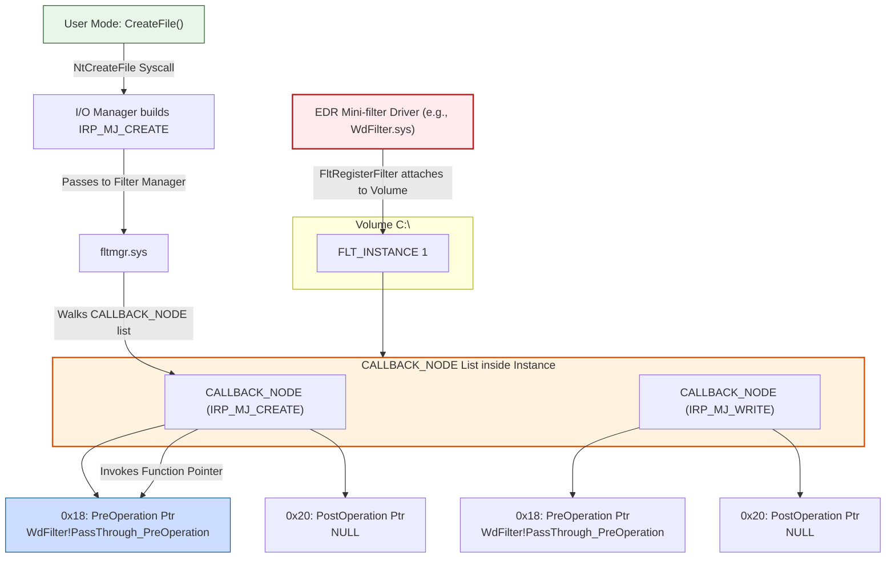
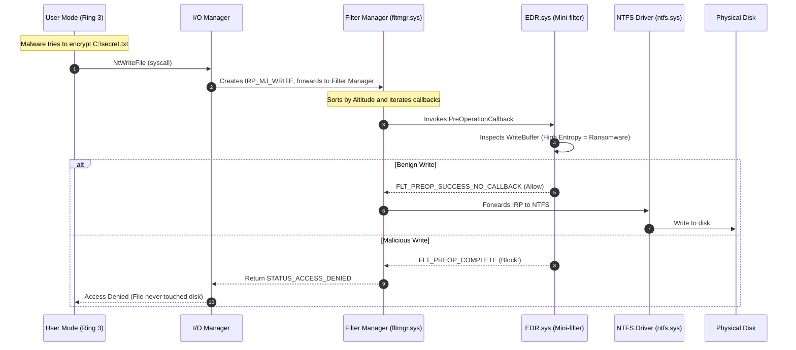

> [!abstract] Deep Dive: File System Operation Kernel Callbacks (Mini-filters)
> In Windows, file operations (Create, Read, Write, Delete) don't go straight to the hard drive. They pass through the I/O Manager and a special kernel component called the **Filter Manager** (`fltmgr.sys`**)**. EDRs and Antiviruses register as "Mini-filters" using `FltRegisterFilter`. This allows them to intercept any I/O Request Packet (IRP) targeting the file system *before* it is executed. This is how EDRs detect ransomware encrypting files, malware dropping payloads into the `Temp` folder, and rootkits modifying system binaries.
> **MITRE ATT&CK Mapping:** [T1486 - Data Encrypted for Impact (Ransomware)](https://attack.mitre.org/techniques/T1486/) | [T1006 - Direct Volume Access](https://attack.mitre.org/techniques/T1006/) | [T1562 - Impair Defenses](https://attack.mitre.org/techniques/T1562/)

## The Filter Manager Architecture

> [!info] How `FltRegisterFilter` Stores Callbacks & How `CreateFile` Invokes Them
> Unlike process callbacks which use a flat global array, File System callbacks use a hierarchical tree structure managed by `fltmgr.sys`. 
> 
> **1. Registration (Driver Load Time):**
> When an EDR driver loads, it calls `FltRegisterFilter`, passing a `FLT_REGISTRATION` structure. This structure contains an array of `FLT_OPERATION_REGISTRATION`, which maps IRP Major Functions (like `IRP_MJ_CREATE` or `IRP_MJ_WRITE`) to the EDR's custom `PreOperationCallback` and `PostOperationCallback` functions.
> 
> **2. Storage (The Callback Tree):**
> The Filter Manager attaches the EDR to a specific Volume (like `C:\`), creating an `FLT_INSTANCE`. Inside this Instance, `fltmgr.sys` creates a `CALLBACK_NODE` for each requested IRP Major Function. These nodes are linked together in a doubly-linked list (`CallbackLinks`), sorted by the EDR's "Altitude".
> 
> **3. Invocation (The `CreateFile` Path):**
> When a user-mode app calls `CreateFile`, it triggers the `NtCreateFile` syscall. The I/O Manager builds an IRP (`IRP_MJ_CREATE`) and sends it down the stack. `fltmgr.sys` intercepts the IRP, walks the `CALLBACK_NODE` list for that specific IRP Major Function (in Altitude order), and invokes the `PreOperation` function pointer stored in each node.



### How Mini-filters Intercept I/O

> [!tip] The I/O Request Packet (IRP) Flow
> When an application requests a file operation, the I/O Manager creates an IRP and passes it down the device stack. The Filter Manager intercepts this IRP, iterates through its registered Mini-filters (based on their "Altitude"), and invokes their Pre-Operation callbacks. If a Mini-filter blocks the IRP, the file operation never reaches the NTFS file system driver.



### WinDbg Deep Dive: The `CALLBACK_NODE` Structure

> [!bug]+ Inspecting the Callback Tree in Memory
> By dumping the internal structures of `fltmgr.sys` in WinDbg, we can see the exact layout of the `CALLBACK_NODE`. This is what the Filter Manager iterates through when a file operation occurs.
> 
> ```text
> lkd> dt fltmgr!_CALLBACK_NODE
>    +0x000 CallbackLinks    : _LIST_ENTRY   // Links to the next/prev callback node
>    +0x010 Instance         : Ptr64 _FLT_INSTANCE // The parent Instance
>    +0x018 PreOperation     : Ptr64     // Pointer to EDR's PreOp callback (Offset 0x18)
>    +0x020 PostOperation    : Ptr64     // Pointer to EDR's PostOp callback (Offset 0x20)
>    ...
> ```
> 
> If we inspect the memory at these offsets, we see exactly which functions the EDR has registered. When `fltmgr.sys` walks the list, it reads the `0x018` offset and executes that function pointer.

---

## 🛠️ Managing Mini-filters with `fltmc` (Line-by-Line Breakdown)

`fltmc` (Filter Manager Control) is the built-in Windows command-line tool to interact with the Filter Manager. It allows defenders and attackers to enumerate, attach, and detach Mini-filters.

> [!example]+ Output of `fltmc filters` & Column Explanations
> 
> ```text
> Filter Name                     Num Instances    Altitude    Frame
> ------------------------------  -------------  ------------  -----
> bindflt                                 1       409800         0
> FsDepends                               5       407000         0
> UCPD                                    5       385250.5       0
> WdFilter                                5       328010         0
> storqosflt                              1       244000         0
> wcifs                                   2       189900         0
> CldFlt                                  2       180451         0
> bfs                                     7       150000         0
> FileCrypt                               0       141100         0
> luafv                                   1       135000         0
> UnionFS                                 0       130850         0
> npsvctrig                               1        46000         0
> Wof                                     3        40700         0
> FileInfo                                5        40500         0
> ```
> 
> **Column Breakdown:**
> - **Filter Name:** The name of the Mini-filter driver (`.sys` file).
> - **Num Instances:** How many volumes this filter is currently attached to. (e.g., `WdFilter` has `5` instances, meaning it's attached to `C:\`, `D:\`, and other mounted volumes).
> - **Altitude:** The Microsoft-assigned priority number. This dictates the exact order `fltmgr.sys` invokes the callbacks. Higher numbers execute first. (EDRs sit high, around `328000`).
> - **Frame:** The Filter Manager group ID. `0` is the default frame for the OS.
> 
> **What are these specific filters?**
> - `WdFilter` (Altitude 328010): **Windows Defender**. This is the EDR/AV mini-filter catching ransomware and payloads.
> - `UCPD` (Altitude 385250.5): **User Choice Protection Driver**. Prevents tampering with default browser/app associations.
> - `luafv` (Altitude 135000): **Limited User Access File Virtualization**. Handles UAC file virtualization (redirecting writes from `C:\Program Files` to `AppData` for standard users).
> - `FileInfo` (Altitude 40500): **File Information Filter**. Caches file metadata to speed up system performance.

### Red Team OPSEC: Detaching a Mini-filter

If an attacker gains SYSTEM/Admin privileges, they can attempt to detach the EDR's Mini-filter instance from the volume, blinding it to file operations.

> [!danger]+ Detaching an EDR Mini-filter (T1562)
> ```cmd
> :: Detach the WdFilter (Defender) instance from the C: volume
> fltmc detach WdFilter C:
> ```
> *Note: Modern EDRs protect their instances via kernel callbacks (`ObRegisterCallbacks`) and ELAM (Early Launch Anti-Malware) protections, making this command fail or trigger a BSOD. However, legacy or poorly configured AVs can be blinded this way.*

---

## 💻 Writing a Mini-filter in C (Kernel-Mode)

To intercept file operations, you must write a Kernel Driver (`.sys`) that registers a `PreOperationCallback` for specific IRP Major Functions (like `IRP_MJ_WRITE` or `IRP_MJ_CREATE`).

> [!bug]+ C Code: Blocking Writes to `secret.txt`
> This code snippet registers a Mini-filter that intercepts file writes. If the target file is named `secret.txt`, it blocks the operation before it reaches NTFS.
> 
> ```c
> #include <fltKernel.h>
> #include <dontuse.h>
> 
> #pragma prefast(disable:__WARNING_ENCODE_MEMBER_FUNCTION_POINTER, "Not valid for kernel mode drivers")
> 
> PFLT_FILTER gFilterHandle = NULL;
> 
> // Pre-Operation Callback: Fires BEFORE a file operation happens
> FLT_PREOP_CALLBACK_STATUS PreOperationCallback(
>     _Inout_ PFLT_CALLBACK_DATA Data,
>     _In_ PCFLT_RELATED_OBJECT FltObjects,
>     _Flt_CompletionContext_Outptr_ PVOID *CompletionContext
> ) {
>     PFLT_FILE_NAME_INFO nameInfo = NULL;
>     NTSTATUS status;
> 
>     // We only care about Write Operations (IRP_MJ_WRITE)
>     if (Data->Iopb->MajorFunction != IRP_MJ_WRITE) {
>         return FLT_PREOP_SUCCESS_NO_CALLBACK;
>     }
> 
>     // Get the file name
>     status = FltGetFileNameInformation(Data, FLT_FILE_NAME_NORMALIZED | FLT_FILE_NAME_QUERY_DEFAULT, &nameInfo);
>     if (NT_SUCCESS(status)) {
>         // Check if the file name contains "secret.txt"
>         if (wcsstr(nameInfo->Name.Buffer, L"secret.txt") != NULL) {
>             DbgPrint("[!] EDR Mini-filter: Blocking write to secret.txt!\n");
>             
>             // Block the operation!
>             Data->IoStatus.Status = STATUS_ACCESS_DENIED;
>             Data->IoStatus.Information = 0;
>             
>             FltReleaseFileNameInformation(nameInfo);
>             return FLT_PREOP_COMPLETE; // Tells Filter Manager to stop the IRP
>         }
>         FltReleaseFileNameInformation(nameInfo);
>     }
> 
>     return FLT_PREOP_SUCCESS_NO_CALLBACK; // Allow the operation
> }
> 
> // Array of Callbacks: Map IRP Major Functions to our callbacks
> const FLT_OPERATION_REGISTRATION Callbacks[] = {
>     { IRP_MJ_WRITE, 0, PreOperationCallback, NULL },
>     { IRP_MJ_OPERATION_END }
> };
> 
> const FLT_REGISTRATION FilterRegistration = {
>     sizeof(FLT_REGISTRATION),
>     FLT_REGISTRATION_VERSION,
>     0,
>     NULL,
>     Callbacks,
>     NULL, NULL, NULL, NULL, NULL, NULL, NULL, NULL
> };
> 
> // Driver Entry Point
> NTSTATUS DriverEntry(_In_ PDRIVER_OBJECT DriverObject, _In_ PUNICODE_STRING RegistryPath) {
>     NTSTATUS status;
>     UNREFERENCED_PARAMETER(RegistryPath);
> 
>     // 1. Register the Mini-filter with the Filter Manager
>     status = FltRegisterFilter(DriverObject, &FilterRegistration, &gFilterHandle);
>     if (!NT_SUCCESS(status)) {
>         return status;
>     }
> 
>     // 2. Start filtering (Attach to volumes)
>     status = FltStartFiltering(gFilterHandle);
>     if (!NT_SUCCESS(status)) {
>         FltUnregisterFilter(gFilterHandle);
>     }
> 
>     return status;
> }
> ```
> *When this driver is loaded, it registers with `fltmgr.sys`. Any time any application tries to write to `secret.txt`, `fltmgr.sys` pauses the IRP, calls `PreOperationCallback`, and the driver returns `FLT_PREOP_COMPLETE` with `STATUS_ACCESS_DENIED`.*

## The Telemetry Goldmine: `FLT_CALLBACK_DATA`

> [!tip]+ How EDRs Catch Ransomware and Payload Droppers
> When the `PreOperation` callback (e.g., `WdFilter!PreOperation`) fires, the EDR receives a pointer to the `FLT_CALLBACK_DATA` structure. This is the goldmine of data, containing the full context of the I/O operation.
> 
> **How the EDR Thinks (The Inspector Logic):**
> 1. **What is being written?** The EDR inspects the `Iopb->Parameters.Write.WriteBuffer`. If it sees patterns characteristic of ransomware (e.g., rapid, massive `IRP_MJ_WRITE` calls across thousands of files, or high-entropy data), it triggers a ransomware alert.
> 2. **Where is it being written?** The EDR checks the `FileObject`. If a process writes to `C:\Windows\System32\` (which should be protected), the EDR blocks it. If it writes to `C:\Temp\`, it might allow it but log the telemetry.
> 3. **What is the file extension?** If the EDR sees a process renaming 10,000 `.docx` files to `.locked`, it will instantly block the I/O and kill the process.
> 
> *If the EDR detects a malicious write, it returns `FLT_PREOP_COMPLETE` with an `STATUS_ACCESS_DENIED` status block. The Filter Manager halts the IRP, and the file is never written to disk.*
## OPSEC & Bypassing File System Callbacks

> [!danger] Bypassing File System Operation Callbacks
> Because Mini-filters sit in the standard I/O path, bypassing them requires either going under them (direct disk access) or attacking the callback tree itself.
> 
> - **Direct Disk Access (T1006 - Bypassing FltMgr):** The Filter Manager only intercepts I/O requests that go through the Windows I/O Manager. Advanced ransomware or wipers (like `NotPetya`) bypass Mini-filters by obtaining a raw handle to the volume (e.g., `\\.\C:`) using `CreateFileW` and writing directly to the disk using `DeviceIoControl` or `NtDeviceIoControlFile`. This writes directly to the NTFS file system driver (`ntfs.sys`), completely bypassing `fltmgr.sys` and the EDR's `CALLBACK_NODE` list.
> - **Callback Data Spoofing:** Advanced rootkits can hook the EDR's `PreOperation` callback function pointer directly in memory. When the EDR inspects the `WriteBuffer`, the rootkit temporarily replaces the malicious buffer with benign data (like zeros), lets the EDR approve it (`FLT_PREOP_SUCCESS_NO_CALLBACK`), and then swaps the buffer back to the malicious payload before `ntfs.sys` writes it to disk.
> - **Removing the Callback (DKOM):** Advanced rootkits perform DKOM (Direct Kernel Object Manipulation) to unlink the EDR's `CALLBACK_NODE` from the `CallbackLinks` list inside the `FLT_INSTANCE` structure. This effectively removes the EDR from the I/O stack for specific operations (like Write), blinding it to all future file operations while leaving the rest of the EDR intact. PatchGuard heavily monitors the Filter Manager structures.

