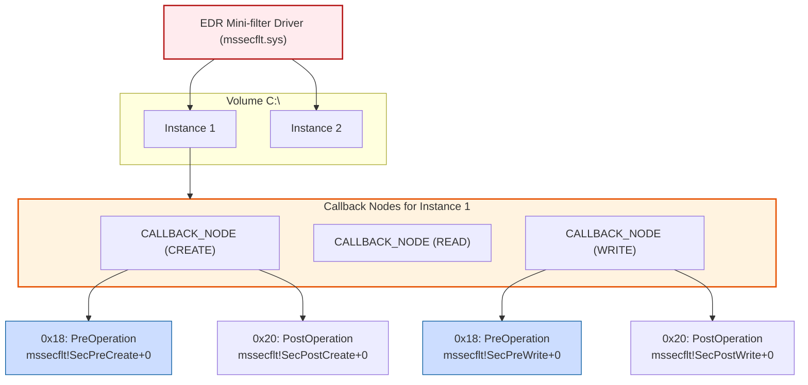

> [!abstract] Deep Dive: File System Operation Kernel Callbacks (Mini-filters)
> In Windows, file operations (Create, Read, Write, Delete) don't go straight to the hard drive. They pass through the I/O Manager and a special kernel component called the **Filter Manager (**`fltmgr.sys`**)**. EDRs register as "Mini-filters" using `FltRegisterFilter`. This allows them to intercept any I/O Request Packet (IRP) targeting the file system *before* it is executed. This is how EDRs detect ransomware encrypting files, malware dropping payloads into the `Temp` folder, and rootkits modifying system binaries.
> **MITRE ATT&CK Mapping:** [T1486 - Data Encrypted for Impact (Ransomware)](https://attack.mitre.org/techniques/T1486/) | [T1105 - Ingress Tool Transfer](https://attack.mitre.org/techniques/T1105/) | [T1027 - Obfuscated Files or Information](https://attack.mitre.org/techniques/T1027/)

### The Mini-filter Callback Tree (Instance & Callback Nodes)

> [!info] Architecture: How Filter Manager Organizes Callbacks
> Unlike process callbacks which use a flat global array, File System callbacks use a hierarchical tree structure.
> 
> When an EDR Mini-filter loads, the Filter Manager attaches it to specific Volumes (like `C:\`). This attachment creates an **Instance**. 
> 
> Inside each Instance, the EDR specifies exactly which file operations it wants to monitor (e.g., `CREATE`, `READ`, `WRITE`). For each operation, the Filter Manager creates a `CALLBACK_NODE`. 
> 
> - **Pre-Operation (**`0x18` **offset):** The callback executed *before* the file operation hits the disk. This is where the EDR decides to Allow or Block.
> - **Post-Operation (**`0x20` **offset):** The callback executed *after* the file operation completes. This is used for logging (e.g., logging that a file was successfully created).



### WinDbg Deep Dive: The `CALLBACK_NODE` Structure

> [!bug]+ Inspecting the Callback Tree in Memory
> By dumping the internal structures of `fltmgr.sys` in WinDbg, we can see the exact layout of the `CALLBACK_NODE`. This structure is what the Filter Manager iterates through when a file operation occurs.
> 
> ```text
> lkd> dt fltmgr!_CALLBACK_NODE
>    +0x000 CallbackLinks    : _LIST_ENTRY   // Links to the next/prev callback node
>    +0x010 Instance         : Ptr64 _FLT_INSTANCE // The parent Instance
>    +0x018 PreOperation     : Ptr64     // Pointer to EDR's PreOp callback (Offset 0x18)
>    +0x020 PostOperation    : Ptr64     // Pointer to EDR's PostOp callback (Offset 0x20)
>    ...
> ```
> 
> **Resolved Pointers (Real-World EDR Example):**
> If we inspect the memory at these offsets, we see exactly which functions the EDR has registered:
> ```text
> lkd> dx -g (*((fltmgr!_LIST_ENTRY *)0xffff978f12345000))
>     [+0x000] CallbackLinks    : [ 0xffff... 0xffff... ]
>     [+0x010] Instance         : 0xffff978f12346000 [Type: _FLT_INSTANCE *]
>     [+0x018] PreOperation     : 0xfffff800417e8f10 [Type: void *]  <-- mssecflt!SecPreCreate+0
>     [+0x020] PostOperation    : 0xfffff800417e9120 [Type: void *]  <-- mssecflt!SecPostCreate+0
> ```
> *Notice the `mssecflt!SecPreCreate` function. This is the exact function that fires when a `CreateFile` syscall is made. If this function returns `FLT_PREOP_COMPLETE`, the file is never created.*

### The Telemetry Goldmine: `FLT_CALLBACK_DATA`

> [!tip]+ How EDRs Catch Ransomware and Payload Droppers
> When the `PreOperation` callback (e.g., `mssecflt!SecPreCreate`) fires, the EDR receives a pointer to the `FLT_CALLBACK_DATA` structure. This is the goldmine of data.
> 
> **How the EDR Thinks (The Inspector Logic):**
> 1. **What is being written?** The EDR inspects the `Iopb->Parameters.Write.WriteBuffer`. If it sees patterns characteristic of ransomware (e.g., rapid, massive `IRP_MJ_WRITE` calls across thousands of files, or high-entropy data), it triggers a ransomware alert.
> 2. **Where is it being written?** The EDR checks the `FileObject`. If a process writes to `C:\Windows\System32\` (which should be protected), the EDR blocks it. If it writes to `C:\Temp\`, it might allow it but log the telemetry.
> 3. **What is the file extension?** If the EDR sees a process renaming 10,000 `.docx` files to `.locked`, it will instantly block the I/O and kill the process.
> 
> *If the EDR detects a malicious write, it returns `FLT_PREOP_COMPLETE` with an `STATUS_ACCESS_DENIED` status block. The Filter Manager halts the IRP, and the file is never written to disk.*

### Enumerating the Mini-filters

> [!example]+ WinDbg & Fltmc Output: Inspecting Mini-filters
> You can see registered Mini-filters from User Mode using the built-in `fltmc` command, or from Kernel Mode using WinDbg.
> 
> **Command Line (**`fltmc`**):**
> ```text
> C:\> fltmc filters
> Filter Name      Num Instances    Altitude    Frame
> ----------------  --------------  ----------  -----
> WdFilter          12              328010      0      <-- Microsoft Defender
> EDRDriver         4               328420      0      <-- EDR Mini-filter
> ```
> *Notice `WdFilter` (Windows Defender) and the hypothetical `EDRDriver` are stacked in the filter chain. Every file I/O on the system must pass through their `CALLBACK_NODE` trees.*

### OPSEC & Bypassing File System Callbacks (Red Team Perspective)

> [!danger] Bypassing File System Operation Callbacks
> Because Mini-filters sit in the I/O path, bypassing them requires either going under them (direct disk access) or attacking the callback tree itself.
> 
> - **Direct Disk Access (Bypassing FltMgr):** The Filter Manager only intercepts I/O requests that go through the Windows I/O Manager. Advanced ransomware or wipers (like `NotPetya`) bypass Mini-filters by obtaining a raw handle to the volume (e.g., `\\.\C:`) using `CreateFileW` and writing directly to the disk using `DeviceIoControl` or `NtDeviceIoControlFile`. This writes directly to the NTFS file system driver (`ntfs.sys`), completely bypassing the Filter Manager and the EDR's callbacks.
> - **Callback Data Spoofing:** Advanced rootkits can hook the EDR's `PreOperation` callback function directly (e.g., hooking `mssecflt!SecPreCreate`). When the EDR inspects the `WriteBuffer`, the rootkit temporarily replaces the malicious buffer with benign data (like zeros), lets the EDR approve it, and then swaps the buffer back to the malicious payload before the I/O Manager writes it to disk.
> - **Removing the Callback (DKOM):** Advanced rootkits perform DKOM (Direct Kernel Object Manipulation) to unlink the EDR's `CALLBACK_NODE` from the `CallbackLinks` list inside the Instance structure. This effectively removes the EDR from the I/O stack for specific operations (like Write), blinding it to all future file operations while leaving the rest of the EDR intact. PatchGuard heavily monitors the Filter Manager structures.