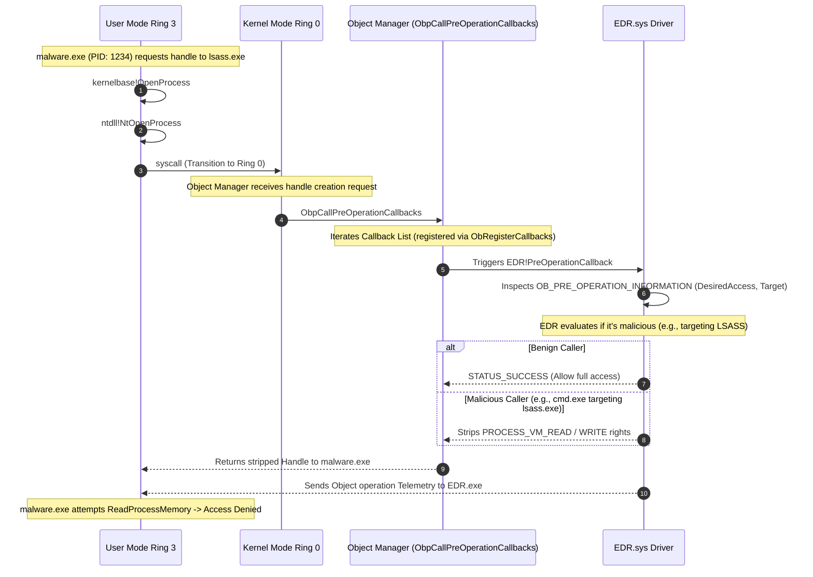

> [!abstract] Deep Dive: Object Operation Kernel Callbacks (`ObRegisterCallbacks`)
> In Windows, everything is an "Object" (Processes, Threads, Files). To interact with a process, you must first obtain a "Handle" to it using `OpenProcess`. EDRs use Object Callbacks to intercept this exact moment. By registering an Object Callback, an EDR can strip dangerous access rights (like `PROCESS_VM_READ` or `PROCESS_VM_WRITE`) from a handle *before* it is handed back to the user-mode application. This is how EDRs protect `lsass.exe` from credential dumping and protect their own `EDR.exe` process from being killed or injected into.
> **MITRE ATT&CK Mapping:** [T1003.001 - OS Credential Dumping: LSASS Memory](https://attack.mitre.org/techniques/T1003/001/) | [T1055 - Process Injection](https://attack.mitre.org/techniques/T1055/)

### Syscall to Callback Flow

> [!info] The Execution & Notification Path
> When a process requests a handle to another process, the request transitions from User Mode to Kernel Mode via a syscall. The Object Manager processes the request, but before creating the handle, it invokes the internal `ObpCallPreOperationCallbacks` function, which iterates through the registered Callback List to notify the EDR.



### Registration & Mechanics

> [!tip] Registration & Storage
> Unlike Process and Thread callbacks which use a global array, Object Callbacks are highly specific. A driver must specify exactly *which* type of object it wants to protect.
> 
> **The Trigger:** These callback routines are triggered initially from User Mode by system calls such as `NtOpenProcess`, `NtOpenThread`, or `NtDuplicateObject` (handle duplication/cloning).
> 
> **Registration API:** Drivers register these callbacks using:
> - `ObRegisterCallbacks` (Modern): Allows the driver to specify a callback for `PsProcessType` (Processes) or `PsThreadType` (Threads). It distinguishes between Pre-Operation (before the handle is created) and Post-Operation (after the handle is created).

### The Telemetry Goldmine: `OB_PRE_OPERATION_INFORMATION`

> [!bug]+ Deep Dive: How EDRs Strip Access Rights (The "Bouncer" Mechanism)
> When the Pre-Operation callback fires, the EDR receives a pointer to an `OB_PRE_OPERATION_INFORMATION` structure. This structure contains the `DesiredAccess` flags requested by the user-mode application.
> 
> **The Structure:**
> ```c
> typedef struct _OB_PRE_OPERATION_INFORMATION {
>     OB_OPERATION Operation;         // Create or Duplicate
>     UNION {
>         ULONG Flags;
>         struct {
>             ULONG KernelHandle : 1;
>             ULONG Reserved : 31;
>         };
>     };
>     PVOID Object;                   // The target _EPROCESS
>     POBJECT_TYPE ObjectType;        // *PsProcessType
>     ACCESS_MASK DesiredAccess;      // What the app wants to do
>     ACCESS_MASK ResultingAccess;    // What the EDR will actually allow
> } OB_PRE_OPERATION_INFORMATION;
> ```
> 
> **How the EDR Thinks (The Bouncer Logic):**
> 1. **Who is asking?** The EDR checks the `CreatorClientId` (which process is requesting the handle).
> 2. **Who is the target?** The EDR checks the `Object` pointer (e.g., is it `lsass.exe` or `EDR.exe`?).
> 3. **What do they want?** The EDR inspects `DesiredAccess`. If `cmd.exe` asks for `PROCESS_VM_READ` (read memory) or `PROCESS_VM_WRITE` (inject code) on `lsass.exe`, it's a massive red flag.
> 4. **The Strike:** The EDR modifies the `ResultingAccess` field. It masks out the dangerous rights: `ResultingAccess = DesiredAccess & ~(PROCESS_VM_READ | PROCESS_VM_WRITE)`.
> 
> *The handle is successfully created and returned to `malware.exe`, but it is a "toothless" handle. When Mimikatz tries to read LSASS memory, it gets `Access Denied`.*

### Enumerating the Callback Array

> [!example]+ WinDbg Output: Inspecting Object Callbacks
> Object callbacks are not stored in a simple global array. They are attached directly to the `OBJECT_TYPE` structure of the specific object (e.g., `Process` or `Thread`).
> 
> ```text
> lkd> dt nt!_OBJECT_TYPE PsProcessType
>    +0x000 Name : ...
>    ...
>    +0x050 CallbackList : _LIST_ENTRY [ 0xfffff800`4178a010 - 0xfffff800`4178a010 ]
> 
> lkd> dx -g -r1 (*((nt!_LIST_ENTRY *)0xfffff8003e7c2050))
>     [+0x000] PreOperation  : 0xfffff80041789b20 [WdFilter.sys+0x79b20]  <-- Defender
>     [+0x008] PostOperation : 0xfffff80041789d40 [WdFilter.sys+0x79d40]
>     [+0x010] PreOperation  : 0xfffff800417e8f10 [mssecflt.sys+0x438f0] <-- EDR Filter
>     [+0x018] PostOperation : 0xfffff800417e9120 [mssecflt.sys+0x45120]
> ```
> *In modern Windows, Object Callbacks are heavily monitored by PatchGuard. Overwriting them is difficult, but they can be enumerated to see exactly which drivers are acting as "bouncers" for process handles.*

### OPSEC & Bypassing Object Callbacks (Red Team Perspective)

> [!danger] Bypassing Object Operation Callbacks
> Because Object Callbacks can neuter any handle requested from User Mode, attackers must find creative ways to obtain high-privilege handles without triggering the Pre-Operation callback, or by using handles that the EDR ignores.
> 
> - **Direct Syscalls are Useless:** Using direct syscalls to call `NtOpenProcess` does not bypass this. The syscall still hits the Object Manager in Ring 0, and the `ObRegisterCallbacks` Pre-Operation callback still fires.
> - **Handle Hijacking (Stealing):** Instead of calling `OpenProcess` (which triggers the callback), attackers use `NtQuerySystemInformation` with `SystemHandleInformation`. This API asks the kernel to dump all open handles in the entire OS. The attacker finds a handle to `lsass.exe` that is already held open by a trusted process (like `csrss.exe` or `svchost.exe`). The attacker then uses `NtDuplicateObject` to clone that handle into their own process. Depending on how the EDR handles duplication, it might slip through.
> - **Parent Process spoofing (PPL):** EDRs often whitelist their own user-mode service (e.g., `EDR.exe`) to have full access to `lsass.exe`. Attackers may try to spawn a child process under the EDR's service, spoofing the parent PID, hoping the EDR's kernel driver whitelists the new child.
> - **Kernel Driver (BYOVD):** The absolute bypass. If an attacker loads their own kernel driver (Bring Your Own Vulnerable Driver), they don't need handles. They can read/write LSASS memory directly using kernel APIs like `MmCopyVirtualMemory`, completely ignoring the Object Manager and its callbacks.
> - **Removing the Callback (DKOM):** Advanced rootkits unlink the EDR's callback entry from the `CallbackList` inside the `_OBJECT_TYPE` structure. This disables the EDR's bouncer entirely, allowing `OpenProcess` to succeed with full rights. PatchGuard heavily monitors this structure.

