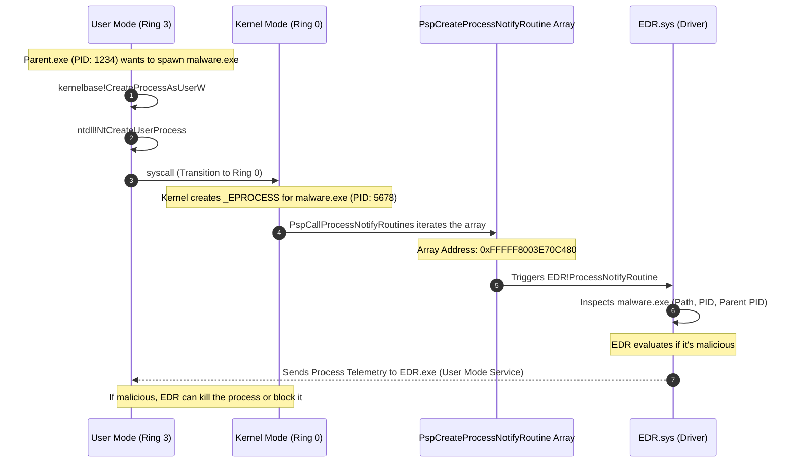

> [!abstract] Deep Dive: Process Creation Kernel Callbacks (`PsSetCreateProcessNotifyRoutineEx`)
> Process Creation Kernel Callback routines are the absolute backbone of modern Endpoint Detection and Response (EDR) solutions. They are used by the Windows kernel to notify drivers whenever a process is created or terminated on the system. EDRs heavily rely on this mechanism to collect initial telemetry on malicious process creation (such as capturing the full file image path of the new process) and to be aware of its existence the moment it spawns—before a single instruction of the new process executes.
> **MITRE ATT&CK Mapping:** [T1106 - Native API](https://attack.mitre.org/techniques/T1106/) (Detection perspective) | [T1562 - Impair Defenses](https://attack.mitre.org/techniques/T1562/) (Bypass perspective)

![[Pasted image 20260918184127.png]]

> [!info] The Execution & Notification Path
> When a parent process attempts to spawn a new process, the request transitions from User Mode to Kernel Mode via a syscall. The kernel creates the process, and then iterates through a specific array to notify all registered drivers that a new process has arrived.



### Registration APIs & Mechanics

> [!tip] The Registration Hierarchy
> **The Trigger:** These callback routines are triggered initially from User Mode by system calls such as `NtCreateUserProcess` or `NtCreateProcessEx`.
> 
> **The Array:** The pointers to these registered callback routines are stored in an undocumented kernel array called `nt!PspCreateProcessNotifyRoutine`.
> 
> **Registration APIs:** Drivers can register their callback routines into this array using three distinct Kernel APIs, each providing a different level of telemetry:
> - `PsSetCreateProcessNotifyRoutine` (Legacy): Provides only PID and Parent PID. No image path or command line.
> - `PsSetCreateProcessNotifyRoutineEx` (Standard EDR): Provides a pointer to the `PS_CREATE_NOTIFY_INFO` structure (the goldmine). *Note: Using this API requires the driver to be signed with a specific Early Launch Anti-Malware (ELAM) certificate or have `/integrity` checks passed.*
> - `PsSetCreateProcessNotifyRoutineEx2` (Modern): Extends `Ex` to add notifications for Windows Subsystem for Linux (WSL) processes.

### The Telemetry Goldmine: `PPS_CREATE_NOTIFY_INFO`

> [!bug]+ Deep Dive: Process Creation Telemetry Data
> When the EDR Driver receives a notification via `PsSetCreateProcessNotifyRoutineEx`, it doesn't just log the name. It extracts a highly detailed structure called `PPS_CREATE_NOTIFY_INFO`.
> 
> **The** `PS_CREATE_NOTIFY_INFO` **Structure:**
> ```c
> typedef struct _PS_CREATE_NOTIFY_INFO {
>     _In_  SIZE_T Size;                  // Size of the structure
>     _In_  HANDLE ParentProcessId;       // PID of the parent process
>     _In_  CLIENT_ID CreatingThreadId;   // PID/TID of the creator
>     _Inout_ struct _FILE_OBJECT *FileObject; // Kernel file object of the .exe
>     _In_  PCUNICODE_STRING ImageFileName;   // Full NT path of the executable
>     _In_  PCUNICODE_STRING CommandLine;      // Exact command line arguments
>     _Inout_ NTSTATUS CreationStatus;          // STATUS_SUCCESS or an error
>     _In_  PVOID UserContext; // Unused in modern Windows
> } PS_CREATE_NOTIFY_INFO, *PPS_CREATE_NOTIFY_INFO;
> ```
> 
> **Critical EDR Use Cases:**
> 1. **Behavioral Genealogy:** `ParentProcessId` allows EDRs to build attack trees (e.g., Word -> PowerShell -> Empire).
> 2. **File Scanning:** `FileObject` allows the EDR to stream the file bytes to its cloud or local engine *before* it executes.
> 3. **Process Blocking:** The EDR can modify the `CreationStatus` field. If the EDR sets `CreationStatus = STATUS_ACCESS_DENIED` during the callback, the kernel will abort the process creation. The process will never run.
> 
> **Example EDR Telemetry Log Output:**
> ```text
> [ProcInfo] Process Created: PID: 7856, Parent PID: 4968, Image File Name: \??\C:\Windows\System32\WindowsPowerShell\v1.0\powershell.exe
> [ProcInfo] Command Line: powershell /c whoami
> [ProcInfo] Creating Thread ID: 6500
> [ProcInfo] Creating Process ID: 4968
> [ProcInfo] Executable File Object: FFFFE78A2B6BBE20
> 
> [ProcInfo] Process Created: PID: 9100, Parent PID: 7856, Image File Name: \??\C:\Windows\system32\whoami.exe
> [ProcInfo] Command Line: "C:\Windows\system32\whoami.exe"
> [ProcInfo] Creating Thread ID: 9224
> [ProcInfo] Creating Process ID: 7856
> [ProcInfo] Executable File Object: FFFFE78A2B6C6580
> 
> [ProcInfo] Process Terminated: PID: 9100
> [ProcInfo] Process Terminated: PID: 7856
> ```
### Enumerating the Callback Array

> [!example]+ DCMB Output: Inspecting Registered Callbacks
> By dumping the `nt!PspCreateProcessNotifyRoutine` array (using tools like DCMB - Driver Callback Memory Block dumper, or WinDbg), we can see exactly which drivers are monitoring process creation on this specific machine. 
> 
> ```text
> [DCMB] Process creation callback array address : 0xFFFFF8003E70C480
> [DCMB] Process Creation : cng.sys+0x5500 = 0xFFFFF80040D15500
> [DCMB] Process Creation : WdFilter.sys+0x79b70 = 0xFFFFF80041789B70  <-- Microsoft Defender
> [DCMB] Process Creation : ksecdd.sys+0x1c750 = 0xFFFFF80040B3C750
> [DCMB] Process Creation : tcpip.sys+0x55eb0 = 0xFFFFF80041D35EB0
> [DCMB] Process Creation : iorate.sys+0xd980 = 0xFFFFF800422FD980
> [DCMB] Process Creation : CI.dll+0x89500 = 0xFFFFF80040C99500
> [DCMB] Process Creation : dxgkrnl.sys+0x12b90 = 0xFFFFF80042912B90
> [DCMB] Process Creation : mssecflt.sys+0x438f0 = 0xFFFFF800417F38F0
> [DCMB] Process Creation : peauth.sys+0x3cd00 = 0xFFFFF8005C46CD00
> [DCMB] Process Creation : wtd.sys+0x1550 = 0xFFFFF8005C531550
> ```
> *Notice `WdFilter.sys` (Windows Defender) is in the list. An EDR driver (e.g., `MsMpEng.sys` or similar) would also appear here, watching every process birth.*

### Advanced OPSEC & Bypassing Process Callbacks

> [!danger] Evasion Techniques (Red Team Perspective)
> Because these callbacks sit deep in Ring 0 (Kernel Mode), they are extremely difficult to bypass from User Mode.
> 
> - **Direct Syscalls:** Attackers often use Direct Syscalls (skipping `ntdll.dll`) to avoid User-Space hooks. However, the syscall still hits the kernel, and `PspCallProcessNotifyRoutine` still fires, alerting the EDR driver. Direct syscalls do **not** bypass kernel callbacks.
> - **Parent PID Spoofing (PPID Spoofing):** EDRs heavily rely on `ParentProcessId` heuristics (e.g., Word should never spawn PowerShell). Attackers use `PROC_THREAD_ATTRIBUTE_PARENT_PROCESS` (`UpdateProcThreadAttribute`) to change the `ParentProcessId` in the `PPS_CREATE_NOTIFY_INFO` structure to a legitimate process (like `explorer.exe`), fooling the EDR's genealogy logic.
> - **Process Herpaderping:** The EDR reads the `FileObject` to scan the binary on disk. In Process Herpaderping, the attacker opens a file, writes the payload, creates the process (triggering the callback), but then *immediately* overwrites the file on disk with a legitimate binary (e.g., `notepad.exe`) before the EDR finishes scanning it. The EDR scans `notepad.exe`, but the kernel executes the original payload.
> - **Removing the Callback (DKOM):** Advanced rootkits and red teams perform DKOM (Direct Kernel Object Manipulation) to directly overwrite the EDR's function pointer inside the `nt!PspCreateProcessNotifyRoutine` array with `0x00`. This blinds the EDR, though PatchGuard heavily monitors this array.
> - **Callback Data Spoofing:** Instead of removing the callback, some exploits hook the callback routine itself to feed fake telemetry data (e.g., changing the image path from `malware.exe` to `notepad.exe`) back to the EDR.
> - **Early Bird Injection:** Attackers create a suspended process (triggering the callback), but before the main thread executes, they queue an APC to run their shellcode. If the EDR's callback logic is asynchronous, the malicious code might execute before the EDR finishes its analysis and attempts to kill the process.
