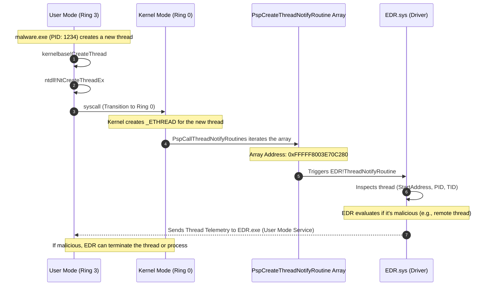

> [!abstract] Deep Dive: Thread Creation Kernel Callbacks (`PsSetCreateThreadNotifyRoutine`)
> A process is just a container; it does nothing without a **Thread**. Threads are the actual execution units that run code. EDRs monitor thread creation because attackers rarely execute malicious code directly in the main process thread. Instead, they inject a new thread into a legitimate process (like `explorer.exe` or `svchost.exe`) to run their payload. The `PsSetCreateThreadNotifyRoutine` callback is the EDR's primary defense against this, firing the exact moment a new thread is born, anywhere on the system.
> **MITRE ATT&CK Mapping:** [T1055 - Process Injection](https://attack.mitre.org/techniques/T1055/) | [T1106 - Native API](https://attack.mitre.org/techniques/T1106/)

### Syscall to Callback Flow

> [!info] The Execution & Notification Path
> When a process attempts to spawn a new thread (often in the context of another process for injection), the request transitions from User Mode to Kernel Mode via a syscall. The kernel creates the thread (`_ETHREAD`), and then iterates through a specific array to notify all registered drivers that a new thread has arrived.



### Registration & Mechanics

> [!tip] Registration & Storage
> **The Trigger:** These callback routines are triggered initially from User Mode by system calls such as `NtCreateThreadEx` or `NtTerminateThread`.
> 
> **The Array:** The pointers to these registered callback routines are stored in an internal, undocumented kernel array called `nt!PspCreateThreadNotifyRoutine`.
> 
> **Registration APIs:** Drivers can register their callback routines into this array using the following Kernel APIs:
> - `PsSetCreateThreadNotifyRoutine` (Legacy): Provides basic telemetry (Process ID, Thread ID, Create/Exit flag).
> - `PsSetCreateThreadNotifyRoutineEx` (Modern): Provides a `PSCREATE_THREAD_NOTIFY_INFO` structure, giving the EDR much deeper context, including the `ThreadContext` and `StartAddress`.

### The Telemetry Goldmine: `StartAddress`

> [!bug]+ Deep Dive: How EDRs Catch Remote Threads
> When a new thread is created, the EDR's callback receives critical information. The most important piece of data is the `StartAddress` (also known as the entry point). This is the memory address where the thread will begin executing code.
> 
> **How the EDR Thinks:**
> 1. **Is it local or remote?** Did `explorer.exe` create a thread inside itself (normal), or did `malware.exe` create a thread inside `explorer.exe` (highly suspicious)?
> 2. **Is the** `StartAddress` **backed by a file?** A legitimate thread's `StartAddress` usually points to the `.text` section of a signed DLL (e.g., `kernel32.dll!BaseThreadInitThunk`).
> 3. **Is it pointing to unbacked memory?** If the `StartAddress` points to a memory region allocated via `VirtualAllocEx` (which is not backed by a file on disk), the EDR immediately flags this as **memory injection** (e.g., shellcode injection).
> 
> *If the EDR detects an unbacked `StartAddress` in a remote process, it will instantly kill the thread or terminate the host process before the shellcode can execute.*

### Enumerating the Callback Array

> [!example]+ DCMB Output: Inspecting Registered Callbacks
> By dumping the `nt!PspCreateThreadNotifyRoutine` array (using tools like DCMB), we can see exactly which drivers are monitoring thread creation on this specific machine. 
> 
> ```text
> [DCMB] Thread creation callback array address : 0xFFFFF8003E70C280
> [DCMB] Thread Creation : WdFilter.sys+0x37a50 = 0xFFFFF80041747A50  <-- Microsoft Defender
> [DCMB] Thread Creation : WdFilter.sys+0x79f20 = 0xFFFFF80041789F20  <-- Microsoft Defender
> [DCMB] Thread Creation : mssecflt.sys+0x3fa30 = 0xFFFFF800417EFA30 <-- Microsoft Security Filter
> [DCMB] Thread Creation : mmcss.sys+0x1040 = 0xFFFFF8005C3E1040
> ```
> *Notice `WdFilter.sys` (Windows Defender) appears twice. An EDR driver (e.g., `CrowdStrike.sys` or `Sentinel.sys`) would also appear here, watching every thread birth.*

### OPSEC & Bypassing Thread Callbacks (Red Team Perspective)

> [!danger] Bypassing Thread Creation Callbacks
> Because these callbacks sit deep in Ring 0, creating a new thread to run shellcode is considered suicide in modern red teaming.
> 
> - **Classic Injection is Dead:** The classic `CreateRemoteThread` API is instantly flagged by these callbacks. The EDR checks the `StartAddress` of the new thread. If it points to an unbacked memory region (like `VirtualAllocEx`) or `LoadLibraryA`, the EDR immediately knows it's an injection and kills the process.
> - **Thread Hijacking (Context Manipulation):** To bypass thread creation callbacks, attackers use **Thread Hijacking**. Instead of creating a *new* thread (which triggers the callback), they find an existing, legitimate thread in the target process, suspend it (`SuspendThread`), modify its CPU registers (`SetThreadContext` to change the Instruction Pointer/EIP/RIP to point to their shellcode), and resume it. Because no *new* thread was created, `PspCallThreadNotifyRoutines` never fires.
> - **APC Injection (Asynchronous Procedure Call):** Attackers can queue an APC to an existing thread using `NtQueueApcThread`. This forces an existing thread to execute the malicious code. No new thread is created, bypassing the callback.
> - **Removing the Callback (DKOM):** Advanced rootkits perform DKOM (Direct Kernel Object Manipulation) to directly overwrite the EDR's function pointer inside the `nt!PspCreateThreadNotifyRoutine` array with `0x00`. This blinds the EDR to thread creation, though PatchGuard heavily monitors this array.

