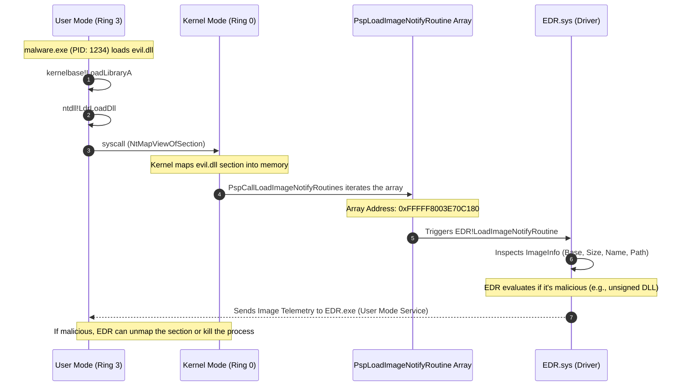

> [!abstract] Deep Dive: Image Load Kernel Callbacks (`PsSetLoadImageNotifyRoutine`)
> An "Image" in Windows is any portable executable (PE) file—this includes `.exe` files, `.dll` files, and kernel drivers (`.sys`). When an image is mapped into memory so it can be executed, the kernel fires the Image Load callback. EDRs heavily rely on this mechanism to detect DLL injection, hijacking, and the loading of unsigned kernel modules. If a process tries to load a DLL from a weird temp folder, or injects a DLL directly from memory (Reflective DLL Injection), this callback is the EDR's first line of defense.
> **MITRE ATT&CK Mapping:** [T1055.001 - Process Injection: Dynamic-link Library Injection](https://attack.mitre.org/techniques/T1055/001/) | [T1574.001 - Hijack Execution Flow: DLL Search Order Hijacking](https://attack.mitre.org/techniques/T1574/001/)

### Syscall to Callback Flow

> [!info] The Execution & Notification Path
> When a process attempts to load a module (like a malicious DLL), the request transitions from User Mode to Kernel Mode via a syscall. The kernel maps the PE file into the process's memory space, and then iterates through a specific array to notify all registered drivers that a new image has arrived.



### Registration & Mechanics

> [!tip] Registration & Storage
> **The Trigger:** These callback routines are triggered initially from User Mode by system calls such as `NtMapViewOfSection` (which is how the loader maps DLLs and EXEs into memory).
> 
> **The Array:** The pointers to these registered callback routines are stored in an internal, undocumented kernel array called `nt!PspLoadImageNotifyRoutine`.
> 
> **Registration APIs:** Drivers can register their callback routines into this array using the following Kernel API:
> - `PsSetLoadImageNotifyRoutine` (Standard): Provides basic telemetry (Image Base, Image Size, PID, and a pointer to the Unicode image name).
> - `PsSetLoadImageNotifyRoutineEx` (Modern): Extends the telemetry to include the `IMAGE_INFO` class, which provides deeper context like whether the image is signed, and a handle to the file object.

### The Telemetry Goldmine: `IMAGE_INFO`

> [!bug]+ Deep Dive: How EDRs Catch Malicious Modules
> When an image is mapped, the EDR's callback receives a pointer to an `IMAGE_INFO` structure. This is the goldmine of data:
> 
> ```c
> typedef struct _IMAGE_INFO {
>     union {
>         ULONG Properties;
>         struct {
>             ULONG ImageAddressingMode  : 1;
>             ULONG SystemModeImage      : 1; // Is it a kernel driver?
>                         ...
>         };
>     };
>     PVOID       ImageBase;       // Where it was mapped in memory
>     ULONG       ImageSelector;   // x86 only
>     SIZE_T      ImageSize;       // Size of the mapped PE
>     ULONG       ImageSectionNumber;
>     PVOID       ImageSection;    // Handle to the section object
>     HANDLE      ImageFileHandle; // Handle to the file on disk
> } IMAGE_INFO, *PIMAGE_INFO;
> ```
> 
> **How the EDR Thinks:**
> 1. **Is it a Kernel Driver?** If `SystemModeImage` is `TRUE`, the EDR knows a new driver (`.sys`) is being loaded. It will immediately check if the driver is signed and if it matches a known malicious hash.
> 2. **Does the file exist on disk?** The EDR checks `ImageFileHandle` and the Unicode name. If the path is `\??\C:\Users\Public\evil.dll`, it can stream the bytes to its cloud engine for signature scanning.
> 3. **Is it an unsigned or unbacked DLL?** If the `ImageBase` points to memory but there is no `ImageFileHandle` (or the path is empty), the EDR knows this is a **Reflective DLL Injection**—a DLL loaded entirely from memory without touching the disk.
> 
> *If the EDR detects an unsigned or malicious module, it can use the `ImageSection` handle to unmap the memory, effectively crashing the injection attempt before the DLL's `DllMain` can execute.*

### Enumerating the Callback Array

> [!example]+ DCMB Output: Inspecting Registered Callbacks
> By dumping the `nt!PspLoadImageNotifyRoutine` array (using tools like DCMB), we can see exactly which drivers are monitoring image loading on this specific machine. 
> 
> ```text
> [DCMB] Image load callback array address : 0xFFFFF8003E70C180
> [DCMB] Image Load : WdFilter.sys+0x68a40 = 0xFFFFF80041768A40  <-- Microsoft Defender
> [DCMB] Image Load : cng.sys+0x5a90 = 0xFFFFF80040D15A90
> [DCMB] Image Load : ksecdd.sys+0x1b680 = 0xFFFFF80040B3B680
> [DCMB] Image Load : tcpip.sys+0x62340 = 0xFFFFF80041D42340
> [DCMB] Image Load : CI.dll+0x89500 = 0xFFFFF80040C99500    <-- Code Integrity Module
> [DCMB] Image Load : dxgkrnl.sys+0x12f90 = 0xFFFFF80042912F90
> [DCMB] Image Load : mssecflt.sys+0x438f0 = 0xFFFFF800417F38F0
> ```
> *Notice `CI.dll` (Code Integrity) is in the list. This is the Windows component responsible for validating driver signatures. An EDR driver would also be here, watching every single DLL that gets loaded into any process.*

### OPSEC & Bypassing Image Load Callbacks (Red Team Perspective)

> [!danger] Bypassing Image Load Callbacks
> - **Classic** `LoadLibrary` **is Dead:** Using `LoadLibraryA` to inject a DLL triggers this callback instantly. The EDR will see the path, scan the file, and likely kill the process if it's not signed or is known malware.
> - **Manual Mapping (Module Stomping / DLL Hollowing):** To bypass this callback, attackers avoid using the Windows loader (`LdrLoadDll`). Instead, they allocate memory (`VirtualAllocEx`), manually copy the PE headers and sections into memory, and resolve imports manually. Because the kernel's `NtMapViewOfSection` is never called, the callback **never fires**. The EDR is blind to the module.
> - **Phantom DLL Hollowing:** Attackers load a legitimate, signed DLL from `System32` (which passes the EDR's callback checks). Once mapped, they overwrite the `.text` section of that legitimate DLL with their malicious shellcode. The EDR thinks the process is running a safe Microsoft DLL, but the CPU is actually executing the attacker's code.
> - **Removing the Callback (DKOM):** As with Process and Thread callbacks, advanced rootkits perform DKOM to directly overwrite the EDR's function pointer inside the `nt!PspLoadImageNotifyRoutine` array with `0x00`, blinding the EDR to all future image loads.

