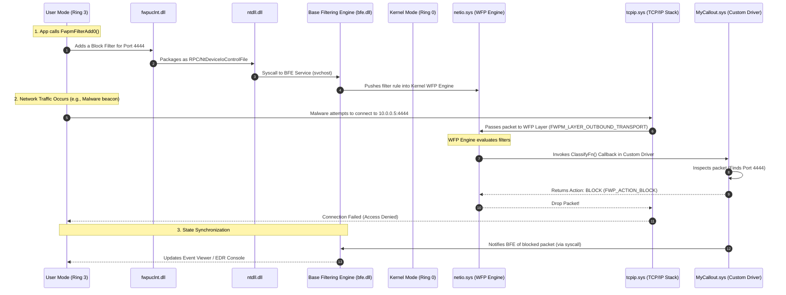

> [!abstract] Deep Dive: Windows Filtering Platform (WFP)
> The Windows Filtering Platform (WFP) is a set of API and system services built into Windows that allows developers to filter network traffic at multiple layers of the TCP/IP stack. It is the engine behind the Windows Firewall, EDR network telemetry, and parental controls. WFP allows you to intercept, block, or modify packets before they reach the network or the application.
> **MITRE ATT&CK Mapping:** [T1562 - Impair Defenses](https://attack.mitre.org/techniques/T1562/) (WFP Bypass/Disabling perspective) | [T1205 - Traffic Signaling](https://attack.mitre.org/techniques/T1205/)
## 📊 WFP Architecture & Traffic Flow (User-Mode to Kernel-Mode)

> [!info] How WFP Intercepts Traffic
> WFP is deeply integrated into the network stack. When an application sends a packet, it travels down from User-Mode to the Kernel. Inside the Kernel, the `tcpip.sys` driver passes the packet through the WFP Engine (`netio.sys`). If a Callout Driver has registered a callback at that layer, WFP pauses the packet, invokes the callback, and waits for the verdict (Permit, Block, or Modify). The state is then synchronized back to User-Mode via the Base Filtering Engine (BFE).



### The Core WFP Components

1. **Filters & Layers:** WFP divides the network stack into specific layers (e.g., Packet Receive, Transport, Stream). You inject a "Filter" into a layer.
2. **Base Filtering Engine (BFE):** A user-mode service (`bfe.dll` running in `svchost.exe`). It manages filter rules, resolves conflicts, and acts as the bridge between your User-Mode app and the Kernel.
3. **Callout Drivers (The Callbacks):** If simple "Allow/Drop" filters aren't enough, you can write a Custom Kernel Driver (`.sys`) that registers a `ClassifyFn` callback. When a packet hits a layer, WFP calls your function, passing the raw packet data.
4. **Windows Drivers Used:**
   - `netio.sys`: The WFP Engine itself. It sits inside the network stack and evaluates the filters.
   - `tcpip.sys`: The core TCP/IP protocol driver. It hands packets to `netio.sys`.
   - `fwpkclnt.sys`: The Kernel-Mode WFP API. Custom callout drivers link against this to talk to the WFP engine.

## 🔥 WFP and `netsh advfirewall`

The standard Windows Firewall is entirely built on WFP. When you type a `netsh` command, you are simply injecting WFP filters via the BFE.

> [!example]+ Creating a WFP Filter via Command Line
> ```cmd
> :: Block inbound traffic on port 445 (SMB)
> netsh advfirewall firewall add rule name="Block SMB" dir=in action=block protocol=TCP localport=445
> 
> :: Allow outbound traffic on port 80
> netsh advfirewall firewall add rule name="Allow HTTP" dir=out action=allow protocol=TCP localport=80
> ```
> *Under the hood, `netsh` uses the `fwpuclnt.dll` API to open a session with the BFE, construct a `FWPM_FILTER0` structure, and inject it into the `FWPM_LAYER_INBOUND_TRANSPORT_V4` layer.*
## 💻 Writing a WFP Filter in C (User-Mode DLL)

To write a programmatic firewall filter in C, you use the User-Mode WFP API (`fwpuclnt.h` and `fwpuclnt.lib`). This code tells the WFP Engine to block all outbound traffic on a specific port (e.g., port 4444).

> [!bug]+ C Code: Blocking Port 4444 (User-Mode API)
> ```c
> #include <windows.h>
> #include <fwpmu.h>
> #include <stdio.h>
> 
> #pragma comment(lib, "fwpuclnt.lib")
> 
> #define FILTER_NAME L"Red Team Block Port 4444"
> #define TARGET_PORT 4444
> 
> int main() {
>     HANDLE hEngine = NULL;
>     FWPM_SESSION0 session = {0};
>     DWORD result;
> 
>     // 1. Open a session to the WFP Engine (BFE)
>     result = FwpmEngineOpen0(NULL, RPC_C_AUTHN_WINNT, NULL, &session, &hEngine);
>     if (result != ERROR_SUCCESS) {
>         printf("[-] FwpmEngineOpen0 failed: %lu\n", result);
>         return 1;
>     }
>     printf("[+] Connected to WFP Engine.\n");
> 
>     // 2. Define the Filter structure
>     FWPM_FILTER0 filter = {0};
>     filter.filterKey = GUID_NULL; // Let WFP generate the GUID
>     filter.layerKey = FWPM_LAYER_ALE_AUTH_CONNECT_V4; // Application Layer Enforcement (Outbound)
>     filter.action.type = FWP_ACTION_BLOCK; // We want to block
>     filter.weight.type = FWP_UINT8;
>     filter.weight.uint8 = 0x0F; // High weight
>     filter.displayData.name = FILTER_NAME;
> 
>     // 3. Define the Filter Condition (If Destination Port == 4444)
>     FWPM_FILTER_CONDITION0 condition = {0};
>     condition.fieldKey = FWPM_CONDITION_IP_REMOTE_PORT; // Remote Port
>     condition.matchType = FWP_MATCH_EQUAL;
>     condition.conditionValue.type = FWP_UINT16;
>     condition.conditionValue.uint16 = TARGET_PORT;
> 
>     filter.filterCondition = &condition;
>     filter.numFilterConditions = 1;
> 
>     // 4. Add the filter to the engine
>     result = FwpmFilterAdd0(hEngine, &filter, NULL, NULL);
>     if (result == ERROR_SUCCESS) {
>         printf("[+] WFP Filter added successfully! Port %d is now blocked.\n", TARGET_PORT);
>     } else {
>         printf("[-] FwpmFilterAdd0 failed: %lu\n", result);
>     }
> 
>     // 5. Cleanup
>     FwpmEngineClose0(hEngine);
>     return 0;
> }
> ```
> **Execution Flow:**
> 1. `FwpmEngineOpen0` inside `fwpuclnt.dll` builds an RPC payload.
> 2. It calls `ntdll.dll` to transition to Kernel Mode.
> 3. The BFE service receives the rule and pushes it into `netio.sys`.
> 4. Any future socket connection to port 4444 is dropped by `tcpip.sys` at the WFP layer.
## 🛡️ Writing a WFP Callout Driver (Kernel-Mode Callback)

If an EDR wants to inspect the *payload* of a packet (not just the port), simple filters aren't enough. They must register a **Callout**.

> [!danger]+ Concept: Kernel-Mode Callout Driver (`FwpsCalloutRegister0`)
> A callout driver registers a `ClassifyFn` function at a specific WFP layer. When traffic hits that layer, WFP pauses the packet and invokes the callback.
> 
> ```c
> // A simplified version of a Kernel Callout Driver
> #include <ntddk.h>
> #include <fwpsk.h> // Kernel WFP API
> 
> // The Callback Function WFP will invoke
> void NTAPI MyClassifyFn(
>     const FWPS_INCOMING_VALUES0* inFixedValues,
>     const FWPS_INCOMING_METADATA_VALUES0* inMetaValues,
>     void* layerData,
>     const void* classifyContext,
>     const FWPS_FILTER0* filter,
>     UINT64 flowContext,
>     FWPS_CLASSIFY_OUT0* classifyOut)
> {
>     // Inspect packet data here (layerData)
>     // If we detect malicious content, we block it:
>     classifyOut->actionType = FWP_ACTION_BLOCK;
>     classifyOut->rights &= ~FWPS_RIGHT_ACTION_WRITE;
> 
>     DbgPrint("[!] WFP Callout: Malicious packet blocked!\n");
> }
> 
> // Driver Entry Point
> NTSTATUS DriverEntry(PDRIVER_OBJECT DriverObj, PUNICODE_STRING RegPath) {
>     NTSTATUS status;
>     FWPS_CALLOUT0 callout = {0};
>     GUID calloutGuid = { /* Generate a unique GUID */ };
>     GUID layerGuid = FWPM_LAYER_INBOUND_TRANSPORT_V4;
> 
>     // 1. Register the Callout with the WFP Engine (netio.sys)
>     callout.classifyFn = MyClassifyFn;
>     status = FwpsCalloutRegister0(DriverObj, &calloutGuid, &callout, NULL);
> 
>     // 2. Add a Filter that points to our Callout ID
>     // (Similar to FwpmFilterAdd0, but in Kernel Mode via fwpkclnt.sys)
>     
>     return status;
> }
> ```
> *This is exactly how EDRs (like CrowdStrike or Defender) inspect encrypted TLS traffic before it hits the application, or how they block malicious IP ranges dynamically.*

> [!warning] Red Team OPSEC: Abusing WFP
> Red Teams can write a custom WFP Callout Driver to create a **kernel-mode packet sniffer** or to **block EDR network traffic**. 
> - By registering a callout at the `FWPM_LAYER_ALE_AUTH_CONNECT_V4` layer, an attacker can see every IP the EDR is trying to communicate with (e.g., cloud telemetry endpoints).
> - They can then return `FWP_ACTION_BLOCK` specifically for the EDR's IP, effectively cutting off the EDR from its management console without killing the EDR process (which would trigger alarms). This is known as "Blinding via WFP".
