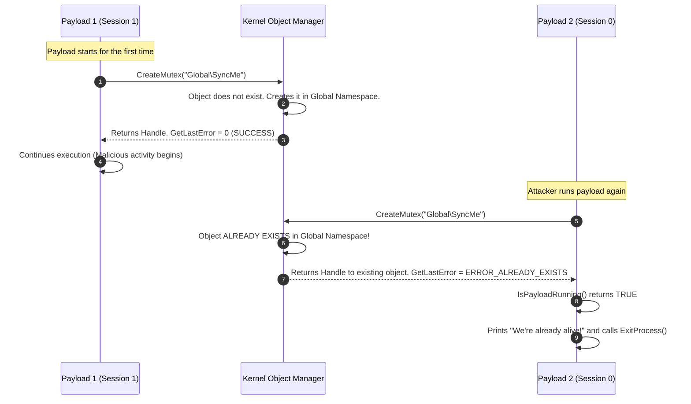

> [!abstract] OPSEC: Single-Instance Payload Enforcement via Kernel Objects
> Running multiple instances of the same payload (like a C2 implant or ransomware) on a single machine is a massive OPSEC failure. It causes resource exhaustion, duplicate network callbacks, and redundant telemetry that instantly triggers EDR alerts. This technique uses Windows Kernel Synchronization Objects to enforce a strict "single instance" rule. If the payload is already running, subsequent executions will silently exit. 
> **MITRE ATT&CK Mapping:** [T1497 - Virtualization/Sandbox Evasion](https://attack.mitre.org/techniques/T1497/) | [T1106 - Native API](https://attack.mitre.org/techniques/T1106/)


> [!info] How Cross-Session Detection Works
> In Windows, Kernel Objects (Mutexes, Events, Semaphores, Pipes) can be named. When a process creates a named object, the Windows Object Manager adds it to a specific namespace.
> 
> - If you don't use a prefix, the object is created in the **Local Session** (e.g., Session 1). 
> - By using the `Global\` prefix (e.g., `"Global\\SyncMe"`), the object is created in the **Global Kernel Namespace**. This means a payload running as a SYSTEM service in Session 0 can detect if a payload is already running in a user's Session 1, and vice versa.
> 
> If a second process tries to create an object with the exact same name, the Kernel doesn't create a new one. It returns a handle to the *existing* object and sets `GetLastError()` to `ERROR_ALREADY_EXISTS`. The payload reads this code and commits suicide (exits).
## The Multi-Method

> [!example]+ Code: 4 Ways to Check for Existing Instances
> This code provides four different methods to check if a payload is already running. Red Teams often switch between these methods to evade specific EDR behavioral rules.
> 
> ```cpp
> #include <windows.h>
> #include <stdio.h>
> 
> HANDLE hSync;
> #define SYNCER "Global\\SyncMe"
> #define PIPENAME "\\\\.\\pipe\\SyncMe"
> #define MUTEX 1
> #define EVENT 2
> #define SEMAPH 3
> #define PIPE 4
> 
> BOOL IsPayloadRunning(int method) {
>     BOOL ret = FALSE;
>     
>     // Method 1: Use a global Mutant (Mutex)
>     if (method == MUTEX) {
>         hSync = CreateMutex(NULL, FALSE, SYNCER);
>         if (GetLastError() == ERROR_ALREADY_EXISTS) {
>             CloseHandle(hSync);
>             ret = TRUE;
>         }
>     }
>     // Method 2: Use a global Event
>     else if (method == EVENT) {
>         hSync = CreateEvent(NULL, TRUE, FALSE, SYNCER); 
>         if (GetLastError() == ERROR_ALREADY_EXISTS) {
>             CloseHandle(hSync);
>             ret = TRUE;
>         }
>     }
>     // Method 3: Use a global Semaphore
>     else if (method == SEMAPH) {
>         hSync = CreateSemaphore(NULL, 0, 100, SYNCER);
>         if (GetLastError() == ERROR_ALREADY_EXISTS) {
>             CloseHandle(hSync);
>             ret = TRUE;
>         }
>     }
>     // Method 4: Use a Named Pipe
>     else if (method == PIPE) {
>         hSync = CreateNamedPipe(PIPENAME, 
>             PIPE_ACCESS_DUPLEX, 
>             PIPE_TYPE_MESSAGE, 
>             PIPE_UNLIMITED_INSTANCES, 
>             1024, 1024, 0, NULL); 
>         
>         if (GetLastError() == ERROR_ALREADY_EXISTS) {
>             CloseHandle(hSync);
>             ret = TRUE;
>         }
>     }   
>     
>     return ret;
> }
> 
> int main(void) {
>     // Check if the payload is already running on the machine
>     if (IsPayloadRunning(MUTEX)) {
>         printf("We're already alive!\n");
>         return 0; // Exit silently
>     }
> 
>     // Payload execution continues here...
>     printf("Payload started successfully.\n");
>     return 0;
> }
> ```
## ⚖️ Comparison

> [!tip] Deep Dive: Differences & EDR Visibility
> All four methods achieve the exact same result, but they use different kernel objects. From a defensive and EDR perspective, these objects are not monitored equally. 
> 
> | Method | Object Type | EDR Visibility / Heuristics | Semantic Correctness | Best Used For |
> | :--- | :--- | :--- | :--- | :--- |
> | **MUTEX** | Mutant | **High.** `CreateMutex` is the industry standard for this. EDRs and analysts heavily hunt for hardcoded mutex names (e.g., `Global\\Mimikatz`). | Perfect. Mutexes are designed for mutual exclusion. | Simple droppers, standard malware. |
> | **EVENT** | Event | **Medium.** Less commonly used for single-instance checks. Some EDRs might flag a persistent payload creating a global Event without a matching `SetEvent` call. | Low. Events are meant for signaling between threads, not locking. | Bypassing older AVs that specifically look for Mutexes. |
> | **SEMAPH** | Semaphore | **Medium-Low.** Rarely used in modern malware for this purpose. Can look suspicious if a payload creates a semaphore but never calls `ReleaseSemaphore`. | Low. Semaphores are for resource counting, not single-instance locking. | Evading basic static/heuristic rules. |
> | **PIPE** | Named Pipe | **Lowest.** Named pipes are extremely common in legitimate software (SQL Server, IIS, Windows RPC). Creating a pipe blends perfectly into normal system noise. | Medium. Often used for IPC (Inter-Process Communication), but works as a lock. | **High-Stealth Red Teaming.** Best choice for blending in. |

### The Verdict: Which one should you use?

> [!success] The Red Team Choice
> 1. **For Evasion (Best Overall): Use** `PIPE` **(Named Pipe).**
>    Named pipes are the ultimate stealth method. EDRs see named pipe creation constantly from legitimate Windows services and applications. By using `CreateNamedPipe` as your single-instance lock, you blend your payload's behavior into normal system noise. 
> 
> 2. **For Reliability & Tradition: Use** `MUTEX`**.**
>    It is exactly what the API was designed for. However, if you use a Mutex, **never** hardcode a readable name like `"Global\\SyncMe"`. You must dynamically generate the name (e.g., hashing the volume serial number) to avoid static detection.

---

## 📊 Execution Flow Diagram

> [!info] How the Kernel Enforces the Rule
> The diagram below illustrates how the Windows Object Manager handles the creation of named objects and prevents duplicate payload executions across sessions.



> [!danger] OPSEC Warning: Hardcoded Names are Fatal
> The biggest mistake in this code is using a hardcoded string like `"Global\\SyncMe"`. Defenders use tools like Sysinternals WinObj or Process Explorer to hunt for named objects. If your payload uses `Global\\Mimikatz`, it will be instantly flagged. Always generate a dynamic name based on the host environment (e.g., `Global\\{MD5(ComputerName)}`).

