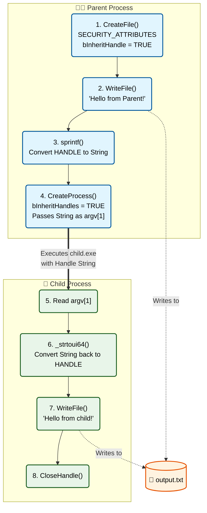

> [!abstract] Advanced Windows Process Creation & Handle Management
> A comprehensive guide to stealthy process execution and inter-process communication in Windows. This covers creating processes in hidden or suspended states, and passing File Handles between Parent and Child processes using Handle Inheritance.
> **MITRE ATT&CK Mapping:** [T1562 - Impair Defenses](https://attack.mitre.org/techniques/T1562/) | [T1055 - Process Injection](https://attack.mitre.org/techniques/T1055/) | [T1106 - Native API](https://attack.mitre.org/techniques/T1106/)

---

## 1. Stealthy Process Creation (`CreateProcess`)

Instead of finding a window *after* it becomes visible, you can launch a process and tell it to start in a hidden or suspended state immediately. 

> [!warning] Technique A: Hiding GUI Applications (`STARTUPINFO` + `SW_HIDE`)
> Instructs the Windows Loader to start the process with the `SW_HIDE` flag. The window is created in memory but never displayed on the screen or taskbar.
> ```cpp
> #include <windows.h>
> #include <stdio.h>
> 
> int main() {
>     STARTUPINFOA si = { sizeof(si) };
>     PROCESS_INFORMATION pi = { 0 };
> 
>     si.dwFlags = STARTF_USESHOWWINDOW; 
>     si.wShowWindow = SW_HIDE;          
> 
>     if (CreateProcessA("C:\\Windows\\System32\\notepad.exe", 
>             NULL, NULL, NULL, FALSE, 0, NULL, NULL, &si, &pi)) 
>     {
>         printf("Process created successfully (Hidden).\n");
>         printf("Process ID: %lu\n", pi.dwProcessId);
>         CloseHandle(pi.hProcess);
>         CloseHandle(pi.hThread);
>     } 
>     else {
>         printf("Process not created. ERROR: %lu\n", GetLastError());
>     }
>     return 0;
> }
> ```

> [!bug] Technique B: Hiding Console Applications (`CREATE_NO_WINDOW`)
> For console apps (like `cmd.exe`), `CREATE_NO_WINDOW` is stealthier than `SW_HIDE` because the system **never creates a console window at all**, saving resources and preventing screen flashes.
> ```cpp
> #include <windows.h>
> #include <stdio.h>
> 
> int main() {
>     STARTUPINFOA si = { sizeof(si) };
>     PROCESS_INFORMATION pi = { 0 };
> 
>     if (CreateProcessA("C:\\Windows\\System32\\cmd.exe", 
>             NULL, NULL, NULL, FALSE, 
>             CREATE_NO_WINDOW, // Creation flag: NO WINDOW
>             NULL, NULL, &si, &pi)) 
>     {
>         printf("[+] cmd.exe created successfully without a window!\n");
>         printf("[+] Process ID: %lu\n", pi.dwProcessId);
>         CloseHandle(pi.hProcess);
>         CloseHandle(pi.hThread);
>     }
>     else {
>         printf("[-] Failed to create process. Error: %lu\n", GetLastError());
>     }
>     return 0;
> }
> ```

> [!danger] Technique C: Suspended Mode (`CREATE_SUSPENDED`)
> Creates the process and initializes its main thread — **but pauses it before it executes a single instruction**. This is the foundational step for Process Hollowing and DLL Injection.
> ```cpp
> #include <windows.h>
> #include <stdio.h>
> 
> int main() {
>     STARTUPINFOA si = { sizeof(si) };
>     PROCESS_INFORMATION pi = { 0 };
> 
>     if (CreateProcessA("C:\\Windows\\System32\\notepad.exe", 
>             NULL, NULL, NULL, FALSE, 
>             CREATE_SUSPENDED, // Creation flag: SUSPENDED!
>             NULL, NULL, &si, &pi)) 
>     {
>         printf("[+] Process created successfully in suspended mode!\n");
>         printf("[+] Process ID: %lu\n", pi.dwProcessId);
>         printf("[+] Thread ID: %lu\n", pi.dwThreadId);
> 
>         // At this point, the process is alive but paused.
>         // An attacker would inject shellcode here using WriteProcessMemory.
>         
>         // To actually start the process, you would call:
>         // ResumeThread(pi.hThread);
> 
>         CloseHandle(pi.hProcess);
>         CloseHandle(pi.hThread);
>     }
>     else {
>         printf("[-] Failed to create process. Error: %lu\n", GetLastError());
>     }
>     return 0;
> }
> ```

---

## 2. Windows Handle Inheritance (Passing Handles to Child Processes)

In Windows, Handles are not accessible to other processes by default. However, by using **Handle Inheritance**, a Parent Process can create a Handle (e.g., an open file) and grant access to it for the Child Process it spawns.

> [!info] Concept & Flow
> To pass a Handle to a child process:
> 1. Create the Handle with `SECURITY_ATTRIBUTES` where `bInheritHandle = TRUE`.
> 2. Call `CreateProcess` with `bInheritHandles = TRUE`.
> 3. Pass the numeric value of the Handle as a string argument via the Command Line.



> [!example]+ Code: Parent Process (`parent.cpp`)
> Creates a file, writes to it, converts the Handle value to a string, and executes the child process.
> ```cpp
> #include <stdio.h>
> #include <windows.h>
> 
> int main() {
>     // 1. Initialize Security Attributes with bInheritHandle = TRUE
>     SECURITY_ATTRIBUTES sa = { sizeof(sa), NULL, TRUE };
> 
>     // 2. Create an inheritable file handle
>     HANDLE hFile = CreateFile(
>         "output.txt", 
>         FILE_APPEND_DATA, 
>         FILE_SHARE_WRITE, 
>         &sa,                   // Pass security attributes here
>         CREATE_ALWAYS, 
>         FILE_ATTRIBUTE_NORMAL, 
>         NULL
>     );
>     
>     if (hFile == INVALID_HANDLE_VALUE) {
>         printf("Failed to create file. Error: %d\n", GetLastError());
>         return 1;
>     }
> 
>     // 3. Write to the file (Parent)
>     DWORD written;
>     WriteFile(hFile, "Hello from Parent!\n", 19, &written, NULL);
> 
>     // 4. Convert handle to string (so the child process can receive it via command line)
>     char handleStr[20];
>     sprintf(handleStr, " %llu", (unsigned long long)hFile); 
> 
>     // 5. Prepare process startup information
>     STARTUPINFOA si = { sizeof(si) };
>     PROCESS_INFORMATION pi = { 0 };
> 
>     // 6. Correctly format the command line
>     char cmdLine[150];
>     sprintf(cmdLine, "\"C:\\Users\\<fixme>\\Desktop\\child.exe\"%s", handleStr);  
> 
>     // 7. Create child process
>     // The 5th parameter (TRUE) is bInheritHandles, which is CRITICAL
>     if (!CreateProcessA(NULL, cmdLine, &sa, &sa, TRUE, 0, NULL, NULL, &si, &pi)) 
>     {
>         printf("CreateProcess failed. Error: %d\n", GetLastError());
>         return 1;
>     }
> 
>     Sleep(50);
>     printf("Parent: Created child process with PID %d\n", pi.dwProcessId);
>     
>     // 8. Close handles
>     CloseHandle(pi.hProcess);
>     CloseHandle(pi.hThread);
>     CloseHandle(hFile);
>     
>     return 0;
> }
> ```

> [!bug]+ Code: Child Process (`child.cpp`)
> Reads the handle string from its command-line arguments, converts it back to a valid `HANDLE`, and uses it to write to the same file.
> ```cpp
> #include <windows.h>
> #include <stdio.h>
> #include <string.h> // Required for strlen
> 
> int main(int argc, char *argv[]) {
> 
>     if (argc != 2) {
>         printf("Child: No handle received!\n");
>         return 1;
>     }
> 
>     // Convert string back to HANDLE
>     HANDLE hFile = (HANDLE)_strtoui64(argv[1], NULL, 10);
> 
>     if (hFile == INVALID_HANDLE_VALUE) {
>         printf("Child: Invalid handle received!\n");
>         return 1;
>     }
> 
>     // Write to the inherited file handle
>     DWORD bytesWritten;
>     const char *message = "Hello from the child process!\n";
>     WriteFile(hFile, message, strlen(message), &bytesWritten, NULL);
> 
>     printf("Child: Wrote to file using inherited handle.\n");
> 
>     // Close the file handle
>     CloseHandle(hFile);
>     return 0;
> }
> ```

---

## 3. Compilation

> [!success]+ Compiling the Codes
> To compile these executables on Windows:
> 
> **MinGW (GCC/G++):**
> ```bash
> # For CreateProcess variations and Handle Inheritance:
> x86_64-w64-mingw32-g++ parent.cpp -o parent.exe
> x86_64-w64-mingw32-g++ child.cpp -o child.exe
> ```
> 
> **MSVC (cl.exe):**
> ```batch
> :: For CreateProcess variations and Handle Inheritance:
> cl /EHsc parent.cpp /Fe:parent.exe
> cl /EHsc child.cpp /Fe:child.exe
> ```
> *Note: Make sure `child.exe` is placed in the path specified in `parent.cpp` (e.g., `C:\Users\<fixme>\Desktop\child.exe`).*

