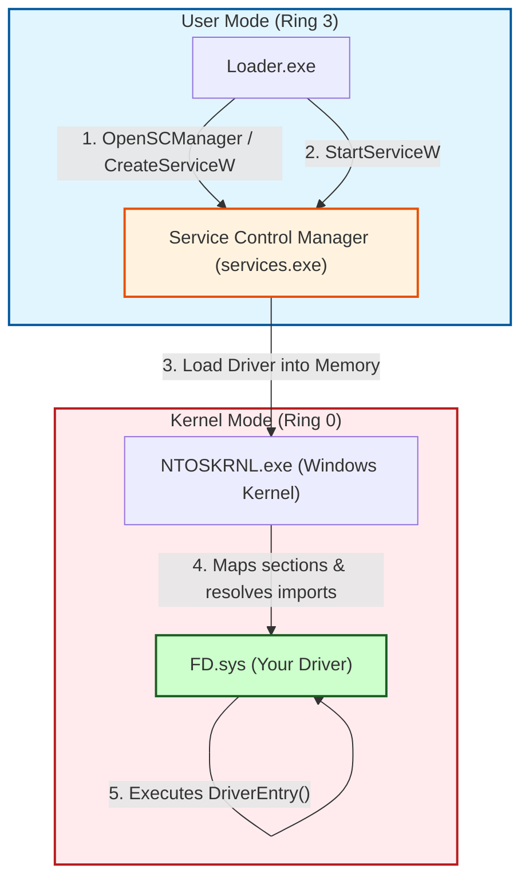

> [!abstract] Windows Kernel Driver Development: Hello World & SCM Loader
> Developing a Windows Kernel Driver (`.sys`) is the first step into Ring 0 (Kernel Mode). Unlike user-mode applications that start at `main()`, kernel drivers start at `DriverEntry` and must be loaded by the Service Control Manager (SCM). This note covers the basic driver structure, test-signing requirements, and a custom C++ loader to dynamically install and start kernel drivers.
> **MITRE ATT&CK Mapping:** [T1543.003 - Create or Modify System Process: Windows Service](https://attack.mitre.org/techniques/T1543/003/) | [T1106 - Native API](https://attack.mitre.org/techniques/T1106/)

## 🛠️ Prerequisites & Environment Setup

> [!info] Setting up the Kernel Development Environment
> To compile kernel drivers, you need the right toolchain and a test environment configured to accept unsigned (test-signed) drivers.
> 
> **1. Software Requirements:**
> - **Visual Studio** (with C++ Desktop Development workload).
> - **Windows SDK** (Software Development Kit).
> - **Windows WDK** (Windows Driver Kit).
> 
> **2. Enabling Test Signing (Crucial):**
> By default, Windows 64-bit requires all kernel drivers to be digitally signed by Microsoft. To load your own custom drivers during development, you must enable test signing mode. Open an Administrator Command Prompt and run:
> ```cmd
> bcdedit /set testsigning on
> ```
> *Note: You must **reboot** the computer for this change to take effect. You will see a "Test Mode" watermark in the bottom right corner of your desktop.*

---

## 💻 The Kernel Driver Code (Ring 0)

> [!example]+ C++ Code: Basic WDK Driver (`FD.sys`)
> Create an Empty WDK Project in Visual Studio. A kernel driver's entry point is `DriverEntry`. It receives a `PDRIVER_OBJECT` (which represents the loaded driver in memory) and a registry path.
> 
> ```cpp
> #include <ntddk.h>
> 
> #define DRIVER_NAME "FD"
> 
> // Forward declaration
> VOID UnloadDriver(_In_ PDRIVER_OBJECT DriverObject);
> 
> extern "C" {
>     NTSTATUS DriverEntry(_In_ PDRIVER_OBJECT DriverObject,
>                          _In_ PUNICODE_STRING RegistryPath) {
> 
>         UNREFERENCED_PARAMETER(RegistryPath);
>         
>         // Register the unload function so the driver can be safely stopped
>         DriverObject->DriverUnload = UnloadDriver;
> 
>         // Print a message to the kernel debug output
>         DbgPrintEx(0, 0, "[%s] Driver Loaded!\n", DRIVER_NAME);
> 
>         return STATUS_SUCCESS;
>     }
> }
> 
> VOID UnloadDriver(_In_ PDRIVER_OBJECT DriverObject) {
>     UNREFERENCED_PARAMETER(DriverObject);
>     DbgPrintEx(0, 0, "[%s] Driver Unloaded!\n", DRIVER_NAME);
> }
> ```
> *To view the `DbgPrintEx` output, use **Sysinternals DebugView** and check the "Capture Kernel" option.*

## 🚀 Method 1: Manual Loading via `sc.exe`

The built-in Windows Service Control (`sc.exe`) tool can be used to manually register, start, and stop a kernel driver.

> [!tip]+ Command Line Deployment
> Open an Administrator Command Prompt:
> 
> ```cmd
> :: 1. Create the kernel service (pointing to the compiled .sys file)
> sc.exe create FD type= kernel binpath= "C:\path\to\FD.sys"
> 
> :: 2. Start the driver (This triggers DriverEntry)
> sc.exe start FD
> 
> :: 3. Stop the driver (This triggers UnloadDriver)
> sc.exe stop FD
> 
> :: 4. Delete the service registry entry
> sc.exe delete FD
> ```
> *Note: The `type= kernel` flag is critical. It tells the SCM that this service is a device driver, not a standard user-mode application.*

## 💻 Method 2: Custom C++ SCM Loader

Red Teams and malware developers often use a custom executable to load their drivers dynamically without relying on `sc.exe`. This is done by interacting with the **Service Control Manager (SCM)** via the Win32 API.

> [!danger]+ C++ Code: Dynamic Kernel Driver Loader
> This user-mode application takes a command-line argument (`load` or `unload`) and uses the SCM API to install and start the kernel driver.
> 
> ```cpp
> #include <Windows.h>
> #include <stdio.h>
> 
> #define DRIVER_NAME L"FD"
> #define DRIVER_PATH L"C:\\Users\\0x29a\\Desktop\\FD.sys"
> 
> void LoadDriver();
> void UnloadDriver();
> 
> int main(int argc, char **argv) {
>     if (argc < 2) {
>         printf("Usage:\n[*] %s [load|unload]\n", argv[0]);
>         return 0x003;
>     }
> 
>     if (strcmp(argv[1], "load") == 0) {
>         LoadDriver();
>     }
>     else if (strcmp(argv[1], "unload") == 0) {
>         UnloadDriver();
>     }
>     else {
>         printf("Invalid argument. use \"load\" or \"unload\" ");
>     }
>     return 0x0000;
> }
> 
> void LoadDriver() {
>     // 1. Open a handle to the SCM
>     SC_HANDLE SCMH = OpenSCManager(nullptr, nullptr, SC_MANAGER_CREATE_SERVICE);
>     if (SCMH == nullptr) {
>         printf("Failed To Open Service Control Manager.\n");
>         return;
>     }
> 
>     // 2. Create the kernel service
>     SC_HANDLE SH = CreateServiceW(SCMH,
>         DRIVER_NAME,
>         DRIVER_NAME,
>         SERVICE_START | DELETE | SERVICE_STOP,
>         SERVICE_KERNEL_DRIVER,           // Specifies this is a driver
>         SERVICE_DEMAND_START,
>         SERVICE_ERROR_IGNORE,
>         DRIVER_PATH,
>         nullptr, nullptr, nullptr, nullptr, nullptr);
>         
>     if (SH == nullptr) {
>         if (GetLastError() == ERROR_SERVICE_EXISTS) {
>             printf("Service Already Exists, attempting to start\n");
>             SH = OpenServiceW(SCMH, DRIVER_NAME, SERVICE_START);
>         }
>         else {
>             printf("Failed to create service.\n");
>             CloseServiceHandle(SCMH);
>             return;
>         }
>     }
> 
>     // 3. Start the service (Loads the .sys into kernel memory)
>     if (!StartServiceW(SH, 0, nullptr)) {
>         printf("Failed to start Service!\n");
>     } else {
>         printf("[+] Driver loaded successfully.\n");
>     }
>     
>     CloseServiceHandle(SH);
>     CloseServiceHandle(SCMH);
> }
> 
> void UnloadDriver() {
>     // 1. Open SCM
>     SC_HANDLE SCMH = OpenSCManagerW(nullptr, nullptr, SC_MANAGER_ALL_ACCESS);
>     if (SCMH == nullptr) {
>         printf("Failed to open Service Control Manager\n");
>         return;
>     }
> 
>     // 2. Open the existing service
>     SC_HANDLE SH = OpenServiceW(SCMH, DRIVER_NAME, SERVICE_STOP | DELETE);
>     if (SH == nullptr) {
>         printf("Failed to open service.\n");
>         CloseServiceHandle(SCMH);
>         return;
>     }
> 
>     // 3. Stop the service (Triggers UnloadDriver in Ring 0)
>     SERVICE_STATUS stats;
>     if (!ControlService(SH, SERVICE_CONTROL_STOP, &stats)) {
>         printf("Failed to stop service\n");
>     } else {
>         printf("[+] Driver stopped successfully.\n");
>     }
>     
>     // 4. Delete the service
>     if (!DeleteService(SH)) {
>         printf("Failed to delete service.\n");
>     } else {
>         printf("[+] Service deleted.\n");
>     }
> 
>     CloseServiceHandle(SH);
>     CloseServiceHandle(SCMH);
> }
> ```

---

## 📊 Architecture Flow: User-Mode to Kernel-Mode

> [!info] How the Loader Interacts with the Kernel
> The custom loader (`Loader.exe`) runs in Ring 3. It cannot directly write the `.sys` file into kernel memory. Instead, it asks the Windows Service Control Manager (SCM) to do it. The SCM is a trusted system process that communicates with the Kernel (`ntoskrnl.exe`) to map the driver into Ring 0 and execute `DriverEntry`.


