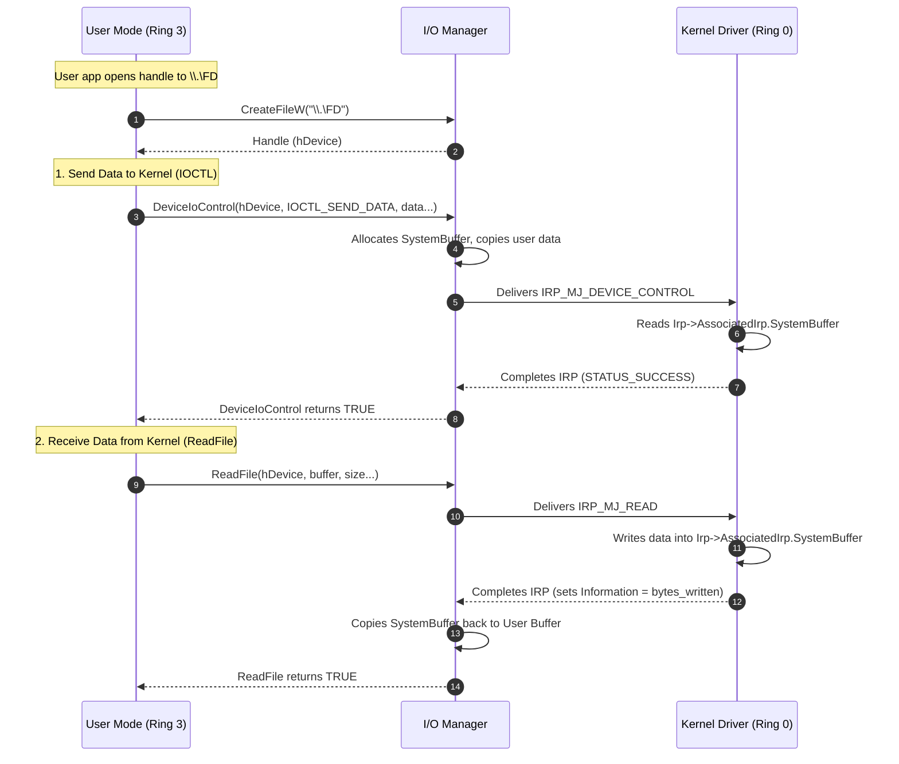

> [!abstract] Windows Driver Communication: IRPs & Buffered I/O
> A kernel driver (`.sys`) cannot communicate with user-mode applications using standard sockets or pipes. Instead, Windows uses **I/O Request Packets (IRPs)** sent through a Device Object. A user-mode application opens a handle to the driver's Symbolic Link (e.g., `\\.\FD`) and uses APIs like `DeviceIoControl` or `ReadFile` to send/receive data. The driver intercepts these IRPs, processes the data in Ring 0, and returns the result.
> **MITRE ATT&CK Mapping:** [T1106 - Native API](https://attack.mitre.org/techniques/T1106/) | [T1543.003 - Create or Modify System Process: Windows Service](https://attack.mitre.org/techniques/T1543/003/)

![[Pasted image 20261009205833.png]]
## Architecture Flow

> [!info] The IRP Journey & Buffered I/O
> When a user-mode application calls `DeviceIoControl` or `ReadFile`, the Windows I/O Manager creates an IRP. Because we set the `DO_BUFFERED_IO` flag, the I/O Manager automatically copies the user's data into a safe, kernel-allocated buffer (`SystemBuffer`). This prevents the kernel from crashing if the user-mode memory is paged out or invalid.



## User-Mode to Kernel-Mode (Sending Data via IOCTL)

The most common method for sending commands to a driver is using a custom **IOCTL (I/O Control Code)**. The user-mode app sends a payload, and the kernel driver reads it.

### User-Mode Code (Client)

> [!example]+ Sending Data with `DeviceIoControl`
> ```cpp
> #include <Windows.h>
> #include <stdio.h>
> 
> #define IOCTL_SEND_DATA CTL_CODE(0x8000,0x900,METHOD_BUFFERED,FILE_ANY_ACCESS)
> 
> int main(int argc, char** argv) {
> 
> 	HANDLE HDevice = CreateFileW(
> 		L"\\\\.\\FD",
> 		GENERIC_WRITE,
> 		FILE_SHARE_WRITE,
> 		nullptr,
> 		OPEN_EXISTING,
> 		0,
> 		nullptr);
> 
> 	if (HDevice == INVALID_HANDLE_VALUE) {
> 		printf("Faild to open the device\nERROR Code: %d\n", GetLastError());
> 		return 0x0001;
> 	}
> 
> 
> 	char data[] = "Hello World From User Mode";
> 	DWORD ByteReturn = 0;
> 
> 	if (!DeviceIoControl(
> 		HDevice,
> 		IOCTL_SEND_DATA,
> 		data,
> 		sizeof(data),
> 		nullptr,
> 		0,
> 		&ByteReturn,
> 		nullptr
> 		)){
> 		printf("Device io Control Failed.\nError Code: %d\n", GetLastError());
> 		CloseHandle(HDevice);
> 		return 0x0001;
> 	}
> 
> 
> 	printf("Data Send Successfully: %s", data);
> 	CloseHandle(HDevice);
> 
> 	return 0x0000;
> }
> ```

### Kernel-Mode Code (Driver)

> [!bug]+ Handling `IRP_MJ_DEVICE_CONTROL`
> The driver registers a function for `IRP_MJ_DEVICE_CONTROL`. When the IRP arrives, it checks the IOCTL code and reads the data from `Irp->AssociatedIrp.SystemBuffer`.
> ```cpp
> #include <ntddk.h>
> 
> #define DRIVER_NAME "FD"
> #define IOCTL_SEND_DATA CTL_CODE(0x8000,0x900,METHOD_BUFFERED,FILE_ANY_ACCESS)
> 
> VOID UnloadDriver(_In_ PDRIVER_OBJECT DriverObject);
> 
> NTSTATUS DriverCreateClose(_In_ PDEVICE_OBJECT DeviceObject, _In_ PIRP Irp);
> NTSTATUS DriverDeviceIoControl(_In_ PDEVICE_OBJECT DeviceObject, _In_ PIRP Irp);
> 
> extern "C" {
> 
> 	NTSTATUS DriverEntry(_In_ PDRIVER_OBJECT DriverObject, _In_ PUNICODE_STRING RegistryPath) {
> 
> 		UNREFERENCED_PARAMETER(RegistryPath);
> 
> 		DriverObject->DriverUnload = UnloadDriver;
> 		DriverObject->MajorFunction[IRP_MJ_CREATE] = DriverCreateClose;
> 		DriverObject->MajorFunction[IRP_MJ_CLOSE] = DriverCreateClose;
> 		DriverObject->MajorFunction[IRP_MJ_DEVICE_CONTROL] = DriverDeviceIoControl;
> 
> 
> 
> 
> 		UNICODE_STRING DeviceName = RTL_CONSTANT_STRING(L"\\Device\\FD");
> 		PDEVICE_OBJECT DeviceObject;
> 		NTSTATUS Status = IoCreateDevice(
> 			DriverObject,
> 			0,
> 			&DeviceName,
> 			FILE_DEVICE_UNKNOWN,
> 			FILE_DEVICE_SECURE_OPEN,
> 			FALSE,
> 			&DeviceObject
> 		);
> 
> 		if (!NT_SUCCESS(Status)) {
> 			DbgPrintEx(0, 0, "[%s] PCKC Driver: Faild To Create Device (0x%08X)\n", DRIVER_NAME, Status);
> 			return Status;
> 		}
> 
> 		
> 		DeviceObject->Flags |= DO_BUFFERED_IO;
> 
> 
> 		UNICODE_STRING SymLink = RTL_CONSTANT_STRING(L"\\??\\FD");
> 		Status = IoCreateSymbolicLink(&SymLink, &DeviceName);
> 		if (!NT_SUCCESS(Status)) {
> 			DbgPrintEx(0, 0, "[%s] PCKC Driver: Failed To Create Symbolic Link (0x%80X)", DRIVER_NAME, Status);
> 			IoDeleteDevice(DeviceObject);
> 			return Status;
> 		}
> 
> 
> 		DbgPrintEx(0, 0, "[%s] Driver Loaded", DRIVER_NAME);
> 
> 		return STATUS_SUCCESS;
> 	}
> 
> }
> 
> 
> 
> 
> VOID UnloadDriver(_In_ PDRIVER_OBJECT DriverObject) {
> 	UNICODE_STRING symLink = RTL_CONSTANT_STRING(L"\\??\\FD");
> 	IoDeleteSymbolicLink(&symLink);
> 
> 	IoDeleteDevice(DriverObject->DeviceObject);
> 
> 	DbgPrintEx(0, 0, "[%s] Driver Unloaded!\n", DRIVER_NAME);
> }
> 
> _Use_decl_annotations_
> NTSTATUS DriverCreateClose(_In_ PDEVICE_OBJECT DeviceObject, _In_ PIRP Irp) {
> 	UNREFERENCED_PARAMETER(DeviceObject);
> 	Irp->IoStatus.Status = STATUS_SUCCESS;
> 	Irp->IoStatus.Information = 0;
> 
> 	IoCompleteRequest(Irp, IO_NO_INCREMENT);
> 	return STATUS_SUCCESS;
> }
> 
> _Use_decl_annotations_
> NTSTATUS DriverDeviceIoControl(_In_ PDEVICE_OBJECT DeviceObject, _In_ PIRP Irp) {
> 	UNREFERENCED_PARAMETER(DeviceObject);
> 	NTSTATUS Status = STATUS_SUCCESS;
> 	PIO_STACK_LOCATION CurrentStackLocation = IoGetCurrentIrpStackLocation(Irp);
> 	CHAR* data = (CHAR*)Irp->AssociatedIrp.SystemBuffer;
> 
> 	switch (CurrentStackLocation->Parameters.DeviceIoControl.IoControlCode) {
> 	case IOCTL_SEND_DATA: {
> 		DbgPrintEx(0, 0, "[%s] Inside IOCTL_SEND_DATA\n", DRIVER_NAME);
> 		DbgPrintEx(0, 0, "[%s] Data From User-mode Process is %s\n", DRIVER_NAME, data);
> 	}
> 	break;
> 	default:
> 		Status = STATUS_INVALID_DEVICE_REQUEST;
> 		break;
> 	
> 	}
> 
> 	Irp->IoStatus.Status = Status;
> 	Irp->IoStatus.Information = 0;
> 	IoCompleteRequest(Irp, IO_NO_INCREMENT);
> 	return Status;
> }
> ```

## Kernel-Mode to User-Mode 

If the kernel needs to send data back (e.g., logging, stolen credentials, or sensor telemetry), the user-mode app can use `ReadFile`. The driver handles `IRP_MJ_READ` and copies data from kernel space into the IRP's `SystemBuffer`.

### User-Mode Code (Client)

> [!example]- Receiving Data with `ReadFile`
> ```cpp
> #include <Windows.h>
> #include <stdio.h>
> 
> #define IOCTL_GET_DATA CTL_CODE(0x8000,0x900,METHOD_BUFFERED,FILE_ANY_ACCESS)
> 
> int main(int argc, char** argv) {
> 
> 	HANDLE HDevice = CreateFileW(
> 		L"\\\\.\\FD",
> 		GENERIC_READ,
> 		0,
> 		nullptr,
> 		OPEN_EXISTING,
> 		0,
> 		nullptr);
> 
> 	if (HDevice == INVALID_HANDLE_VALUE) {
> 		printf("Faild to open the device\nERROR Code: %d\n", GetLastError());
> 		return 0x0001;
> 	}
> 
> 
> 	char data[256] = { 0 };
> 	DWORD BytesRead = 0;
> 
> 	if (!ReadFile(HDevice, data, sizeof(data), &BytesRead, nullptr)) {
> 		printf("Faild To Read Data\nERROR Code:%d\n", GetLastError());
> 		CloseHandle(HDevice);
> 		return 0x0001;
> 	}
> 
> 
> 	printf("Data Recive Successfully: %s\n", data);
> 	CloseHandle(HDevice);
> 
> 	return 0x0000;
> }
> ```

### Kernel-Mode Code (Driver)

> [!bug]- Handling `IRP_MJ_READ` and Returning Data
> The driver reads the requested buffer size from the IRP stack, copies its own data into the `SystemBuffer`, and tells the I/O Manager how many bytes were written by setting `Irp->IoStatus.Information`.
> ```cpp
> #include <ntddk.h>
> 
> #define DRIVER_NAME "FD"
> #define IOCTL_SEND_DATA CTL_CODE(0x8000,0x900,METHOD_BUFFERED,FILE_ANY_ACCESS)
> 
> VOID UnloadDriver(_In_ PDRIVER_OBJECT DriverObject);
> NTSTATUS DriverCreateClose(_In_ PDEVICE_OBJECT DeviceObject, _In_ PIRP Irp);
> NTSTATUS DriverRead(_In_ PDEVICE_OBJECT DeviceObject, _In_ PIRP Irp);
> 
> extern "C" {
> 
> 	NTSTATUS DriverEntry(_In_ PDRIVER_OBJECT DriverObject, _In_ PUNICODE_STRING RegistryPath) {
> 
> 		UNREFERENCED_PARAMETER(RegistryPath);
> 
> 		DriverObject->DriverUnload = UnloadDriver;
> 		DriverObject->MajorFunction[IRP_MJ_CREATE] = DriverCreateClose;
> 		DriverObject->MajorFunction[IRP_MJ_CLOSE] = DriverCreateClose;
> 		DriverObject->MajorFunction[IRP_MJ_READ] = DriverRead;
> 
> 
> 
> 
> 		UNICODE_STRING DeviceName = RTL_CONSTANT_STRING(L"\\Device\\FD");
> 		PDEVICE_OBJECT DeviceObject;
> 		NTSTATUS Status = IoCreateDevice(
> 			DriverObject,
> 			0,
> 			&DeviceName,
> 			FILE_DEVICE_UNKNOWN,
> 			FILE_DEVICE_SECURE_OPEN,
> 			FALSE,
> 			&DeviceObject
> 		);
> 
> 		if (!NT_SUCCESS(Status)) {
> 			DbgPrintEx(0, 0, "[%s] PCKC Driver: Faild To Create Device (0x%08X)\n", DRIVER_NAME, Status);
> 			return Status;
> 		}
> 
> 		
> 		DeviceObject->Flags |= DO_BUFFERED_IO;
> 
> 
> 		UNICODE_STRING SymLink = RTL_CONSTANT_STRING(L"\\??\\FD");
> 		Status = IoCreateSymbolicLink(&SymLink, &DeviceName);
> 		if (!NT_SUCCESS(Status)) {
> 			DbgPrintEx(0, 0, "[%s] PCKC Driver: Failed To Create Symbolic Link (0x%80X)", DRIVER_NAME, Status);
> 			IoDeleteDevice(DeviceObject);
> 			return Status;
> 		}
> 
> 
> 		DbgPrintEx(0, 0, "[%s] Driver Loaded", DRIVER_NAME);
> 
> 		return STATUS_SUCCESS;
> 	}
> 
> }
> 
> VOID UnloadDriver(_In_ PDRIVER_OBJECT DriverObject) {
> 	UNICODE_STRING symLink = RTL_CONSTANT_STRING(L"\\??\\FD");
> 	IoDeleteSymbolicLink(&symLink);
> 
> 	IoDeleteDevice(DriverObject->DeviceObject);
> 
> 	DbgPrintEx(0, 0, "[%s] Driver Unloaded!\n", DRIVER_NAME);
> }
> 
> NTSTATUS DriverCreateClose(_In_ PDEVICE_OBJECT DeviceObject, _In_ PIRP Irp) {
> 	UNREFERENCED_PARAMETER(DeviceObject);
> 	Irp->IoStatus.Status = STATUS_SUCCESS;
> 	Irp->IoStatus.Information = 0;
> 
> 	IoCompleteRequest(Irp, IO_NO_INCREMENT);
> 	return STATUS_SUCCESS;
> }
> 
> NTSTATUS DriverRead(_In_ PDEVICE_OBJECT DeviceObject, _In_ PIRP Irp) {
> 	UNREFERENCED_PARAMETER(DeviceObject);
> 
> 	NTSTATUS Status = STATUS_SUCCESS;
> 	PIO_STACK_LOCATION CurrentStackLocation = IoGetCurrentIrpStackLocation(Irp);
> 	ULONG buffersz = CurrentStackLocation->Parameters.Read.Length;
> 
> 	const char* message = "Hello From Driver\n";
> 	SIZE_T messagesz = strlen(message) + 1;
> 	DbgPrintEx(0, 0, "[%s] Check Client Console\n", DRIVER_NAME);
> 
> 	if (buffersz < messagesz) {
> 		Status = STATUS_BUFFER_TOO_SMALL;
> 	}
> 	RtlCopyMemory(Irp->AssociatedIrp.SystemBuffer, message, messagesz);
> 	Irp->IoStatus.Information = messagesz;
> 	Irp->IoStatus.Status = Status;
> 	IoCompleteRequest(Irp, IO_NO_INCREMENT);
> 	return Status;
> }
> 
> ```
## 🛠️ Deployment & Testing Commands

> [!tip]+ Compiling, Loading, and Testing
> 1. Compile the Kernel Driver (`.sys`) using Visual Studio + WDK.
> 2. Enable Test Signing (requires reboot):
>    ```cmd
>    bcdedit /set testsigning on
>    ```
> 3. Install and start the driver:
>    ```cmd
>    sc.exe create FD type= kernel binpath= "C:\path\to\your_driver.sys"
>    sc.exe start FD
>    ```
> 4. Run your User-Mode client application (`client.exe`).
> 5. View Kernel Debug output (`DbgPrintEx`) using **Sysinternals DebugView** (Run as Admin, check "Capture Kernel").
> 6. Stop and delete the driver:
>    ```cmd
>    sc.exe stop FD
>    sc.exe delete FD
>    ```

